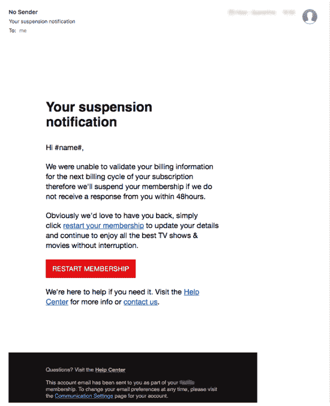

# 为什么机器学习模型讨厌“改变”

> 原文：<https://towardsdatascience.com/why-machine-learning-models-hate-change-f891d0d086d8?source=collection_archive---------36----------------------->

## 模型漂移，一种机器学习概念的介绍

在 [Unsplash](https://unsplash.com/s/photos/time?utm_source=unsplash&utm_medium=referral&utm_content=creditCopyText) 上由 [Aron 视觉](https://unsplash.com/@aronvisuals?utm_source=unsplash&utm_medium=referral&utm_content=creditCopyText)拍摄的照片

# 目录

1.  [简介](#d663)
2.  [什么是模型漂移？](#1186)
3.  [模型漂移的类型](#d66d)
4.  [如何检测模型漂移](#be51)
5.  [如何解决模型漂移](#a0ed)

# *简介*

> "变化是生活中唯一不变的东西。"

这句话出自一位名叫赫拉克利特的希腊哲学家，它是如此有趣的一句话，因为它是唯一正确的。术语“恒定”被定义为*在一段时间内持续发生，*因此，你可以说变化是永恒的。这对机器学习模型提出了一个问题，因为模型是基于其创建时的变量和参数来优化的。

设想一个分类模型，用于检测几年前创建的网络钓鱼电子邮件(垃圾邮件)。当时，垃圾邮件看起来像这样:

你可以看出这是一封垃圾邮件，因为它包括一笔不切实际的金额(480 万美元)，它包括电子邮件中的一个联系人，它要求你立即按照说明操作，或者“当你阅读此邮件时”

自那时以来，时代已经发生了变化，诈骗者正在创建更加复杂和现实的电子邮件，这使得区分变得更加困难。以下是最近一封网络钓鱼电子邮件的示例:

请注意，这封垃圾邮件与几年前相比有多么不同。您认为几年前创建的欺诈检测模型能够正确分类此电子邮件吗？可能不是因为网络钓鱼邮件的出现**改变了**和**模特不喜欢改变**。创建模型时的一个主要假设是，未来数据将与用于构建模型的过去数据相似。

这是一个模型漂移的例子。在本文中，您将了解什么是模型漂移，模型漂移的类型，如何检测模型漂移，以及如何解决它。

# 什么是模型漂移？

**模型漂移**(也称为模型衰减)是指由于环境的变化，以及变量之间的关系，导致模型的预测能力下降。参考上面的示例，垃圾邮件呈现方式的变化会导致几年前创建的欺诈检测模型降级。

# 模型漂移的类型

模型漂移主要有三种类型:

1.  概念漂移
2.  数据漂移
3.  上游数据变更

**概念漂移**是一种因变量性质发生变化的模型漂移。上面的欺诈模型是一个概念漂移的例子，其中“欺诈”的分类发生了变化。

**数据漂移**是一种模型漂移，其中独立变量的属性发生变化。数据漂移的例子包括季节性引起的数据变化、消费者偏好的变化、新产品的增加等

**上游数据变化**指数据管道中的运行数据变化。这种情况的一个例子是不再生成要素，从而导致丢失值。另一个例子是测量值的变化(如英里到公里)。

# 如何检测模型漂移

## 衡量模型的准确性

检测模型漂移最准确的方法是将来自给定机器学习模型的预测值与实际值进行比较。随着预测值越来越偏离实际值，模型的准确性越来越差。

数据科学家用来评估模型准确性的一个常用指标是 F1 分数，这主要是因为它包含了模型的精确度和召回率(*见下文精确度和召回率的直观表示)。*也就是说，根据具体情况，有许多指标比其他指标更相关。例如，类型 2 错误对于癌症-肿瘤图像识别模型来说是极其重要的。因此，当一个指定的指标低于一个给定的阈值时，您将知道您的模型正在漂移！

## 检测模型漂移的其他方法

有时监控模型的准确性并不总是可能的。在某些情况下，获得预测的和实际的配对数据变得更加困难。例如，设想一个预测上市公司净收入的模型。这意味着你每年只能从公司的季度收益报告中衡量 4 次模型对净收入预测的准确性。如果您无法将预测值与实际值进行比较，您可以依靠其他替代方法:

*   **Kolmogorov-Smirnov (K-S)检验**:K-S 检验是一种非参数检验，它比较两个数据集的累积分布，在本例中是训练数据和训练后数据。该检验的零假设表明两个数据集的分布是相同的。如果零被拒绝，那么你可以断定你的模型已经漂移。
*   **人口稳定指数(PSI)**:PSI 是一种度量标准，用于衡量变量的分布如何随时间变化。这是一种常用的度量标准，用于监控群体特征的变化，从而检测模型衰退。
*   **Z-score** :最后，您可以使用 Z-score 比较训练数据和真实数据之间的特征分布。例如，如果给定变量的多个实时数据点的 z 值为+/- 3，则该变量的分布可能发生了偏移。

# 如何解决模型漂移

检测模型漂移只是第一步，下一步是解决模型漂移。这样做有两种主要方法。

第一种是简单地按照预定的方式重新训练你的模型。如果您知道模型每六个月降级一次，那么您可能会决定每五个月重新训练一次模型，以确保模型的准确性不会低于某个阈值。

另一种解决模型漂移的方法是通过在线学习。在线学习简单地说就是让机器学习模型实时学习。这是通过在数据变得可用时立即按顺序接收数据来实现的，而不是用批量数据来训练模型。

> 更多类似的文章，请查看 Datatron 的媒体页面或他们的博客 https://blog.datatron.com/

# 感谢阅读！

如果你喜欢我的工作，想支持我…

1.  支持我的最好方式是在**媒体**上关注我[这里](https://medium.com/@terenceshin)。
2.  在 **Twitter** 这里[成为第一批关注我的人之一](https://twitter.com/terence_shin)。我会在这里发布很多更新和有趣的东西！
3.  此外，成为第一批订阅我的新 **YouTube 频道** [这里](https://www.youtube.com/channel/UCmy1ox7bo7zsLlDo8pOEEhA?view_as=subscriber)！目前还没有视频，但它就要来了！
4.  在 **LinkedIn** 上关注我[这里](https://www.linkedin.com/in/terenceshin/)。
5.  在我的**邮箱列表** [这里](https://forms.gle/UGdTom9G6aFGHzPD9)报名。
6.  看看我的网站，【terenceshin.com】**。**