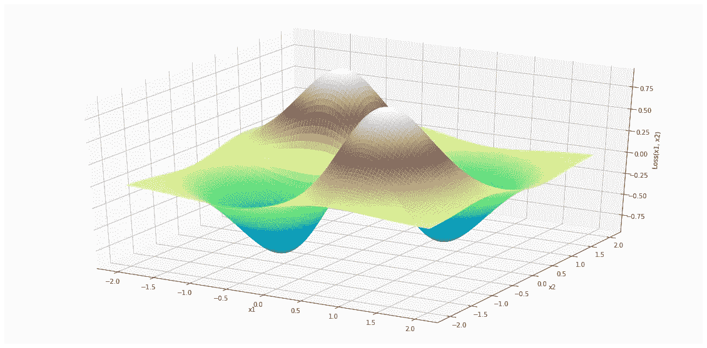
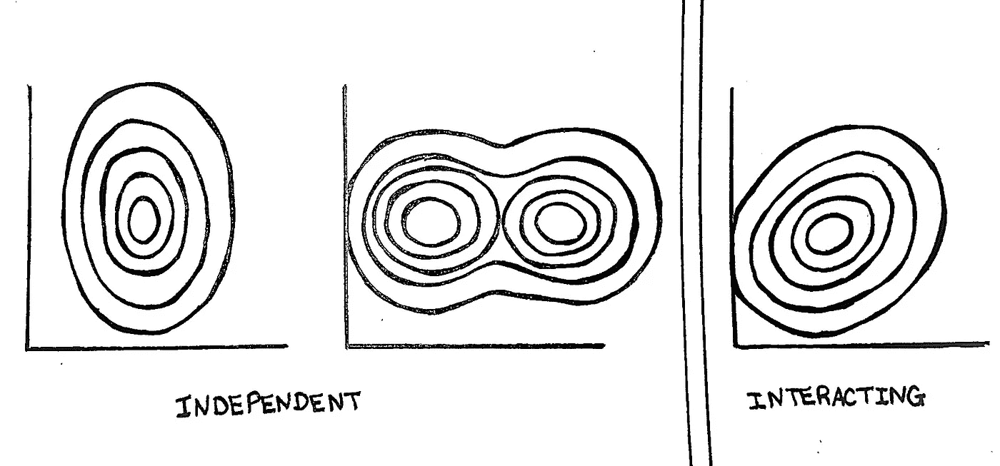
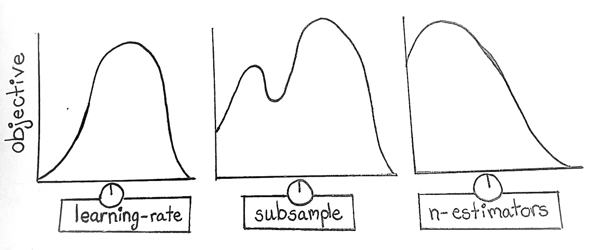
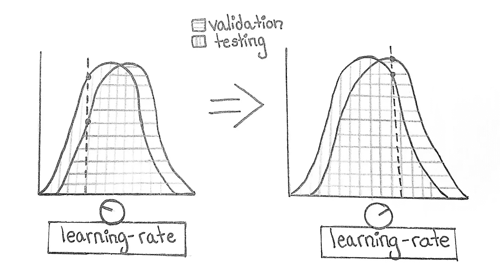
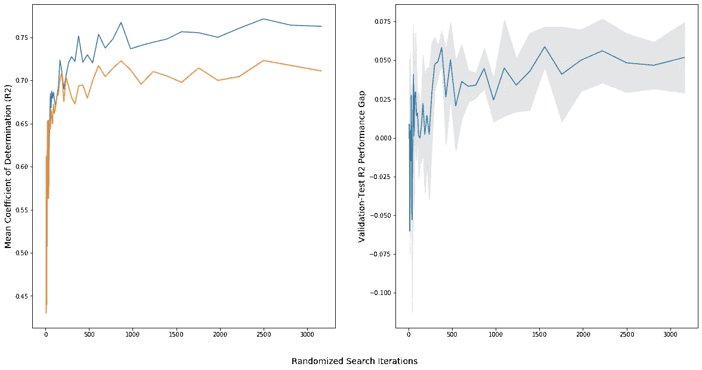

# 为什么机器学习验证集变得陈旧

> 原文：<https://towardsdatascience.com/why-machine-learning-validation-sets-grow-stale-69fa043fd547?source=collection_archive---------36----------------------->

## 用这个心智模型提升你的直觉

由 [Unsplash](https://unsplash.com/s/photos/mixing-board?utm_source=unsplash&utm_medium=referral&utm_content=creditCopyText) 上的 [chuttersnap](https://unsplash.com/@chuttersnap?utm_source=unsplash&utm_medium=referral&utm_content=creditCopyText) 拍摄

当你进入数据科学的世界时，你学到的第一件事就是拥有[独立数据集](https://en.wikipedia.org/wiki/Training,_validation,_and_test_sets)来训练和验证你的机器学习模型的重要性。那么，为什么这个概念看起来如此难以掌握呢？

尽管我们为什么要对数据集进行分区有一个简单的直觉，但要深入理解这个行业仍然有一些障碍。一个是过时的经验法则的持续存在，如“70-30 列车测试分割”或大数据前黑暗时代的其他遗产。

另一个问题是，我们中的许多人在了解到除了测试集之外，我们还应该有一个单独的验证集，我们可以用它来进行超参数调优，但令人惊讶的是，这个问题没有好的答案。这个问题是:“如果我们可以通过调整超参数来适应测试集，难道我们不能适应验证集吗？”

答案是:可以，当然可以。最终，您将过度适应一个验证集，并且它将被认为已经“过时”今天我想探索一些思考为什么会发生这种情况的方法。我希望通过这样做，我们可以绘制出一条路径来更深入地理解过度拟合和数据划分，而不仅仅是人们期望在面试中知道的两个命题陈述。

首先，我们将探讨损失景观的概念，以及如何利用样本景观和总体景观之间的关系来理解验证集泄漏。在这个过程中，我们将基于一些简化的假设开发一个有用的心智模型。最后，我们将通过一个快速实验(代码包含在下面)来测试我们的理解。

让我们开始吧！

**一个简单的想法被命名为:损失景观**

二元函数。[代码。](https://gist.github.com/rayheberer/bd2d94443e77b9734d52a7a4c736bbf3)

如果你熟悉机器学习，你可能会熟悉损失景观的概念。尤其是如果你已经研究过神经网络和梯度下降，并且读过那些关于基于梯度的优化的文章，其中有华丽的可视化和动画。

损失景观只是一个函数。具体来说，机器学习模型的损失或错误是其参数的函数。

如果你觉得这个想法太简单，不值得特别关注，我理解你的想法。但是“损失景观”确实是这类函数的名称，知道它可以让你轻松地查找各种酷的内容和与[相关的研究](https://arxiv.org/abs/1712.09913)，即使你已经理解了底层概念。

“风景”这个词唤起了我们的物理直觉。由 [Fabrizio Conti](https://unsplash.com/@staticlaw?utm_source=unsplash&utm_medium=referral&utm_content=creditCopyText) 在 [Unsplash](https://unsplash.com/s/photos/valley?utm_source=unsplash&utm_medium=referral&utm_content=creditCopyText) 拍摄

要点是损失景观是可以遍历的函数，无论是通过梯度下降还是通过其他方法(例如模拟退火、进化方法)。这样命名可以让我们从物理直觉的角度来看待它，即使你要处理的功能通常是在更高维的空间中。

虽然我们通常认为损失景观是模型参数的函数，但也可以将其视为超参数的函数。

请注意，虽然损失可以根据数据和模型参数明确计算，但损失和模型超参数之间的联系不太直接。如果这让你感到困扰，回想一下生物学家使用[健康景观](https://en.wikipedia.org/wiki/Fitness_landscape)来思考生殖成功是遗传因素的一个功能。如果有必要的话，可以将损失视为超参数(和数据)的函数，视为“模型适应度景观”。

现在要认识到的关键思想是，数据集的每个分区都有单独的损失景观。训练集、验证集和测试集的损失情况都是不同的。如果数据已经被很好地分割，使得每个集合都是代表性的样本，那么希望非常相似，但是仍然不同。

最重要的是，手头上的所有数据都将有不同于外部数据底层“群体”的损失情况。我们同时拥有验证集和测试集的原因是，如果验证集确实随着时间的推移泄露了信息，我们仍然需要一些数据来对我们的模型在野外的表现进行无偏估计。

考虑超参数调优的一种方式是，作为超参数的函数，遍历验证集数据的损失情况。为了建立直觉，让我们从想象一个“理想”的景观开始。

**走向心智模型:想象独立的超参数**

当然，我们理想的损失情况是超参数是“独立的”我的意思是，在它们与损失的关系中，没有交互作用项。这种函数将具有不沿对角线突出的轮廓。这样更容易表达我的意思:

这一系列损失景观非常理想的原因是，在处理它们时，调整许多超参数的问题可以分解为一次单独调整一个超参数的行为。由于任何一个超参数的最佳值都独立于任何其他超参数的值，因此我们可以依次调整它们，而不是并行调整。

换句话说，把每个超参数想象成一个旋钮。我们所要做的就是触摸每个旋钮一次，直到我们找到每个特定旋钮的最佳位置，然后再继续。

与每个旋钮相关联的是损失场景的[投影](https://en.wikipedia.org/wiki/Projection_(mathematics))。我们函数的这一部分只有一个独立变量:我们正在调整的超参数。

这就是事情变得有趣的地方。回想一下，每个数据集都有自己的损失景观。现在想象将这些功能的投影叠加在每个被调谐的旋钮旁边。让我们选择用于确定最佳超参数值的验证数据的损失情况，以及全部数据的假设损失情况，这是我们真正*希望*我们的模型尽可能做到的，也是我们的测试集的估计值(如果采样正确的话)。

根据验证集数据，每次我们将旋钮调到最佳值时会发生什么？

很有可能，这两种亏损局面并不完全一致。每当我们调整一个值，使其验证损失部分达到峰值时，我们就有可能超过“总体”损失情况的峰值。我们调得越多，越过的峰值就越多。这导致验证集和真实世界(由测试集估计)性能之间的差距越来越大。

就是这样！这就是为什么验证集变得陈旧并泄漏信息，或者至少是一种有帮助的思考方式。

在这里，特别有洞察力的读者可能会问:“但是如果验证和人口损失景观总体上不一致，为什么峰值比其他点不一致？”这是一个很好的问题，它开始测试我们已经开发的心智模型的极限。

要回答这个问题，请考虑单个超参数的验证性能。现在，将目标函数中的每个值都看作是来自可概括特征的贡献，以及来自验证集数据的特性的贡献。

随着您向更优的值移动，这些组件的贡献可能会增加。为了提高验证性能而不降低测试集和野外的结果，需要这种提高只来自可推广组件。

作为回报，我也向您提出这个问题:如果您正在优化的超参数之一实际上与从数据中学习可概括的特征没有什么关系(例如`random_state`)，该怎么办？对于类似这样的事情，优化验证损失会有什么影响？

说到底，我们在这里经历的是一个心智模型，因此服从著名的[乔治·博克斯](https://en.wikipedia.org/wiki/George_E._P._Box)格言:

> 所有的模型都是错的，但有些是有用的。

在这种情况下，我希望这是一种有用的方式来思考如何过度适应验证集背后的机制。

**弄脏我们的手:模拟验证集泄漏**

作为一名数据科学家，不经过测试就阐述一个想法对我来说并不合适。要求超参数没有任何交互作用有点严格。虽然这对于开发一个心智模型是有用的，但如果能有一些实证结果来表明所开发的思想扩展到不太理想的场景，那就更好了。

下面，我运行了一个快速实验，将在[梯度推进回归模型](https://scikit-learn.org/stable/modules/generated/sklearn.ensemble.GradientBoostingRegressor.html)上执行的调优量，以及验证集和测试集性能之间的差距联系起来。我选择使用梯度增强，因为它们是一类具有大量超参数的流行模型。

根据我们对验证集泄漏的理解，我们期望看到的是，随着调优的增加，性能差距会越来越大。在我的实验中，“更多”调优是通过在 5 个不同的超参数中运行更多的随机搜索迭代来定义的。更多的迭代意味着在验证集上找到更优结果的机会更大。如果心理模型认为这种最优性的一部分来自验证数据的不可概括的怪癖是真的，那么我们预期不是所有这些性能的提高都会出现在测试数据中。

在展示我的结果之前，我想澄清这个实验偏向于支持我的论文的一个重要方面:

我使用少量数据进行训练和验证。当然，通过拥有大的验证集可以减轻验证集泄漏，因此选择小的 [*波士顿房价*](https://www.cs.toronto.edu/~delve/data/boston/bostonDetail.html) *数据集可以很容易地演示对小的验证集的过度调整。*

除了我选择的特定数据集之外，您应该怀疑这些结果是否成立！我鼓励你提出自己的实验，并与我们其他人分享你的结果。

正如您所看到的，当我们投入越来越多的精力来优化我们的超参数并基于验证集性能选择模型时，验证和测试集性能之间的差距就越来越大。

如果我们已经调优了超参数的一个子集，然后回来使用另一个子集，或者尝试切换所使用的模型系列，这种情况会更加明显。数据样本(验证集)提供的每个决策都会慢慢地将样本的随机波动编码到我们的产品中。

**结论**

这实际上是我第二次尝试解释超参数调整和验证集过拟合现象之间的关系。对于一个具有相对简单的潜在直觉的想法来说，要详细解释是非常困难的。

我认为问题的一部分是我们的集体知识仍然被采访-回答风格的断言所支配，比如“你对验证数据过度拟合”和“验证集泄漏信息”，这些断言没有视觉或经验直觉的支持。

虽然这篇文章试图满足这种对更深入和简单的解释的需求，但仍然有更多角度和思考方式的空间。Cassie Kozyrkov 最近写了一篇关于数据集分区的有趣文章,用教学和憨豆先生做类比。我很高兴看到数据社区还能提出什么。

*图表由我可爱的女朋友梅根提供。*