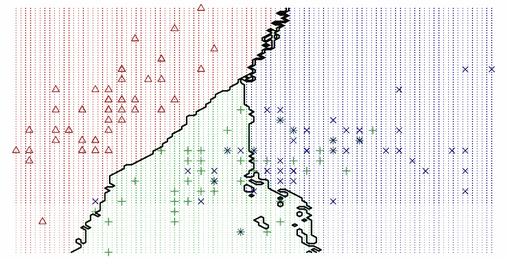
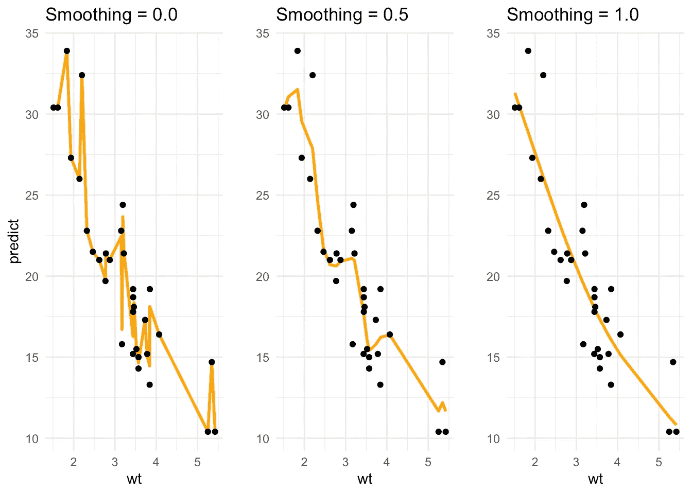
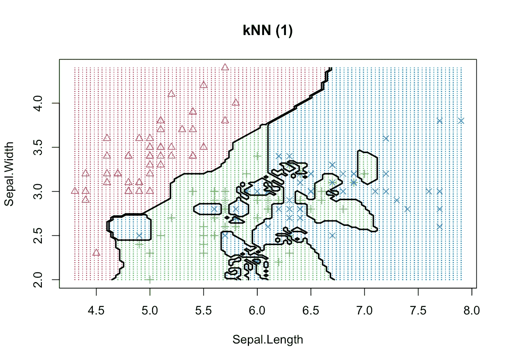
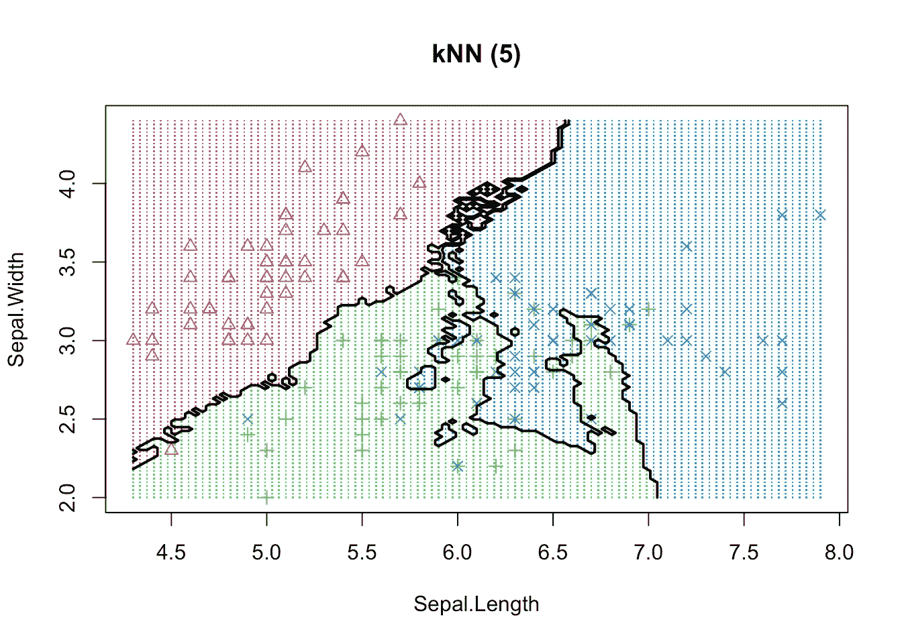
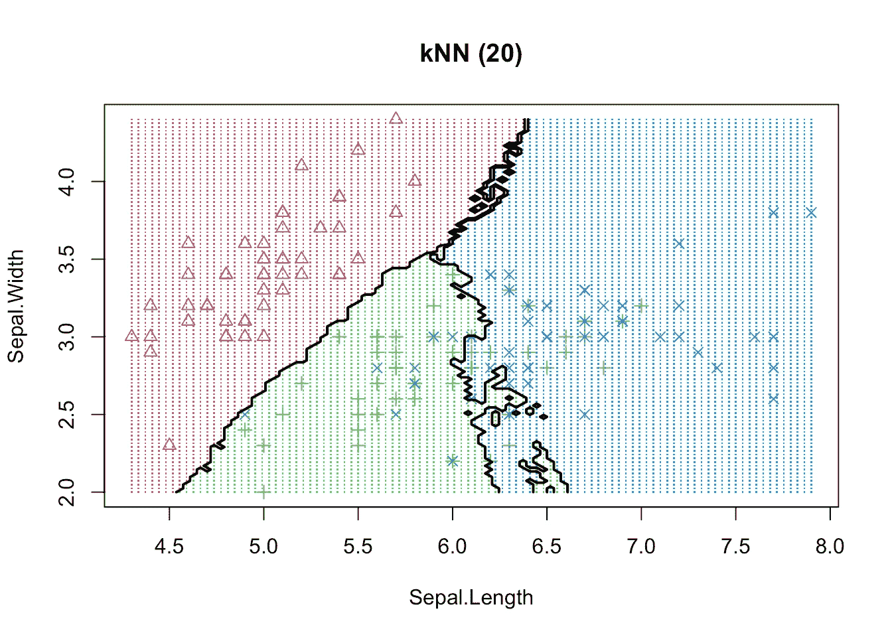

# 为什么管理层喜欢过度拟合

> 原文：<https://towardsdatascience.com/why-management-loves-overfitting-361175edcc3b?source=collection_archive---------88----------------------->

## 管理数据科学中决策者的期望

数据科学家的角色包括构建和微调模型，并改进各个业务领域的流程和产品。典型的使用案例包括营销活动、客户流失预测或欺诈检测。经过训练的模型不仅应该处理(看到的)训练数据，还应该处理新的(看不到的)真实世界数据。然而，这一要求对于大多数相关决策者来说并不明显，他们倾向于支持过度拟合的模型，并用难以置信的数字和承诺欺骗自己。当结果不一致时，问题总是在实施后立即出现。因此，正如我们即将推出的课程[R](https://www.quantargo.com/courses/course-r-machine-learning)中所涵盖的，正确管理预期并采用行业最佳实践是每个负责任的数据科学家的任务。

为了了解过度装配的问题，让我们看看著名的`mtcars`数据集中一辆汽车的重量(wt)与每加仑行驶里程(mpg，miles-per-gallon)之间的简单关系。显然，汽车越重，每加仑行驶的里程数越少(或者油耗越高)。我们已经使用 R 中的`smooth.spline()`函数对关系进行了建模，并使用平滑参数(`spar`)作为滑块中的参数。我们看到接近于零的`spar`似乎很好地模拟了关系(平滑)。通过增加模型的`spar`，它开始更紧密地拟合观察值，因此它的方差增加了。然而，一旦`spar`越来越接近一，花键开始失去其光滑的形状和之字形-这是**过度拟合**的迹象。

同样的现象可以在一个分类的例子中表现出来。我们使用基本的 K-最近邻模型，使用变量萼片长度/宽度和花瓣长度/宽度来区分 50 朵花中的 3 个鸢尾属物种。这三个类别可以很容易地从视觉上区分为三个区域。通过将邻居的数量移近 1，我们增加了模型方差，并观察到决策边界变得支离破碎。

即使更多的观察值可以在样本内正确分类，或者类似地，回归误差可以减少，我们也应该始终记住，模型性能只能由样本外数据来判断。因此，决策者应该始终更加关注模型是如何选择的，而不是报告的性能有多好。为了安全起见，如果有足够的数据可用，我们总是可以保留一个最终测试(对模型开发人员不可用)来评估实际性能——很像一场 [Kaggle](https://www.kaggle.com/) 竞赛。

所以我最后的建议是:

1.  不要欺骗自己，诚实对待样本外的数据/性能。
2.  管理好决策者的期望——现实一点。
3.  如果你第一次尝试的结果看起来非常好——他们很可能是错的。

*最初发表于*[T5【https://www.quantargo.com】](https://www.quantargo.com/blog/2019-01-23-why-management-loves-overfitting)*。*