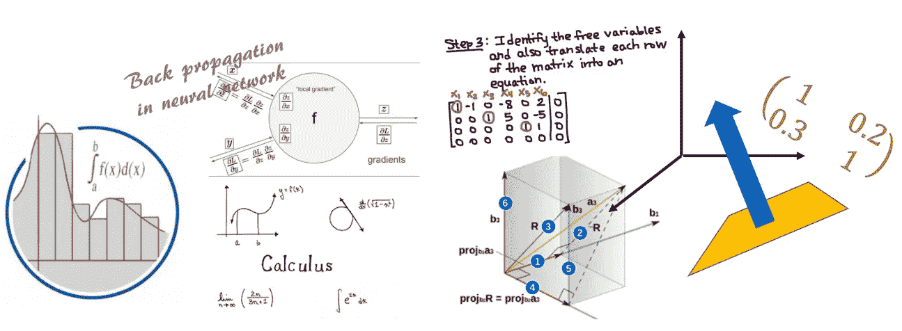
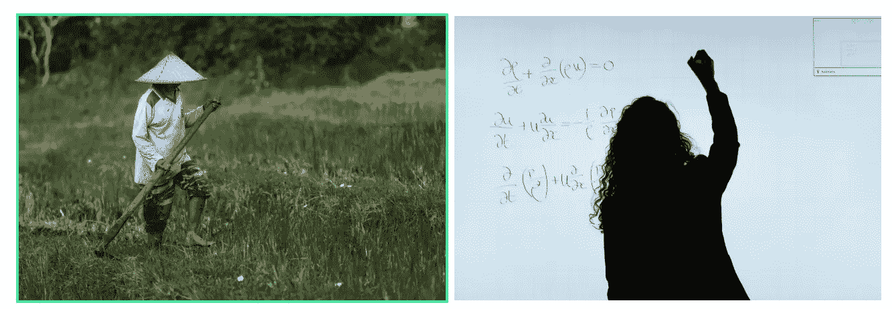
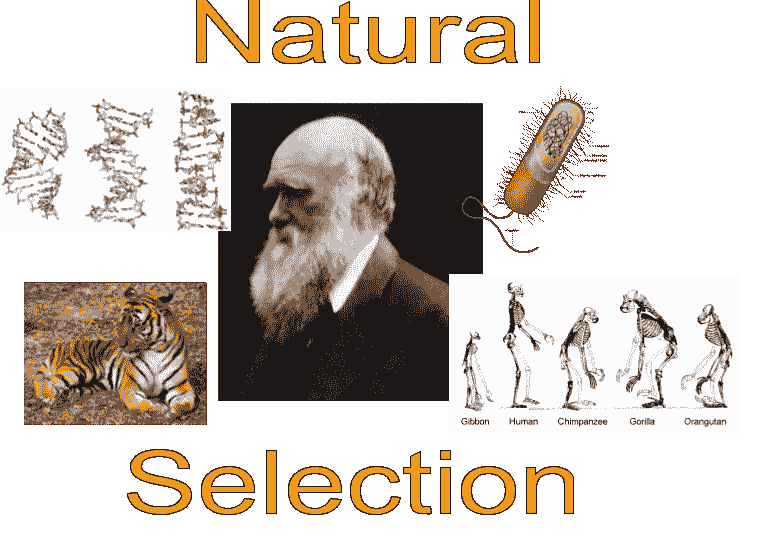
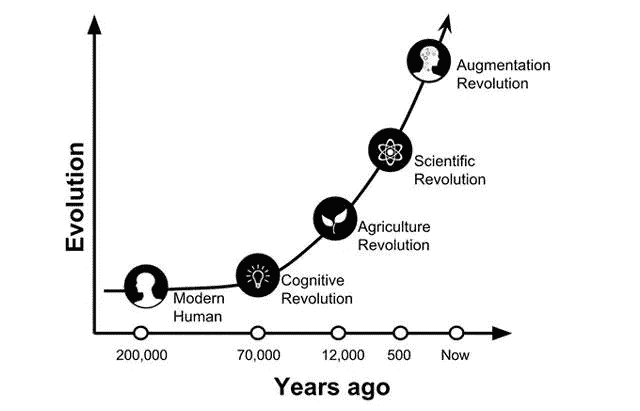
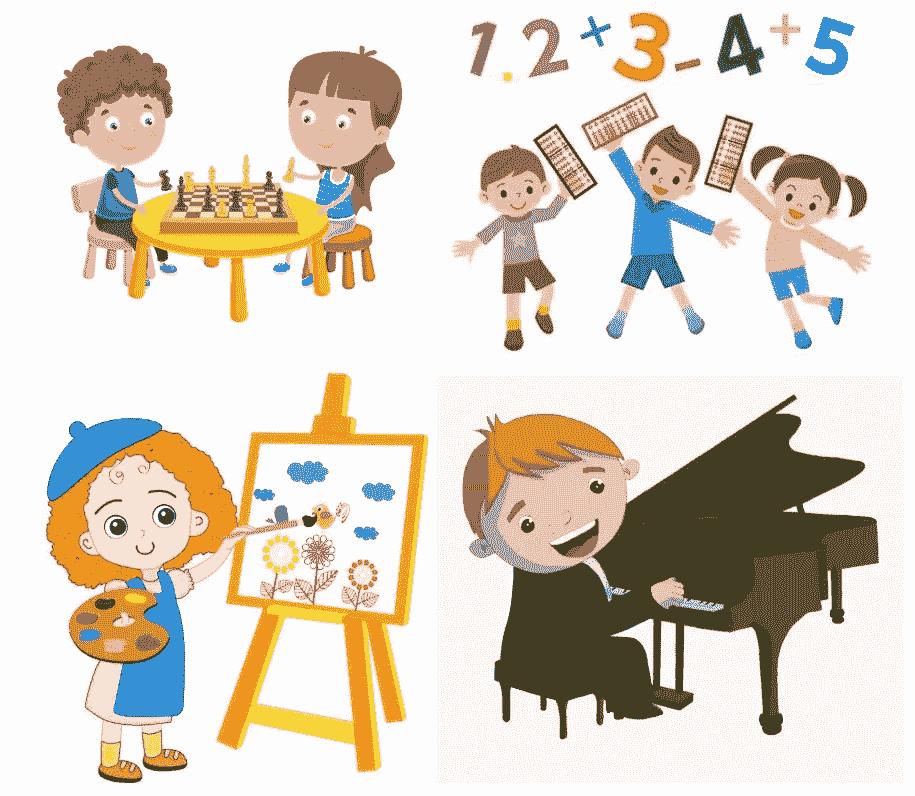
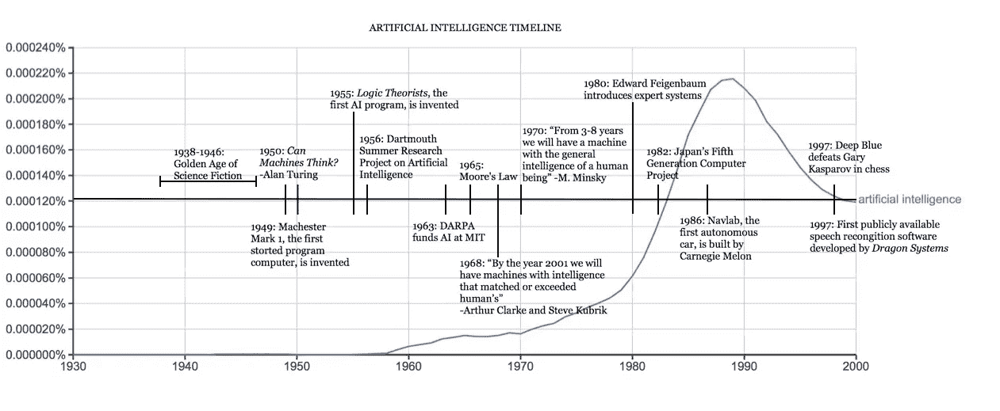
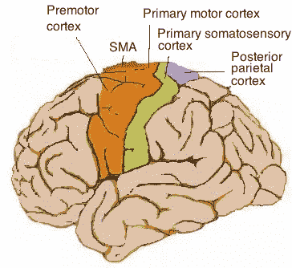

# 为什么数学对人工智能来说很容易，但园艺却不容易:莫拉维克悖论

> 原文：<https://towardsdatascience.com/why-math-is-easy-for-ai-but-gardening-is-not-moravecs-paradox-99994b201d10?source=collection_archive---------19----------------------->

## 对于人工智能来说，进行高级推理很容易，但获得像样的运动技能却非常困难。

图片来源: [Pixabay](https://pixabay.com/photos/pots-plants-cactus-succulent-shelf-716579/)

# 介绍

人工智能(AI)系统，由海量数据和复杂算法提供动力——包括但不限于——深度神经网络和统计机器学习(ML)(支持向量机、聚类、随机森林等。)，正在对我们的日常生活产生深远的变革性影响，因为它们进入了从金融到医疗保健，从零售到运输的各个领域。

网飞电影推荐器，亚马逊的产品预测，脸书展示你可能喜欢的东西的神秘能力，谷歌的助手，DeepMind 的 AlphaGo，斯坦福的 AI 击败人类医生。[机器学习正在吃软件](/how-machine-learning-is-eating-software-a751fffe1188)。这份清单还在继续…

然而，这些强大算法的一个共同特点是[它们利用复杂的数学来完成它们的工作](/mathematics-for-ai-all-the-essential-math-topics-you-need-ed1d9c910baf)——对图像进行分类和分割，做出关键决策，提出产品建议，对复杂现象进行建模，或者从海量数据中提取并可视化隐藏的模式。

机器学习数学(来源:"[数据科学基础数学](/essential-math-for-data-science-why-and-how-e88271367fbd)")

很简单，所有这些数学过程都超出了一个人(或一个团队)手动(甚至在计算机上)或头脑中思考的范围。这就是 AI/ML 系统的魅力所在——当与大量原始数据配对时，它们可以自动化复杂的数学推理任务(在概率模型和统计规则的帮助下)。

然而，在这篇文章中，我们将会看到，对于人工智能系统来说，并非所有类型的自动化都是容易的。

> 这些强大算法的一个共同特征是它们利用复杂的数学来完成工作。

# 推理自动化与运动技能

## 人工智能在数学方面做得很好

冒着有点轻视它的风险，我们可以把一个现代的人工智能系统想象成一个自动化的数学推理系统。

一直都是这样。即使在过去。

上世纪八九十年代，[符号逻辑](https://pathmind.com/wiki/symbolic-reasoning)和[专家系统](https://www.guru99.com/expert-systems-with-applications.html)盛行。请记住，符号逻辑只不过是一种复杂的数学推理范式。

快进到 2010 年代和 2020 年代，我们正在开发和使用以庞大的线性代数解算器和统计分布建模器为核心的系统。

这种方法已经从基于符号的[(演绎逻辑)转变为基于数据的](https://www.livescience.com/21569-deduction-vs-induction.html)，但共同点没有改变——人工智能系统在复杂的数学中工作得很好。

> 我们可以把一个现代人工智能系统想象成一个自动化的数学推理系统。

## 园丁和数学家谁更聪明？

这个问题当然是修辞性的，近乎冒犯。智力对不同的人有不同的含义，没有理由认为某一特定职业的从业者会比另一职业的从业者更聪明，即使平均而言也是如此。

毕竟，智力是非常难以定义的。

图片来源:Unspalsh

好吧。让我们倒退一点，用一个更严格的智力定义来工作。

毫无疑问，今天的人工智能系统是大规模计算系统。深度学习系统的训练是通过数百次重复通过处理大量矢量化数据的计算节点的堆叠层来进行的。在基本层面上，它可以归结为数十亿次简单的计算——比如乘法、加法或逻辑与/或。

因此，在狭义上，我们可以在计算次数和人工智能系统的推理能力之间建立等价关系。我们已经看到，从[单隐层神经网络无法解决异或问题](https://www.quora.com/Why-cant-the-XOR-problem-be-solved-by-a-one-layer-perceptron)到 [152 层 ResNet](https://www.wired.com/2016/01/microsoft-neural-net-shows-deep-learning-can-get-way-deeper/) 能够以高精度分类数千种图像类别。

更多的层，更多的计算，更强大的人工智能。

图片来源:[https://i1 . WP . com/www . michaelchementi . com/WP-content/uploads/2017/11/Deep-Neural-Network-What-is-Deep-Learning-edu reka . png](https://i1.wp.com/www.michaelchimenti.com/wp-content/uploads/2017/11/Deep-Neural-Network-What-is-Deep-Learning-Edureka.png)

因此，如果我们把计算和智能联系在一起，也就是说，用更高程度的智能进行复杂计算的能力，那么数学家就拿走了蛋糕，不是吗？

> 因此，在狭义上，我们可以在计算次数和人工智能系统的推理能力之间建立等价关系。

至少，我们可以以某种方式说服自己，高水平的心理推理任务比一些卑微的体力劳动需要更多的计算，比如园艺，我们可以轻松地完成这些工作，而无需在大脑中进行任何复杂的计算。

事实证明，这将是一个错误的结论。

对一个人工智能系统来说，成为数学家比获得园丁的技能更容易。至少，对于现在的人工智能系统来说，情况似乎是这样的。

> …我们可以以某种方式说服自己，高层次的心理推理任务需要比一些体力劳动多得多的计算。

# 莫拉维克悖论

汉斯·莫拉维克是出生于奥地利的美国机器人专家和计算机科学家，目前是卡耐基梅隆大学[机器人研究所](https://www.ri.cmu.edu/)的兼职教员。

他因在机器人、人工智能方面的工作以及关于技术影响的著作而闻名。莫拉维克也是一位[未来学家](https://en.wikipedia.org/wiki/Futures_studies)，他的许多出版物和预测都聚焦于[超人类主义](https://en.wikipedia.org/wiki/Transhumanism)。

在 20 世纪 80 年代，莫拉维克和其他先驱科学家，如[马文·明斯基](https://en.wikipedia.org/wiki/Marvin_Minsky)和[罗德尼·布鲁克斯](https://en.wikipedia.org/wiki/Rodney_Brooks)，做了一个观察:“与传统假设相反，推理(人类的高级)需要很少的计算，但是[感觉运动](https://en.wikipedia.org/wiki/Sensory_processing#Sensorimotor_system)技能(人类相对低级)需要大量的计算资源”。

正如 Moravec 所写的，“让计算机在智力测试或玩跳棋时表现出成人水平的表现相对容易，而在感知和移动性方面，让它们拥有一岁儿童的技能却很难或不可能”。

虽然这种观察是在三十多年前进行的，并且在狭窄的图像分类领域中已经展示了人类水平的感知能力的 ResNet-50 模型之类的模型当时还没有开发出来，但是即使在今天，观察的准确性仍然很高。

我们都见过 [OpenAI 的惊人程序在 Dota](https://openai.com/projects/five/) 的复杂比赛中放倒人类选手，但你见过单个机器人放倒哪怕是初级的国家级乒乓球选手吗？

机器人足球队对抗业余俱乐部队？一个完全自主的机器人园丁，可以修剪树叶，轻轻采摘花朵，完美无瑕地浇灌花园？

为什么不呢，我们想知道…

> 与传统假设相反，推理(人类的高级)需要很少的计算，但感觉运动技能(人类的相对低级)需要大量的计算资源。

## 人类技能的生物学基础

所有人类的技能都是通过自然选择过程设计的机器，从生物学角度实现的。这也是一个非常重视优化(能源支出)的过程。

想想人类的大脑。超过 800 亿个神经元在这个紧凑的处理器中工作，而[的电力账单只有一个昏暗的灯泡(~ 20 瓦](https://hypertextbook.com/facts/2001/JacquelineLing.shtml))。大量的优化使得这个 1400 克的海绵状粘性物质成为整个已知宇宙中最节能的处理器[。](http://nautil.us/issue/59/connections/why-is-the-human-brain-so-efficient)

因此，在整个进化过程中，人类的技能发展倾向于保留满足极其苛刻的优化标准的设计改进。但这种优化过程是缓慢的，需要很长时间来塑造和引导特定技能的进化。

因此，可以简单地理解为，技能越古老，自然选择就有越多的时间来改进设计。

图片来源:维基百科(知识共享许可)

抽象思维和高级数学推理只是最近才发展起来，因此，它的实现和机制预计不会特别有效。

> 因此，在整个进化过程中，人类的技能发展倾向于保留满足极其苛刻的优化标准的设计改进。

## 直到最近，高级推理才成为进化的宠儿

暂停一秒钟，想象自己是一个站在 20 万年前广袤的非洲热带草原或亚马逊雨林中的智人。

以下哪项技能是你最看重的？

*   跑得更快以逃离一群鬣狗的能力(至少给自己一个生存的机会)
*   识别和区分有毒植物和药用植物的能力
*   加法和乘法的能力，或者想象一个美丽的故事告诉你的队友

我们这个物种的感官知觉和运动技能(与肌肉运动有关)确保了它在大部分历史中的生存。

直到 7 万年前所谓的认知革命。

人类学分析和化石记录表明，那时我们的物种发展了用符号和想象的实体来思考的能力。

【https://www.industry-era.com/augmented-human-10070.php】图片来源:

**正如尤瓦尔·赫拉利在他的畅销书《智人》中指出的那样，智人之所以优于其他类人物种，最重要的一个原因是她能够以抽象的术语和想象的实体(如上帝、金钱、国家等)进行推理和思考。).**

**尼安德特人可以很容易理解新鲜水果或今天捕获的游戏的价值，但不能完全理解“建立信任”的想象效用，以便他们可以捕获更大的游戏，作为一个团队工作，明天*。***

******

***图片来源:[https://www.ynharari.com/book/sapiens/](https://www.ynharari.com/book/sapiens/)***

***抽象思维和数学推理很好地服务了我们这个物种。语言、数学、逻辑、艺术、科学、技术——一切都源于这种能力。***

***但这只是最近的发展。***

***在那之前的几十万年里，运动技能和感官知觉帮助了我们基因的生存和滋养。只有那些具有优越反射能力，能够从远处发现掠食者威胁，或者跑得更快，投掷目标更准的动物才能存活下来，并把它们的基因传递下去。***

***因此，我们的生物学确保了我们在头盖骨内携带了一个次优化的数字处理器和一个极其高效的运动皮层。***

> ***抽象思维和数学推理很好地服务了我们这个物种。语言、数学、逻辑、艺术、科学、技术——一切都源于这种能力。但这只是最近的发展。***

## ***(对人工智能而言)比下棋或做积分更难的活动***

***Moravec 认为，总的来说，“我们应该预料到对任何人类技能进行逆向工程的难度大致与该技能在动物身上进化的时间成比例”。***

***最古老的人类技能在很大程度上是无意识的，在我们看来是毫不费力的。因此，那些看起来毫不费力的技能，计算量很大，很难被人造人工智能系统逆向工程，这并不令人惊讶。***

***需要有意识努力的技能——下棋、做数学、写诗、弹钢琴、画画——对人工智能来说可能一点也不困难。***

***最近几天，我们都听说过[弹钢琴](https://experiments.withgoogle.com/ai/ai-duet/view/)、国际象棋和围棋冠军、[绘画大师](https://www.instapainting.com/ai-painter)、[作曲](https://www.aiva.ai/)或数学天才艾，不是吗？***

******

***图片来源:[作者](https://medium.com/@tirthajyoti)***

***但是，我们还没有听说过一个人工智能/机器人系统可以在狭窄的厨房里洗碗，而不会干扰周围的几十个器皿，对吗？***

***见鬼，甚至没有一个商业机器人能够感知并在我们的头盖骨周围施加适量的压力，给我们一个奇妙的头部按摩！如果你能买到这样的 AI，我打赌你会马上买一台。***

***这些是真正的难题。***

> ***我们应该预计，对任何人类技能进行逆向工程的难度，大致与该技能在动物身上进化的时间成正比。***

***早在 1997 年，国际象棋就被计算机征服了。一旦 [AlphaGo 打败了 Lee Sedol](https://en.wikipedia.org/wiki/AlphaGo_versus_Lee_Sedol) ，[只用了一年左右的时间就开发出了 AlphaGo-zero](https://deepmind.com/blog/article/alphago-zero-starting-scratch) 。强大的[定理证明器](https://arxiv.org/abs/1904.00619)和逻辑合成引擎是在 50 年代和 60 年代开发的，编程和计算能力有限。***

***但是现实世界中机器人技术、视觉和听觉感知、运动技能仿真的发展速度一直很慢，而且极具挑战性。***

***这肯定不是在这些领域工作的专业人员和研究人员的过错。这些任务对于专注于数学推理和大规模线性代数求解器的狭义人工智能来说是不容易完成的。***

## ***最有力的证明？人工智能的历史***

***莫拉维克的观察不是物理定律。或许，它更类似于摩尔定律，毕竟，摩尔定律是一个敏锐的观察。***

***有人称之为悖论。然而，我相信在人工智能的发展史上，我们有充分的证据证明这个悖论。***

***甚至在人工智能和计算机科学的早期，研究人员已经成功地编写了程序，证明定理，解决代数和几何问题，玩像 T2 跳棋和国际象棋这样的游戏。所有这些都只需要适度的计算能力，而且几乎没有数据。***

***这让他们相信，一旦这些“困难”问题被人工智能完全解决，那么“*从照片中认出朋友的脸”*或“*在大学宿舍里走来走去而不翻倒*”这些“简单”问题应该是在公园里散步。***

***正如罗德尼·布鲁克斯所说，智能事物“最能被描述为受过高等教育的男性科学家发现具有挑战性的事物”*——国际象棋、符号整合、证明数学定理以及解决复杂的文本代数问题。四、五岁的孩子可以毫不费力地做的事情，如在视觉上区分咖啡杯和椅子，或用两条腿走路，或找到从卧室到客厅的路，都不被认为是需要智力的活动。****

***天哪，他们错了！***

******

*****图片来源:**[**http://sitn . HMS . Harvard . edu/flash/2017/history-人工智能/**](http://sitn.hms.harvard.edu/flash/2017/history-artificial-intelligence/)***

***这些所谓的“简单”问题，与视听感知和运动/移动有关，结果却是最难解决的问题。***

***我们可以有把握地说，我们现在明白是怎么回事了。这是因为事实上，进化的大机器也一直在完善和优化我们物种的这些技能，比其他任何事情都更艰难和持久。***

***毕竟，生物学不会那么容易屈服于人工智能事业。***

# ***AGI 和未来的工作***

## ***模仿生物学是通向人工智能的正确道路吗(AGI)？***

***有人可能会说，也许我们应该建立模拟大脑回路的人工智能系统，并设计各种模仿进化作品的子处理器。通过这种方式，我们或许能够像人类进化那样，将适量的计算资源分配给合适的子处理器。***

***全脑仿真可能是通往 AGI 的一条可能的道路。围绕它的可行性和潜力有很多争论[。有一个令人兴奋的项目是](https://feed.jeronimomartins.com/deep/artificial-general-intelligence-and-whole-brain-emulation/)[模拟人类大脑的整个新皮层](https://en.wikipedia.org/wiki/Blue_Brain_Project)。我们不是来讨论这些的。***

******

***图片来源:维基百科(创意通用许可)***

***目前，普遍接受的构建智能代理的方法是“模仿人类行为”。这相当于著名的[图灵测试](https://en.wikipedia.org/wiki/Turing_test)，人工智能代理通过测试的标准只是“‘在外部考官看来像人类，并迫使她这么认为’”。请注意，图灵测试并没有硬性要求人工智能代理在智能谱上与人类完全一样。它只需要代理人扮演一个伟大的模仿者。***

***只要我们按照那个原则设计人工智能系统，我们就可能会受到生物学的限制。与构建只解决数学推理问题的人工智能相比，构建模拟日常感知和运动任务的人工智能将需要我们更多的计算能力和创造力。***

***数学很容易，毕竟园艺很难。***

## ***未来的工作？***

***人们想知道这对未来的工作有什么影响。有很多关于[白领工作被人工智能技术](https://www.forbes.com/sites/johnkoetsier/2019/06/04/ai-will-transform-500-million-white-collar-jobs-in-5-years-silicon-valley-must-help/#3c523c457e11)取代的猜测，就像工业革命如何取代大量体力劳动工作或汽车革命如何使马车过时一样。***

***另一方面，许多专家一直在宣布人工智能和机器人自动化带来的所谓的[第四次工业革命](https://www.weforum.org/focus/fourth-industrial-revolution)将为劳动力市场带来[转机和更光明的未来](https://www.weforum.org/agenda/2019/09/fourth-industrial-revolution-jobs/)。***

***无论情况如何，我们看到有一个强有力的科学论据来相信，许多涉及复杂身体运动和微妙感官知觉的工作(例如，园艺，理发，老人护理，儿童保育，体育，调酒，酒店和酒店)不太可能在短期内被任何机器人自动化所取代。尽管这些工作表面上看起来毫不费力，但它们依赖于通过数百万年的生物过程优化而完善的技能，并且需要比许多白领重复性工作多得多的计算，这些工作只依赖于高级推理，这是人类进化的相对较新的产物。***

***未来是不确定的，令人兴奋的。保持开放的心态…***

> ***大量涉及复杂身体运动和微妙感官知觉的工作不太可能在短期内被任何机器人自动化所取代。***

******

***图片来源:Pixabay***

***如果您有任何问题或想法要分享，请通过[**tirthajyoti【AT】Gmail . com**](mailto:tirthajyoti@gmail.com)联系作者。此外，您可以查看作者的 [**GitHub**](https://github.com/tirthajyoti?tab=repositories) **知识库**中的代码、思想和机器学习和数据科学方面的资源。如果你和我一样，对人工智能/机器学习/数据科学充满热情，请随时[在 LinkedIn 上添加我](https://www.linkedin.com/in/tirthajyoti-sarkar-2127aa7/)或[在 Twitter 上关注我](https://twitter.com/tirthajyotiS)。***

*** [## Tirthajyoti Sarkar - Sr .首席工程师-半导体、人工智能、机器学习- ON…

### 通过写作使数据科学/ML 概念易于理解:https://medium.com/@tirthajyoti 开源和有趣…

www.linkedin.com](https://www.linkedin.com/in/tirthajyoti-sarkar-2127aa7/)***