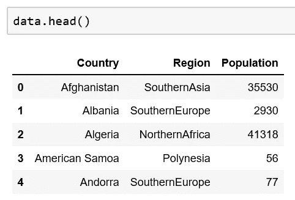
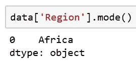
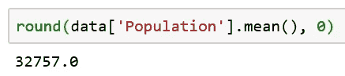
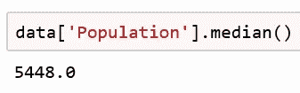
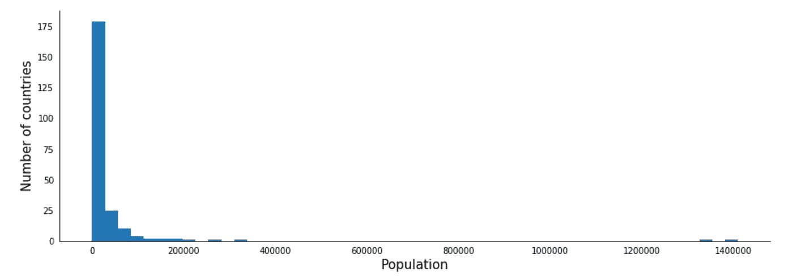

# 为什么中位数(有时)比平均数好

> 原文：<https://towardsdatascience.com/why-median-is-sometimes-better-than-mean-dcdf5377c9d1?source=collection_archive---------27----------------------->

## 以世界人口为例的简单统计。用熊猫。

由 [Unsplash](https://unsplash.com?utm_source=medium&utm_medium=referral) 上的 [Louis Hansel @shotsoflouis](https://unsplash.com/@louishansel?utm_source=medium&utm_medium=referral) 拍摄的照片

当然，从数据分析开始，我发现了解数据描述的主要统计方法是非常必要的。当我深入研究时，我意识到对我来说很难理解对给定的数据选择哪个集中趋势指标。因为，当然，你知道，有三种:均值，中值，众数。

所以我决定写这篇文章来帮助像我一样的这个领域的新手解决这个问题，不要害怕数据和统计。要知道，有时候是会发生的，但不应该成为一个人和他成为数据分析师的梦想之间的高墙。对我来说，这也是一个很好的机会，让我可以在我感兴趣的领域——世界、国家和他们的人口——做一个小小的研究。(为什么我觉得有趣——这是另一个故事。)

好，我们开始吧。第一，要拿数据去探索。我在 Kaggle 上发现了一个很好的数据集:这个[国家统计](https://www.kaggle.com/sudalairajkumar/undata-country-profiles/data)。它代表了世界上所有国家的经济、社会、基础设施和环境指标。在我们的研究中，我们只需要这个数据框中的三列:国家名称、所在地区和人口。

让我们看一下数据:

现在我们可以转移到我们的问题:我们应该使用哪个中心趋势度量来探索数据，以及为什么。

最简单的部分是关于模式。它只是一行或一列中所有值中最常见的值，仅此而已。这是数据中最“流行”的数字。

我们对非数字值使用 mode，并且只对它们使用。为了找到它，我们必须计算特定单元在给定列中出现的频率。结果最大的单元就是我们要找的模式。

在我们的数据集中，我们可以将一个关于模式的问题仅应用于 region 列，这是表中该问题唯一有意义的列。因为在国家一栏中所有的值都是不同的，而在人口一栏中它们是数字。

事先，我清理了这个列，只留下了五大洲的名字(而不是东南亚，亚洲等等)。只是不要混淆我们。

区域列的模式为:

很好。这意味着大多数国家位于非洲大陆。这并不奇怪，对吗？

现在让我们转向均值和中值。这两个值都显示了行中间的数字。但是方式不同。

Mean 是平均值，我们可以通过将一行中的所有值相加，然后将结果除以它们的数量来计算它。让我们看看人口。为了计算平均值，我们应该将所有国家的人口值相加，然后将总和除以数据集中的国家数。幸运的是，熊猫可以为我们做到这一点。

这个数字表明，一个正常的国家平均生活着大约 3300 万人。让我们保持原样，移到中间。

中位数也向我们展示了一个平均数。但是它正好是一行中间的值。如果我们按从最小到最大的顺序排列人口值，在这个有序行的中间位置，中位数将是。

我们来计算一下。

Ups！按照中位数计算，一个国家的平均人口只有 550 万人左右。根据平均数，它比平均人口少得多。怎么会这样？

通常平均值和中间值非常接近。如果不是，问题就出在异常值上，即与行中所有其他值都非常不同的值。我们来做一个小小的图形。

人口分布直方图

我们看到大多数国家都集中在零附近。但是有些价值观与众不同。虽然这些点很小，但我们可以看到其中一些在 2 亿以上，两个在 14 亿附近。这些都是离群值。它们会影响平均值。因为这是平均值的本质——考虑一行中的所有值。而中位数则没有这个缺点。

因此结论是，虽然均值、中位数和众数被用来描述数据的中心趋势，但我们在探索中应该相当谨慎地选择一个。否则，我们会做出错误的决定。

现在我们也知道了，世界上充满了勇敢而美丽的小国。大部分在非洲。

这是描述我们周围世界的统计和编程方法的一个小例子。数据分析可以给我们提供更多信息，帮助人们获得问题的答案。