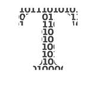

# 为什么平庸的数据科学永远无法服务于社会

> 原文：<https://towardsdatascience.com/why-mediocre-data-science-cant-ever-serve-society-3cc346d3fb06?source=collection_archive---------61----------------------->

## 意见

## 疫情政治表明，需要透明、隐私、背景和不愚蠢的解释

是时候采用消费和处理数据的最佳实践了。在 [Unsplash](https://unsplash.com/s/photos/programmer?utm_source=unsplash&utm_medium=referral&utm_content=creditCopyText) 上[彼得 G](https://unsplash.com/@pepegombos?utm_source=unsplash&utm_medium=referral&utm_content=creditCopyText) 拍摄的照片

  T 疫情冠状病毒是一个完美的例子，说明当科学突然成为焦点，需要以极快的速度进行时会发生什么。虽然在疫情有许多好的和谨慎的数据科学的正面例子，但许多平庸的，甚至完全虚假的信息也充斥着我们的社交媒体。

不幸的是，即使领导人和新闻媒体是善意的，他们也经常提供误导性的信息。例如，他们往往只关注每个国家的官方数字，尽管它们只揭示了部分真相。或者，他们称赞那些似乎很好地处理了疫情的国家，但忘记了隐私泄露和其他问题点。所有这些都增加了人们对政府和现有新闻的困惑和不信任感。

# 良好的意图，不完整的信息

官方公布的死亡人数只揭示了真相的一部分。真正的数字可以通过超额死亡来更好地量化，这意味着将过去五年的平均死亡率与 2020 年的死亡率进行比较。

例如，当纽约市在 4 月 25 日统计大约 16，700 人因冠状病毒[死亡时，超额死亡人数达到 20，900 人；因此，约有 4200 人在没有被确认为病毒受害者的情况下死亡。](https://www.nytimes.com/interactive/2020/04/27/upshot/coronavirus-deaths-new-york-city.html)

对于确诊病例，这种差异可能更大。由于没有严重症状的人不会做太多的检查，未被发现的病例数量很可能比官方的高很多。

虽然在疫情持续期间很难估计，但总体而言，死亡率被认为在 0.5%到 1%之间。即使我们假设官方死亡统计是准确的(事实并非如此):在撰写本文时，全球官方死亡人数超过 50 万，这意味着我们应该已经统计了 5000 万到 1 亿例冠状病毒病例。这与三周前报道的大约 900 万例 T2 病例不可同日而语，考虑到测试和死亡之间的[时间差](https://www.nytimes.com/2020/07/03/health/coronavirus-mortality-testing.html)。

最后，追回案件的数量不仅被低估，而且在含义上有误导性。虽然康复患者的身份可能意味着患者已经离开医院，但许多人报告说，他们在接下来的几周甚至几个月里都在与后遗症作斗争。此外，越来越多的证据表明，冠状病毒能够在以前健康的个体中[导致心脏病](https://www.hopkinsmedicine.org/health/conditions-and-diseases/coronavirus/can-coronavirus-cause-heart-damage)和[引发糖尿病](https://www.nature.com/articles/d41586-020-01891-8)。

 [## 新冠肺炎官方统计数据遗漏了一些关键的东西

### 即使你从新冠肺炎恢复过来，你也不可能全身而退

elemental.medium.com](https://elemental.medium.com/official-covid-19-statistics-are-missing-something-critical-155e1e153a2f) 

换句话说，许多所谓的康复病人还没有恢复到疫情之前的健康状态。由于没有人知道针对 Covid 的[免疫能持续多久，因此将它们归类为长期免疫还为时过早。](https://www.nature.com/articles/d41586-020-01989-z)

底线是:尽管超额死亡是估计死亡人数的唯一可靠的方法，但是从感染到死亡之间的时间间隔太长了，因此无法推断出当前的情况。因此，决策者和科学家需要将他们的模型建立在关于确诊病例的高度不完整数据的基础上。

关于这种病毒的许多基本信息仍然不为人所知，例如为什么人们对它的反应如此不同，他们能免疫多久，以及它是否已经显示出任何令人担忧的变异。数据科学家在建立模型时需要考虑所有这些不确定性，例如病毒的传播。

疾病预防控制中心给[树立了一个好榜样](https://www.cdc.gov/coronavirus/2019-ncov/covid-data/forecasting-us.html):在死亡人数的预测中，它总是包括来自可信机构的多重模拟，因此显示了一系列可能的情况。这突出了一个事实，即基础模型是基于不同的假设，因此不能无限精确地预测未来。

不幸的是，当一些新闻媒体和政客制造浮华的标题时，这种不确定性的概念往往会被遗忘。因此，不仅是数据科学家，普通大众在阅读一个又一个标题时也需要非常谨慎。

不要让你的数据成为监控机器。 [ev](https://unsplash.com/@ev?utm_source=unsplash&utm_medium=referral&utm_content=creditCopyText) 在 [Unsplash](https://unsplash.com/s/photos/data-science?utm_source=unsplash&utm_medium=referral&utm_content=creditCopyText) 上拍照

# 精确和隐私之间的微妙平衡

关于病毒的潜在假设并不是模型成败的唯一因素。如果不尊重基本的公民权利，数据收集和处理就无法进行，即使在疫情也是如此。

以韩国为例。最新披露显示，因应对冠状病毒爆发而受到称赞的国家一直在存储 2015 年 MERS 爆发以来的敏感健康数据。虽然这个数据集可能会为处理当前的疫情提供一些见解，但政府在使用后有法律义务删除这些数据，以降低泄露敏感数据的风险，并防止污名化。

不仅数据一旦被使用就必须被删除。把它捆绑起来也很重要，这样人们就无法通过组合不同的数据点来找出个体的身份。统计披露控制框架可以自动完成这项任务。

另一方面，人们也不应该过多地捆绑数据。例如，[社交距离计分板](https://www.unacast.com/covid19/social-distancing-scoreboard)忽略了重要的地方和地区差异，意义不大，因为它们没有考虑到[的社会、人口和经济背景](https://hbr.org/2020/05/which-covid-19-data-can-you-trust)。

一旦你在尊重隐私和捆绑数据之间找到了一个好的平衡点，你还需要检查你的模型的参数。添加更多参数可能会使您的模型更好地适应训练数据。但是你添加的越多，包含的不确定性就越多，你的发现就变得越不相关[。](https://www.nature.com/articles/d41586-020-01812-9?utm_source=Nature+Briefing&utm_campaign=6441803628-briefing-dy-20200626&utm_medium=email&utm_term=0_c9dfd39373-6441803628-44535153)

# 警惕道德和数据来源技术

你做的每个分析都必须基于社会价值观。在电晕时代，这可能是公共卫生。在其他领域，这可能是可持续性、盈利性或生产率。如果一个模型被重新用于一个不同的问题，这些核心价值必须被重新评估。

这听起来很简单，但事实并非如此。考虑前面提到的社交距离记分卡:当然，人们可以收集数据，并建立一个社交距离随时间演变的预测模型。但是这真的有利于公共健康吗？鉴于地区和社会经济背景的不准确性，可能不会。

然而，如果获取数据的技术不理想，所有这些确定目的的方法都无济于事。例如，联系追踪应用程序[远非完美](https://www.qubicgroup.com/news/australian-covidsafe-contact-tracing-app-not-perfect-experts-warn/)。使用他们的数据的唯一合法方式是考虑所有的不确定性，并在展示你的发现时充分披露。

首先，接受不确定性意味着一件事:提出更多的问题，而不是给出明确的答案。虽然清晰的答案在短期内会成为更好的头条，但从长远来看，它们几乎肯定是非常错误的。

为了培养一种你可以问更多问题的文化，尝试在一个开放的生态系统中发布你的模型，在那里科学同行评审者、研究伙伴、企业和其他社区可以成为讨论的一部分。通过这个，你不仅证明了你并不知道所有的事情。你还暗示这是一个正在进行的调查，每个人都关心。

虽然上述所有这些在其他分支机构中已经很长时间了，但现在是时候将这种技能融入到当前事务中了。

培养一种开放的文化最终对每个人都有好处。卢克·波特在 [Unsplash](https://unsplash.com/s/photos/social?utm_source=unsplash&utm_medium=referral&utm_content=creditCopyText) 上拍摄的照片

# 用上下文和心灵来引导

如果你读到这里，你可能会想，这一切听起来很好，但是很难向你的祖母解释。你没有错。数据科学及其伦理很难向公众解释清楚。但也不是不可能。

以[希腊](https://elemental.medium.com/how-greece-managed-to-get-it-right-7407e4172b5c)为例。它在处理疫情方面的成功在很大程度上要归功于希腊卫生部发言人 Sotiris Tsiodras。作为一名科学家，他不仅解释了图形和曲线。每天晚上，他都上电视，在概述疫情发展的同时，他强调每一个病例，每一个死亡对这个国家的某些人来说都是人类的悲剧。

这是数据科学家在这种时候最终应该做的事情。这就是目前公共卫生数据、数据处理和建模的内容。不是 p 值黑客或者最漂亮的新算法。甚至不是让你奶奶明白流行曲线的来龙去脉。所有关于伦理、数据收集、隐私和目的的谈论都是为了一件事:尽你最大的努力确保你的奶奶不会死。