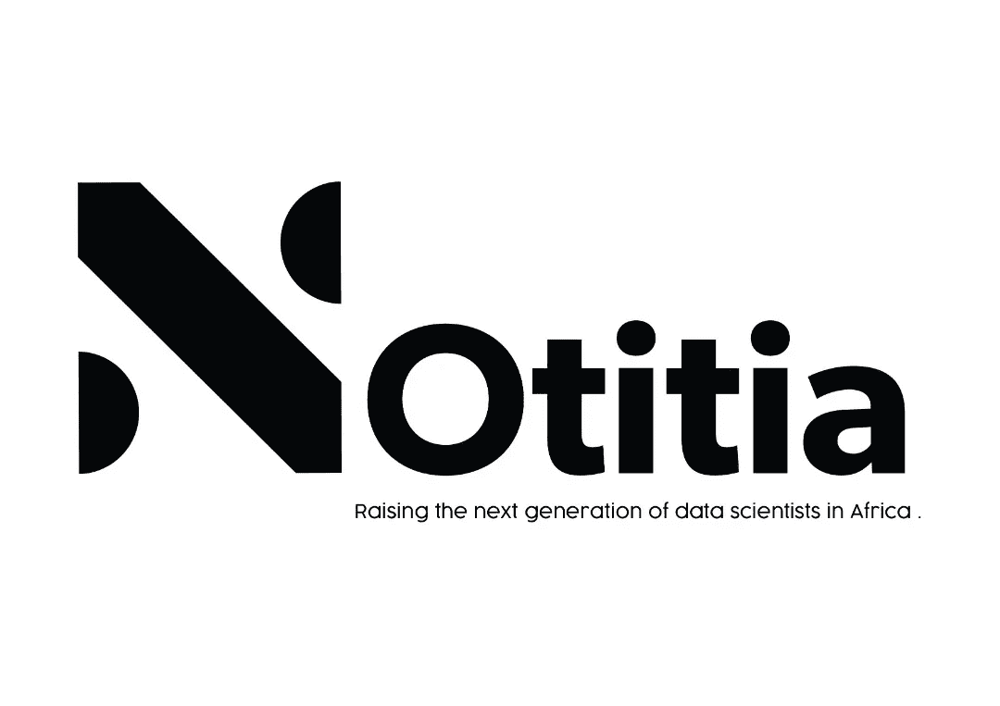

# 为什么如果你想成为一名成功的数据科学家、人工智能或人工智能工程师，导师是必不可少的。

> 原文：<https://towardsdatascience.com/why-mentorship-is-essential-if-you-want-to-be-a-successful-data-scientist-ai-or-ml-engineer-b445112e53bb?source=collection_archive---------65----------------------->

## 你很有可能在这个领域靠自己获得成功，但这里有几个原因可以让你在导师的帮助下获得更多，做得更好。

制造者在 [Unsplash](https://unsplash.com?utm_source=medium&utm_medium=referral) 上 [NESA 的照片](https://unsplash.com/@nesabymakers?utm_source=medium&utm_medium=referral)

> 导师是在你身上看到比你在自己身上看到的更多的天赋和能力，并帮助你发挥出来的人。 *—鲍勃·普罗克特*

学习成为一名数据科学家、人工智能或人工智能工程师可能非常困难，即使你有幸接受过正式的课堂教育。通常情况下，你会学到很多抽象的东西，以至于当你最终以专业人士的身份进入这个领域时，你会发现自己有所欠缺。把学习成为一名数据科学家、人工智能或人工智能工程师想象成在一个沙箱中，在那里你周围有一个受控的环境。无论您在沙盒中做什么，都不会影响现实世界中的生活，而且大多数情况下，您所从事的项目类型或用于这些项目的数据都已经准备好供您使用，在学习过程中不会遇到任何问题。然而，你发现作为专业或实践数据科学家、AI 或 ML 工程师的沙盒之外的生活是完全不同的。在现实世界中，您的行为会对您组织的业务或财务计划产生影响，您必须处理的数据未经预处理，您所从事的项目对您所在的任何机构的决策都至关重要。那么，你如何为自己的职业生涯做准备呢？很简单，**给自己找个导师**。不是任何导师，而是在这个行业中专业工作过的人，如果这个人现在还在工作，他擅长他所做的或者仍然在做的事情。让我们讨论一下为什么如果你想成为一名成功的数据科学家、人工智能或 ML 工程师，拥有一名导师是必不可少的几个原因。

# 你的导师让你做好准备

作为一个在行业中有如此丰富技术经验的人，你的导师会让你准备好在现实世界中会遇到什么，并通过从他们的个人经历、错误和缺点中教会你做正确的事情，引导你走上在该领域取得成功的正确道路。你的导师也把你们的关系作为一个机会来建议和激励你，即使是在生活中与工作和学习无关的方面。你的导师视你为朋友，甚至是弟弟妹妹，会尽一切努力帮助你成功。

# 你的导师挑战你

你的导师强调要确保你永远是比前一天更好的自己。凭借你的导师在行业内专业工作的所有知识和经验，你的导师会推动你走得更远，做得更好，知道得更多。你的导师知道你会从做得更多中获得什么，他们不会罢休，直到你成为他们更好的版本。

# 你的导师保护你

作为一个对你的幸福和事业成功充满热情的人，你的导师永远不会让你满足于低于你应得的。你的导师保护你不落入坏雇主的手中，不成为坏合同的牺牲品。

> 给我看一个成功的人，我会给你看一个对他或她的生活有真正积极影响的人。我不在乎你靠什么谋生——如果你做得好，我敢肯定有人在为你加油或指路。一个导师。 *—丹泽尔·华盛顿*

# Notitia AI

[Notitia AI](https://notitia.site/) logo 由[诺贝特 Dziwornu](https://www.linkedin.com/in/norbert-dziwornu-545271163/)

[Notitia AI](https://notitia.site/) 是一个以培养非洲下一代数据科学家为愿景的组织，即使我们在培训和指导之间架起了一座桥梁。在 Notitia AI 注册可以让你进入一个虚拟的生态系统，其中包括一个人工智能驱动的学习和培训平台，一个坚实的工作空间和一个由来自非洲各地和其他地方的顶级专业人士作为导师的社区。Notitia AI 目前正在举办一个队列，但感兴趣的人可以通过填写此[表格](https://notitia-ai.typeform.com/to/nbEwVMQo)加入我们未来队列的等候名单。

你还怀疑师徒关系的重要性吗？你能指出我写这篇文章时可能漏掉的一些事情吗？在这篇文章的回复部分分享你的想法和观点。你也可以在 [Twitter](https://twitter.com/buabaj_) 或 [LinkedIn](https://www.linkedin.com/in/buabaj/) 上直接联系我。

在你成为世界级数据科学家、人工智能或人工智能工程师的旅途中，祝你成功！

*我衷心感谢* [*安娜·阿依库*](mailto:ayikuanna44@gmail.com) *校对并纠正了我写这篇文章时犯的许多错误。*