# 什么是歧义厌恶？

> 原文：<https://towardsdatascience.com/why-most-of-you-made-an-irrational-decision-aeeac532ef92?source=collection_archive---------6----------------------->

## 第 2 部分，共 3 部分——风险、不确定性和模糊性之间的区别

合理性问答中你选择了 [A & C，A & D，B & C，还是 B & D](http://bit.ly/quaesita_ebp) ？

*(不知道我在说什么？这可能是因为你没有先阅读* [*第一部分(一个 3 分钟的小测验)*](http://bit.ly/quaesita_ebp) *就来到了这里，所以请在进一步阅读之前先这样做。你需要知道这些 X 事物的含义，其他的才有意义。)*

我在网上放了一个可爱宠物的屏障，这样你就不会不小心看到下面的剧透了。当你读完[第 1 部分](http://bit.ly/quaesita_ebp)时，滚动浏览它们。

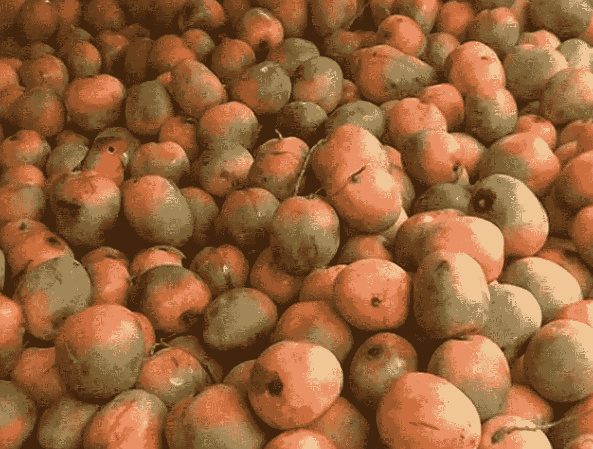

# 大多数人选择什么？

如果你像大多数人一样，你选择了常年最喜欢的: [A & D](http://bit.ly/quaesita_ambiguity) 。

唉，如果真是这样，说明你没有理性选择！是的，大多数人不喜欢，所以没必要难过。你在一个好公司里。各种不合理的决策是我们人类固有的，需要大量的训练来克服。

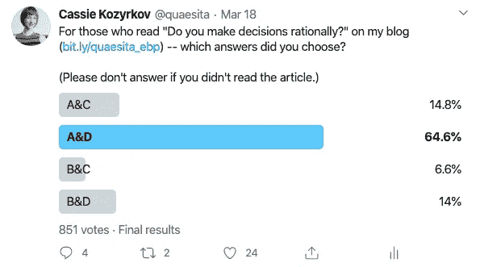

Twitter 上的投票结果与 20 世纪 60 年代以来无数的实验室研究结果一致。

# 你的结果是什么？

*   **A & C** — **理性**，尤其是如果你喜欢粉色(或者认为我喜欢)。
*   B&D——**理性**，尤其是如果你不喜欢粉色(或者认为我喜欢)。
*   抛硬币两次——理性的，尤其是如果你是一名训练有素的经济学家。
*   **A&D**——**非理性**但流行。科学认为它知道人们为什么这样做。
*   **B&C**——**非理性**和科学不理解你。:(

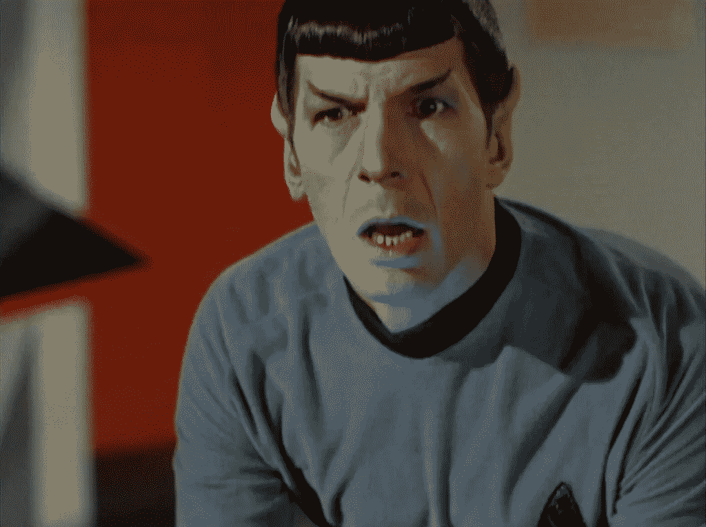

图片:[来源](https://i.imgflip.com/2px6hk.jpg)。

我的大多数读者都是数据科学专业人士和/或高级数据主管。当昨天的测验进行时，我很开心地收到了一堆评论，比如，*“太简单了，给我们来点难的吧！”*(如此虚张声势！我的手指发痒，想写一篇关于[过度自信效应](https://en.wikipedia.org/wiki/Overconfidence_effect)的文章。)

> 如果理性决策如此简单，为什么你们这些数学伙伴中有四分之三的人会犯错误？

也许这并不容易，数据科学课程也不能让你摆脱人类的弱点。也许数据科学家可以从行为经济学家和心理学家那里学到一些东西

# 非理性决策

总有一天，我会写一篇文章，聚焦于经济学家如何定义理性(并向你介绍[冯·诺依曼–摩根斯坦理性的四个公理](http://bit.ly/vnm_rationality) …嗯，真想不到)，但现在，让我们保持简单:

一个决定可能不合理的一种方式(以及其他方式)是不一致，这是压倒性流行的 **A & D** 答案所遭受的。

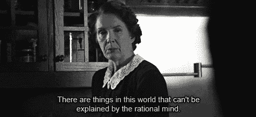

拿出手术刀，准备解剖！我们用理性案例做一点证明。

# 理性案例#1:行为经济学家做什么

我的本科专业是经济学，这使我有资格加入最冷血的群体——经济学家。对一个幼小的实验/行为经济学家的训练的一部分是被棍子打，直到我们学会对像这样的决定采取理性的态度。那么，在我们洗脑之后，我们更喜欢哪个答案呢——呃，我的意思是，训练已经成功扎根了？

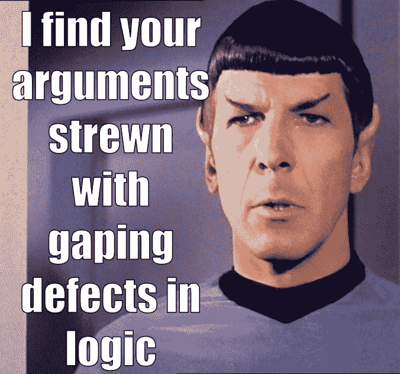

图片:[来源](https://themindlessphilosopher.files.wordpress.com/2017/03/spock.jpg?w=676)。

我们。不要。关心。

完全理性的头脑不应该有任何偏好。当面对这些选择时，我们感到完全的、厚颜无耻的、好战的冷漠。所有四个 X&X 组合是相同的。

一个经济学家被训练来观察选择并分析可能性。我们问，*“虽然我们知道有 30 个白色的球，但我们对其余 60 个球中黄色和粉色的分布有什么了解？”*

最佳答案:什么都没有。

事实:我没有给你任何关于这方面的信息，你必须先了解我，才能知道我相对喜欢粉色还是黄色。如果你认为你知道我喜欢哪种颜色，那就是你在展示你的偏见。

所以，就一个训练有素的经济学家而言，有:

1.  没有信息表明粉色比黄色多。
2.  没有信息表明黄色比粉色多。

这意味着当我们计算数字时，没有理由区别对待黄色和粉红色，因此，以下是目前与《经济学人》头脑中的内容最一致的内容:

*   30 白色
*   30 粉色
*   30 黄色

喜欢就试试[自己跑数字](http://bit.ly/quaesita_ebp)得到解答:
赌 A: 30 个好球 vs 60 个坏球
赌 B: 30 个好球 vs 60 个坏球
赌 C: 60 个好球 vs 30 个坏球
赌 D: 60 个好球 vs 30 个坏球

这使得所有的捆绑(A&C、A&D、B&C、B&D)对经济学家来说都具有同等的吸引力，然后经济学家被迫任意挑选(或抛硬币)来减轻这种极度冷漠的痛苦。

# 理性案例#2:粉色的粉丝做了什么

如果你不能表现出完全的冷漠，你喜欢挑选一匹赛马只是为了好玩，让我们假设你喜欢粉红色，你想打赌粉红色比黄色多。(如果你被[偏见](http://bit.ly/quaesita_biasdef)所困扰，你会得到类似的答案，因为一些奇怪的原因，我会在桶里放更多的粉红色而不是黄色。)

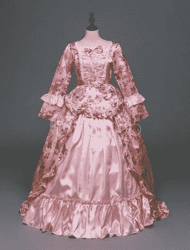

我们将想象最温和的情况——让我们从这里开始，制作一个黄色球来改变忠诚，而不是相等的黄色-粉红色赔率。天平现在略微倾向于粉红色。

此刻在你的脑海里:

*   30 白色
*   31 粉色
*   29 黄色

**赌局 A: 30 个好球 vs 60 个坏球**
赌局 B: 29 个好球 vs 61 个坏球
**赌局 C: 61 个好球 vs 29 个坏球**
赌局 D: 60 个好球 vs 30 个坏球

因为你会参加第一场比赛(A 对 B)或第二场比赛(C 对 D ),但不会两者都参加，所以尝试两面下注没有任何好处。如果你想要那 100 美元，你会赌更多的好球而不是坏球。这意味着你唯一合理的组合是 A&C。

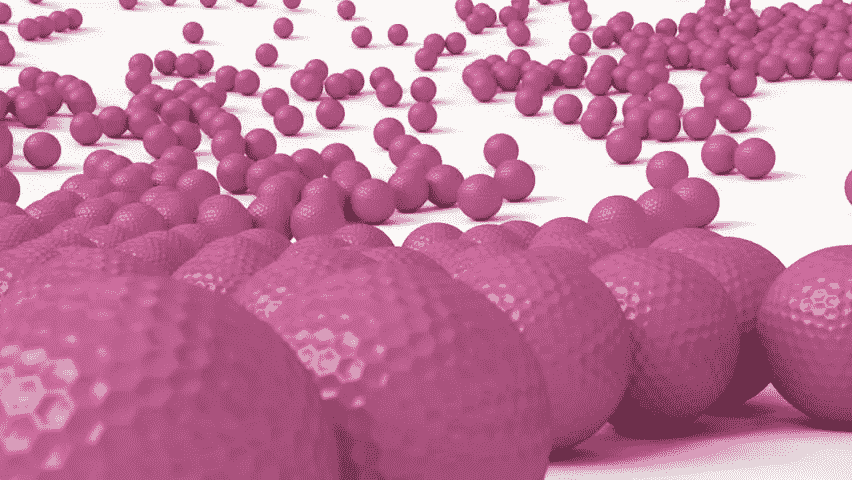

现在尝试极端的全粉色案例:

*   30 白色
*   60 粉色
*   0 黄色

**赌局 A: 30 个好球 vs 60 个坏球**
赌局 B: 0 个好球 vs 90 个坏球
**赌局 C: 90 个好球 vs 0 个坏球**
赌局 D: 60 个好球 vs 30 个坏球

还是那句话，必须是 A**A&C**。其他的都没有意义！

# 理性案例#3:讨厌粉色的人做了什么

如果你想赌黄色或者你确信我对[小鸭子](https://www.youtube.com/watch?v=f5d8pVg3Qtg)的喜爱，逻辑是一样的，但现在唯一有意义的答案是 **B & D** 。

# 大多数人选择了非理性选项 A&D…瓦特？！

尽管如此，在 Twitter 的民意调查中，我们有近 65%的人选择了非理性选项 A&D。从上面的逻辑来看，选择这两个选项是没有意义的。

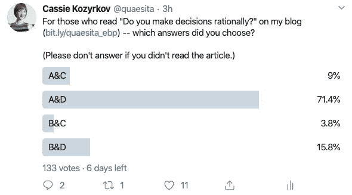

这张截图是在上一张之前拍摄的，当时还没有解释和剧透，所以这些是我们在投票前无法先睹为快的情况下得到的结果。我很高兴地看到，当作弊成为一种选择时，事情并没有变得混乱。

A&D 是不一致的选项(如果 A 比 B 好，那么 C 应该比 D 好……事实上，这两组几乎是相同的赌博——我们所做的只是将相同的粉红色球移到线的另一边):

赌 A: W 好，休息不好
赌 B: Y 好，休息不好
赌 C: W **+P** 好，休息不好
赌 D: Y **+P** 好，休息不好

那种对称是华丽的…如果你在赌博 B 中赌黄色，理性建议你在赌博 d 中仍然应该这样做。但是人们不这样做。尽管事实上，如果你两次使用同一个铲斗，A&D 在一起将没有意义，尽管事实上选择是不合理和不一致的，人们仍然最喜欢它。

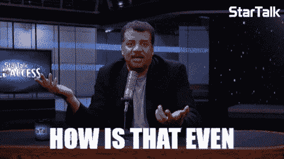

# 埃尔斯伯格悖论

是的，的确，这是一个悖论！事实上，它被称为**埃尔斯伯格悖论**，以决策理论家[丹尼尔·埃尔斯伯格](https://en.wikipedia.org/wiki/Daniel_Ellsberg)的名字命名，他想出了一个我们刚刚玩的小游戏，当时他正在哈佛大学写他 1962 年的博士论文——事实上，他的[维基百科页面](https://en.wikipedia.org/wiki/Daniel_Ellsberg)几乎没有提到他的另一个成名原因:泄露[五角大楼文件](https://en.wikipedia.org/wiki/Pentagon_Papers)(是的，你在尼克松[水门丑闻](https://en.wikipedia.org/wiki/Watergate_scandal)的背景下听说过的那些

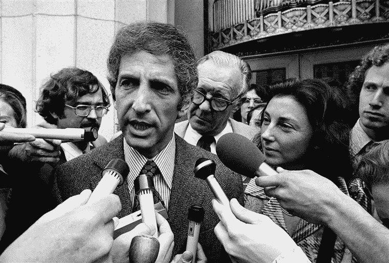

丹尼尔·埃尔斯伯格，我们埃尔斯伯格悖论中的人。请允许我小小的幻想一下，这些记者渴望了解更多关于效用理论和理性决策的知识。图片:[来源](https://media3.s-nbcnews.com/j/newscms/2014_22/477626/140530-140529-daniel-ellsberg-jms-1739-1310_1dab9d81c87f621fde0533f582b19522.fit-760w.jpg)。

但这意味着什么呢？

大多数经济学家对这个难题的答案包括引入一个叫做“模糊厌恶”的新概念来解释这种怪异的选择模式。

让我们像埃尔斯伯格那样看待它。A&D 期权有什么共同点？是什么吸引了你？

如果你没有像我们一样把粉色和黄色的数字折叠起来，并且一直在未知的地方工作，这就是你的想法:

*   30 白色
*   ？？粉红色
*   ？？黄色

喜欢就试试[自己跑数字](http://bit.ly/quaesita_ebp)得到解:
**赌 A: 30 个好球 vs 60 个坏球**
赌 B:？？好 vs？？坏球
赌博 C:？？好 vs？？坏球
**赌博 D: 60 个好球 vs 30 个坏球**

图片:[来源](https://i.ytimg.com/vi/UNUYS0GRivc/maxresdefault.jpg)。

这里有龙！这是伟大的未知！！哦，不。让我们坚持一些安全的东西，选择已知的赌博，而不是宇宙状态不确定的赌博…

> “风险”意味着概率是已知的。“模棱两可”意味着他们不是。

# 什么是歧义厌恶？

简单地说，这个理论就是:模糊伤害了人类这个动物。我们不喜欢它。我们愿意做出次优的选择来避免它。

> 当事情有风险的时候，也不是那么糟糕。模糊更让我们害怕。

如果我们不太介意进行一两次概率计算，风险是我们可以处理的，但模糊性确实困扰着我们。与风险相比，模糊会带来不同的不适。一个更原始的。(*“什么？!"*我听到你在问，*“难道* [*风险、*](http://bit.ly/quaesita_uncertainty) *不是一回事吗？它们不是同义词吗？”如果你是一个行为经济学家，那就不是了。)*

**基本术语:**

*   **“风险”是指明确知道概率的决策。(A 和 D)**
*   ****“模糊不清”**指的是你毫无头绪，决策卡住的决策。(B 和 C)**
*   ****【不确定性】** — [可以指](http://bit.ly/quaesita_uncertainty)中的任何一个，取决于你成长的领域和年代。***

**当你在行为悖论中插入模糊厌恶的概念时，一切都变得完美了。如果你选择了 A&D，埃尔斯伯格在 60 年代提出的流行理论认为，正是这些问号让你止步不前。**

> **心理学家认为，人类天生就觉得模棱两可很痛苦。**

**你不想处理这种模棱两可的痛苦，所以你选择了看起来更容易处理的选项…即使它们是非理性的和不一致的。对于生活在大草原上的生物来说，这是一个非常好的适应——小心那片黑色的高草丛……你永远不知道那里潜伏着什么，所以最好避开它。如果可能的话，呆在阳光充足的地方，在那里你至少可以看到你正在进行的赌博。**

# **与新冠肺炎的相关性**

**也许你明白我的意思，也明白为什么在所有的头条都是疫情风味的时候，我会有灵感写下这个特定的话题……新冠肺炎早期的情感流失之一就是我们突然不得不面对的所有模糊。如果你相信厌恶模棱两可的经济学理论，并且因为对媒体每天警告你的新危险知之甚少而情绪低落，那么你至少可以解释一种困扰你的潜在压力源。**

**请在这里观看我正在撰写的一篇文章的链接，这篇文章是关于你可以做些什么来更好地应对你的模糊厌恶，但现在，我希望你能从理解模糊带来的额外痛苦是很正常的这一点上得到一点安慰。至少，如果这里一定有龙的话，它们现在有名字了。**

**我的新冠肺炎决策指南，见[此链接](http://bit.ly/quaesita_covid)。**

> **如果这里一定有龙，至少现在它们有名字了。**

# **第 3 部分是为过分感兴趣的人准备的**

**如果你想深入了解单词**不确定性**的学术本质，这里有链接。**

***【附:对于那些*必须*知道我到底更喜欢哪种颜色的人来说，这里透露一下……这只猫在粉色和黄色之间是无所谓的。哈！这就是为什么我选择他们作为例子。埃尔斯伯格的原作使用了黑色(我最喜欢的)、白色和红色。】***

# **关于那些评论**

**这篇文章发表后，我收到了一些固执地为自己的选择行为辩护的人的暴躁评论。(称 mathy folk 为非理性类似于踢马蜂窝。)你可以在这里找到我的回复[。](https://bit.ly/quaesita_hornet)**

**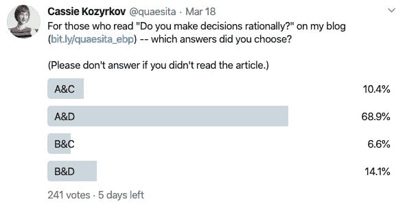**

**对于那些好奇的人来说，这是剧透出来后的分数(“最流行的答案是不理智！”)但是在解释发表之前。我用最后的分数替换了上面的。**

# **现在是完全不同的东西…**

**感谢阅读！如果你在这里玩得开心，并且对人工智能感兴趣，这里有一个初学者友好的介绍供你娱乐:**

**在这里欣赏整个课程播放列表:[bit.ly/machinefriend](http://bit.ly/machinefriend)**

# **喜欢作者？与凯西·科兹尔科夫联系**

**让我们做朋友吧！你可以在 [Twitter](https://twitter.com/quaesita) 、 [YouTube](https://www.youtube.com/channel/UCbOX--VOebPe-MMRkatFRxw) 、 [Substack](http://decision.substack.com) 和 [LinkedIn](https://www.linkedin.com/in/kozyrkov/) 上找到我。有兴趣让我在你的活动上发言吗？使用[表格](http://bit.ly/makecassietalk)取得联系。**