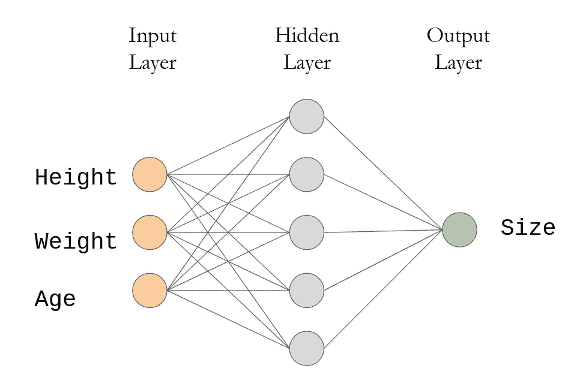
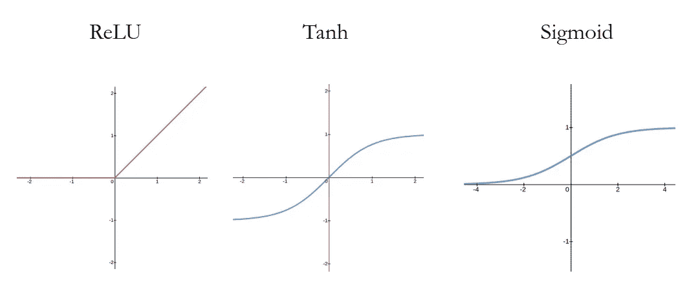
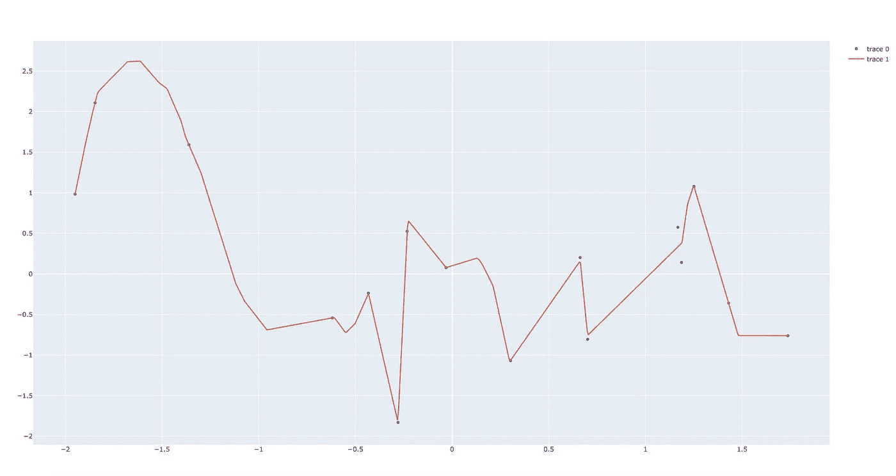
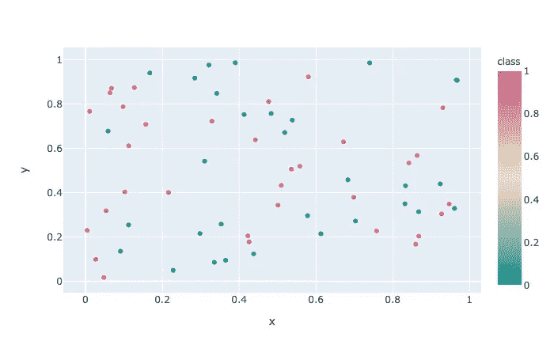
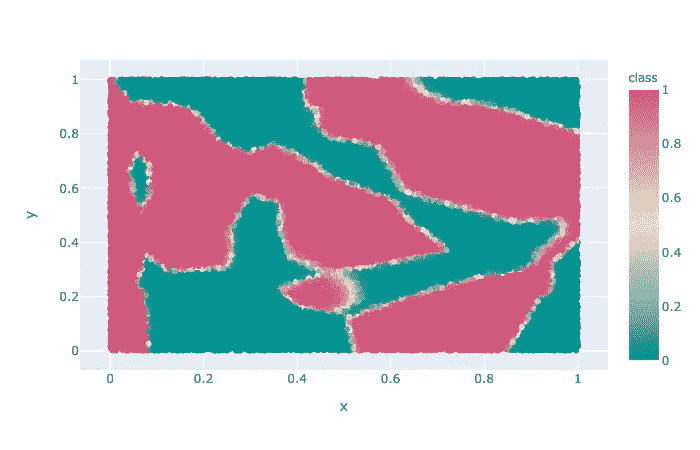

# 为什么神经网络可以逼近任何函数

> 原文：<https://towardsdatascience.com/why-neural-nets-can-approximate-any-function-a878768502f0?source=collection_archive---------10----------------------->

## 具有 PyTorch 代码和可视化工具的通用逼近定理的基本概述

在本文中，我将解释通用逼近定理，并用 PyTorch 代码展示两个快速示例，以演示神经网络学习逼近函数。如果你已经知道神经网络如何工作的基础知识，请随意直接跳到代码和可视化！

很多人一听到*函数*这个词，就想到高中代数和 f(x)=x 之类的关系，虽然我对高中代数没什么反感(我教了两年！)，重要的是要记住，功能只是从输入到输出的映射，而这些可以采取多种形式。

在 [Unsplash](https://unsplash.com?utm_source=medium&utm_medium=referral) 上 [Kitti Incédi](https://unsplash.com/@incedikitti?utm_source=medium&utm_medium=referral) 拍摄的照片

假设你想训练一个预测一个人衣服尺码的机器学习模型。(我最近用这样的算法估算了一下我穿夹克的尺码)。输入是人的身高、体重和年龄。输出是大小。我们试图做的是产生一个函数，将一个人的身高/体重/年龄组合(一个三元组的数字)转换为一个尺寸(可能是一个连续的标量值或像 XS，S，M，L，XL 这样的分类)。

根据机器学习，我们可以通过以下步骤来实现这一点:

*   收集具有代表性的数据(大量人群的身高/体重/年龄数据，以及他们的实际服装尺寸)。
*   训练模型以逼近将输入映射到训练数据输出的函数。
*   在看不见的数据上测试你的模型:给它新人们的身高/体重/年龄数据，希望它能产生一个准确的服装尺寸！

如果服装尺寸只是输入变量的线性组合，那么训练模型将会很容易。简单的线性回归可以得到下式中 a、b、c 和 d 的正确值。

`size = a*height + b*weight + c*age + d`

然而，我们**不能**假设，一般来说，输出是输入变量的线性组合。现实生活中的情况很复杂。规则有例外和特例。像手写识别和图像分类这样的任务显然需要从高维输入数据中学习非常复杂的模式。

如果有一种方法可以逼近任何函数，那不是很好吗？根据通用逼近定理，只有一个隐藏层的神经网络可以做到这一点。

## 神经网络概述

出于我们的目的，我们将只研究具有一个输入层、一个隐藏层和一个输出层的全连接神经网络。在我们的服装尺寸预测器的情况下，输入层将有三个*神经元*(身高、体重和年龄)，而输出层将只有一个(预测尺寸)。在这两者之间，有一个隐藏层，有一定数量的神经元(下图中有 5 个，但实际上可能有 1024 个)。

网络中的每个连接(线路)都有一些可调整的权重。训练意味着找到良好的权重，使给定输入集的预测大小与真实大小之间的差异很小。

每个神经元都与下一层的每个神经元相连。这些连接中的每一个都有一定的*权重*。每个神经元的值沿着每个连接传递，在那里乘以权重。然后所有的神经元都向前反馈到输出层，这给了你一个结果。训练该模型包括为所有连接找到好的权重。通用逼近定理的核心主张是，对于足够多的隐藏神经元，存在一些可以逼近任何函数的连接权重集——即使该函数不是像 f(x)=x 那样可以清晰地写下来的东西。即使是一个疯狂、复杂的函数，如输入 100x100 像素图像并输出“狗”或“猫”的函数，也包含在该定理中。

## 非线性

神经网络能够逼近任何函数的关键在于它们将非线性融入了其架构。每一层都与一个激活函数相关联，该激活函数将非线性变换应用于该层的输出。这意味着每一层不仅仅是与前一层的某种线性组合一起工作。一些常见的非线性激活函数是 ReLU、Tanh 和 Sigmoid，如下图所示。

ReLU 是一个简单的分段线性函数——计算量非常小。另外两个都涉及到求幂运算，因此评估成本更高。

我们现在已经有了所有的部分，可以开始研究一个通用近似定理的例子了。为了演示这一点，我将生成随机的输入和输出集，并让神经网络学习“功能”。当然，在这种情况下，没有任何功能！但我们应该期待的是，无论如何，该模型将符合随机数据，就好像它是由某种确定性函数生成的一样。

对于本文中的演示，我使用 PyTorch 中提供的高级神经网络功能。PyTorch 库只需几行代码就可以轻松构建一个基本的神经网络。它抽象出了许多技术细节，因此您只需处理大图。

## 示例 1:用曲线拟合一些点

神经网络可能面临的最基本的情况之一是从一个变量到另一个变量学习函数。例如，假设 x 值代表时间，y 坐标代表某条街道的交通量。没有理由认为这是一种线性关系，峰值和谷值在一天中的不同时间点出现。

下面的代码根据正态分布生成随机点，并训练一个将 x 坐标作为输入、y 坐标作为输出的网络。有关每个步骤的更多细节，请参见代码注释。

基于作为训练数据生成的随机点，该模型学会了逼近一个通过所有这些点的函数。注意右边的两点，模型没有学习完美。我们可以通过运行更多的训练步骤或增加隐藏神经元的数量来解决这个问题。

## 示例 2:二元分类

函数不一定是你在高中代数中看到的那种“一个数进去，另一个数出来”的函数。让我们尝试一个二进制分类任务。数据点有两个特征，可以归入两个标签中的一个。也许这两个特征是纬度和经度坐标，而标签是环境污染物的存在。或者，这些特征可能是学生的数学和阅读测试成绩，标签对应于他们是左撇子还是右撇子。重要的是，模型必须从两个输入到一个输出学习一个函数，要么是 0，要么是 1。

下面的代码与前面的代码非常相似。唯一的新东西是输入层现在有两个神经元，输出层之后是 Sigmoid 激活，它将所有输出压缩到范围(0，1)内。这为我们提供了一个很好的二进制分类，其中从输出到 0 或 1 的距离也为我们提供了模型在该分类中的置信度。

在单位正方形内随机均匀生成的点，随机分配给标签 0(蓝绿色)和标签 1(粉红色)。你能想出一个有趣的真实世界的例子来匹配这个数据吗？

我在单位正方形中随机生成了一些点，并将其随机分配到两个类别中的一个，标记为 0 和 1。如你所见，蓝绿色和粉色之间没有单独的直线或曲线。然而，该模型能够学习输入要素(x 和 y 坐标)和输出标签(类别/颜色)之间的关系。

这是在给定训练数据的情况下，模型如何在单位正方形中着色。与上图中的点进行比较。

## 过度拟合

在我们对这些结果过于兴奋之前，让我们退一步，问一问这些结果是否真的令人满意。这两个例子都说明了机器学习中一个非常重要的现象:*过拟合*。当模型很好地学习了训练数据的特性，以至于不能很好地概括看不见的数据时，就会发生过度拟合。

在**示例 1** 中，让我们假设其中一个点是错误数据收集导致的异常值。鉴于可供学习的训练数据数量如此之少，模型变得过度适应这些数据，在实际上只是噪声的地方看到了信号。一方面，实际上令人印象深刻的是，模型能够学习一个考虑到这个异常值的函数。另一方面，当将该模型应用于真实世界的数据时，这可能导致不期望的结果，在该点附近产生错误的预测。

在**例 2** 中，模型学习了一个漂亮的分类值拼布被子。然而，请注意最靠近右下角的蓝绿色点。尽管这是唯一的一点，但它导致模型将整个右下角标记为蓝绿色。仅仅几个错误的数据点就可能严重扭曲模型。当我们尝试将模型应用于测试数据时，它可能比预期的要差得多。

为了避免过度拟合，拥有大量代表模型预期面对的样本的训练数据是很重要的。如果你正在开发一个工具来预测普通人群的衣服尺寸，不要只从你大学时代的朋友那里收集训练数据。此外，还有先进的技术来帮助减少过度拟合(例如[重量衰减](/this-thing-called-weight-decay-a7cd4bcfccab))。

## 结论

总之，神经网络是强大的机器学习工具，因为它们能够(在理论上)学习任何功能。然而，这并不保证您可以轻松找到特定问题的最佳权重！在实践中，在合理的时间内训练一个准确的模型取决于许多因素，例如优化器、模型架构、数据质量等等。特别是*深度学习*涉及到具有*多个*隐层的神经网络，非常擅长学习某些困难的任务。

我个人喜欢用小例子可视化神经网络如何工作，因为对基础工作方式有一个坚实、直观的理解有助于我掌握更高级或抽象的概念。例如，虽然我知道过度拟合的技术定义，但我自己运行这些示例帮助我在更直观的层面上真正理解了它是什么。我希望你也学到了一些东西。我欢迎您的任何反馈，感谢您的阅读！

## 参考

[1]用实例学习 PyTorch。[https://py torch . org/tutorials/初学者/py torch _ with _ examples . html](https://pytorch.org/tutorials/beginner/pytorch_with_examples.html)

[2]普适逼近定理。[https://en . Wikipedia . org/wiki/Universal _ approximation _ theory](https://en.wikipedia.org/wiki/Universal_approximation_theorem)