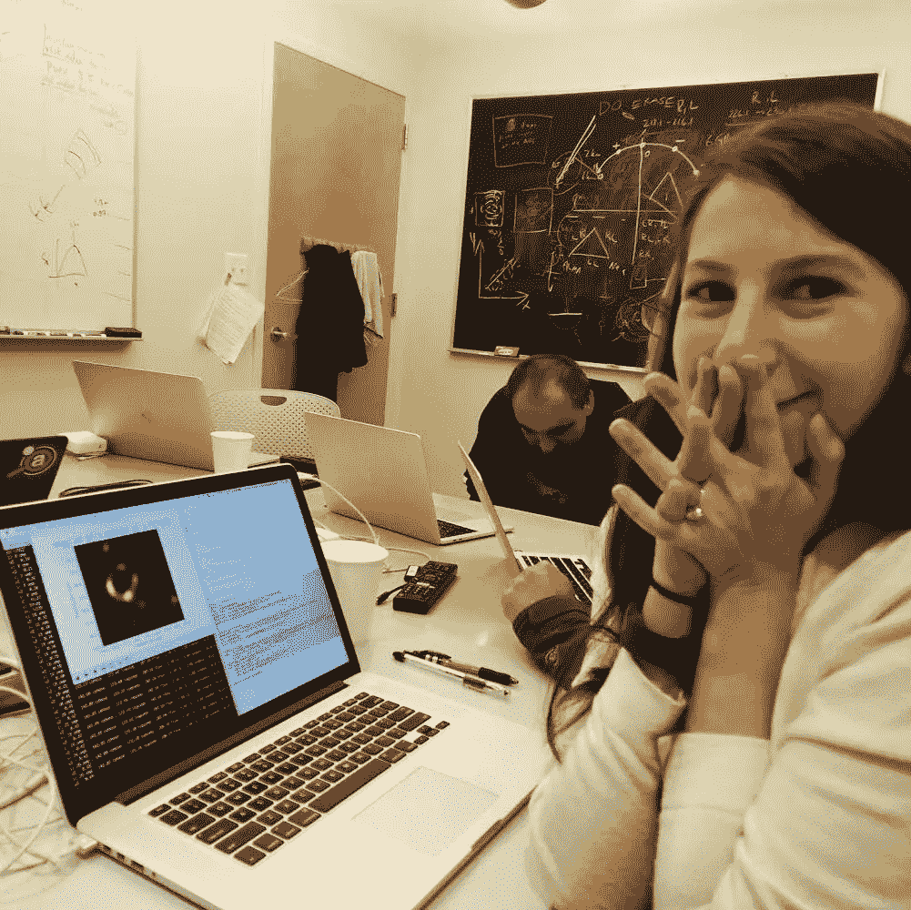
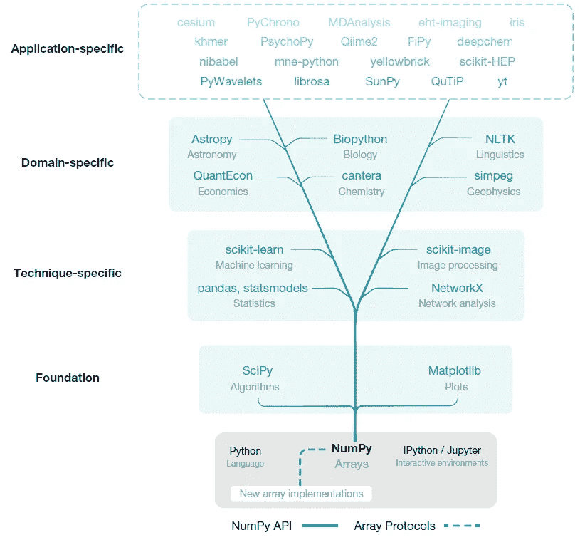

# 为什么 NumPy 如此重要

> 原文：<https://towardsdatascience.com/why-numpy-is-so-fundamental-78ae2807300?source=collection_archive---------35----------------------->

## 我们不能没有它


皮隆·纪尧姆在 [Unsplash](https://unsplash.com?utm_source=medium&utm_medium=referral) 上拍摄的照片

笨重的，笨重的。这个图书馆已经成为基础，很难想象一个没有它的世界，或者在它诞生之前。NumPy 从 2005 年就出现了，如果你曾经在 Python 中处理过数据，你一定会以某种方式使用它。

该图书馆最近得到了应有的认可。一组研究人员在著名的科学刊物《自然》上发表了一篇论文，他们中的许多人都积极参与了 NumPy 的维护和开发。在这篇论文中，作者回顾了 NumPy 的历史，它的主要特点，它在当今科学界的重要性，并讨论了它的未来。

# 是什么让 NumPy 如此优秀？

NumPy 有一个语法，它同时是紧凑的、强大的和富于表现力的。它允许用户管理向量、矩阵和更高维数组中的数据。在这些数据结构中，它允许用户:

*   访问，
*   操纵，
*   计算

你还记得这张照片吗？



研究员凯蒂·布曼在 [PBS](https://www.pbs.org/newshour/science/katie-bouman-hardly-knew-what-a-black-hole-was-her-algorithm-helped-us-see-one) 上的照片

首次获得黑洞图像的努力之所以成为可能，不仅是因为一组研究人员的辛勤工作和奉献，也是因为 Numpy 的支持。

NumPy 项目有正式的治理结构。团队在早期采用了分布式修订控制和代码审查来改进协作。这反过来意味着清晰的路线图和清晰的过程来讨论大的变化。这些可能看起来不多，但它们有助于激发用户的信心和信任。这是一个保证，每一个变化都是经过深思熟虑的，该库将随着时间的推移得到维护。

该项目由 NumFOCUS 赞助，这是一个促进研究开源思维的非营利组织。近年来，它还获得了多个基金会的资助。这反过来允许项目保持对改进和新特性开发的关注。

在 90 年代中期，科学界出现了两个主要的软件包:Numarray 和 Numeric。

*   **Numarray** 是一个数组处理包，旨在高效处理大型多维数组。
*   Numeric 对于小数组处理很有效，并且有丰富的 C API。

但随着时间的推移，他们越来越疏远。这是 NumPy 在 2005 年作为两个世界中最好的一个出现的时候。它最初是由学生、教师和研究人员开发的，旨在为 Python 带来一个先进的开源数组库，可以免费使用，并且不受许可证服务器和软件保护的影响。它广受欢迎，拥有大量的追随者和热情的志愿者。剩下的就是历史了。

快进到 15 年后，NumPy 已经变得必不可少。今天，它支持大多数进行科学或数值计算的 Python 库，包括 SciPy、Matplotlib、pandas、scikit-learn 和 scikit-image。论文的作者创造了以下视觉效果，一张图胜过千言万语:



视觉由 Harris，C.R .，Millman，K.J .，van der Walt，S.J. *等*对 [Nature " *数组编程用 NumPy*](https://doi.org/10.1038/s41586-020-2649-2)

# *NumPy 基金会*

*我们先来看看数据结构的概念。数据结构被称为数组。NumPy 是一个使数组处理变得容易的库。但是什么是数组呢？*

*在计算机科学中，数组是一种数据结构。该数据结构包含相同数据类型的元素。数据类型可以是数字(整数、浮点、…)、字符串(文本、引号" "之间存储的任何内容)、时间戳(日期)或指向 Python 对象的指针。数组很有用，因为它们有助于组织数据。使用这种结构，可以很容易地对元素进行排序或搜索。*

## *形状*

*每个数组都有一个形状。该形状由( *n* ， *m* )定义，其中 *n* 为行数， *m* 为列数。*

```
*# This array is of shape (2,2)
[1,2
 3,4]# This array is of shape (4,2)
[1,2
 3,4
 5,6
 7,8]*
```

*如果上面的结构看起来像矩阵，你就对了。在数学领域，这些元素中的任何一个都是一个矩阵。在使用 NumPy 时，术语*矩阵*和*数组*可以互换，可能会导致混淆。*

*一维数组也称为*向量*:*

```
*# Horizontal, a row vector
[1,2,3]# Vertical, a column vector
[1,
 2,
 3]*
```

*最后，如果它只包含一个元素，它就被称为*标量:**

```
*# Scalar
[7]*
```

## *大步*

*大步帮助我们解读计算机内存。元素以多维数组的形式线性存储。步幅描述了在内存中向前移动所需的字节数。例如移动到下一行或下一列。让我们以 shape (3，3)的数组为例，其中每个元素占用 8 个字节的内存。*

```
*# Array of shape (3,3)[1,2,3,
 4,5,6
 7,8,9]*
```

*   *移动到另一列:移动 8 个字节就足够了，这是数组中一个元素占用的内存量。*
*   *移动到另一行:我们从第一行第一列开始，从 1 开始。要到达第二行，我们需要在内存中跳转**三次**。我们跳到 2，然后 3，最后到 4。这表示 24 个字节(每个元素 3 次跳转* 8 个字节)。*

*为了理解这个概念，数组也可以被视为一维数组。注意:多余的空格是为了阅读的目的，有助于可视化不同行的位置。*

```
*[1,2,3,  4,5,6  7,8,9]# Moving from 5 to 7, would require 2 jumps in memory, so 16 bytes.
[1,2,3,  4,**5**,6  **7**,8,9]*
```

## *使用 NumPy 的操作*

*可以在 NumPy 阵列上执行多种操作:*

*   ***索引***

```
*1\. Array x, of shape (3,3)x = [1,2,3,
     4,5,6
     7,8,9]2\. Indexing the array to return '5'#IN
x[1,2]#OUT
6*
```

*索引 NumPy 数组从 0 开始。对于 x[1，2]，1 代表行，2 代表列。当读取 x[1，2]时，我们需要记住我们从 0 开始计数，并在心里为两个[1，2]增加 1。因此，我们到达第 2 行和第 3 列。这个索引上的元素是 6。*

*   ***切片***

```
*1\. Using the original x-array from above, we perform a slice#IN
x[:,1:]#OUT
[[2 3]
 [5 6]
 [8 9]]*
```

*   ***复印***

*注意，切片创建的是视图，而不是副本。正如 NumPy 的官方文档所解释的:*

> *NumPy 切片创建了一个[视图](https://numpy.org/doc/stable/glossary.html#term-view)，而不是像内置 Python 序列(如字符串、元组和列表)那样的副本。从一个大数组中提取一小部分时必须小心，因为提取的小部分包含对大的原始数组的引用，直到从该数组派生的所有数组都被垃圾回收，该数组的内存才会被释放。在这种情况下，建议使用明确的`*copy()*`。*

```
*1\. Using the original x-array from above, we perform a slice then copy it#IN
y = x[:, 1:].copy()#OUT
[[2 3]
 [5 6]
 [8 9]]*
```

*   ***矢量化***

```
*1\. Using the original x-array, we perform an additionx = [1,2,3,
     4,5,6
     7,8,9]y = [1,1,1,
     1,1,1,
     1,1,1]#IN
z = x + y#OUT
z = [2,3,4,
     5,6,7,
     8,9,10]*
```

*以相同形状的两个阵列为例，结果是直观的。美妙之处在于，它发生在一条线上。*

*   ***广播***

*处理不同形状的数组时会出现这种情况。较小的阵列将被“广播”到较大的阵列。结果是一个与两个初始数组形状不同的数组，如下面的乘法示例所示:*

```
*1\. Using two 1D-arrays, we perform a multiplications = [0,
     1,
     2]t = [1,2]#IN
u = s*t#OUT
[0,0
 1,2
 2,4]*
```

*   ***还原***

```
*1\. Array x, of shape (3,3)x = [1,2,3,
     4,5,6
     7,8,9]2\. We decide to reduce to one column:#IN
y = np.sum(x, axis=1)#OUT
array([6, 15, 24])3\. We can also reduce our new y array to one row:#IN
z = np.sum(y, axis=0)#OUT
45*
```

*我们在数组上使用了 *np.sum()* 来减少它们。参数*轴*定义了操作将在哪个轴上发生。0 表示行，1 表示列。*

# *当前的不足之处*

*由于其内存中的数据模型，NumPy 无法直接利用加速器硬件，如图形处理单元(GPU)、张量处理单元(TPU)和现场可编程门阵列(FPGAs)。*

*这导致了新的数组实现框架的出现，如 PyTorch 和 Tensorflow。他们可以在 CPU 和 GPU 上进行分布式训练。*

# *NumPy 的未来*

*有了正式的治理、路线图和对大型变更的彻底讨论，NumPy 的运营方面看起来很光明。该团队已经实现了软件开发的最佳实践，例如分布式修订控制和代码审查，以改进协作。*

*资金总是棘手的部分。虽然它从不同的基金会获得资金，但它也造成了对资助者的依赖。希望从早期开始就有一个坚实的热心人社区，那时适当的资助还不是一件事。正如论文作者所报告的，发展仍然主要依赖于研究生和研究人员在空闲时间的贡献。*

*作者讨论了 NumPy 在未来十年将面临的几个挑战:*

> ****1。新的设备*** *将被开发，现有的专用硬件将进化以满足摩尔定律的收益递减。**
> 
> ****2。随着薄幕显微镜和大型综合巡天望远镜(LSST)等设备和仪器的采用，科学数据收集的规模将继续扩大。****
> 
> ****3。新一代语言*** *、解释器和编译器，如 Rust、Julia 和 LLVM，将创造新的概念和数据结构，并决定其生存能力。**

*最后但同样重要的是，NumPy 将需要新一代的志愿者和贡献者来帮助它前进。**也许是你？***

# *你能帮什么忙？*

*有可能成为 NumPy 的贡献者。作为一名编码员并不是一项要求，因为 NumPy 项目已经发展并具有多面性。该团队正在寻求这些方面的帮助:*

*   *代码维护和开发*
*   *社区协调*
*   *DevOps*
*   *开发教育内容和叙述性文档*
*   *筹款*
*   *营销*
*   *项目管理*
*   *翻译内容*
*   *网站设计和开发*
*   *撰写技术文档*

*更多信息可以在 [**这里找到**](https://numpy.org/doc/stable/dev/)*

# *与 NumPy 更进一步*

*如果你想深入了解，我发现这些资源很有趣:*

*   ***广播***

*[](https://numpy.org/doc/stable/user/basics.broadcasting.html) [## 广播—NumPy 1.19 版手册

### 注请参阅本文中有关广播概念的插图。广播这个术语描述了 numpy 如何对待…

numpy.org](https://numpy.org/doc/stable/user/basics.broadcasting.html) 

*   **带代码片段的 NumPy 高级讲座**

[](https://scipy-lectures.org/advanced/advanced_numpy/index.html) [## 2.2.高级数字—科学讲义

### NumPy 是 Python 科学工具栈的基础。其目的是在许多项目上实现高效的操作…

scipy-lectures.org](https://scipy-lectures.org/advanced/advanced_numpy/index.html) 

# 最后的话

NumPy 在科学和数据科学社区中拥有如此重要的地位，我们应该感谢多年来的辛勤工作。该项目面临着挑战，但也有一个坚实的社区，并利用最佳实践来保持组织和交付。NumPy 万岁！

**编码快乐！**

感谢阅读！喜欢这个故事吗？ [**加入媒介**](https://medium.com/@maximegodfroid/membership) 可完整访问我的所有故事。

# 参考

[1] Harris，C.R .，Millman，K.J .，van der Walt，S.J. *等*用 NumPy 进行数组编程。*性质* **585，**357–362(2020)。[https://doi.org/10.1038/s41586-020-2649-2](https://doi.org/10.1038/s41586-020-2649-2)

[2] NumPy 团队(2020 年 9 月检查)，*案例研究:第一张黑洞图像*，[https://numpy.org/case-studies/blackhole-image/](https://numpy.org/case-studies/blackhole-image/)

[3] NumPy 团队(2020 年 9 月入住)，*索引，*[https://numpy.org/doc/stable/reference/arrays.indexing.html](https://numpy.org/doc/stable/reference/arrays.indexing.html)*