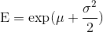
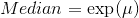
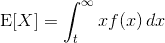
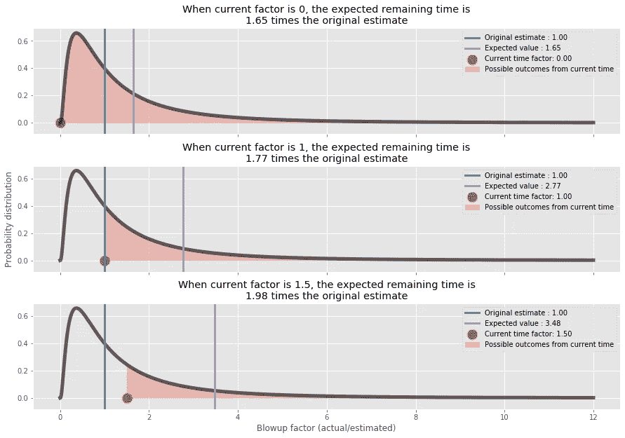

# 为什么过期的任务仍然需要很长时间才能完成？

> 原文：<https://towardsdatascience.com/why-overdue-tasks-take-still-a-long-time-to-finish-f291b9493a2a?source=collection_archive---------61----------------------->

## 这个问题我们问过自己很多次。下面是答案。

让我困惑了一段时间的典型情况如下:
*-我们估计一项任务需要 3 天
-鲍勃已经为这项任务工作了 3 天
-在每日的 scrum 上，他说他只需要再处理几件事情，任务就会完成
-第二天任务没有完成*

有时这样的任务即使工作了 5 天也没有完成。由于它们是典型的“更多的研究，更少的开发”任务，许多人建议接受这种不确定性，因为这是研究固有的。虽然我同意一点，但我不想这么容易放弃可预测性。一年前，Erik Bernhardsson 分享了一篇关于时间估计的精彩博文[,他总结道，开发任务比预期花费更长时间的原因是膨胀因子(实际时间/预期时间)遵循对数正态分布，我们对中位数的估计是准确的，但对平均任务完成时间的估计不是那么准确。我真的很喜欢他的帖子，去年重读了几次，因为它最终帮助我理解了为什么玩 scrum poker 如此困难。我把他的模型作为我在这里工作的基础，看看我们是否需要微调我们对任务完成的估计。](https://erikbern.com/2019/04/15/why-software-projects-take-longer-than-you-think-a-statistical-model.html)

## 估计比预期的完成时间短

在上面的例子中，Bob 在任务进行了 3 天时，直觉地认为他真的要完成任务了。毕竟，该任务估计需要 3 天时间。然而，从统计学上来说，我们对 3 天的估计是对基础分布中值的估计。分布的中间值并没有说太多关于值的比例，它只是简单明了地说，50%的时间任务会更快地完成，50%的时间会超过 3 天。中位数的一个问题是，它对任务中的不确定性不敏感。然而，当您想要计算一个特性的开发时间时，您确实想要考虑不确定性。因此，最好计算任务完成时间的期望值，因为我们已经有了几乎所有需要的信息。让我们看看这个期望值是什么样的。

对数正态分布的期望值为:

为了计算这个，我们需要知道两个参数μ和σ。幸运的是，我们有一个中位数的无偏估计，因为这是:

由此，我们可以简单地通过取中位数的对数来计算μ。对于σ来说，情况有点棘手，但并非毫无希望。埃里克的想法是利用冒险的直觉。此外，我的建议是使用 scrum poker 估计值的分布作为σ的未校准估计值。可以肯定的是，这是一个未经校准的估计，因为——尽管它应该与某种不确定性相关联——它仍然没有反映任何特定的比例因子。很可能，这也取决于团队和环境，所以最好根据从 sprints 中收集的实际数据来估计。基本上，您需要个人的估计和实际时间来拟合一个简单的模型，并为您的团队获得σ。一个补充:很可能，一个任务的不确定性可以用一个模型更好地估计，这个模型也考虑了谁是任务的接受者(没有冒犯任何人的意思；).有些人更擅长精简，而有些人则更注重细节。

## “做”栏的百慕大三角

所以让我们回到每天的争论中，Bob 说他即将完成我们估计需要 3 天工作的任务(只是作为一个备注，Bob 是一个虚构的人)。问题是我们是否应该接受平均完成时间比我们的估计(中值)要长，或者这个故事比我们看到的要复杂。

假设我们做 scrum poker 的时候投票如下:我:2；约翰:2，鲍勃:3，莎拉:3，琳达:5，玛丽:5。基于此，我们有一个 3 天的估计。现在三天过去了，所以问题是我们是否还应该坚持同样的估计？事实上，结果证明约翰和我在评估任务的难度时都错了，所以人们已经可以直观地看到剩余投票的中位数(扣除我们糟糕的投票)可以被认为更高(现在是 4 天！).更一般地说，当我们在任务开始前进行估计时，我们考虑了各种结果，其中包括任务可能在几分钟内完成的情况(也许如果 Bob 意识到相同的特性已经存在于某个地方，但名称不同)，以及非常困难的实现过程的荒谬情况(也许如果该特性比我们想象的更复杂)。从统计学上讲，我们通过对整个分布进行积分来计算期望值。现在，对于任何时间点 *t* > 0，显然我们不能在积分中考虑 0 和 *t* 之间的时间，而是必须计算如下期望值:

其中 *f(x)* 是给定我们考虑从 *t* 到 *∞* 点的条件概率 *x* 。因此，我们不考虑我们已经知道没有实现的情况，而只考虑任务至少需要花费 *t* 时间才能完成的情况。

因此，尽管在分布的峰值之外，紧接在 *t* 之后的点比更远的点具有相对更高的概率，但是更远的点要多得多，并且曲率也随着远离峰值而变化，因此期望值实际上在膨胀。让我们通过一个例子来说明这一点。让我们用三个例子来说明，(1)任务处于“todo”阶段，我们还没有开始它，(2)任务已经工作了最初估计的时间(展开因子为 1)，以及(3)任务已经工作了两倍于最初估计的时间(展开因子为 2)。

三个例子说明预期完成时间如何依赖于已经花费在任务上的时间。在第一个例子中，我们在开始任务之前。完成时间的期望值是最初估计的 1.65 倍。第二，我们已经在任务上花费了预计的时间。根据零分布的彩色区域，预计完成时间是最初估计的 2.77 倍。第三，任务逾期，完成时间进一步增长。使用σ=1 生成零分布，使用当前因子而不是实际时间进行总体估计。

现在你看到一个矛盾的事情:剩余的时间，由 E _ t-t 操作化，随着我们的进行不是在减少，而是在增加。当然，这并不意味着我们不能完成任务；通过将消耗的时间考虑到等式中，有助于对剩余的工作做出更好的估计。我们可以在多种场景中使用这些知识。首先，它可以帮助团队在何时削减或重组任务上做出更好的决策，并在总体上理解他们什么时候可以完成(即，根据经验，当爆发系数已经是 2 时，拒绝在下一个小时内完成的想法)。

第二，这种知识对于识别不可能及时完成的任务也很重要。我们已经看到了几个任务，乍一看似乎很容易处理，但后来却成了项目的怪物。尽早发现这些问题并重新思考可交付成果、处理期望和/或提出替代解决方案至关重要。

此外，本练习中的假设是，在任务执行期间，不存在“检查的反馈效应”。实际上，团队在日常的 scrum 中的反馈或者涉众在评审中的反馈可能会改变方法(和分布),从而也改变了预期的完成时间。事实上，如果你看一下 [SiP 数据集](https://github.com/Derek-Jones/SiP_dataset)(Erik 也看了)中放大因子的分布，右尾并不像人们从标准对数正态分布中预期的那样重，我的假设是，正是那些反馈、控制和重组机制——当放大因子变大时，它们开始起作用——对此负责。所以，我的主要建议是，团队要密切关注每日的争论，以避免故事完成时间的浪费。

代码可在 [GitHub](https://github.com/agostontorok/TaskCompletionTimeEstimation) 上获得

备注:

*   德里克·m·琼斯根据他对 SiP 数据集的分析为[写了一篇有趣的论文](https://arxiv.org/pdf/1901.01621.pdf)。他期待着免费分析你的数据，条件是他可以公开匿名形式的数据。这是为贵公司获取这些参数的绝佳机会。
*   在这篇文章中，我使用了对数正态分布，寻找最佳拟合分布，尽管这是一个活跃的研究领域。
*   在 SiP 数据集中，估计是由单个开发人员进行的，而不是联合工作，而且大多数估计在 2 天以内。

感谢 [Adam Csapo](https://scholar.google.com/citations?user=5WMeN5UAAAAJ&hl=en) 、[于尔根哈恩](https://dblp.uni-trier.de/pers/hd/h/Hahn:J=uuml=rgen_T=)和[德里克 m 琼斯](http://www.knosof.co.uk/ESEUR/)对初稿的评论。