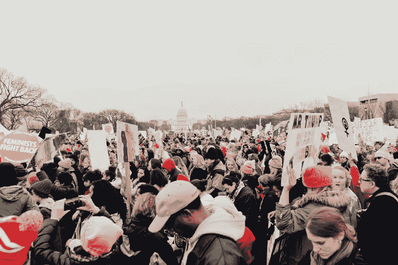

# 为什么政治和机器学习不太匹配

> 原文：<https://towardsdatascience.com/why-politics-and-machine-learning-are-not-a-good-match-b13cd18d33?source=collection_archive---------29----------------------->

罗亚·安·米勒在 [Unsplash](https://unsplash.com/s/photos/politics?utm_source=unsplash&utm_medium=referral&utm_content=creditCopyText) 上的照片

随着部署机器学习(ML)带来的机会越来越多，人们很容易忘记负面影响和风险。ML 策略亏损、错过目标或让客户失望的主要原因之一是“坏数据”。坏数据可能以多种形式出现，如果处理和管理不当，可能会导致错误的见解。政治提供了许多误用数据的例子，并将被用来帮助说明这个概念。

在开始之前，定义一些数据科学中常用的术语是很有用的。一个*群体*被定义为某个群体的每个成员或每个数据点。如果我们希望了解加拿大人在即将到来的选举中的投票意向，我们会说所有加拿大人都包括在人口中。另一方面，*样本*是从总体中抽取的少量数据点。想象一个样本，3000 名加拿大公民被联系进行民意调查，并询问他们喜欢的候选人。

训练 ML 模型时的第一个常见问题就是没有足够的数据。当样本量很小时，可能会偶然引入偏差和误差。数据可能包含对结果有很大影响的异常值，因为它们对样本的其余部分相对重要。想象一下浏览 twitter 并试图辨别用户的政治观点。一个持有激进观点的用户会打乱你的评估，让你认为这些观点代表了大部分人。

虽然看起来很直观，小数据集可能是错误的，但大数据集也可能欺骗经理和他们的机器学习算法。想想有多少民意调查是在选举期间产生和公布的。似乎每天都有一个新的民意调查宣称要了解当时的选民情绪，结果却发现他们与真实结果相差甚远。

一个著名的例子来自 1936 年的美国大选。在选举前夕，一本名为《文学文摘》的杂志从读者那里收集了 240 万份答案，并预测挑战者阿尔夫·兰登将会使富兰克林·罗斯福总统下台。罗斯福最终获得了自 1820 年以来最高的普选票数。发生了什么事？

管理者需要考虑数据的来源以及在收集过程中可能引入的偏差。《文学文摘》的读者是上层阶级，他们更有可能反对罗斯福推出的政策。还有，倾向于回答民调的人可能和不回答民调的人有不同的看法。这些差异没有在数据中显示出来，并导致不代表总体的见解。

在训练模型之前，管理人员需要确保他们考虑了数据收集过程，确定了潜在的偏差，并确定数据集是否真正代表了他们希望获得洞察力的总体人群。请记住，数据收集和分析流程是数据科学家的工作。管理者的角色不是取代这种专业知识。相反，经理必须询问有关数据收集过程的关键问题，并帮助识别潜在的偏见来源。通过这种理解，公司可以避免部署包含有害偏见的模型，这些偏见会影响他们希望服务的客户。这种批判性思维还将有助于揭示组织中存在的人类偏见，并可能导致关于如何创建机器学习以造福所有人的建设性对话。