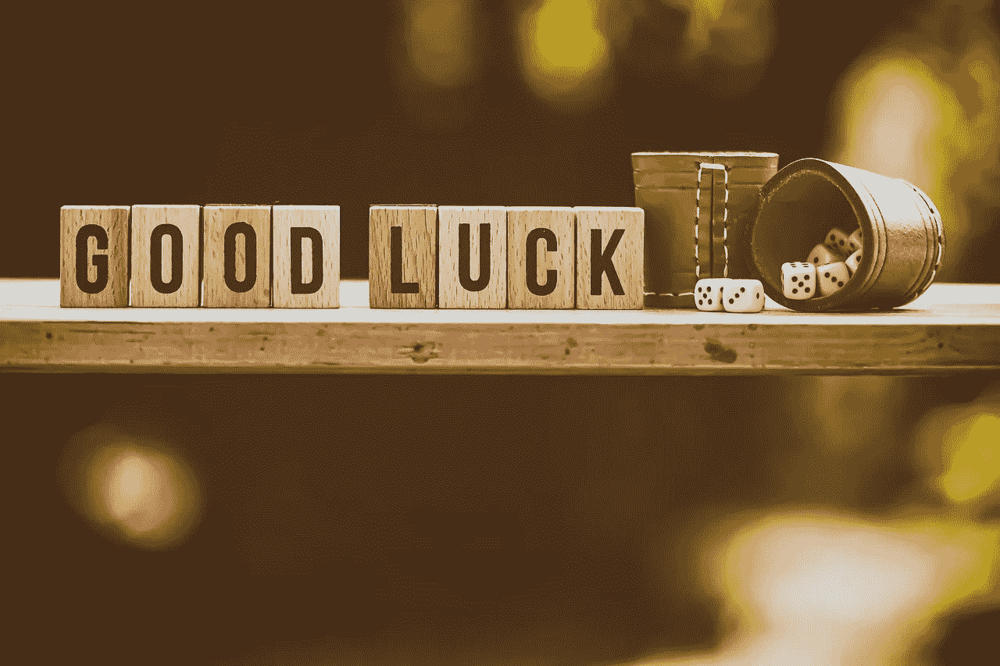

# 为什么概率是走向数据科学的垫脚石

> 原文：<https://towardsdatascience.com/why-probability-a-stepping-stone-towards-data-science-a81f6714102e?source=collection_archive---------96----------------------->

## 理解概率及其在现实生活中的应用。

照片由 [Alexas_Photos](https://pixabay.com/users/alexas_fotos-686414/) 在 [Pixabay](https://pixabay.com/photos/cube-shaker-luck-gambling-5214498/) 上拍摄

F 或者任何第一次踏入**数据科学**，**概率**是一个必须知道的概念&一个至关重要的先决条件。数据科学的核心需要统计学的基础知识，从掌握概率**开始。**它是关于解释你获得的结果，并试图用一个模型来解释现实世界的数据。概率知识有助于你更好地完成这些解释。

概率是对不确定性的度量，因为它量化了事件发生的可能性。它给你一个平均 t 的**可能性，基于**模式**的知情**决策**。数据科学在很大程度上高度依赖于概率及其应用。**

GIF 由 [AsmodeeGames](https://giphy.com/AsmodeeGames/) 在 [GIPHY](https://media.giphy.com/media/MdoycLRBmVoT7I89Xt/giphy.gif) 上生成

几个**现实生活中应用**的概率是:

*   天气预报:预测海浪
*   数据分析:检测数据中的**模式**
*   金融/股票市场:开发**定价模型**
*   运动攻略:在球员身上寻找**价值。**

让我们来看几个例子，看看概率在游戏中是如何运用的

使用概率的概念，可以决定靠近篮筐是投三分球还是两分球。

照片由[丹金](https://unsplash.com/@danielcgold?utm_source=medium&utm_medium=referral)在 [Unsplash](https://unsplash.com?utm_source=medium&utm_medium=referral) 上拍摄

有史以来最伟大的例子之一就是体育管理是如何通过将统计学&概率应用于**棒球**比赛并由团队**“奥克兰运动家”**创造历史而被彻底**改造**的。他们使用了一种叫做打破偏见的方法，一种基于概率频率的方法来预测和发现球员的价值以及他们对团队的意义。

现在最重要的问题"**为什么是概率？**

数学是确定性的逻辑；概率是不确定性的逻辑。概率在各种各样的领域都非常有用，因为它提供了理解和解释**变化**，从噪声中分离**信号**，以及**模拟复杂现象**的工具。

例如，在以下情况下需要概率:

1.  ***统计学*** :概率是统计学的基础和语言，使许多利用数据了解世界的有力方法成为可能。
2.  ***物理学*** :爱因斯坦有句名言‘上帝不和宇宙掷骰子’，但目前对量子物理学的理解大量涉及自然界最基本层面的概率。
3.  ***生物学*** :无论是基因的遗传还是随机突变的建模，遗传学都与概率深深交织在一起。
4.  ***计算机科学*** :概率在研究随机化算法、机器学习、人工智能中也起着必不可少的作用。
5.  ***金融学*** :概率在量化金融学中处于中心地位。随着时间的推移对股票价格进行建模并确定金融工具的“公平”价格在很大程度上取决于概率。
6.  *:近年来，政治学变得越来越量化和统计化，例如在预测和理解选举结果方面。*
7.  ****医学*** :近年来，随机临床试验的发展改变了医学研究，在这些试验中，患者被随机分配接受治疗或安慰剂。*
8.  ****人生*** :人生是不确定的，概率就是不确定的逻辑。虽然对生活中做出的每个决定进行正式的概率计算是不现实的，但认真思考概率可以帮助我们避免一些常见的谬误，揭示巧合，并做出更好的预测。*

*有趣的是，概率无时无刻不在我们身边，因此，人们形成了对概率的直觉。潜意识里，概率论帮助我们**做出更好的决策**，**提前**计算事情**。我们应该明智地使用它，把我们的情绪放在一边。***

*我希望我已经通过这篇文章引起了你对这个美丽主题的兴趣，尽管定义说“**不确定性是概率**的关键部分”，我希望你重新审视或研究这个有趣主题的事件发生的可能性是 100%，这使它是确定的。非常感谢你朗读这个故事。😃*

**

*照片由 [Alexas_Photos](https://pixabay.com/users/alexas_fotos-686414/) 在 [Pixabay](https://pixabay.com/photos/cube-shaker-luck-gambling-5214804/) 上拍摄*