# 为什么在 DS/ML 中概率分布是必须的？

> 原文：<https://towardsdatascience.com/why-probability-distribution-is-must-in-ds-ml-4edf2057ecfe?source=collection_archive---------23----------------------->

## 综合指南

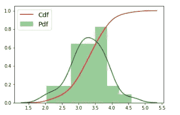

顾名思义*概率分布*是一个*随机变量*在所有可能的*结果*中总*概率*的分布。
例如，假设一家银行向其客户提供四种不同类型的借记卡(经典卡、银卡、金卡、白金卡)。每张借记卡都有不同参数的特定值，如最大交易金额、奖励积分、年度服务成本、最大购买金额等。

银行根据客户的年龄、教育状况、职业、工资、家庭规模、居住地等特征提供借记卡。

现在假设一个软件专业人员在银行开户，那么应该给他提供什么样的借记卡。在分析了所有客户特征之后，银行给出了一个*概率*表，如下所示。

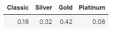

借记卡类型的概率分布

上表表示借记卡的*概率分布*，其中总*概率* (1.0)分布在所有四种类型的借记卡上，并带有相应的*概率*值。

*概率分布*在-

*   **数据分析**
*   **决策**

本博客强调在上述两种情况下需要*概率分布*，概率分布类型和*正态性*检验的不同类型。

让我们用 kaggle 上可用的 [***澳洲运动员数据集***](https://www.kaggle.com/vikashrajluhaniwal/australian-athletes-data-set) 来讨论一下。这个样本数据包含了*运动员*的各种身体属性。它包含了对 13 个不同特征的 202 次观察，如身高、体重、体重指数、性别、红细胞计数、白细胞计数等。

数据来源:[https://www . ka ggle . com/vikashrajluhaniwal/Australia n-athletes-data-set](https://www.kaggle.com/vikashrajluhaniwal/australian-athletes-data-set)

现在，让我们尝试建立一个简单的分类模型，一次使用一个变量对运动员的性别进行分类。为此，*概率密度函数*非常有助于评估一个连续变量的重要性。

> 附加说明:本文仅包含不同地块在交互模式下的最终可视化输出。为了访问 python 代码，请访问 kaggle 内核[这里](https://www.kaggle.com/vikashrajluhaniwal/5-must-know-probability-distributions)([https://www . ka ggle . com/vikashrajluhaniwal/5-must-know-probability-distributions](https://www.kaggle.com/vikashrajluhaniwal/5-must-know-probability-distributions))。

**a .分析 rcc**

由于两种性别类别的 *rcc* 的 pdf 相互之间略有重叠，因此不可能根据某种条件对所有的点进行正确分类。通过考虑两个 pdf 的交叉点，可以建立一个简单的模型

```
if(rcc<=4.68):
 sex = “female”
else:
 sex = “male"
```

从 pdf 曲线中，我们可以观察到，直到 4.68(交点处的值)，属于女性类别的点数比男性多，类似地，在 4.68 之后，男性点数更多。但是该模型导致在 4.68 之后属于女性类别的点的错误分类，并且类似地导致在 4.68 之前属于男性类别的点的错误分类。

同样，我们可以考虑其他变量来建立一个简单的分类模型，就像这样。为了找出最重要的变量，可以使用 pdf 进行单变量分析。

# 使用 pdf 进行单变量分析

**使用 pdf 确定最重要特征的经验法则:-**

*   不同类别目标变量的 pdf 曲线之间的间隔越高，分类越好

*   重叠的 PDF 曲线导致最差的分类

现在，让我们使用 PDF 对要素子集执行单变量分析。

**b .分析 wcc**

由于两种性别类别的 *wcc* 的 pdf 曲线相互重叠，因此很难得出简单分类的条件。

**c .分析体重指数**

由于两种性别类别的 *bmi* 的 pdf 曲线相互重叠，因此简单分类模型将具有较高的误分类水平。

**d .分析 pcBfat**

使用 *pcBfat* 可以建立一个简单的模型(如下所示),但是这又会导致一些错误的分类。

```
if(pcBfat<=11.80):
    sex = "male"
else:
    sex = "female"
```

**e .分析 lbm**

使用 *lbm* 可以构建一个简单的模型(如下所示),但它再次将低于 64.10 的男性点误分类为女性，将高于 64.10 的女性点误分类为男性。

```
if(lbm<=64.10):
    sex = "female"
else:
    sex = "male"
```

# 使用 CDF 的单变量分析

以上所有的简单模型都导致了某种分类错误，但是使用 PDF，我们无法计算分类错误的程度。使用 CDF 曲线可以获得误分类误差的大小。

**a .分析 rcc**

从 CDF 曲线中，我们可以观察到高达 4.68(来自构建模型的条件值)的 12.74%的男性被错误分类为女性，类似地，19%的女性在 4.68 以上被错误分类为男性。

所以总的误分类误差= 12.74 + 19 = 31.74%

**b .分析 pcBfat**

从 CDF 曲线中，我们可以观察到高达 11.80(来自构建模型的条件值)的 18%的女性被错误分类为男性，类似地，14.70%的男性在 11.80 以上被错误分类为女性。

所以总的误分类误差= 18 + 14.70 = 32.70%

**c .分析 lbm**

从 CDF 曲线中，我们可以观察到高达 64.10(来自构建模型的条件值)的 12.74%的男性被错误分类为女性，类似地，在 64.10 以上，7%的女性被错误分类为男性。

所以总的误分类误差= 12.74 + 7 = 19.74%

**结论**

基于 rcc、pcBfat 和 lbm 之间的错误分类误差的最佳预测器是 lbm。

# 概率分布的类型

基于随机变量的类型(离散或连续),有两种类型的概率分布——离散和连续。在这篇博客中，我们将讨论以下概率分布。

1.  离散概率分布

*   离散制服
*   二项分布

2.连续概率分布

*   连续均匀
*   正态分布
*   对数正态分布

# 1.正态分布

*正态(高斯)*分布是一种钟形曲线，它的分布模式在大多数自然现象中观察到，如身高、体重、标志等。它有两个参数—均值()和标准差(**)。**

**服从正态分布*的*随机变量*的 PDF 为***

**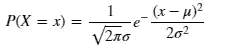**

****正态分布的性质****

*   **均值=中位数=众数**
*   **本质上对称**
*   **曲线下的总面积= 1**
*   **随着我们远离平均值，PDF 值降低**
*   **随着方差的增加，分布范围也增加，曲线变得更宽**
*   **68–95–99.7 经验法则
    **-** 68.2%的数据位于距平均值一个标准差以内
    **-** 95%的数据位于距平均值两个标准差以内
    **-** 99.7%的数据位于距平均值三个标准差以内**

**如果我们事先知道一个变量遵循正态分布，那么我们就可以很容易地说出这个变量的许多属性，而不需要查看实际数据。**

****通过可视化和偏斜度检查身高、体重栏的正态性****

**从曲线中我们不难看出，身高和体重几乎呈正态分布，但存在少量的不对称性，这可以通过**的偏斜度来衡量。****

*****偏斜度:**是一个统计参数，用来衡量随机变量分布中均值的不对称性。该参数值可以是正数、负数或未定义。负值表示数据*左偏*，而正值表示数据*右偏*。***

***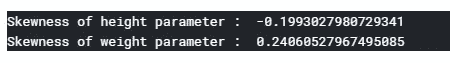***

***这里，身高稍微偏左，而体重稍微偏右。***

***现在让我们试着回答下面的问题。***

*   ***身高<=165 cm?***
*   ***What % of athlete has a height between 165 and 185 cm?***
*   ***What % of athlete has height > 185 cm 的运动员占百分之几？***

***对于一个均值和标准差有限的随机变量，利用 ***切比雪夫不等式*** 可以很容易地回答以上这些问题。***

***假设高度强烈遵循*正态分布*，那么它的分布应该如下图所示***

***如果身高特征完全符合*正态分布*，那么使用*正态分布*的 CDF，上述问题将很容易回答***

***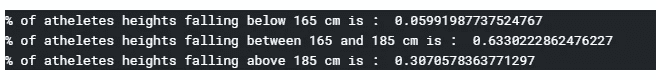***

## *****常态测试*****

***正态性检验用于确定数据是否正态分布，或者样本数据是否来自正态分布总体。有各种各样的图形和数字测试来确定这一点。
1。图形测试***

*   ***直方图/密度图***
*   ***Q-Q 图***

***2.数字测试***

*   ***夏皮罗-维尔克试验***
*   ***科尔莫戈罗夫-斯米尔诺夫试验***

*****a. QQ 剧情*****

***这是一种比较两个概率分布的图形方法，通过绘制它们的 ***分位数*** 来进行比较。对于*正态性*测试，一个分布是 w.r.t .我们想要测试的给定样本，另一个分布是*标准正态性*分布。
stats models 和 scipy 包中有内置方法可以绘制 *Q-Q 图*。我们也可以手动绘制。***

*****手动绘制 Q-Q 图的步骤*****

***假设 X 是代表给定样本的随机变量，Y **~** (0，1)是服从*标准正态*分布的随机变量，其中*均值(***)*等于 0，*标准差(****∑****)*等于 1。****

*   ****计算 x 的所有百分位数，比如 x'₁，x'₂，x'₃………..x'₁₀₀.这些百分位数也称为样本分位数。****
*   ****计算 y 的所有百分位数，比如 y'₁，y'₂，y'₃………..y'₁₀₀.这些百分位数也称为理论分位数。****
*   ****将 x 的每个百分位数与 y 的相同百分位数相对照，即 2d 点形成为(x'₁,y'₁)、(x'₂,y'₂)、(x'₃,y'₃)…………)..(x'₁₀₀,y'₁₀₀).****
*   ****如果所有点都在一条直线上(参考线 y=x)，那么 X 遵循*正态*分布。****

****从图中我们可以假设*身高*特征遵循*正态*分布吗？****

****在这里，大多数点都落在参考线上，所以我们的假设似乎相当安全。****

******夏皮罗-维尔克检验******

****这是一个检验样本是否正态分布的数值测试。这是一个基于*假设*的测试，其中*无效*和*替代*假设定义如下-****

******H₀(Null 假设:**样本为*正态分布*****

******H₁(Alternate 假设:**样本不是*正态分布*****

****这样，如果为 W 统计量获得的 ***p 值*** 小于*显著性水平* ( **α** )，则*零假设*被拒绝，反之，如果 ***p 值*** 大于 **α** ，则*零假设*被拒绝失败。****

********

****这里对于 **α** = 0.05，得到了 ***p 值***(0.2120)>**α**，所以我们没能拒绝*无效*的假设，即*身高*来自于一个*正态分布的*总体。****

******柯尔莫哥洛夫-斯米尔诺夫(K-S)检验******

****K-S 检验提供了一种方法—****

*   ****检查样本是否来自参考概率分布(*单样本 K–S 检验*)****
*   ****检查两个样本是否来自同一分布(*双样本 K-S 检验*)****

****这是一种基于假设的检验，其中单样本*K–S 检验*的无效假设和替代假设定义如下-****

******H₀(Null 假设):**样本遵循*参考*分布****

******H₁(Alternate 假设):**样本不遵循*参考*分布****

********

****这里对于 **α** = 0.05，得到 p 值(0.7958) > **α** ，所以我们未能拒绝*无效*假设，即*身高*服从*正态*分布。****

## ******切比雪夫不等式******

****通过遵循 68–95–99.7 的*正态*分布数据集的经验法则，我们知道有多少%的数据位于 ***k*** *标准差*与*均值*之内，但是如果数据不遵循*正态*分布呢？或者如何知道对于任意随机分布，数据的多少部分位于 ***k*** *标准差*内？****

****要回答这类关于随机分布数据的分散性的问题 ***切比雪夫不等式*** 就是 ***的运用。*******

*******切比雪夫不等式*** 表示不超过 ***1/k*** 的分数的数据落在超过 ***k*** *标准差*远离*平均值*的地方****

****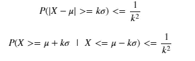****

****简单来说****

****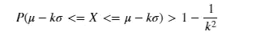****

****换句话说，对于具有有限*均值*和有限*标准差*的样本，至少数据的***1-(1/k)****部分落在 ***k*** *标准差*内。*****

****下面我们用几个 **k** 的值来多探讨一下不等式。****

*   ****对于 ***k*** = 2，***1-(1/k)***= 0.75，即至少 75%的数据落在任意*随机*分布的*的两个*标准差内。****
*   ****对于 ***k*** = 3，***1-(1/k)***= 0.89，即至少 89%的数据落在任意*随机*分布的*均值*的*三个*标准差内。****

****下面我们试着用*切比雪夫不等式*来回答一下问题。****

*   ****身高在 160.68-199.52cm 的运动员占百分之几？****
*   ****身高在 150.97-209.23cm 的运动员占百分之几？****

****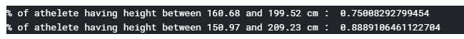****

# ****2.对数正态分布****

****如果随机变量 X 的自然对数正态分布为*正态分布*，则称该随机变量为*对数正态分布*。换句话说，如果 log(X)正态分布*，则 X **~** LogNormal( **，σ** )。*****

******对数正态*分布随机变量的 PDF 为*****

****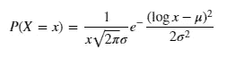****

****让我们画出 *ferr* 特征的分布图。****

****我们可以观察到 *ferr* 特征遵循某种*对数正态*分布，其中右边部分比左边部分长。****

******使用 QQ 图比较 ferr 的分布与对数正态分布******

*****QQ 图*可用于通过绘制两个*概率*分布的分位数来比较它们。****

****从上面的 *QQ 图中，*我们可以观察到，大多数点并没有紧密地位于参考线上，因此 *ferr* 特征并没有严格遵循*对数正态*分布。****

# ****3.二项分布****

****二项分布是一种离散概率分布，用于从 ***n*** *伯努利轨迹*中准确获得 ***k*** 个成功。****

*****伯努利尾迹的特征*—****

*   ****每条线索只有两种可能的结果——成功和失败。****
*   ****步道的总数是固定的。****
*   ****在所有的试验中，成功和失败的概率保持不变。****
*   ****这些轨迹是相互独立的。****

****二项式分布是一种从***【n】****伯努利轨迹*中计算 ***k*** 成功概率的方法。****

*****二项式*随机变量的 PMF 如下所示****

****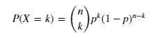****

****其中 *p* =成功的概率， *(1-p)* =失败的概率****

*****k* =成功次数，而 *(n-k)* =失败次数****

****从基础数据集中，我们可以观察到只有 12.37%(25/202)的运动员打篮球，现在如果我们选择一个由 50 名运动员组成的随机样本****

*   ****恰好两个运动员打篮球的概率是多少？****
*   ****最多 10 个运动员打篮球的概率是多少？****
*   ****至少 20 个运动员打篮球的概率是多少？****

****由于上述所有问题从固定数量的试验(50)中获得不同数量的成功(2，10，20)，且 ***p*** = 0.1237，因此*二项式*分布可用于回答这些问题。****

****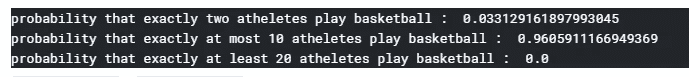****

# ****4.均匀分布****

******4 .离散均匀分布******

*****离散均匀*分布是一种*对称*分布，具有以下特性。****

*   ****它有固定数量的结果。****
*   ****所有的结果都同样可能发生。****

****如果一个随机变量 *X* 遵循*离散均匀分布*并且它有 *k 个*离散值比如 x₁、x₂、x₃………..x₁₀₀，则 *X* 的 PMF 为****

****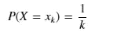****

****从给定的数据集中，我们可以观察到*性别*特征有两个可能的值*男性*和*女性*。有几乎相等数量的*男(100)* 和*女(102)* 运动员所以如果我们假设*性别*特征严格遵循均匀分布那么****

****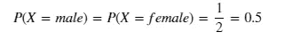****

****因此，随机的运动员有 50%的机会成为男*男*，同样，随机的*男*运动员有 50%的机会成为女*女*。****

******4.b 连续均匀分布******

****如果在 *a* 和 *b* 中定义了连续均匀分布的随机变量 *X* ，则 *X* 的 PDF 为****

****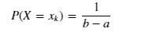****

****让我们考虑一组数据的 wcc 值在 4.40 和 5.40 之间，另一组在 7.70 和 9.90 之间。*该数据子集的分布*如下所示，其中*概率*在*连续*范围的所有三个箱中是相同的。****

# ****结束注释****

****在到目前为止的旅程中，我们讨论了不同种类的概率分布，特别强调了在 DS/ML 上下文中对概率分布的需求。****