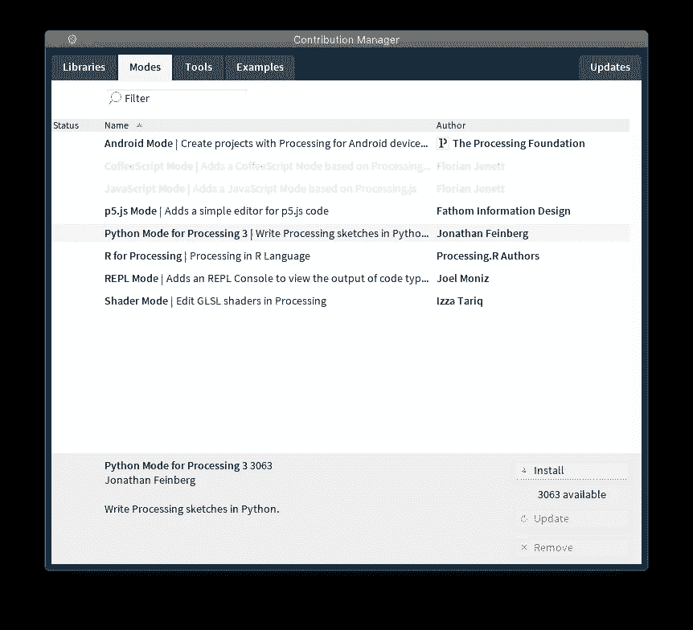
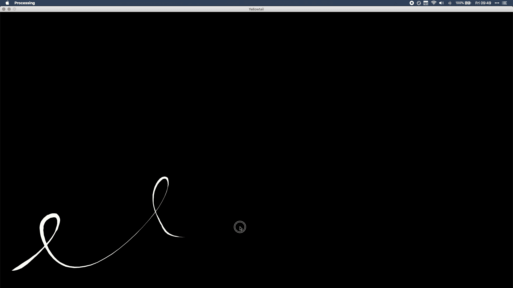
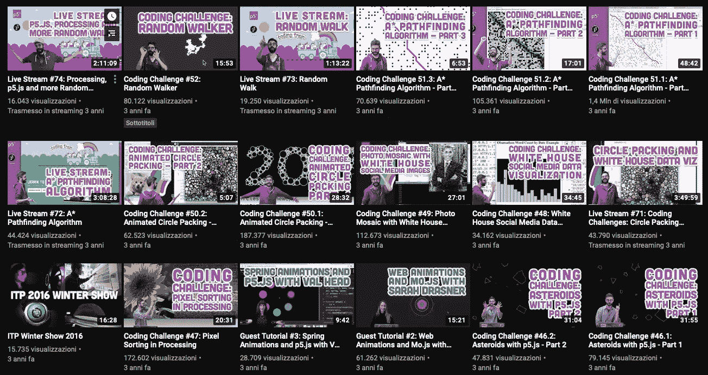

# 为什么处理是学习 Python 的最佳方式

> 原文：<https://towardsdatascience.com/why-processing-is-the-best-way-of-learning-python-222a77f97cca?source=collection_archive---------23----------------------->

用 [yasai](https://www.openprocessing.org/sketch/494102/) 写的 p5.js 草图生成的柏林噪声图像。

## 学习 Python 有所有的好处，没有缺点

无论你是一个有经验的程序员，或者你从来没有编程过，你可能从来没有听说过 Processing。在创造性计算和视觉艺术领域，处理是一个众所周知的工具，但它在其他领域却显得非常小众。处理是(我引用[官网](http://processing.org/)):

*一个灵活的软件速写本和一种语言，用于学习如何在视觉艺术的背景下编码。*

在上面的引用中，Processing 被同时称为 sketchbook 和语言，因为最初(早在 2001 年)Processing 只与 Java 编程语言的定制/简化版本一起提供，因此它既是语言又是编码环境。从那以后，很多事情都变了。Processing 已经发展成为一个大型的社区支持项目，拥有大量的附加组件、视频教程和外部库。其中，在 2010 年和 2014 年之间，开发了 Python 模式。从那时起，就有可能使用 Python 编程语言在处理 IDE 中实际编程，我在这里告诉你为什么这是学习和/或教授 Python 的一个极好的方法。

# 忘记 Python 安装的噩梦吧

加工的本质使一切都变得容易。从安装处理应用程序本身，到开始使用第一批提供的视频教程，一直到导航复杂的示例和安装扩展。这就是处理-Python 协作的亮点。

Python 是接近编程世界的伟大语言，因为它的易用性和语法非常接近书面英语。然而，如果有一件事是绝对**而不是**适合初学者的，那就是安装过程。Python 是非常不明确的，它有几个版本(其中一些已被弃用)。此外，安装可以通过许多不同的渠道进行:Rodeo、Anaconda、brew、python.org…仅举几例！处理消除了学习者和 Python 之间的任何障碍，将安装程序置于任何其他处理模式之中！选择 Python 模式进行处理，单击 install，就可以开始了。

有人可能会说，使用类似于 [Anaconda Navigator](https://docs.anaconda.com/anaconda/navigator/) 的东西会让初学者以同样的易用性获得类似的结果。然而，Anaconda Navigator 仍然保留了 Anaconda 的大部分强大功能，因此界面更加复杂。此外，Navigator 只是一个包管理器，用户必须从那里选择并安装一个代码编辑器，增加不必要的步骤，这是 Python 初学者*不应该*担心的。

图片由 Processing 提供的一键安装的作者提供。

# 视觉反馈的力量

如引言中所述,“处理”是视觉艺术领域中一个非常著名的软件。这是因为处理的优势在于能够在代码和视觉效果之间建立紧密的联系，这使得使用代码生成视觉效果变得极其简单。Processing 并不是唯一允许这样做的软件( [OpenFrameworks](https://openframeworks.cc/) 是游戏中的另一个大玩家)，但它绝对是最容易和最平易近人的环境之一。

当在处理中观察 Python 时，好处更加明显。Python 语言的脚本特性意味着第一次接触它的用户通常必须看到他们的第一个脚本的结果以文本的形式出现在 Python 控制台中(或者 ASCII arts，如果他们正在学习的教程很有趣的话)。处理彻底改变了这种范式，并提供了从第一行代码生成视觉效果的能力。能够以可视化的方式看到几行代码的结果是一个非常强大的工具，可以使学习之旅更加有趣和互动。

随着学习者变得更擅长编程，处理环境也随之增长，为视觉艺术世界提供了越来越多的深度:3D 环境、网格、纹理等等。最终，即使有一天处理环境可能会成为专业程序员的限制，但它为他们提供了轻松切换到更强大环境的工具。这甚至没有提到处理框架*已经以许多不同的方式衰落了:从让你将草图移植到基于网络的环境的 p5.js，到让你在移动和基于 Linux 的平台上运行处理草图的 Android 和 Pi 的处理。*

[Golan Levin](http://www.flong.com) 的处理示例短片，标题为 Yellowtail，由 [Jonathan Feinberg](http://mrfeinberg.com) 翻译成 Python。

# 证明文件

最后，也是最重要的，文档:处理项目充满了优秀的文档！从参考手册开始，不仅包含每个内置功能的解释，还包含可以复制粘贴到草图中的现成代码，一直到由独一无二的[丹尼尔·希夫曼](https://shiffman.net/)制作的数千个视频教程。无论你被一个问题困住，或者你只是喜欢跟随一个指导你通过复杂的加工草图的错综复杂的教程，你一定会找到你需要的。

作者图片取自丹尼尔·希夫曼的[编码训练](https://www.youtube.com/channel/UCvjgXvBlbQiydffZU7m1_aw)提要，展示了数千个教程的多样性。

# 结论

总之，处理使 Python 入门变得更有趣和更具交互性。它为用户提供了一个测试和学习所有 Python 基础知识的良好环境，并支持程序员成长为一个强大的工具，直到学习者的旅程结束。
虽然我强烈认为 Python 的优势还在于虚拟环境的管理和外部模块的安装，但我认为这两个主题可以放在一边，以利于程序员旅程开始时更好的学习体验。