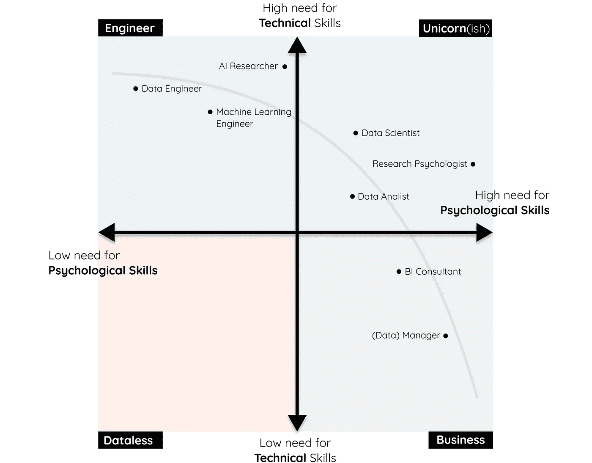
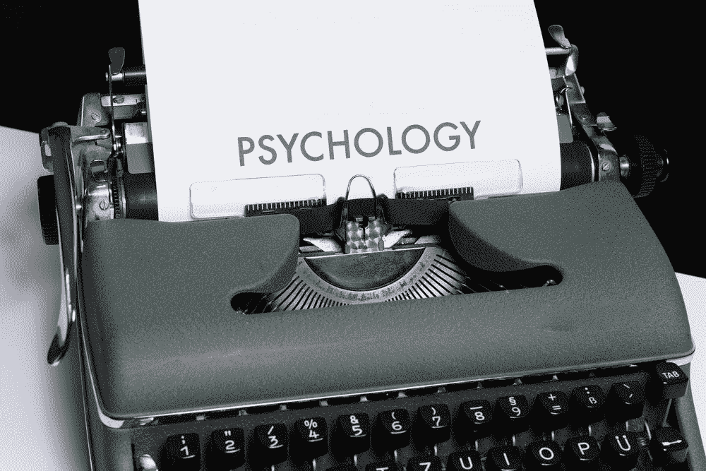
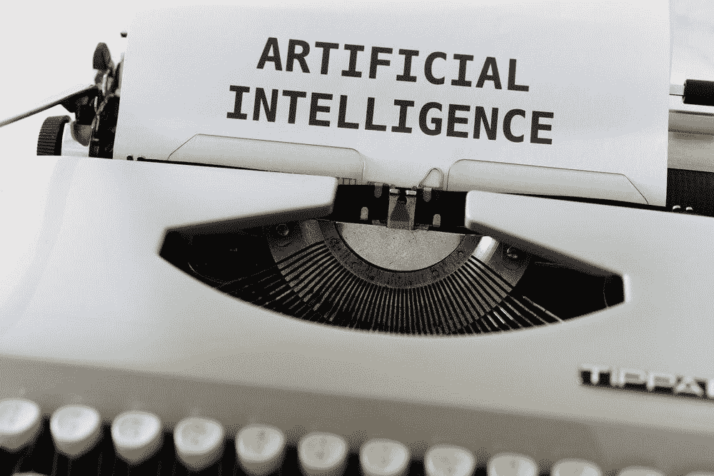
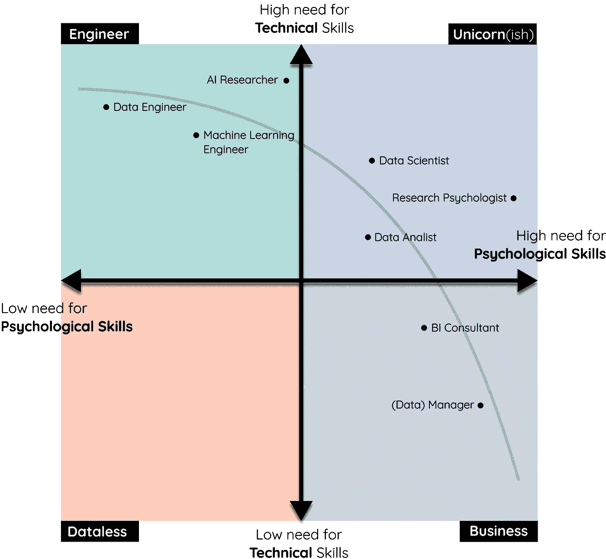
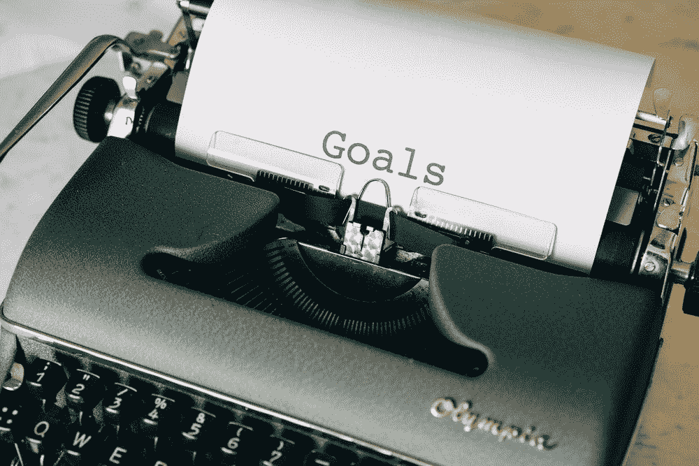

# 为什么心理学家可以成为伟大的数据科学家

> 原文：<https://towardsdatascience.com/why-psychologists-can-be-great-data-scientists-970552b5223?source=collection_archive---------8----------------------->

数据驱动职业心理技能需求象限。图片由作者提供。

## 心理学和数据科学的交叉点

在我之前的一篇文章中，我谈到了从**心理学**(或任何社会科学)到**数据科学**的过渡。重点主要是成为一名成熟的数据科学家所需的技能。

 [## 从心理学家转变为数据科学家的 5 个技巧

### 以及如何做到这两点。

towardsdatascience.com](/5-tips-for-making-the-transition-from-psychologist-to-data-scientist-8198fbbbb19e) 

然而，如果你已经完成了转变，那该怎么办呢？作为一名数据驱动的专业人士，你能做些什么来利用你现有的心理学知识？丢掉多年的学习，忽视你所学的一切，这将是一种耻辱！

我真的相信心理学家有特定的技能，可以用来成为伟大的数据科学家！当然，作为一名心理学家，我有偏见，但是让我们暂时忽略这一点😉*

作为一名数据驱动型专业人员，本文将重点介绍在您的工作中可以使用哪些心理技能，以及如何使用。

这个不会像教程一样不言自明。这里的目的是激励你寻找**创造性的方法**在你的工作中既是心理学家又是数据科学家。我希望通过给你提供一些清晰的例子来实现这一点，这些例子可能会**触发**你以新的方式应用旧的心理学方法。

> ***注**:本文中的技巧并不专属于心理学家或有社会背景的人。焦点就在于此，因为心理学家可能比软件工程师更善于沟通。

# 1.心理技能

马库斯·温克勒的照片

让我们从头开始，为什么我会认为心理学家可以成为伟大的数据科学家？当然，这不是因为他们是伟大的程序员，也不是因为他们有丰富的 git 经验，对吗？不要！这主要是因为他们通常已经获得了两种广泛的技能:

*   通讯技能💬
*   研究技能🔍

现在你可能认为这看起来没什么，通过观察这两项技能，我倾向于同意你的观点。这似乎并不令人印象深刻…然而，掌握这些技能需要付出巨大的努力，使用它们的影响可能比你想象的要大。

这两种技能都是总括性的概念，因此包含了几个子技能，每个子技能都以自己的方式对心理学和数据科学领域做出了贡献。

下面，我将简要介绍其中的一些技能，让您感受一下为什么沟通和研究技能对数据科学来说比您可能意识到的更重要。

## ELI5💬

**E**xplain it**l**ike**I**am**5**(**Eli 5**)常用于对复杂的话题要求简单的解释。如果你能向一个 5 岁的孩子解释，你就真正理解了这个主题，并表明你能在所有知识水平上交流这些概念。

作为一名心理学家，你已经接受过这样的训练。你的病人理解复杂的方法是至关重要的，比如认知行为疗法，因为如果他们不理解，就很难实施治疗。

## 利益相关者管理💬

通过会议、电话会议、午餐等认识到公司是社会组织，这一点很重要。能够在高级水平上交流是非常有利的。

尤其是当涉及到利益相关者管理时，真正理解他们的问题，以及他们更喜欢的解决方案，需要你作为一个专业人士对他们有一种感觉。这个人为什么要求这个功能？他们想达到什么目的？

## 道德决策💬

不管你的专业是什么，心理学家都应该了解伦理学。在数据科学的背景下，这涉及到患者的保密性、隐私、决策等。理解并在复杂的伦理环境中工作有助于防止偏差，如选择偏差、确认偏差或反应偏差。

 [## 如何检测人工智能中的偏差

### 检测数据中常见的(认知)偏差

towardsdatascience.com](/how-to-detect-bias-in-ai-872d04ce4efd) 

## 实验知识🔍

现在，那些有社会背景的人学到的不仅仅是沟通技巧。在大多数项目中，很大一部分课程是为了理解涉及人类的实验设置。

实验设计的严谨性、对结果细致入微的解释、求知欲，这些都是优秀心理学家必备的技能。

## 统计数字🔍

有趣的是，大多数心理学项目都比你想象的更注重统计。在我的项目中，四分之一的课程是某种形式的统计学。这包括从统计测试和验证问卷，到 A/B 测试和

那些学习社会科学的人往往比大多数其他专业的人对实验设计和统计学有更深入的了解。鉴于大量的机器学习源于统计学，这是一项非常棒的技能。

## 主题🔍

当分析人类行为时，比如为 A/B 测试设计实验或解释个人的地理数据，那么很好地掌握驱动人类的事物肯定会有帮助。

心理学家在分析与人类行为相关的数据时会有很大的帮助！

# 2.数据专业人员的类型

马库斯·温克勒的照片

尽管上述技能很重要，但它们可能更重要或更不重要，这取决于你实际从事的工作。到目前为止，我一直在寻找数据科学家的视角。在实践中，数据科学家之间的工作可能会有很大不同，因为数据领域内的职业仍然没有明确定义。

## **数据职业**

为了理解心理学如何有助于数据驱动的专业人士，重要的是你要定义你想成为什么样的专业人士！

根据我的经验，数据驱动型专业人士大致有 7 种*:

*   经理(管理一个由数据驱动的专业团队)
*   商业智能顾问
*   数据分析师
*   数据科学家
*   机器学习工程师
*   数据工程师
*   人工智能研究员

这些角色对技术和心理技能的需求有很大不同。例如，经理通常不需要像人工智能研究人员那样多的技术知识，但肯定应该更倾向于心理学，以便正确地管理团队。

最适合你的数据职业可以浓缩成一个简单的问题:

> 在你的工作中，你希望心理技能和技术技能之间达到什么样的平衡？

回答这个问题可能会帮助你了解你想成为什么样的专业人士。如果这个问题的答案是你不是在找技术工作，那么大多数心理学专业都会适合你(例如，临床心理学、社会心理学家、I/O 心理学家等。).

然而，如果有一定数量的心理和技术技能是你想要的，这个问题就变得更难了。答案……一个**象限**！

# 3.数据中的心理学象限

你的心理技能实际上有多大帮助很大程度上取决于你所做的工作类型。如果您是一名数据工程师，并且主要专注于创建数据管道，那么拥有这些技能就不那么有帮助和必要了。

下面，我创建了一个象限，显示了几种职业中对心理技能的**需求**与对技术技能的**需求**。尽管这是对现实的简化(谁真的想看一个四维图😅)，希望这能帮助你决定最适合你的职业。

数据驱动职业心理技能需求象限。图片由作者提供。

如上所述，心理技能通常对应于**沟通**和**研究**技能。在上面的象限中，更加强调**沟通**技能，以便将其与技术技能分开。

**技术技能**包括数据领域内的各种技能，如编程、机器学习、MLOps、数据架构等。

有趣的是，在填写象限时，我开始注意到职业相对位置的趋势。技术和心理技能之间似乎存在一条**曲线**:

> 对技术技能的更高需求往往导致对心理技能的更低需求，反之亦然。

## 低技术高心理

我把通常需要更多心理技能而不是技术技能的职业放在了右下象限:**商业**。

那些在商业象限的人更有可能担任**咨询/建议**角色或者**管理**角色。随着对沟通和领导技能的更大需求，BI 顾问和经理填补了一个伟大的适合！

> BI 顾问可能非常专业，尤其是当他们还负责底层数据模型的时候。然而，通常情况下，它更多的是关于理解业务，而不是创建复杂的算法分析。这个象限中的许多其他职业也是如此。

## 高技术低心理

我把通常需要更多技术技能而不是心理技能的职业放在了左上方的象限中:**工程师**。

工程师象限中的人大多具有技术背景，如数据工程师或机器学习工程师。虽然拥有一些心理技能是有帮助的，但这不是工作的必要条件，因为你与利益相关者的互动不如数据科学家。

## 高技术和高心理

我把通常需要高心理和技术技能的职业放在了右上象限:**独角兽** (ish)。

你不会经常看到人们同时拥有高技术和心理技能，因为这些技能很难独立获得，更不用说一起获得了。您可以在象限的人口中看到这一点:右上角没有角色。

在我看来，即使是数据科学家这种典型的独角兽角色，也不需要具备与人工智能研究员相同的技术技能。他们确实需要广泛的技术和心理技能，只是不是专家的水平。

## 低技术低心理

我把通常不需要多少心理和技术技能的职业放在右上方的象限中:**无数据**。

每个象限都需要一个名称，所以我将所有与数据无关的角色都称为无数据。我怀疑有任何数据角色不需要技术和心理技能。

> **注**:由于数据驱动的职业通常定义不清，上述职位应被视为一种指示，而非事实。此外，这是我的观点，也是我对自己经历的偏见。

# 4.如何在数据科学中运用心理学

马库斯·温克勒的照片

最后，**百万美元**问题:

> 作为一名数据科学家，我如何在工作中真正运用心理学？

虽然这可以通过多种方式实现，但我想从三个方面入手:

*   利益相关者沟通
*   展示结果
*   分析人类行为

## 利益相关者

由于利益相关者对他们的项目有看似模糊的需求，与他们的沟通通常是非常困难的。这通常不是涉众的错，而是要求那些需求的人的错！当你写下这些需求时，你需要理解涉众的意图。

它从超越需求开始。对于每个需求，询问涉众他/她想用这个需求完成什么。为什么要预测下一年的销售额？拥有这些知识，你想达到什么目的？

意识到双方都缺乏理解。涉众对你的工作知之甚少，反之亦然。跨过那座桥需要你开始认同利益相关者。

> **注意**:在分析我和他人之间的沟通错误时，帮助我的是假设我是错误的。通过假设这是我自己的错误，我可以开始认识到我如何以不同的方式处理这种情况。如果你责怪对方沟通不畅，下次就没什么机会了。

## 沟通

优秀的沟通技巧可能需要几年的时间来培养，但是关注几个方面会对你的技巧有很大的帮助。让我们关注一种单一的沟通形式:**呈现**。

展示您最新的分析结果可能比您预期的更加困难。您需要传达您的结果、技术假设、对业务的影响、验证指标等。所有这些都是有趣的过程。

这里有一些让你开始的提示:

*   了解你的受众
*   **K**eep**I**t**S**imple， **S** tupid (KISS)
*   解释一下我喜欢我 T21
*   像讲故事一样对待它
*   专注于一条信息

保持简单，专注于一条信息，并用大多数人都能理解的方式解释，这是良好沟通的关键。

即使对于技术观众来说，从简单开始也是最好的。从一开始就钻研技术含量很高的内容需要极大的注意力。对于技术人员来说，你需要对你所展示的东西和你所应用的方法产生直觉。

## 分析人类行为

解释您的分析结果通常需要一定程度的领域知识。作为一名心理学家，人类行为是你的专业知识。然而，没有多少组织专门致力于分析人类行为。

幸运的是，大多数组织都有某种形式的关于人类行为的数据。例如，这可能是客户评论、票据，甚至是人力资源数据。现在所有的组织都有一个网站，你至少可以分析人们如何使用一个组织的网站，并开发一个行为流程。

在任何组织中，你都不需要寻找太多的行为数据。识别这些用例或问题可能是有益的，因为它允许你炫耀你的心理学领域的知识！

> **结束所有注释的注释:**尽管这篇文章比我预期的要长，但它仍然缺少相当多的信息和脚注。为了压缩信息，我在这里或那里做了一些假设，但有时感觉未压缩的信息是必不可少的。我意识到我有时过于笼统，所以如果我遗漏了重要信息或者过于笼统，请纠正我。找到平衡被证明是相当困难的*😅。*

# 感谢您的阅读！

如果你像我一样，对人工智能、数据科学或心理学充满热情，请随时在 [LinkedIn](https://www.linkedin.com/in/mgrootendorst/) 上添加我，或者在 [Twitter](https://twitter.com/MaartenGr) 上关注我。

有关心理学和数据科学交叉的更多信息，请点击下面的帖子之一:

 [## 从心理学家转变为数据科学家的 5 个技巧

### 以及如何做到这两点。

towardsdatascience.com](/5-tips-for-making-the-transition-from-psychologist-to-data-scientist-8198fbbbb19e)  [## 如何检测人工智能中的偏差

### 检测数据中常见的(认知)偏差

towardsdatascience.com](/how-to-detect-bias-in-ai-872d04ce4efd)