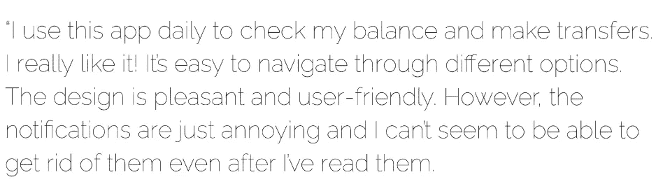
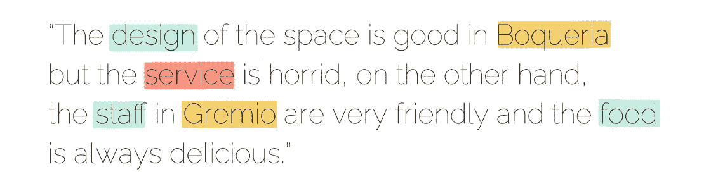
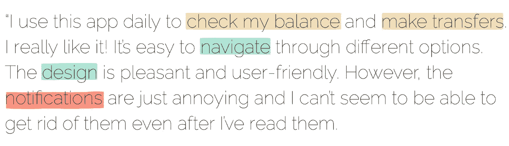

# 为什么纯粹的情感分析在当今的行业中不起作用

> 原文：<https://towardsdatascience.com/why-pure-sentiment-analysis-does-not-work-in-todays-industries-df6eefe3fec4?source=collection_archive---------35----------------------->

## [入门](https://towardsdatascience.com/tagged/getting-started)

## 对下一级情感分析的完整介绍。

作者图片

在过去的几十年里，感知分析已经被多种类型的行业广泛使用。它不仅可以产生有用的见解，还可以通过利用机器学习的能力而不是手动收集和分析一堆数据中的信息来节省时间和精力。它只是对输入(通常以句子或文档的形式)是否包含正面或负面意见进行分类。下面一个简单的例子清楚地表明，情绪是负面的。

看起来很简单，对吧？当数据变得更长、更复杂时，问题就出现了。假设我们有一个超过 500 个单词的文档，或者……大约 50 个单词，就像下面的例子一样。它可能谈论不止一个单一的主题。如果文件的最终输出将只是正面或负面，它是否真的代表了整个文件的思想？如果这份文件包含积极和消极的情绪呢？情感分析的输出会是什么？

在这个大数据扮演非常重要角色的时代，大量非结构化信息很可能会产生各种各样的场景。大多数公司肯定希望从中获取尽可能详细的知识。不幸的是，情感分析不能满足他们的要求。

# 然后，怎么做？

今天，我们至少知道情感分析的 4 个子领域:基于方面的情感分析、有针对性的情感分析、有针对性的基于方面的情感分析和基于概念的情感分析。我们将看看他们中的每一个是如何做的比常规的情绪分析更多。

## **基于方面的情感分析(ABSA)**

这是最常见的情感分析类型。除了情绪，还有一个叫做相位的东西应该被考虑。这里的方面是指预定义类别的列表，并且非常依赖于数据的领域。假设我们拥有的数据是关于笔记本审查的，我们将很可能定义离`portability`、`connectivity`、`operation_performance`以及任何其他与笔记本相关的东西不远的方面类别。许多公司利用 ABSA 来更好地了解他们自己的重要方面。与情绪分析不同，ABSA 可以给他们提供更详细、更结构化的信息。因此，他们只需要专注于改善那些容易产生负面情绪的方面。

SemEval 与 ABSA 相关的数据集一起举办了一场比赛(Pontiki 等人，2016 年)。从 SemEval 笔记本电脑数据集，下面是一个例子，以帮助您更好地理解。根据我们前面提到的一系列方面，示例中包含的方面是可移植性和连接性，它们的极性都是积极的。请注意，带下划线的单词并不是系统的真正输出。它们可以作为相应方面(可移植性和连接性)的线索和证据。

另一方面，还有另一种类型的 ABSA。实际上，输出和实现是完全不同的，但是人们经常使用同一个术语，这导致了混淆，尤其是对于那些刚刚了解这个领域的人。与前面的 ABSA 不同，这里的方面是直接从文档中提取的。它可以是任何东西，只要在文件中有说明，并且代表正在讨论的东西。通常以单词或短语的形式出现。因此，可以肯定地说，这种类型的情感分析比前一种更独立于领域。以下是取自 SemEval 数据集的一些示例。这里可以提取的方面是服务和人民，他们的极性分别是消极的和积极的。

## 目标情感分析

这个子领域通常被称为基于实体的情感分析，因为它分析出现在文档或句子中的实体。潜在的假设是在文档或句子中应该至少有一个实体被提及。实体通常以产品、人员、位置、组织等形式出现。下面是 Vo 和张(2015)的一个例子，其中的实体是窗户和，它们的极性分别为正和负。

## 基于方面的目标情感分析(TABSA)

顾名思义，这个任务基本上是有针对性的情绪分析和 ABSA 的结合。有三个组件需要分析:实体、方面和情感。摘自 Sentihood 数据集(Saeidi 等人，2016 年)，下面是句子和输出可能看起来像什么的示例。

提到了两个实体:Boqueria 和 Gremio。博克里亚的设计是积极的，而服务是消极的。而且 Gremio 的服务(工作人员)和食物都是正面的。有趣的是，这两个实体有相同的方面(服务),但有不同的情感。换句话说，这项任务提供了对多个实体进行比较的优势。这对于公司来说非常有用，尤其是当他们想要将自己的产品与竞争对手的产品进行比较，并挖掘更多关于他们的信息时。

## 基于概念的情感分析

基于概念的情感分析方法侧重于通过使用网络本体或语义网络对文本进行语义分析，这允许聚合与自然语言观点相关联的概念和情感信息(Cambria，2013)。基本上和 aspect 差不多但是更一般。这就是为什么它能比其他产品产生更详细的输出。

让我们再来看看这篇文章开头的 50 个单词的例子。通过使用基于概念的情感分析，我们可以从这篇综述中获得几个概念(或主题),即使它们并不都有情感。*检查我的余额*和*进行转账*是有效概念的例子，但是没有情感。而另外三个是有效的概念，有感情。阅读和分析结果似乎有点困难。这就是为什么在实践中，结果通常以关系图、词云等形式可视化。

# 结论

总之，情感分析有助于从任何领域，甚至是一般领域，给出更广泛的想法。但是，如果我们想要更细粒度的信息，根据我们想要关注的部分，有许多选项可用。

# 参考

[1]庞蒂克等， [SemEval-2016 任务 5:基于方面的情感分析](https://www.aclweb.org/anthology/S16-1002/) (2016)，第十届语义评价国际研讨会论文集

[2] DT。Vo 和 Y. Zhang，【2015】，第 24 届国际人工智能联合会议论文集

[3] Saeidi 等人，[感知:基于目标特征的城市街区情感分析数据集](https://www.aclweb.org/anthology/C16-1146/) (2016)，2016 年科林会议录

[4] E. Cambria，[概念级情感分析介绍](https://www.researchgate.net/publication/290106740_An_Introduction_to_Concept-Level_Sentiment_Analysis) (2013)，墨西哥人工智能国际会议

[5] A. Lowe，[概念层次情感分析:理解文本反馈中情感的下一层次](https://www.luminoso.com/post/concept-level-sentiment)

如果你喜欢阅读这篇文章，并想在这里听到更多我和其他作者的意见，请[加入 Medium](https://medium.com/@arfinda/membership) 和[订阅我的时事通讯](https://medium.com/subscribe/@arfinda)。或者直接点击下面的链接。谢谢大家！

 [## 通过我的推荐链接加入媒体

### 作为一个媒体会员，你的会员费的一部分会给你阅读的作家，你可以完全接触到每一个故事…

medium.com](https://medium.com/@arfinda/membership)  [## 每当 Arfinda Ilmania 发布时，都会收到一封电子邮件。

### 每当 Arfinda Ilmania 发布时，都会收到一封电子邮件。通过注册，您将创建一个中型帐户，如果您还没有…

medium.com](https://medium.com/subscribe/@arfinda)