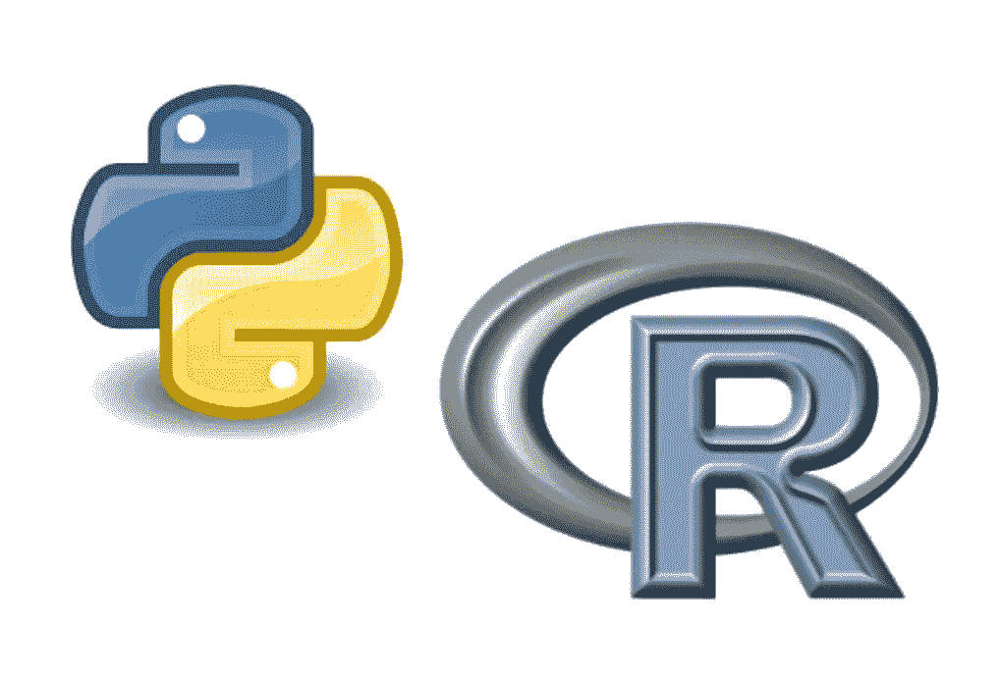

# 为什么 Python 比 R 更适合数据科学职业

> 原文：<https://towardsdatascience.com/why-python-is-better-than-r-for-data-science-careers-44ec7a149a18?source=collection_archive---------10----------------------->

## 新数据科学家将从学习 Python 中获益更多的四个原因

新数据科学家都面临着一个极其重要的问题: ***我该学 Python 还是 R？***

这个问题非常重要，因为学习你的第一门编程语言需要数百个小时。试图两者都学是不切实际的，尤其是当你刚刚开始职业生涯的时候。

那么你应该选哪个呢？

根据我的经验，我相信如果你选择 Python，你的职业生涯会受益更多。

> 在我看来，Python 是从事数据科学职业的更好选择，尤其是如果你刚刚起步的话

我给你四个我认为 Python 是你职业生涯更好选择的理由，但是我也要明确一点 ***我不认为 R 是一个糟糕的选择*** 。

选择 R 不会对你的工作机会产生负面影响，根据你的团队，你甚至可能需要学习它。事实上，脸书将 R 用于其内部调查工具的分析组件，并且我们所有的数据科学基础设施都支持这种语言。

也就是说，我相信如果你首先学习 Python，作为一名实践数据科学家，你将更快地变得富有成效，并且你将能够在统计建模之外的重要领域更好地为你的团队做出贡献。

因此，学习 Python 将使你能够为你的公司带来更大的影响，你的职业生涯也将因此受益更多。

# 原因 1:无论如何，你可能都必须学习 Python

大多数公司要求他们的数据科学家做的不仅仅是预测建模(即机器学习)。至少，您可能需要维护为模型提供数据的数据管道，而这些数据管道很可能是用 Python 构建的。

如今管道的行业标准是基于 Python 的气流，在脸书，我们使用基本相同的内部 Python 工具。

事实上，我估计我们脸书的数据科学家每周 100%使用 Python，而大约 10%的人积极使用 r。

因此，选择 Python 可能更有效:虽然一旦找到工作，你可能会避免使用 R，但你不太可能避免使用 Python。

# 原因 2: Python 更容易学习

获得就业机会所需的时间非常重要，尤其是如果你在大学以外自学的话。

Python 以简单易学而闻名。学习了 Python 和 R(尽管对 Python 的了解更深)，我认为 Python 的名声是当之无愧的。

当您开始使用统计建模之外的语言特性时，Python 易于学习的好处尤其明显。这些特性包括打包项目以供分发、开发命令行界面、用 SQLAlchemy 之类的 ORM 建模数据结构等等。

使用 Python 将使您更容易精通这些特性，您的职业生涯也将因此受益。

# 原因 3: Python 有一个更大的社区

Python 是世界上最流行的编程语言之一，在 stack overflow、kaggle 甚至 medium 等网站上都有一个庞大的社区。

因此，当你不可避免地遇到你自己无法解决的问题时，你更有可能找到在你之前遇到过的人，寻求帮助，并得到解决方案。

这意味着您将花费更少的时间来调试系统的兼容性问题，而将更多的时间用于交付对公司产生影响的代码。

# 原因 4:使用 Python 部署模型更容易

最后，在您的职业生涯中，您可能会希望将您的模型实时提供给最终用户。为了解决这个问题，您需要构建一个基于 REST 的 web 应用程序，这对于 Python 来说要容易得多。

事实上，Python 拥有一些世界上最流行的 web app 框架，即 Django 和 Flask。您公司的内部部署工具更有可能支持那些框架，而相对来说不太可能支持 r。

这些框架的流行也意味着它们受到平台即服务提供商的良好支持，如 Heroku、Amazon Lightsail 和许多其他提供商。您将能够在线发布您的个人项目，而这只是在 r。

最重要的是，如果你足够幸运，你的公司在自己的产品中使用 Python 框架，那么学习 Python 意味着你会很危险，足以建立自己的应用内跟踪。能够自主地为您的模型捕获更多的特性将会对您能够提供的影响产生巨大的影响。

当然，所有的决定都有取舍，选择学习 Python 而不是 R 也不例外。尽管我相信 Python 是数据科学职业的更好选择，但考虑它带来的负面影响也是值得的。

对我来说，最大的缺点是 Python 没有与 Rstudio 等效的工具。与 Python 最有可比性的工具是 Jupyter notebook，但我个人认为 Rstudio 更好，因为它具有数据探索功能。

> 编辑:自从写了这个故事， [Marcelo Garcia](https://www.linkedin.com/in/marcelo-garcia-4abb34182/) 指出免费使用的 Spyder 包是 Rstudio 的 Python 替代品。我还没有机会尝试 Spyder，但它看起来很棒！

R 在学术界也非常流行，所以 R 中的包文档更有可能直接引用学术研究。这些文档对于从事“前沿”研究的数据科学家来说非常有用。

但是我不认为缺少 Rstudio 等价物就足以否定 Python 的相对优势。数据科学学术界的职业也更加罕见，这使得 R 的研究相关优势对大多数数据科学家来说不太相关。

所以尽管 R 有优势，我相信如果你选择学习 Python，你的职业生涯会受益更多。

最后，我觉得再次值得一提的是 ***我不觉得学 R 是个坏选择，*** 只是那个 Python 更有可能是你职业生涯更好的选择。根据您的具体情况，学习 R 可能对您更有意义。

不管你选择哪种语言，你都不应该觉得你不能改变你的想法。所有编程语言的相似之处比不同之处多得多:学习你的第二语言比学习你的第一语言要容易得多。

事实上，我自己已经选择先学 R 了！所以我很难强烈反对 R，即使我现在推荐 Python 作为你职业生涯的更好选择。

感谢阅读！如果你觉得这些内容有用，我写的是关于数据科学和编程的文章，所以请关注我，获取更多类似的文章。