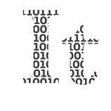
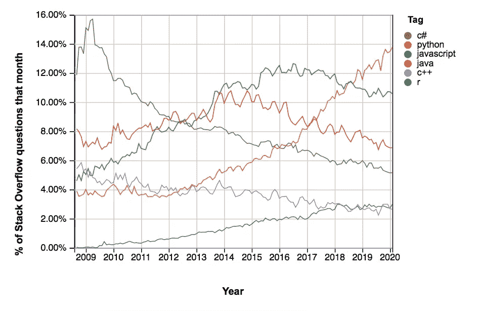
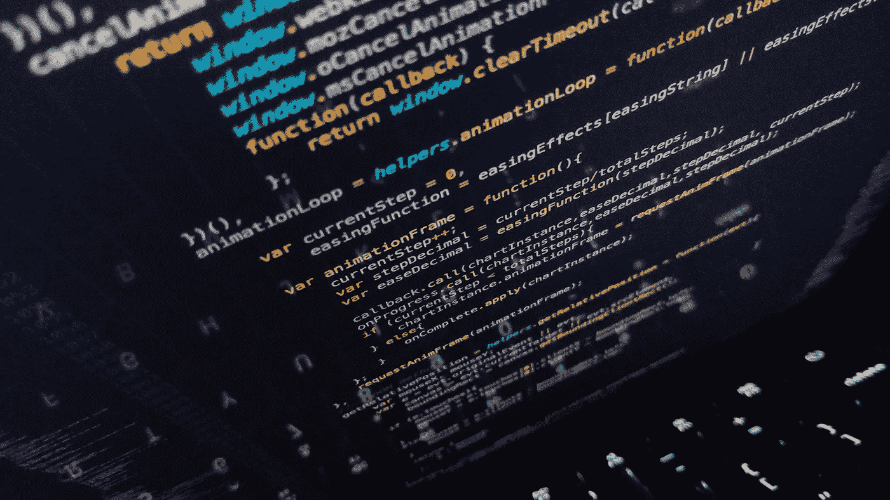
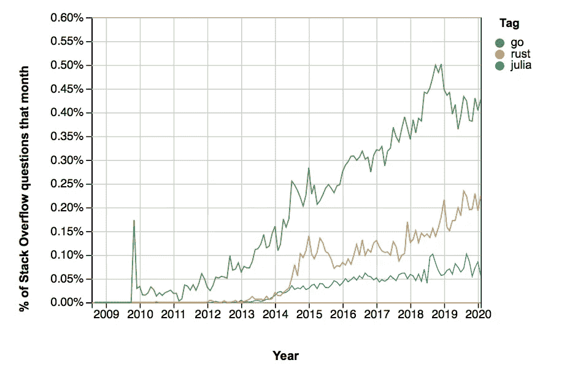

# 为什么 Python 不是未来的编程语言

> 原文：<https://towardsdatascience.com/why-python-is-not-the-programming-language-of-the-future-30ddc5339b66?source=collection_archive---------0----------------------->

## 意见

## 尽管未来几年对它的需求量会很大

Python 为我们提供了很好的服务——但是它会长久吗？戴维·克洛德在 [Unsplash](https://unsplash.com/s/photos/python?utm_source=unsplash&utm_medium=referral&utm_content=creditCopyText) 上的照片

  It 花了编程社区几十年的时间来欣赏 Python。但自 2010 年初以来，它一直在蓬勃发展，并最终在受欢迎程度上超过了 C、C#、Java 和 JavaScript。

但是这种趋势会持续到什么时候呢？Python 最终什么时候会被其他语言取代，为什么？

给 Python 设定一个确切的到期日会有太多的猜测，它可能会像科幻小说一样过时。相反，我将评估目前推动 Python 流行的优点，以及将来会破坏它的弱点。

# 是什么让 Python 现在流行起来

Python 的成功反映在[堆栈溢出趋势](https://insights.stackoverflow.com/trends?tags=r%2Cpython%2Cjavascript%2Cjava%2Cc%2B%2B%2Cc%23)中，该趋势测量平台上帖子中的标签数。鉴于 StackOverflow 的规模，这是一个很好的语言流行指标。

StackOverflow 上各种编程语言的标签快照。

虽然 R 在过去几年中一直处于停滞状态，许多其他语言也在稳步下降，但 Python 的增长似乎是不可阻挡的。几乎 14%的 StackOverflow 问题被标记为“python ”,而且这一趋势还在上升。这有几个原因。

## 它是旧的

Python 在九十年代就已经出现了。这不仅意味着它有足够的时间成长。它还获得了一个庞大的支持性社区。

因此，如果你在用 Python 编码时遇到了任何问题，你很有可能通过谷歌搜索就能解决。仅仅是因为有人已经遇到了你的问题，并写了一些有帮助的东西。

## 这是初学者友好的

这不仅仅是因为它已经存在了几十年，给了程序员时间来制作精彩的教程。不仅如此，Python 的语法非常易读。

首先，不需要指定数据类型。你只需要声明一个变量。Python 将从上下文中理解它是整数、浮点值、布尔值还是其他什么。这对初学者来说是一个巨大的优势。如果你曾经不得不用 C++编程，你就会知道你的程序不能编译是多么令人沮丧，因为你把一个浮点数换成了一个整数。

如果你曾经不得不同时阅读 Python 和 C++代码，你就会知道 Python 是多么容易理解。尽管 C++在设计时就考虑到了英语，但与 Python 代码相比，它的可读性相当差。

 [## 学习 Python:从零到英雄

### 快速全面的 Python 入门指南。

medium.com](https://medium.com/the-renaissance-developer/learning-python-from-zero-to-hero-8ceed48486d5) 

## 它是多功能的

自从 Python 出现这么久以来，开发人员已经为每一种用途制作了一个包。如今，你可以找到几乎所有东西的包装。

想要处理数字、向量和矩阵吗？NumPy 是你的男人。
想为科技和工程做计算？使用 **SciPy** 。
想在数据处理和分析领域做大？给熊猫一个机会。
想从人工智能入手？为什么不用 **Scikit-Learn** 。

无论您试图管理哪种计算任务，都有可能有一个 Python 包来完成它。这使得 Python 在最近的发展中处于领先地位，这可以从过去几年机器学习的激增中看出。

# Python 的缺点——以及它们是否是致命的

基于前面的阐述，你可以想象 Python 将在未来很长一段时间内保持在 sh*t 之上。但是像所有技术一样，Python 也有它的弱点。我将逐一检查最重要的缺陷，并评估这些缺陷是否致命。

## 速度

Python 很慢。非常慢。平均而言，使用 Python 完成一项任务所需的时间是使用任何其他语言的 2-10 倍。

这有各种各样的原因。其中之一是它是动态类型的——请记住，您不需要像在其他语言中那样指定数据类型。这意味着需要使用大量的内存，因为程序需要为它在任何情况下都能工作的每个变量保留足够的空间。大量的内存使用意味着大量的计算时间。

另一个原因是 Python 一次只能执行一个任务。这是灵活数据类型的结果——Python 需要确保每个变量只有一种数据类型，而并行进程可能会弄糟这一点。

相比之下，普通的网络浏览器可以同时运行十几个不同的线程。还有一些其他的理论。

但是到了最后，所有的速度问题都不重要了。计算机和服务器变得如此便宜，以至于我们谈论的是几分之一秒。最终用户并不真正关心他们的应用程序是在 0.001 秒还是 0.01 秒内加载。

 [## 尽管(超级)慢，Python 为什么受欢迎

### Bobby 对 Python 中速度问题无关性的漂亮解释。

medium.com](https://medium.com/@trungluongquang/why-python-is-popular-despite-being-super-slow-83a8320412a9) 

## 范围

最初，Python 是由[动态限定作用域](https://www.geeksforgeeks.org/static-and-dynamic-scoping/)的。这基本上意味着，为了计算一个表达式，编译器首先搜索当前块，然后依次搜索所有调用函数。

动态范围的问题是每个表达式都需要在每个可能的上下文中进行测试——这很繁琐。这就是为什么大多数现代编程语言使用静态作用域。

Python 试图过渡到静态范围，但是[搞砸了](https://www.quora.com/What-are-the-main-weaknesses-of-Python-as-a-programming-language)。通常，内部作用域——例如函数中的函数——能够看到*和*改变外部作用域。在 Python 中，内部作用域只能看到外部作用域，而不能改变它们。这导致了很多混乱。

## 兰姆达斯

尽管 Python 具有很大的灵活性，但 Lambdas 的使用还是相当有限的。Lambdas 在 Python 中只能是表达式，不能是语句。

另一方面，变量声明和语句总是语句。这意味着兰姆达斯不能用于他们。

表达式和语句之间的区别是相当随意的，在其他语言中不会出现。

空白使代码可读性更强，但可维护性较差。照片由[欧文·史密斯](https://unsplash.com/@mr_vero?utm_source=unsplash&utm_medium=referral&utm_content=creditCopyText)在 [Unsplash](https://unsplash.com/s/photos/programmer?utm_source=unsplash&utm_medium=referral&utm_content=creditCopyText) 上拍摄

## 空白

在 Python 中，使用空白和缩进来表示不同级别的代码。这使得它在视觉上很吸引人，理解起来很直观。

其他语言，例如 C++，更多地依赖于大括号和分号。虽然这可能在视觉上没有吸引力，对初学者也不友好，但它使代码更易于维护。对于更大的项目，这更有用。

像 Haskell 这样的新语言解决了这个问题:它们依赖空格，但是为那些不想使用空格的人提供了另一种语法。

## 移动开发

随着我们见证从桌面到智能手机的转变，很明显我们需要健壮的语言来构建移动软件。

但是用 Python 开发的移动应用并不多。这并不意味着不能这样做——有一个名为 Kivy 的 Python 包可以实现这个目的。

但是 Python 并没有考虑到移动。因此，即使它可能对基本任务产生可接受的结果，你最好的选择是使用一种为移动应用程序开发而创建的语言。一些广泛使用的移动编程框架包括 React Native、Flutter、Iconic 和 Cordova。

明确地说，笔记本电脑和台式电脑应该在未来很多年都会存在。但是既然移动早就超过了桌面流量，那么可以肯定的说，学习 Python 还不足以成为一个经验丰富的全能开发者。

## 运行时错误

Python 脚本不是先编译再执行的。相反，每次执行时它都会编译，所以任何编码错误都会在运行时显现出来。这导致性能差、耗时，并且需要大量的测试。比如，很多测试。

这对初学者来说很好，因为测试教会了他们很多东西。但是对于经验丰富的开发人员来说，用 Python 调试复杂的程序会让他们出错。这种性能的缺乏是在 Python 上设置时间戳的最大因素。

 [## 现在要学习的 7 种现代编程语言

### Rust、Go、Kotlin、TypeScript、Swift、Dart、Julia 如何促进您的职业发展并提高您的软件开发技能

towardsdatascience.com](/top-7-modern-programming-language-to-learn-now-156863bd1eec) 

# 将来什么会取代 Python 什么时候

编程语言市场上有一些新的竞争对手:

*   **Rust** 提供了与 Python 相同的安全性——没有变量会被意外覆盖。但是它用所有权和借用的概念解决了性能问题。根据 [StackOverflow Insights](https://insights.stackoverflow.com/survey/2019#technology) 的说法，它也是最近几年最受欢迎的编程语言。
*   **Go** 非常适合 Python 这样的初学者。它如此简单，以至于维护代码更加容易。有趣的一点:Go 开发者是市场上收入最高的程序员之一。
*   **Julia** 是一种非常新的语言，与 Python 正面竞争。它填补了大规模技术计算的空白:通常，人们会使用 Python 或 Matlab，并用 C++库修补整个事情，这在大规模中是必要的。现在，人们可以使用朱莉娅，而不是在两种语言之间周旋。

虽然市场上有其他语言，但 Rust、Go 和 Julia 是修复 Python 弱点的语言。所有这些语言都在未来的技术中表现出色，尤其是在人工智能领域。虽然它们的市场份额仍然很小，正如 StackOverflow 标签的数量所反映的那样，但所有这些标签的趋势都很明显:向上。

StackOverflow 上各种编程语言的标签快照。

鉴于 Python 目前无处不在的受欢迎程度，这些新语言中的任何一种取代它肯定需要五年，甚至整整五年的时间。

这将是哪种语言——Rust、Go、Julia 或未来的新语言——目前还很难说。但是考虑到 Python 架构中的基本性能问题，不可避免地会出现这种情况。