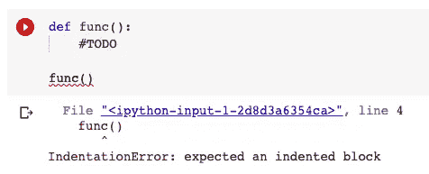
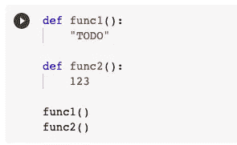
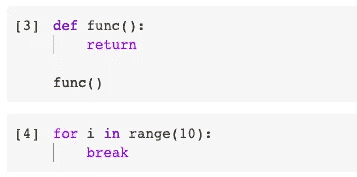

# 为什么 Python 需要“pass”语句

> 原文：<https://towardsdatascience.com/why-python-needs-the-pass-statement-30a4bdf87fa3?source=collection_archive---------33----------------------->


由 [Pixabay](https://pixabay.com/photos/the-side-of-the-road-snow-mountains-4259510/) 上的 [pasja1000](https://pixabay.com/users/pasja1000-6355831/) 拍摄

## 什么时候用“pass”？有其他选择吗？

对于像我这样从其他语言转向 Python 编程语言的人来说，经常会发现 Python 有一些非常独特的语句。“pass”语句就是其中之一，你很少能在其他编程语言中找到这样的东西。我一直在用 Java，C，C#，JavaScript，Objective-C，Swift，Scala 等等，没有一个有“通过”的语句。

其实“pass”语句在 Python 中是一个非常简单的表达式。在本文中，我将介绍这一独特语句的几个不同方面，包括它的用法、需要使用它的场景、使用它的好处、Python 需要它的原因以及潜在的替代方案。

# 定义


照片由[惊奇](https://pixabay.com/users/amazed-2609641/)在 [Pixabay](https://pixabay.com/get/54e5d2464355ae14f6d1867dda29327d1638dde7534c704f752c7bd6924cc35e_1920.jpg?attachment=) 拍摄

那么，Python 中的“pass”语句是什么呢？

一般来说，“通过”语句仅仅是一个**空操作**。具体来说，当它被执行时，什么都不会发生。

因此,“通过”语句通常在语法上用作**占位符****。当没有代码需要执行时，我们可以把“pass”语句放在那里。**

# **情节**

****

**由[sendocomun](https://pixabay.com/users/sentidocomun-208542/)在 [Pixabay](https://pixabay.com/photos/toys-kids-pieces-5-five-blocks-308176/) 上拍摄的照片**

**那么，我们可能或者需要使用“通过”语句的场景有哪些呢？事实上，它并不局限于在任何特定的场景中使用。然而，当然，到处放也没什么意义。所以，这里我总结了五种不同的典型场景。**

## **1.循环往复**

**“pass”语句可用于循环语句，如 for-loop。**

```
for i in range(10):
    pass
```

**或者 while 循环。**

```
while true:
    pass
```

**因此，我们不需要在循环中编写任何逻辑，因为“pass”语句充当占位符，不做任何事情。**

## **2.在 if-else 条件下**

**当我们定义一个 if-else 条件时，我们可以先决定条件，然后再考虑条件语句。**

```
if a == 2:
    pass
else:
    pass
```

## **3.在函数中**

**它也经常被用在一个函数中。**

```
def func(param):
    pass
```

**当我们想定义一个函数，但又想以后实现它时，我们可以使用“pass”语句。**

## **4.在一个班级**

**有时我们想创建一个类，但在以后实现它，如下所示。**

```
class Cat(Animal):
    passclass Dog(Animal):
    pass
```

**我们知道猫和狗是动物，所以我们想创建这些子类，并在以后实现它们。**

## **5.在 try-expect 子句中**

**这是“pass”语句的另一个常见用例。**

```
try:
    print(x)
except:
    pass
```

**在这种情况下，我们希望使用 try-except 语句，但是我们实际上并不关心异常是什么。所以，我们可以只使用“通过”语句。**

# **使用“通行证”的好处**

****

**由[绝对视觉](https://pixabay.com/users/absolutvision-6158753/)在 [Pixabay](https://pixabay.com/photos/smiley-emoticon-anger-angry-2979107/) 上拍摄的照片**

**我们已经谈了很多关于“通”的说法。然而，我们为什么需要使用它呢？换句话说，使用它有什么好处？**

**首先，虽然“pass”语句什么都不做，但它仍然可以像我们在其他编程语言中所做的那样使用— `//TODO`。注释和“pass”语句的主要区别之一是后者可以被大多数 IDE 工具着色，因为它是一个关键字。**

**此外，与一段将被完全忽略的注释不同，“pass”语句毕竟是有效的代码。它将被翻译识别。因此，它被迫遵循 Python 语法的缩进，并帮助构造完整的代码片段。**

# **Python 为什么需要“pass”？**

****

**由 [Bru-nO](https://pixabay.com/users/bru-no-1161770/) 在 [Pixabay](https://pixabay.com/photos/water-balance-tool-craft-build-2081191/) 上拍摄的照片**

**让我们尝试一个不使用“pass”语句的函数。**

****

**无论我们是否放置了`#TODO`注释，代码都无法执行，因为 Python 依赖于缩进而不是花括号`{}`。注释`#TODO`是缩进的，但是会被解释器忽略。因此，我们不得不使用“通过”语句。它是一段有效的代码，不会被解释器忽略，成为函数的主体。**

**让我们更进一步。如果我们只需要一段有效的代码，“pass”语句可能不是唯一的选择。例如，我们可以使用一个字符串或一个数字，但不需要将它们赋值给任何变量，如下所示。**

****

**这次我们通过了编译。**

**但是字符串和数字放在函数体中没有任何意义，非常明显的是“pass”语句更加整洁优雅。**

# **其他选择**

****

**[奇莫诺](https://pixabay.com/users/qimono-1962238/)在 [Pixabay](https://pixabay.com/photos/doors-choices-choose-decision-1767562/) 上的照片**

**确实有一些其他关键字可以实现与“通过”语句类似的结果，例如`return`、`yield`、`continue`和`break`。**

****

**为什么我们不用它们？**

**首先,“pass”语句永远不会改变代码执行的顺序，也不会在它自己的域中产生任何影响。所以，如果我们把它们用于同样的目的，这是最安全的选择。**

**也就是说，**

*   **`return`和`yield`将停止一个功能的执行**
*   **`break`将停止一个循环**
*   **`continue`将停止当前循环**

**除此之外，这些关键词并不一般化。它们只能在特定的场景下使用。**

*   **`return`和`yield`只能在一个函数中使用**
*   **`break`和`continue`只能在一个循环中使用**

**因此，尽管一些关键字可以用于相同的目的，但还是建议使用“pass”语句。**

# **摘要**

****

**照片由 [Engin_Akyurt](https://pixabay.com/users/engin_akyurt-3656355/) 在 [Pixabay](https://pixabay.com/photos/coffee-pen-notebook-caffeine-cup-2306471/) 上拍摄**

**在本文中，我介绍了 Python 中一种独特的语法，即“pass”语句。它是一段代表“空操作”的有效代码，通常在循环、函数、类等中用作占位符。使用它有几个好处，例如 IDE 会将它作为一个关键字。此外，Python 需要提供这样的关键字，因为它依赖缩进来定义函数的域等。因此，需要使用一段有效的代码作为占位符，而不是大多数其他编程语言中使用的“待办事项”注释。最后，虽然也有一些其他关键字如“返回”可以用来实现同样的事情，但它不够一般化，也没有“通过”语句那么整洁。**

**[](https://medium.com/@qiuyujx/membership) [## 通过我的推荐链接加入 Medium 克里斯托弗·陶

### 作为一个媒体会员，你的会员费的一部分会给你阅读的作家，你可以完全接触到每一个故事…

medium.com](https://medium.com/@qiuyujx/membership) 

如果你觉得我的文章有帮助，请考虑加入 Medium 会员来支持我和数以千计的其他作者！(点击上面的链接)**