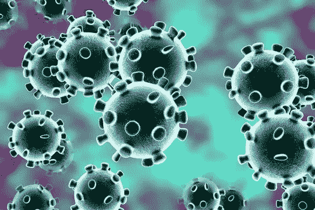
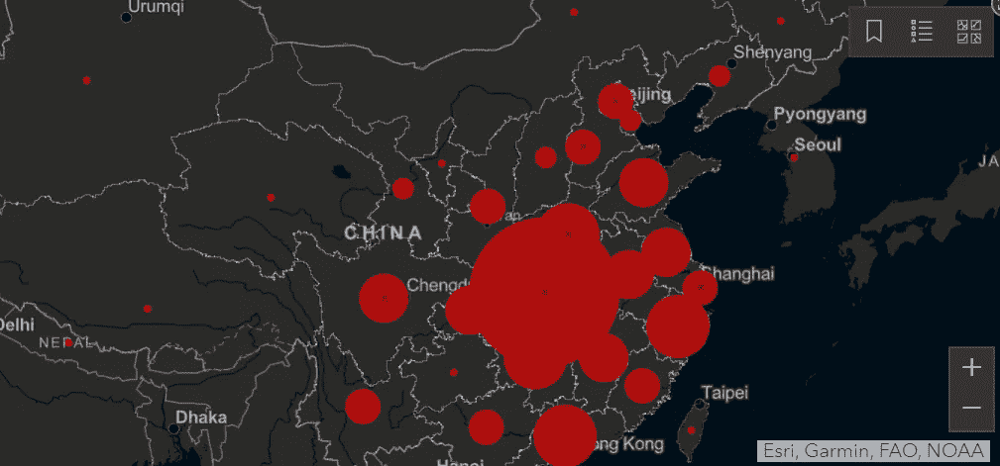
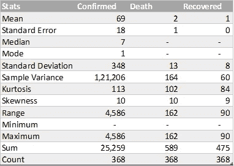
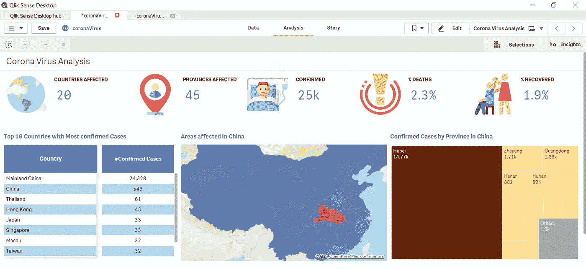
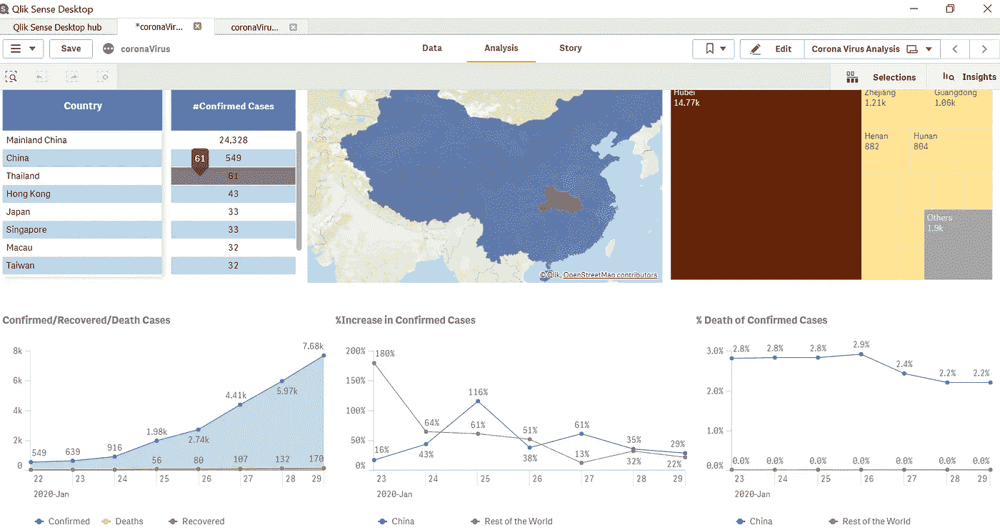

# 分析 2019-nCoV(冠状病毒)数据—为什么质量和感觉检查在数据科学中如此重要？

> 原文：<https://towardsdatascience.com/why-quality-sense-checks-are-so-important-in-data-science-7ef80da760c3?source=collection_archive---------16----------------------->

## 世界卫生组织和 Kaggle 的 2019-nCoV(冠状病毒)数据库如何用不同的影响数字讲述相同的故事..

图片来源:WebMD.com

“我 *真诚地为每一个中国人的安康祈祷。愿上帝给冠状病毒受害者和他们的家人足够的力量，让他们度过这段艰难的时光。请遵循* [*世卫组织网站*](https://www.who.int/emergencies/diseases/novel-coronavirus-2019/advice-for-public) *中概述的建议，以保持安全并受到保护*

# **世界卫生组织担心什么？(问题背景)**

*“冠状病毒(CoV)是一个大的病毒家族，可引起从普通感冒到更严重疾病的疾病，如* [*中东呼吸综合征(MERS-CoV)*](https://www.who.int/emergencies/mers-cov/en/) *和* [*严重急性呼吸综合征(SARS-CoV)*](https://www.who.int/csr/sars/en/) *。* [*一种新的冠状病毒(nCoV)*](https://www.who.int/emergencies/diseases/novel-coronavirus-2019) *是一种以前在人类中未被识别的新毒株*。关于始于中国武汉的冠状病毒爆发的消息变化很快。这种与 SARS 和 MERS 密切相关的呼吸道感染一直在中国蔓延，其他几个国家也诊断出了病例，包括美国、澳大利亚、日本等。”

 [## 新型冠状病毒(2019-nCoV)——世卫组织新型交互式、基于网络的冠状病毒在线培训…

### 世卫组织的在线训练是目前对抗冠状病毒爆发的最佳武器；涵盖检测方法…

medium.com](https://medium.com/@angeleastbengal/novel-coronavirus-2019-ncov-whos-new-interactive-web-based-online-training-for-coronavirus-d0865f0b47af) 

# 在哪里可以找到真实世界的信息？(数据来源)

[约翰·霍普斯金大学](https://gisanddata.maps.arcgis.com/apps/opsdashboard/index.html#/bda7594740fd40299423467b48e9ecf6)创建了一个在线仪表板来监控冠状病毒的当前情况，数据从同一链接中提取，并以 [csv 格式](https://www.kaggle.com/sudalairajkumar/novel-corona-virus-2019-dataset/data)提供。大部分数据收集自各种来源，包括 [**【世卫组织】**](https://www.who.int/emergencies/diseases/novel-coronavirus-2019/situation-reports)[**美国疾控中心**](https://www.cdc.gov/coronavirus/2019-ncov/index.html)**[**ECDC**](https://www.ecdc.europa.eu/en/home)中国疾控中心(**)[**NHC**](http://www.nhc.gov.cn/yjb/s3578/new_list.shtml)**和 [**DXY**](https://3g.dxy.cn/newh5/view/pneumonia?scene=2&clicktime=1579582238&enterid=1579582238&from=singlemessage&isappinstalled=0) 。DXY 是一个中文网站，几乎实时地汇总 NHC 和当地 CCDC 疫情报告，提供比国家一级报告组织所能提供的更多的当前区域病例估计，因此用于所有报告的 mainland China 病例(确诊、疑似、恢复、死亡)。美国病例(确诊、疑似、康复、死亡)取自美国疾病预防控制中心，所有其他国家(疑似和确诊)病例数据取自相应的地区卫生部门。 ***数据存在于国家、省&日期级别，包含约 368 条记录。*********

********

****图片来源:约翰·霍普斯金大学****

# ****我的数据来源可靠吗？(探索性数据分析)****

****分析领域中非常熟悉的术语，涉及构建摘要、检查数据重复、缺失值、关键绩效指标的分布。因为我们有大约 368 条记录，所以我在 Excel 中做了所有的数据验证。以下是我的发现:****

*   ****368 条记录中的 **~66 条记录**没有州/省信息****
*   ****19 在中国、Mainland China、马拉西亚、巴西等国家获得的记录没有确诊、死亡或恢复病例的信息****
*   ******“上次更新”**时间馈送不符合数据类型一致性，需要清理，特别是 2020 年 1 月 23 日馈送****
*   ****描述性统计— *由于病例大多局限于中国，观察到较高的标准差或方差。世界其他地方的事件非常少*****

********

****EDA —数据处理前的原始数据****

# ****我们有冠状病毒感染的风险吗？(调查结果)****

****迄今为止，这种风险仍主要局限在中国，然而，在美国和其他国家也发现了一些人际传播的病例。****

*******泰国、香港、日本、新加坡位居前列，但仅构成 1%的病例*** 。 ***确诊病例总数持续上升，但确诊病例的百分比增长至今没有显示出任何线性趋势，而死亡与确诊病例的比率保持平稳。*******

************

****为了监控实时更新，我创建了一个基于 QlikSense 的仪表盘，带有每日更新连接器，用于分析不同场景的数据。****

********

****数据截止到 2020 年 1 月 29 日；冠状病毒对全球的整体影响——特别是中国和 Mainland China****

********

****数据截止到 2020 年 1 月 29 日；增长率和死亡与确诊率——中国与世界其他地区****

# ****数据从不说谎！但是，我如何验证真相呢？(质量和感觉检查)****

****任何分析的最大挑战是验证我们报告的数字。通常，数据整理过程很繁琐，需要在数据被使用之前进行大量清理。清理涉及可能会使我们的结果产生偏差的近似和假设。代码错误、数据收集根中的无效信息、仪表板中的系统或后端问题通常可能代表不正确的数字。因此，10K 报告说，通过真实的来源和一点点谷歌搜索可以确保正确的输出。为了验证仪表板上的数字，我查阅了世卫组织网站上的[形势报告。以下是我的发现:](https://www.who.int/docs/default-source/coronaviruse/situation-reports/20200129-sitrep-9-ncov-v2.pdf?sfvrsn=e2c8915_2)****

1.  ****我的仪表板中报告了约 25000 例确诊病例，比世卫组织报告的高得多，约 17000 例(确诊+疑似+严重+死亡)****
2.  ****约 20 个国家& 45 个省至少有一例确诊病例，与世卫组织报告的 16 个国家一致****
3.  ****迄今为止，全球报告了约 2.3%的死亡病例和约 1.9%的康复病例****
4.  ****确诊病例的增长百分比没有显示任何线性/非线性趋势，随着时间的推移保持平稳，但有突然的峰值****

****作者简介:高级分析专家和管理顾问，帮助公司通过对组织数据的商业、技术和数学的组合找到各种问题的解决方案。一个数据科学爱好者，在这里分享、学习、贡献；你可以在[链接](https://www.linkedin.com/in/angel-das-9532bb12a/)上和我联系；****