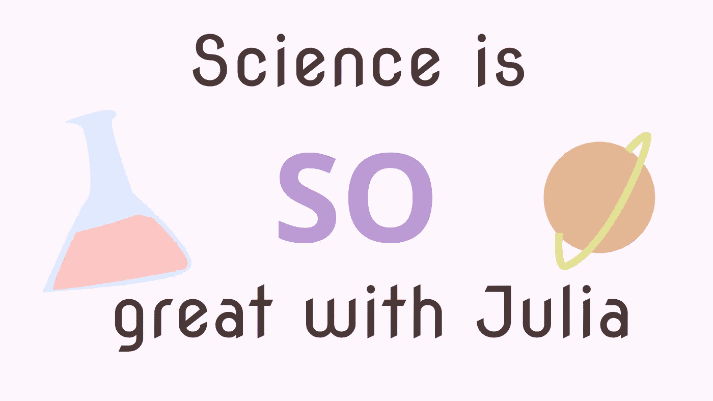

# 为什么科学计算对 Julia 如此重要

> 原文：<https://towardsdatascience.com/why-scientific-computing-is-so-great-with-julia-e8cc2eab6298?source=collection_archive---------24----------------------->

## 这种年轻的科学编程语言有什么了不起的？



(图片由作者提供)

# 介绍

在过去的十年里，科学计算的热潮越来越高涨，随之而来的是程序员在数学计算和数据处理方面有了更多的选择。有一种语言可能不如这个领域的其他语言流行，比如 Python 和 R，它是一种开源的、多范例的、非常动态的语言，叫做 Julia。

Julia 是一种语言，它不仅被创建用于一般用途的应用程序，而且非常适合科学计算和计算分析。虽然这本身意味着 Julia 可能比不是为做这些操作而构建的语言更适合这些应用程序，但该语言也有许多非常好的属性，这使它非常适合科学计算，而不仅仅是为了做这些而构建的。

# 速度

正如您可能已经预料到的，在科学和统计中使用 Julia 语言的第一个主要好处是速度。语言的速度是可靠的，一致的，最重要的是；可复制。Julia 代码不仅几乎和 C 编程语言一样快，而且写起来也快得令人难以置信。与 C 代码甚至 C++代码相比，编写 Julia 代码的一个巨大优势是，使用 Julia，您可以将方法用作模板。例如，在 C++中，我们可以获取任何类并对其进行子类化——本田思域是轿车，是汽车，是交通工具。在 Julia 中，我们可以对使用多态分派的方法应用同样的“模板化”策略。

所有这些结合在一起，就形成了一种语言，它可以像 C 一样科学地用于相同的应用程序，但它的编写速度和易用性更类似于 Python、Nimrod 或 JavaScript。对于常规的通用应用程序来说，这当然是非常强大的，但它在机器学习、数据分析和科学计算等应用程序中得到了进一步的证明。

# 句法

Julia 支持的另一件大事是语法表达式。这些允许您将公式归属于标识符，并创建使用参数执行算术的简单且传统的科学方法。当然，有很多地方需要用到这一点 dispatch 本身就是一种语法表达。然而，作为一个例子，我们可以做 f(x ),其中 f(x)等于 x 的阶乘:

```
f(x) = factorial(x)
```

虽然这不是 Julia 中的唯一例子，但我们可以通过类似 sigma 的东西更进一步:

```
∑(x) = sum(x)
```

当然，我们也可以在表达式中加入算术:

```
μ(x) = sum(x) / length(x)
```

# 浮点精度

去年，我写了一篇文章，预测 Julia 可能是 Scala 的绝佳替代品。我反对使用 Scala 的一个重要理由是缺乏浮点精度，这是任何 Java 后代编程语言都会继承的问题。Julia 可以处理大数据操作，比如 Scala，同时使用不同的类型，比如 BigInt 和 BigFloat，将浮点精度保留到精确的小数。这些测量在科学上非常重要，这取决于你在做什么；小数部分可能意味着有效假设和接受零假设之间的差异。

# 生态系统

茱莉亚最大的弱点之一就是年轻。当你的编程语言如此新的时候，它很难成为未来的编程语言。然而，尽管它相对年轻，Julia 已经有了很多很棒的科学应用软件包。其中一些包甚至可能没有其他语言的对应部分。

你想用神经网络做机器学习吗？你想做生物信息学，占星学，量子计算，最优化，还是统计绘图？Julia 有可以执行所有这些操作的软件包。虽然它们可能不像其他语言中的一些包那样成熟，但是它们在不断地被改进，并且您总是可以自己提交代码来推进项目。

# 动态打字

许多科学语言的目标通常是动态类型化和功能化。然而，Julia 将泛型带到了一个全新的层次，它允许语言既具有传统的不可变数据、结构和常量类型的功能，又具有面向对象的功能，可以同时编辑包含在构造类型中的数据。

Julia 不仅是动态类型的，而且这种语言本身在本质上也是非常动态的——它几乎可以做任何你想让它做的事情，只要通过使用多分派作为范例来建立你想要的数据存储和操作方式。

# 结论

有很多很好的理由让科学程序员尝试 Julia 编程语言。Julia 不仅编译快，编写和开发也超级快。这对于所有使用该语言的程序员来说都是一个巨大的优势，但对于需要不断调整函数以处理新数据并改变在工作中处理特定类型的方式的科学程序员来说，这可能更为重要。

此外，Julia 是一种令人难以置信的动态语言，具有多态调度和语法表达式，允许人们操纵该语言编写类似科学公式的内容。当然，这不仅对科学程序员来说是一件好事，对任何打算使用同一方法对几种不同类型执行多重操作的程序员来说也是如此。与许多竞争对手相比，Julia 在计算分析方面也相当准确，这使它领先于计算高浮点值有问题的语言。

最后，尽管 Julia 的生态系统还很年轻，许多软件包还没有完全成熟，但是目前软件包开发的水平是惊人的。有这么多不同的软件包可用于这么多不同的科学应用，而且随着时间的推移，这只会变得更好。

对于科学编程来说，Julia 确实正在发展成为一种未来使用的奇妙语言。