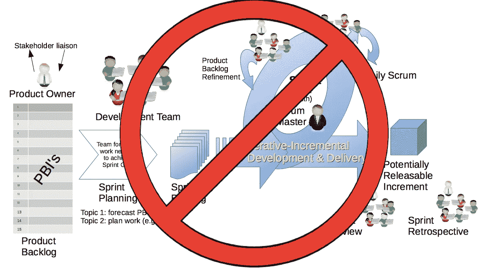

# 为什么 Scrum 对数据科学来说很糟糕

> 原文：<https://towardsdatascience.com/why-scrum-is-awful-for-data-science-db3e5c1bb3b4?source=collection_archive---------6----------------------->

## 越来越多的数据科学团队似乎在追赶 scrum 潮流，但这是个好主意吗？

Scrum 不适合大多数数据科学团队。[图片来源](https://commons.wikimedia.org/wiki/File:Scrum_Framework.png)

Scrum 是软件工程中一种流行的项目管理方法，最近这种趋势已经延伸到了数据科学。虽然 Scrum 在标准软件工程中的效用仍有争议，但在这里我将详细说明为什么它在数据科学(以及数据工程)中毫无疑问没有一席之地。这并不是说“敏捷”作为一个整体对数据科学有害，而是说 Scrum 的具体原则:冲刺、单一产品所有者、scrum master、每日站立(以及一连串的其他会议)不适合数据科学团队，并最终导致较差的产品。

**冲刺/估计**

Scrum 通常在两周的冲刺阶段优先创建“可交付成果”。虽然这在软件工程的某些领域可能很有效，但在数据科学领域却非常失败。数据科学本质上是一个科学过程，涉及研究、实验和分析。数据科学项目很难评估，因为很多时候他们要求团队做一些以前没有做过的事情。诚然，数据科学家可能在没有利用数据集或利用所需的特定技术之前就已经设计了类似的模型。这意味着在这个过程中有很多不确定性。像数据质量比预期的差、超参数调优的问题，和/或某项技术不起作用，都可能导致在 sprint 结束时“交付”失败。这意味着点估计通常不是毫无价值的，因为它们基于以前的项目，而这些项目通常与当前正在进行的项目没有相似之处。

此外，即使数据科学家“交付”了 sprint 所需的项目，在许多情况下，他们也可能牺牲了代码质量、模型健壮性或文档，以满足 sprint 的任意结束。我经常听到管理层正面描述两周冲刺中“更紧急”的好处。但是请记住，这种紧迫性也有缺点，主要是数据科学家更容易犯错误和忽略事情。

另一方面，我见过提前完成工作的数据科学家，他们因为害怕在 sprint 结束前无法完成新的故事而犹豫不决。因此，在下一次冲刺之前，他们只是闲坐几天。

但是我们不能分解这些大任务吗？Scrum 的支持者会争辩说，这里的问题不是 Scrum，而是需要更好地分解大任务(很可能需要额外的耗时整理会议)。然而，即使分解大任务也不能消除数据科学的不确定性。例如，像训练 XGBoost 模型和报告结果这样的任务，可能比单次 sprint 花费更长的时间，因为代码中缺少需要编码的值，或者根本不存在需要的数据。是的，这可以通过让之前的故事“探索数据集并填充缺失值”来解决，但是正如我将在第二部分描述的，大多数 PO 缺乏优先处理这些类型故事的专业知识，因为它不能立即完成交付。

**不断旋转**

与上述观点相关，Scrum 经常导致从一个项目到另一个项目的不断转换。的确，许多人认为旋转是一种“令人满意的”特性，然而这种方向的不断变化经常导致一事无成，有前途的项目被搁置，仅仅是因为它们没有产生直接的可交付成果。在数据科学领域尤其如此，许多项目需要在员工时间和资源上进行长期**投资。我见过很多次有前途的项目被终止，因为它们没有足够快地交付性能改进，或者产品所有者只是看到了一些更耀眼的东西，他们想专注于这些东西。**

**缺乏跨团队授粉**

Scrum 经常创造一个可怕的狭隘的焦点，只关注自己团队的冲刺门票，而排除其他一切。它阻碍了数据科学家(或任何人)为公司的其他计划做出贡献；他们的技能可能有所帮助的其他计划。它还倾向于推掉可能影响其他团队的重要问题，除非该团队与产品负责人直接接触。

**产品负责人(PO)的角色**

Scrum 的另一个关键问题是它将太多的权力放在了 PO 的手中。PO 通常负责积压工作，并确定哪些问题需要优先处理。然而，产品负责人通常对数据科学项目的技术细节了解不多。因此，诸如代码重构或模型性能的进一步分析等必要的工作经常被推到后面。此外，缺乏直接的“进展”可能会导致产品负责人完全离开项目。这并不是说数据科学家不应该定期与利益相关者沟通以确定票证的优先级，而是说，不是在所有会议上都有一个专门的产品负责人来决定任务的优先级，这对团队和产品本身的长期发展都是适得其反的。

**日常站立、梳洗和其他时间浪费**

我很少见过需要每天开会的团队。队友之间的交流很重要，但是，通常每周两次或三次就足够了。同样，应该鼓励队友在遇到困难或需要帮助时伸出援手。然而，每日站立通常除了微观管理员工之外什么都不做。

> 梳理(或细化)是 Scrum 团队的一次会议，会上讨论产品待办事项，并准备下一个冲刺计划。

梳理是另一个不必要浪费时间的环节。正如我上面提到的，数据科学中的技术复杂性通常意味着 sprint 的目标常常无法实现，或者只能达到很差的结果。这反过来经常导致更多的梳理会议(或我们过去称之为预梳理)的理由，以便“分解那些大问题”在永无止境的循环中，这些会议继续消耗越来越多的数据科学家的时间。

复古会议是我喜欢的少数几个 scrum 会议之一，然而，在这些会议上的建议通常不会被认真对待。例如，在我职业生涯中参加的几次 sprint 回顾会上，大多数队友都建议不要每天都站着说话，但是 scrum 主管和管理层对这些建议不予考虑，因为“那不是 scrum。”然而，相比之下，建议增加更多的梳理会议几乎总是毫无疑问地颁布。

**Scrum 大师**

另一个本质上无用的角色是 scrum master。scrum 大师的正式定义是:

> **scrum master** 是团队角色，负责确保团队遵循敏捷价值观和原则，并遵循团队同意使用的流程和实践。“-敏捷联盟

什么…？在实践中，scrum master 扮演了一个非技术性的忙人角色，他强迫团队成员参加前面提到的无意义的会议，拖着 JIRA 卡片到处走，同时宣扬 scrum 将如何带领你的团队走向救赎的准则(例如，每次冲刺交付更多的分数)。

**错误的二分法和不真实的 Scrum 论证**

最后，Scrum 的支持者经常在将 Scrum 与瀑布和其他旧的项目管理方法进行比较时制造一个稻草人。此外，在许多公司，管理层采取要么全有要么全无的方法。有可能采用 Scrum、敏捷或其他形式的项目管理，而不完全遵循它们。例如，你可以在没有产品负责人、sprints 或 scrum 大师的情况下，利用像故事、史诗等想法。

我经常看到的另一个普遍趋势是人们说“你所经历的不是真正的 Scrum，等等等等实际上是瀑布。如果你有一个更好的产品负责人就好了……”这没有意识到 Scrum 作为一个系统滋生了这些类型的问题。委派一个单一的角色作为产品所有者必然会引起问题。当然，你可以有一个特别好的 PO，他有多年的 DS 经验或了解团队，但这可能不会发生。此外，冲刺的核心是鼓励在任意决定的持续时间结束时疯狂冲刺，以满足“承诺”。它还从根本上假设所有的功**都可以被具体估计。Scrum 可能在软件工程领域工作，在那里有非常好定义的问题，这些问题仅仅是微小的变化(尽管即使这样，你也有 POs 和 Scrum masters 的问题)。然而，当存在任何不确定性时(比如在数据科学、数据工程和 Devops 中)，Scrum 就会崩溃，导致时间和资源的浪费。**

**你应该用什么来代替？**

这就引出了一个核心问题:你应该如何管理一个数据科学团队。没有单一的答案。我发现有一种基于看板的方法很有效，它没有产品负责人，但是与利益相关者定期讨论(每周或每隔一周)。此外，在制品限制似乎有助于简化流程。就像我上面提到的，一周两次会议(周二/周五)或者其他方式通常都很有效。

然而，这种方法并不适用于所有的团队。这就是为什么，特别是对于数据科学，我建议尝试许多不同的方法来确定什么对您的团队有效。关键是找到一个适合你的团队和利益相关者的系统，而不是一个仅仅迎合上层管理人员关于数据科学家团队应该如何运作的想法的系统。

**附加链接**

[Reddit 上关于数据科学 Scrum 的讨论](https://www.reddit.com/r/datascience/comments/gvlcie/agilescum_is_the_worst/)

[Quora 问答](https://www.quora.com/Do-you-use-scrum-as-a-data-scientist)