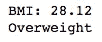
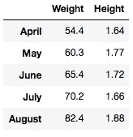
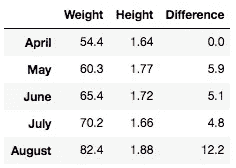
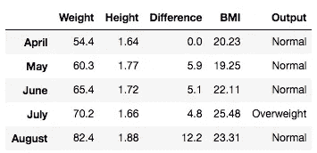
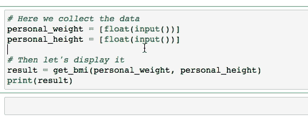

# 数据科学家为什么要用函数？

> 原文：<https://towardsdatascience.com/why-should-data-scientists-use-functions-67cbbf932a99?source=collection_archive---------52----------------------->

## 让我们看看为什么必须将代码包装在函数中。

# 重要的事情先来

在开始学习数据科学之前，我就已经是一名软件工程师了。在过去的几年里，它让我理解了一个问题，通常初学者不会理解这个问题:**用函数**将代码分解成块。

过去几年，数据科学领域受到了大肆宣传，允许它以指数速度增长；随着互联网的出现，现在学习者可以简单地去 YouTube 或 Medium，开始理解和应用一切。

现在，让我们一起来看看这些标准方法之间的主要区别。

由[格伦·卡斯滕斯-彼得斯](https://unsplash.com/@glenncarstenspeters?utm_source=medium&utm_medium=referral)在 [Unsplash](https://unsplash.com?utm_source=medium&utm_medium=referral) 上拍摄的照片

# 我们学习的方式

我不知道你的学习过程，但在我的数据科学课程中，我遇到了一个问题:为了以更简单的方式传递内容，我们的老师通常倾向于避免复杂的事情；如果这会使以后的解释变得非常困难，他们为什么要把代码包装在函数中呢？

我记得，在我的一堂课上，我的老师说了以下的话:

> “还记得上节课我们要写的函数吗？没用的，其实是我的错；但我们不会在那上面浪费时间，只要写下面的代码就行了……”

这才是真正的错误！我们没有重写函数，解决问题，让我们知道它是如何工作的，以及函数有多大的好处，而是被教导要避免这样做，仅仅因为一行代码就可以破坏整个项目。他仅仅因为一个问题就忽略了功能系统的整体能力。

# 使用最简单的方法

今天，我们将深入了解函数的重要性；为了简单起见，我们用一个简单的例子:**发现一个人的身体质量指数。**我们将使用公制版本，因此公式如下:

> **体重(公斤)/(身高(米)* 2)**

图片由雷南·洛里科拍摄——中号

这里，我们使用了一种使用两个“野蛮”数字的方法；这真的很容易做到，对不对？你只需要访问这两个数字，然后把结果插入到新的变量中，真的令人印象深刻。

您可以通过将固定数字转换为变量来增加一些抽象层次，这样我们可以通过简单地修改这个变量来轻松地将数字转换为总和，让我们来看看:

这对初学者来说是一种令人印象深刻的方式，但是让我们检查一下主要问题:**修改**。现在我们有了一个重量和高度的列表来测量身体质量指数，我们需要将代码包装在一个循环中…一些问题开始出现了。

这里有一些问题，让我们列举一下:

1.  这里我只是打印输出，但是假设您需要将结果存储在一个变量上，或者更糟，应用一些修改；一个循环变得越重，我们需要花在它上面的时间就越多；
2.  众所周知，随着时间的推移，代码变得陈旧，需要进行一些改进；假设在未来的某个时刻，你的公司决定为超重的人制作额外的标签，你会怎么做？

# 将数据包装在函数中

我想，现在你开始明白函数对每个人有多重要，但对我们这些数据科学家来说，它变成了处理数据的琐碎部分；

现在让我们修改一下上下文:假设我们已经从一个随机的人那里收集了五个月的身体质量指数结果，并且需要给出不同的建议。首先，让我们看一下数据集。

图片由雷南·洛里科拍摄——中号

正如你可以检查以上没有什么特别的，对不对？只是数据框架上的数据，非常简单；但是 [**特色工程**](/the-difference-between-feature-transformation-engineering-and-selection-b3e5d85b4b0b) 怎么样？你如何从数据中获得重要的洞察力？忠告:没有功能，真的很辛苦；正如我之前说过的，函数是数据科学家日常工作中微不足道的一部分，你需要使用它。让我们验证一个与我们的上下文非常匹配的函数:

哇哦。那是什么？冷静下来，先在功能上准确的看一下，没什么难懂的，只是实际体重和过去一个月的差异；现在，我们的数据框架看起来像这样:

哎呀！我忘了去掉身高一栏，这样才有意义……忽略它——雷南·罗利科

# **在数据帧上追加身体质量指数**

还记得我们在本文开始时在循环中添加的代码吗？在处理真正的数据科学项目时，它不是真正抽象的？我们来看看它的功能版本:

正如你所看到的，现在我们能够以一种简单的方式使用特性工程，编写可重用的代码；一天结束时，我们的数据框架看起来像这样:

最后三列是使用函数——雷南·洛里科创建的

# 奖金

有了这个函数，现在我们能够毫无问题地处理未来的数据；你可以随时调用它来预测任何人的身体质量指数，换句话说，现在你可以不用担心所谓的样板文件了。看看下面的 gif:

作者:雷南·洛里科——中号

# 别忘了

你浪费在重写代码上的时间越多，你在真正重要的事情上投入的精力就越少；重用代码！数据科学领域的大数据工作，这意味着每一秒钟都取决于性能。

# 就这样，伙计们！

我希望你喜欢这个内容，并能熟练运用你的新知识！如果你想每天都学习有趣的东西，我很乐意与你分享精彩的内容！

另外，你可以在 Github 上查看我的个人资料。所有的关键概念都可以学习和重用！

 [## 雷南·洛利科-吉图布

### UI/UX 设计师。夜间跨平台开发者。还有，我讲数据科学和人工智能。解散…

www.github.com](https://www.github.com/renfelo)