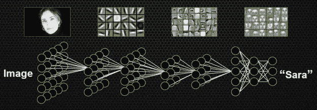
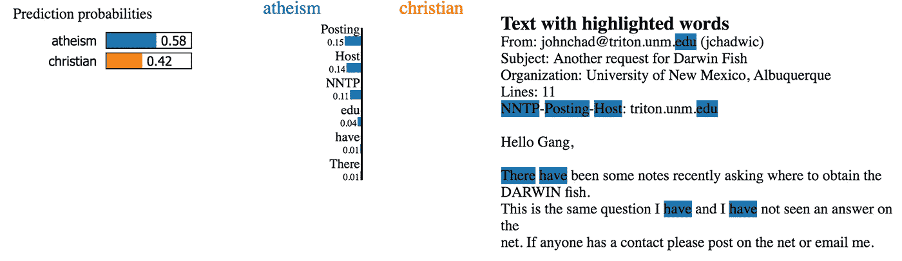
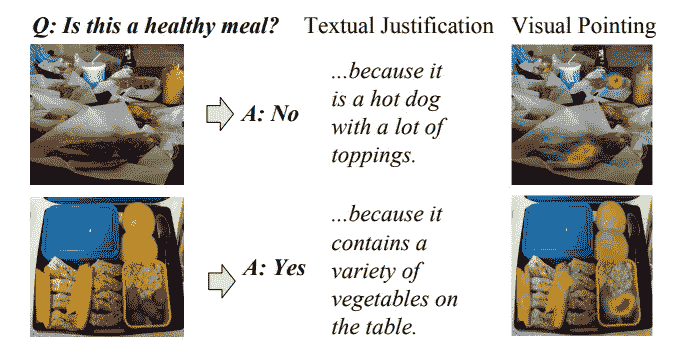

# 我为什么要信任一个人工智能系统？

> 原文：<https://towardsdatascience.com/why-should-i-trust-an-ai-system-6f06a28b163d?source=collection_archive---------36----------------------->

## 你如何区分人工智能系统的可解释性、可解释性和透明性？这些术语和信任有什么关系？

伯纳德·赫曼特在 [Unsplash](https://unsplash.com/s/photos/trust?utm_source=unsplash&utm_medium=referral&utm_content=creditCopyText) 上的照片

在过去的几年里，人工智能系统已经变得无处不在，并越来越多地影响着我们的日常生活。使用搜索引擎，跟随电影推荐或拍照被强大的新算法修正。这些算法也是[决定我的信用度](https://www.wired.com/story/the-apple-card-didnt-see-genderand-thats-the-problem/)，我获得医疗保健的机会，甚至我是否必须[进监狱](https://www.propublica.org/article/machine-bias-risk-assessments-in-criminal-sentencing)。虽然这些算法正越来越多地影响我们与世界互动的方式以及我们被视为公民的方式，但我们可能想提出一个问题，即我们是否应该信任这些系统。

在过去，科学发明要经过几个阶段才能得到值得信赖的产品。例如，玛丽·居里(Marie Curie)或威廉·伦琴(Wilhelm Rö ntgen)等科学家对放射性元素和一般辐射进行了实验，并取得了突破性的发现。像莱特兄弟这样的早期飞机先驱在奥托·李林塔尔这样的工程师的工作基础上开发了第一架飞行器，这些工程师研究了空气动力学的基本原理，帮助我们了解如何开发飞行器。在人们信任产品之前，商业应用中的安全使用(如 x 光或商用飞机)通常需要长达十年的实验和法规的引入。人工智能系统似乎大多跳过了这一重要的开发步骤，但越来越多的人询问人工智能系统和隐含偏见、隐私或安全问题。

幸运的是，在过去的几年里，人们一直在热烈讨论如何让人工智能系统更加值得信赖，答案往往是它们必须更加透明。然而，在人工智能系统的环境中，透明意味着什么？我们希望每一行代码都是开源的吗？非专家真的能理解像卷积神经网络(CNN)和变压器这样的算法是做什么的吗？机器学习专家能否解释主要的神经网络技术是做什么的，以及这些系统是如何做出决定的？

在这篇文章中，我想探讨三个术语，它们将帮助消费者、人工智能开发者和人工智能系统提供商在人工智能系统所做的事情中灌输信任。我想提供三个不同的术语的清晰定义:(1)可解释性，(2)可解释性，以及(3)透明性。它们都通过另一个重要的概念联系在一起:信任。

# 可解释性

当人工智能工程师使用监督机器学习方法时，她基于训练数据创建 ML 模型。为了改进模型，已经开发了特征工程技术来选择最具预测性的特征。自从深度学习出现以来，这一步经常被忽略，因为网络中的隐藏层通常可以被视为肩负着特征工程任务的工作。例如，卷积神经网络的不同层可以通过学习如何识别图片的部分，如边缘、形状或甚至片段(如人脸的部分)，来识别视觉识别任务的重要特征。

不同的层关注不同的特性(来自:[https://developer . NVIDIA . com/discover/artificial-neural-network](https://developer.nvidia.com/discover/artificial-neural-network))

然而，ML 模型的工程师可能不会检查这些层，而只是简单地运行网络，而不能解释网络实际学到了什么。这可能会导致不可预见的后果，正如 [Sameer Singh](http://sameersingh.org/) 和他的同事们的工作所显示的。他们研究了似乎为给定任务(例如，文本分类、视觉识别)提供高准确度的分类器，但是分类器可能没有出于正确的原因而学习了决策边界。如果某个特定特征恰好与分类器必须学习的类别高度相关，就会发生这种情况。这样的模型会做出正确的预测，但不能很好地概括。

例如，关于不同流行主题的帖子的文本分类系统可以包含写帖子的人的姓名。如果有一个非常多产的作家总是写同一个主题，这个名字可能会成为这个特定类别的一个很好的预测。然而，一旦作者选择了不同的主题，这个模型就会失效。由于使用模型作为黑盒的这种缺陷， [Singh 等人](http://sameersingh.org/files/papers/lime-kdd16.pdf)发明了一种称为局部可解释模型不可知解释(LIME)的系统，该系统允许 ML 模型开发者更仔细地查看用于具体示例分类的特征。

LIME 是一个与模型无关的工具，用于解释分类器针对给定示例做出的决策。该工具允许开发人员通过局部近似黑盒模型来检查为什么一个文本被标记为某种方式。它关闭实例的某些部分(例如，使图片的某些部分变灰或省略文字)。然后，LIME 基于这些所谓的扰动实例创建了一个简单的回归模型。线性模型更容易解释，因为你可以很快看出哪些变量具有很高的权重。

为错误的原因预测正确的话题(来源:[)https://www . oreilly . com/content/introduction-to-local-interpretable-model-agnostic-explaining-lime/](https://www.oreilly.com/content/introduction-to-local-interpretable-model-agnostic-explanations-lime/)

来自 [20 个新闻组数据集](http://qwone.com/~jason/20Newsgroups/)的给定文本分类示例显示了单词 *posting* 如何对这篇文章的正确分类产生重大影响。然而，令牌*帖子*出现在电子邮件标题中，实际上与帖子中讨论的主题无关，分类器突然变得不太可信。

Singh 等人还对受试者进行了一些实验，对他们是否信任分类器的结果进行评级。他们为 20 新闻组任务创建了两个分类器:一个使用所有的标记，包括误导性的标记，如*发帖*，另一个使用一组干净的标记，以确保分类器更好地泛化。使用 Mechanical Turk，他们询问非人工智能专家，在给定 LIME 生成的解释的情况下，他们更信任哪个分类器。他们发现，受试者能够根据石灰产生的描述来区分分类器。

如果特性名称是描述性的，并且能够以易于用户使用的形式呈现给用户，那么 LIME 创建了可理解的描述。作者使用解释这一术语，因为即使对于机器学习的非专家来说，图片片段或文字也是可以理解的。然而，如果特征需要语言学专家知识(解析树的 [c-command](https://en.wikipedia.org/wiki/C-command) )或特定领域知识，那么将更难以将 LIME 的输出作为解释呈现给 AI 系统的用户。

因为 LIME 的输出与机器学习算法使用的特征密切相关，LIME 的描述对 ML 工程师很有用，可以更好地解释她正在开发的模型的内部工作方式(有关类似模型的相当全面的概述，请参见 [DipanjanSarkar 的](https://towardsdatascience.com/@dipanzan.sarkar) [文章](/human-interpretable-machine-learning-part-1-the-need-and-importance-of-model-interpretation-2ed758f5f476))。人工智能系统的用户也可能从这些描述中受益，但它仍然缺乏对模型为什么选择某个标签的解释。LIME 或类似系统没有提供自然语言描述来证明标签的选择是正确的。

# **可解释性**

诚然，可解释人工智能的方法经常与简单解释 ML 模型工作方式的方法重叠，决策树等方法经常被用作可解释人工智能的标准例子。我对可解释性的定义更加严格，可能超出了当前方法所能提供的范围，但我认为可解释性需要基于自然语言描述，就像人类在人工智能系统给出自动生成的摘要、分类结果或问题答案时会提供的那样。

各种各样的研究项目正在解决这样一个问题，即如何向用户提供对人工智能系统的更好的解释。在 DARPA 资助的名为可解释的人工智能(XAI)的项目下，人们可以找到几个研究如何更好地解释用户在查看 ML 算法输出时可能产生的问题的倡议。这些答案通常对军事和安全应用至关重要，对监控运输、支持医疗应用或法律研究的系统也是如此。

吉尔平等人(2018) 最近对可解释性方法的文献综述总结了以前的方法，分为三类:(1)处理，(2)表征，(3)解释产生。类别处理和表示包括代理方法，如 LIME，但也包括决策树，以及对神经元层在神经网络中所起作用的分析，类似于我所说的可解释性。第三类工作包含脚本对话或基于注意力的方法来自动产生解释。

当前的解释生成方法通常集中在多模态系统上，如生成解释和识别图片中用于活动识别任务(ACT-X)和视觉问题回答任务(VQA-X)的区域。 [Huk Park et al. (2018)](http://openaccess.thecvf.com/content_cvpr_2018/html/Park_Multimodal_Explanations_Justifying_CVPR_2018_paper.html) 例如，开发了生成口头辩护和突出显示用于视觉识别任务的图片中的区域的方法。

Huk Park 等人(2018 年)开发了一个提供多模态解释的指向和调整模型

生成叙事是向不一定是 ML 专家的用户解释模型输出的第一步。人工智能系统的用户应该能够向系统提问，以便真正地与输出进行交互。特别是，询问为什么问题和反事实对于使人工智能系统对用户更加透明很重要。

# 透明度

AI 系统提供商主要负责让 AI 系统更加透明。透明度是增加对人工智能系统信任的另一种方式，因为它允许用户“看引擎盖下”。然而，这并不意味着每个系统都需要开源或者训练数据必须公开。尽管学术界强烈推动这样做，但想要销售基于人工智能系统的产品的公司无法做到这一点。

然而，公司可以通过识别人工智能系统的开发使用了哪些数据源，通过合并结果显示的置信区间来显示更多的透明度(即，我 97%确定这张照片显示的是一个苹果)。当他们提供图像识别或文本分类等服务时，他们还应该根据他们如何处理来自少数群体的数据或预期的输入格式来确定能力的界限。

由[凯特·克劳福德](https://www.katecrawford.net/)和[特雷弗·帕格伦](http://paglen.com/)从[挖掘人工智能](https://www.excavating.ai/)的图像

米切尔等人的作品。指出在交付基于人工智能的系统时包括模型卡。模型卡记录了用户、软件开发人员、政策制定者以及受影响的个人可能遇到的一系列重要问题。该列表包括以下一些问题:

*   你能提供模型的基本信息吗？(模型是谁开发的？用了什么算法？目前使用的是哪个版本？什么时候训练的？)
*   预期用途是什么？(主要的预期用途和用户是什么？哪些用法超出范围？)
*   使用了哪些指标？(报告了哪些模型性能指标，为什么？如果使用决策阈值，它们是什么，为什么？)
*   该模型的伦理含义是什么？(例如，模型是否使用任何敏感数据(例如，受保护的类)？模型使用中可能存在哪些风险？)

其他行业在遵循通常通过运营和安全审计强制执行的法规方面付出了大量努力。例如，航空业受到严格管制，以确保飞机安全运行。新药的开发受到临床试验几个阶段的指导。心理学中的人体实验需要得到机构审查委员会的批准，以确保参与者不会受到任何伤害。

主动描述人工智能系统的数据集、方法和限制，对于向科技公司目前正在开发的此类系统灌输信任至关重要。更具体地说，解释可以帮助用户更好地理解机器学习模型为什么做出特定的决定，而增加模型的可解释性的方法可以帮助模型开发者产生更好的模型。

# 相信我！

人工智能系统的发展已经达到了历史上的一个关键时刻，就像炼金术变成了化学，或者第一架飞行器变成了商用飞机。与描述空气动力学的周期系统和数学方法类似，AI 正在快速开发数学方法，以驱动越来越多的高级系统的进一步开发。在人工智能系统中加强可解释性、可解释性和透明度将增加对人工智能系统的整体信任，类似于安全设备和法规如何导致更安全的化学产品和飞机。