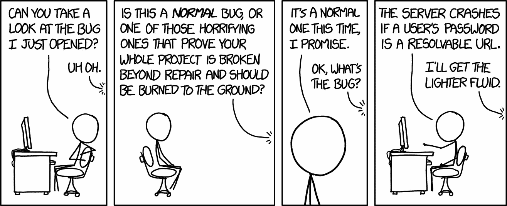
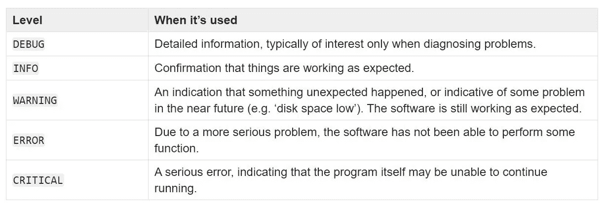
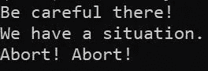
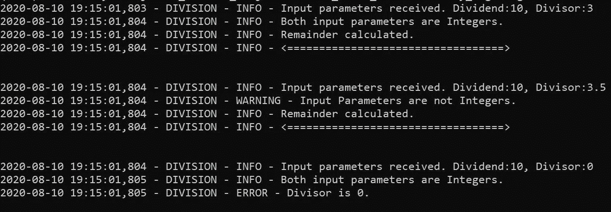

# 为什么您应该关心日志记录？

> 原文：<https://towardsdatascience.com/why-should-you-care-about-logging-442a195b80a1?source=collection_archive---------23----------------------->

## 从 Python 初学者提升到中级


由 [Ales Krivec](https://unsplash.com/@aleskrivec?utm_source=medium&utm_medium=referral) 在 [Unsplash](https://unsplash.com?utm_source=medium&utm_medium=referral) 上拍摄的照片

作为一个初学者，我们经常发现我们更倾向于写代码来完成工作，而不是如何完成工作。很少考虑整体应用程序的设计和应该遵循的最佳实践。虽然这对初学者来说没问题，但随着我们在编程之旅中不断前进，在将代码投入生产之前，我们还需要考虑应用程序的其他方面。正确的日志记录是将中级或高级开发人员与新手区分开来的一个方面。在本文中，我们将学习 Python 的'***L***[***ogging***'](https://docs.python.org/3/library/logging.html)模块的基础知识。值得注意的是，尽管我们展示的是 Python 示例，但整体概念并不仅限于 Python，还可以应用于其他语言。

# 伐木及其重要性

作为 noobs，我们总是使用强大的 *print()* 函数在控制台中打印东西，也许是为了调试或显示中间变量和输出值。这在编码阶段很好，但是当你的应用程序在生产环境中运行时，它们需要适当的跟踪监控。日志记录是在应用程序执行不同任务或事件时提供有关应用程序信息的过程。日志记录提供了以下好处:

**问题诊断:**假设用户报告了一个 bug，您想要在您的开发环境中复制这个场景。现在，如果您已经在日志文件中记录了用户活动，那么引用这些日志并在非生产环境中复制它以供进一步分析可能会更容易。



bugs——作者 [Xkcd](https://xkcd.com/1700/)

**分析:**通过分析网站日志，人们可以获得更多关于网站高峰时间的信息，或者流量来自哪个地区，或者用户在特定页面上花了多少时间等等。通过在日志文件中记录更多数据，您可以进一步分析用户行为，这可能会改善用户的整体体验。


大学网站—作者 [Xkcd](https://xkcd.com/773/)

# 我应该在日志中包含什么？

要记录的信息是主观的，取决于特定应用程序的上下文。但是，建议至少包括以下信息:

*时:记录事件的时间戳
*谁*:应用名或用户名
*其中*:事件的上下文(登录模块、文件上传模块等。)
*What* :活动类型或错误类别(数据库错误、文件 I/O 等。)*

*切记不要在日志中包含任何敏感信息。*

# *日志记录级别*

*Python 为此提供了一个内置模块，我们将在下面探讨。在进入代码之前，让我们看看这个包提供的不同级别的日志记录。“*日志记录级别*”主要讨论我们的日志中包含的信息类型。有 5 个这样的级别:*

**

*来源:Python 官方[文档](https://docs.python.org/3/howto/logging.html)*

*根据我们的具体需求，我们可以选择一个或多个日志记录级别。它们都有一个与之相关联的数值。通常，我们选择这些级别中的一个，大于或等于所选日志级别的所有其他级别都会被捕获到我们的日志文件中。让我们借助一个例子来看看这一点。*

**

*来源:Python 官方[文档](https://docs.python.org/3/library/logging.html#logging-levels)*

*在下面的代码片段中，在第 1–7 行之间，我们正在导入 python ***日志*** 模块，创建一个名为“ *MY_FIRST_logger* ”的 LOGGER 对象，并将日志记录级别设置为“ ***警告*** ”。这告诉程序不要捕获低于“警告”级别的日志(即调试&信息)。*

*从第 9–13 行开始，我们简单地指定了一个文件处理程序，并将其附加到我们的 logger 对象上。*

*在第 15–19 行，我们向上面列出的所有不同的日志记录级别发送消息。*

*运行这段代码后，让我们看看日志文件(my_log1.log)的内容。如下所示，它只打印“警告”及以上级别的记录。如果我们将日志记录级别设置为“DEBUG ”,那么所有的行都会出现在日志文件中。*

**

*my_log1.log 文件的内容(来源:作者)*

*可以使用参数 logger.level 检查记录器的当前级别。*

```
***print(logger.level)
30***
```

*接下来，让我们将这个 logger 函数添加到一个执行两个整数的*除法并返回余数*的程序中。我们还将在日志记录中添加更多信息，如时间戳、上下文等。这里使用的日志记录只是为了说明，可能不一定相关。在异常捕获块中添加这些日志命令是一种常见的做法，这样可以使日志更加全面。*

*函数“division”用不同的参数调用了 3 次。让我们检查一下日志文件在执行后的样子。*

**

*my_log2.log 文件的内容(来源:作者)*

*如上所述，由于除数为零，对该函数的第三次调用导致了一个 *ZeroDivisionError* 错误。查看日志，我们可以知道程序未能完全执行(因为计算了“余数”因故障未打印)。但是，因为我们在日志文件中记录了输入参数，所以我们可以从一个合理的起点来判断是什么导致了这个问题，并从那里开始着手。很明显这是一个过于简化的问题，但是对于一个有几十种方法的更复杂的应用程序，这是我们必须考虑的。*

*现在，我们可以根据我们的具体需求选择一个或多个上述级别，并且基于所选的日志记录级别，它们将显示在日志文件中。通常在生产中，它被设置为 info 及以上。*

*在结论中，我们探讨了在我们的开发过程中使用日志模块背后的动机。我们还浏览了不同级别的日志记录，以及如何在 Python 代码中实现它们。*

*非常感谢您的阅读，我希望这篇文章能让您对在您的下一个项目中使用 loggers 有一个基本的了解和认识。*

*您可能还喜欢:*

*[](/face-detection-in-10-lines-for-beginners-1787aa1d9127) [## 面向初学者的 10 行人脸检测

### 使用 Python OpenCV 在图像和视频中检测人脸的介绍。

towardsdatascience.com](/face-detection-in-10-lines-for-beginners-1787aa1d9127) [](/add-animated-charts-to-your-dashboards-with-streamlit-python-f41863f1ef7c) [## 使用 Streamlit-Python 向您的仪表盘添加动画图表

### 利用 ATP 网球排名数据对比网球四大

towardsdatascience.com](/add-animated-charts-to-your-dashboards-with-streamlit-python-f41863f1ef7c) 

## 参考资料和进一步阅读:

[](https://docs.python.org/3/howto/logging.html) [## 日志 HOWTO - Python 3.8.5 文档

### 日志记录是跟踪某些软件运行时发生的事件的一种方式。该软件的开发人员添加了日志调用…

docs.python.org](https://docs.python.org/3/howto/logging.html)*