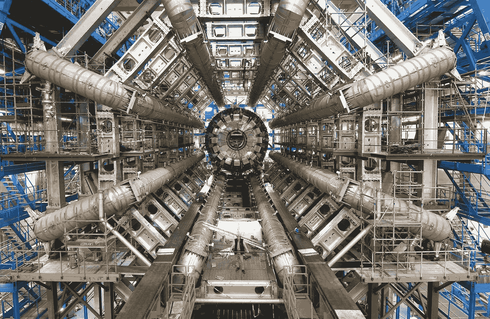

# 为什么要关心粒子物理？

> 原文：<https://towardsdatascience.com/why-should-you-care-about-particle-physics-c7770d684ed?source=collection_archive---------27----------------------->

## 从万维网到尖端人工智能，没有它我们将一事无成

阿特拉斯粒子探测器。欧洲核子研究中心提供

  W 惶然坐在火车上，前往工作。我正在研究一篇研究论文，而你却在上下打量我。

“你为什么会成为粒子物理学家？”

“因为我喜欢，”我直截了当地回答。

是的，但是——你的工作是由政府资助的。“所以很明显，你所做的事情应该会引起公众的兴趣，”

是的，当然。科学总是公众感兴趣的。这是因为对世界如何运转感到好奇是人类的天性。科学是找到答案的最佳途径，”

当然，但是我们不应该用科学来解决更大的问题吗？还有比搞笑小颗粒更重要的东西！癌症、人道主义危机、战争……

> 今天的科学是明天的技术

“你是对的，”我承认。当然，这些问题更为紧迫，我们绝对应该资助科学家和组织去解决它们。

但是我们也应该资助粒子物理学家。想想看:爱因斯坦在一个多世纪前发表了他的相对论。然而，如果没有它，我们今天就不会有 GPS，”

真的吗？我不知道。“这是为什么，”

嗯，全球定位系统和绕地球轨道运行的卫星一起工作。你在地球上的位置是根据这些卫星到你的设备的距离计算出来的。但是你需要考虑到它们绕地球运行的速度非常快。爱因斯坦的理论预测，对于快速移动的物体，时间会走得快一点。如果我们不考虑这一点，全球定位系统会非常不准确，你几乎无法使用它。

 [## 为什么没有广义相对论 GPS 就不能工作

### GPS 就像太空中的大钟！而且它的时间跑得比我们快……大英百科全书解释了它是如何工作的。

www.britannica.com](https://www.britannica.com/video/185396/GPS-satellites-relativity) 

哦，哇。所以，如果政府没有资助爱因斯坦做他的理论，我们还会在没有现在位置的情况下使用地图吗？

事实上，无论如何你都会有全球定位系统。爱因斯坦是一个例外——他在做专利律师的时候，利用业余时间进行物理研究。他没有得到任何发展自己理论的资金。

看到了吗？“你已经过时了！”你脱口而出，脸上带着羞怯的笑容。

哦，不！没有粒子物理学的资助，我们就不会有万维网。

“什么？”

你没听错。万维网是由欧洲粒子物理研究所的粒子物理学家发明的。

 [## 网络简史| CERN

### 万维网的起源，以及它的发明者蒂姆·伯纳斯·李的最初提议

home.cern](https://home.cern/science/computing/birth-web/short-history-web) 

那些家伙一定是天才。“但是他们为什么不专注于他们的粒子呢？”

“你看，”我开始说道，“在欧洲粒子物理研究所，每年都会产生大量的数据。许多研究人员只在欧洲粒子物理研究所呆一两年，然后继续在他们自己的实验室从事他们的项目。因此，科学家们开发了一个系统，可以从任何地方获取信息。瞧，万维网诞生了！

哇哦。“我不知道。”

没有粒子物理学家的贡献，今天的互联网将是不可想象的。克里斯蒂娜@ wocintechchat.com 在 [Unsplash](https://unsplash.com/s/photos/world-wide-web?utm_source=unsplash&utm_medium=referral&utm_content=creditCopyText) 上的照片

我微笑。是的，如果三十年前没有发生这种事情，今天的世界可能会是一个非常不同的地方。

好的，但那是不久前的事了。那么为什么今天人们还在那里工作呢？“我们不是在浪费钱吗，”

嗯，首先，我们对基本粒子还是很好奇的。这是主要的动机。[希格斯玻色子](https://arxiv.org/abs/1207.7214) [已经被发现](https://arxiv.org/abs/1207.7235)，但是仍然有很多我们想要解开的谜团。

另外，这个叫做万维网的粒子物理学工具得到了广泛的应用。CERN 内部和周围不断开发新的工具。为什么这些不能对公众有用呢？

“那会是什么样的工具，”

比如机器学习和人工智能。粒子物理学家是这些技术的最早开发者和采用者之一。他们帮助理解他们收集的大量数据。

 [## AI 你准备好了吗？数据驱动投资者的 Rhea Moutafis

### 正如我们今天所知，人工智能正在改变生活

medium.com](https://medium.com/datadriveninvestor/are-you-ready-for-ai-5301640e6c0d) 

这么说，粒子物理学是一门包含大量数据的科学？

没错。这就是为什么欧洲粒子物理研究所和世界各地的粒子物理学家在开发这些算法时处于最前沿。这并不意味着他们是唯一的参与者——还有许多计算机科学家、数据工程师和其他相关人员。

但是粒子物理学家确实在帮助推进这个领域，因为他们需要这些工具来处理粒子数据。“我们仍处于起步阶段——但你可以期待人工智能以类似于万维网的方式改变世界。”

我们会看到这是否会发生…说到技术革命，还有量子计算。这在未来也很重要，对吗？粒子物理学家也研究这个吗？

 [## 量子互联网时代来临了吗？

### 它可能会改变我们今天所知的世界

medium.com](https://medium.com/@rheamoutafis/is-the-era-of-quantum-internet-upon-us-c1e2c73382f0) 

没那么多。量子物理学与粒子物理学有很多联系，但它们并不相同。与此同时，量子计算，尤其是量子互联网，可能会彻底改变整个科学计算。粒子物理学家可以从中受益，就像许多其他科学分支一样。谁知道这会带来什么样的技术和社会进步呢？

“是啊，谁知道呢，”你回答，凝视窗外。听起来确实很酷。粒子物理学似乎在每个人的生活中扮演着相当重要的角色，但以你意想不到的方式。

“你完全正确，”我回答道，当我们走向车门准备下车时，我心满意足地微笑着。