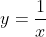

# 你必须、应该和不应该使用乳胶的理由

> 原文：<https://towardsdatascience.com/why-should-you-learn-latex-or-at-least-give-it-a-try-8d0f3218b8e?source=collection_archive---------6----------------------->

## 最好的排版系统是开放的、免费的，它已经存在了 30 多年

阿玛多·洛雷罗在 [Unsplash](https://unsplash.com/s/photos/typography?utm_source=unsplash&utm_medium=referral&utm_content=creditCopyText) 上的照片

如果你必须写下一份文件，你会运行你默认的文本处理器(可能是 MS Word ),甚至不考虑任何其他选项。这款处理器可能满足您的所有需求。我敢说 95%的用户都不知道什么是 LaTeX。这完全没问题。然而，很可惜。因为 LaTeX 是有史以来最成功、最令人惊叹的自由软件项目之一。它已经存在了三十多年，有两位图灵奖获得者直接参与了它的设计和实现。乳胶一定有特别之处。希望在读完这篇文章后，你会考虑尝试一下。

我不会展示如何使用 LaTeX，因为周围有很多精彩的教程。我只会列举你什么时候必须，应该，不应该使用 LaTeX。

## 一点历史

[唐纳德·克努特](https://en.wikipedia.org/wiki/Donald_Knuth)(1974 年图灵奖)于 1968 年出版了他的第一版[计算机编程的艺术](https://en.wikipedia.org/wiki/The_Art_of_Computer_Programming)，当时他 30 岁。那时，书籍是使用 monotype 设置印刷的。Knuth 对最终的印刷很满意。然而，1976 年的第二版不得不再次排版，因为原来的字体已经不再可用。当克努特收到校样时，他很失望。他发现他们低人一等。

他致力于设计他的排版系统。我们说的是七十年代末，当时数字排版本身就是一个有待解决的问题。史蒂夫·乔布斯本人为这个话题做出了贡献。Knuth 计划在 1978 年休假一年来完成这个项目。他低估了这项任务的复杂性。最终的解决方案直到 1989 年才准备好！Knuth 将这种语言称为 TeX，每个字母都是大写的希腊字母 tau τ、epsilon ε和 chi χ。特克斯是τέχνη (techne)的缩写，意思是“艺术”和“工艺”。克努特一直坚持你应该把它读成/tɛk/.

当莱斯利·兰波特(2013 年图灵奖)开始使用 Knuth 的 TeX 时，他开始为自己的目的编写一些宏。LaTeX 只是 LAmport 的 TeX，它是 TeX 之上的一组宏，使之更容易。这是我们今天的主要收藏。

## 乳胶可以做什么？

有了 LaTeX，你可以不费吹灰之力就拥有高质量的排版(我认为是最好的)文档。因为它是免费的。不费吹灰之力。是的，毫不费力。这个索赔是巨大的。每个人都可以用一个免费的、几乎可以在任何地方运行的软件，写出纯文本和使用标记来获得专业的结果。这就是 LaTeX 成为学术界和工程界标准的原因。

这听起来很棒……但是正如你从这篇文章的标题中可以预料到的，它有一些缺点。最主要的是学习曲线。LaTeX 不是一个所见即所得的解决方案，需要一个学习期。让我给你一些指导，告诉你什么时候必须、应该和不应该使用它。当然这一切都来自于我使用 LaTeX 超过 15 年后的观点和经验。

## 什么时候必须使用乳胶？

*   **你是在学术界，尤其是在任何** [**干**](https://en.wikipedia.org/wiki/Science,_technology,_engineering,_and_mathematics) **学科**。在这种情况下，手稿就是一切。内容真的很重要，需要大量的工作。在博士论文的情况下，你必须考虑花一些时间学习 LaTeX，以使你的最终结果有所不同。我看过用 MS Word 写的博士手稿，我不得不说，不知何故(对我来说),它降低了手稿的价值。
*   **你有丰富的参考书目**。专业著作可能会管理数百篇引文。引文必须有一致的格式，否则你的参考书目部分会很乱。为了节省时间，必须搭配 LaTex + BibTeX。用引用条目填充 BibTex 文件，标记它们，并使用 latex 文档中的标记作为参考。编译器会完成剩下的工作。我知道有针对 MS Word 和其他文本处理器的插件和解决方案。但是记住，三十年了，这个问题已经用明文解决了。从我的经验来看，这些插件很麻烦。
*   **您正在使用公式**。插件可以轻松管理公式，如:

其他公式如

可能写不出来。管理数学公式的每个像样的解决方案都是基于 LaTeX 的。为什么不直接用？

*   **你希望数字尽可能使用最好的质量**。诸如 SVG 之类的格式不能用于您的文本处理器。使用 LaTeX，您可以生成嵌入了 SVG 图形的 PDF 文档。没有多少解决方案能提供这样的东西。
*   **你想要免费的解决方案**。
*   **你想让它向前兼容**。乳胶已经存在三十多年了。我们可以对旧文件进行排版，看看它们原本是什么样的。
*   **一个入口点，多种输出格式**。因为 LaTeX 是一个排版系统，你可以得到 DVI、PDF、HTML、XML 等格式的输出。只有一份文件。
*   **忘记文档布局**。LaTeX 有点像 HTML + CSS。一旦你定义了文档结构，你就使用了一种标记语言，编译器会帮你把所有的东西都联系起来。不再用双倍行距而不是一倍行距分隔段落。

## 什么时候应该使用乳胶？

*   **您是 LaTeX 新手，您必须开始一个新项目，并且您正在寻找它提供的所有优势**。
*   **您希望您的文档在众多文档中脱颖而出**。你会的。LaTeX outcomes 有一个人人都欣赏的独特品质。
*   **你正在考虑写一本书、一篇文章或一份手稿，也许会自己出版**。随着亚马逊自助出版等平台的采用，这是一种常见的情况。有了 LaTeX，你可以从原始文本到高质量文本。epub，。mobi 电子书文件。

## 什么时候不应该使用乳胶？

*   **您的文档已经以另一种格式编写**。内容物很可能容易被转移到乳胶中。然而，文档的布局可能很难得到。
*   **你在做协同工作，你是唯一的乳胶从业者**。不要进入乳胶。想都别想。我的经验是，在开始一个共享的 LaTeX 项目后，你的同事会抱怨，你最终会在截止日期前两个小时将所有东西都转移到一个普遍理解的格式。
*   你的文档布局对你来说意味着一切。你正在考虑一个迷人的打印，有 30 种字体，文本行穿过正文，图像在文档的每个可能的地方，等等。那么很可能 LaTeX 不是你的候选人。想想 QuarkXPress。

## 当人们抱怨乳胶时，他们会说…

*   **难**。LaTeX 的学习曲线比 MS 要陡峭得多，这是事实。然而，获得一个基本的 LaTeX(文本、图形、标题、表格)文档并不困难。外面有一百万个例子。复杂性来自于理解 LaTeX 使用的概念，比如浮动对象。
*   我看不到我在做什么。LaTeX 不是所见即所得的解决方案。你必须编译然后检查输出。幸运的是，有一些程序如 [TeXMaker](https://www.xm1math.net/texmaker/) 提供了更好的用户体验。
*   **数字没有出现在我想要的地方**。这是一个关于 LaTeX 中人物放置工作方式的经典误解。LaTeX 会计算您的图形在文档中的最佳位置。然而，可以使用[调节器](https://www.overleaf.com/learn/latex/Positioning_of_Figures)改变位置。
*   我不能轻易改变我的文档的布局。这是真的。如果你想建立自己的文档结构，你需要对宏有更深的理解。有一个很好的社区可以帮助你。然而，这可能需要一些时间和努力。幸运的是，已经有大量[定义的](https://www.latextemplates.com/)模板可供使用。

## 而现在…

如果你已经读到这里，谢谢。我可能引起了你的兴趣。如果是这样，你可以从这里开始学习一些基础知识，如果你需要一些帮助，请查看 [StackExchange](https://tex.stackexchange.com/) 。

你呢？你使用 LaTeX 的体验是怎样的？你对新手或有经验的用户有什么建议？

本文的第一个版本发表在:[https://jmtirado . net/why-you-should-learn-latex-or-at-that-it-a-try/](https://jmtirado.net/why-you-should-learn-latex-or-at-least-give-it-a-try/)