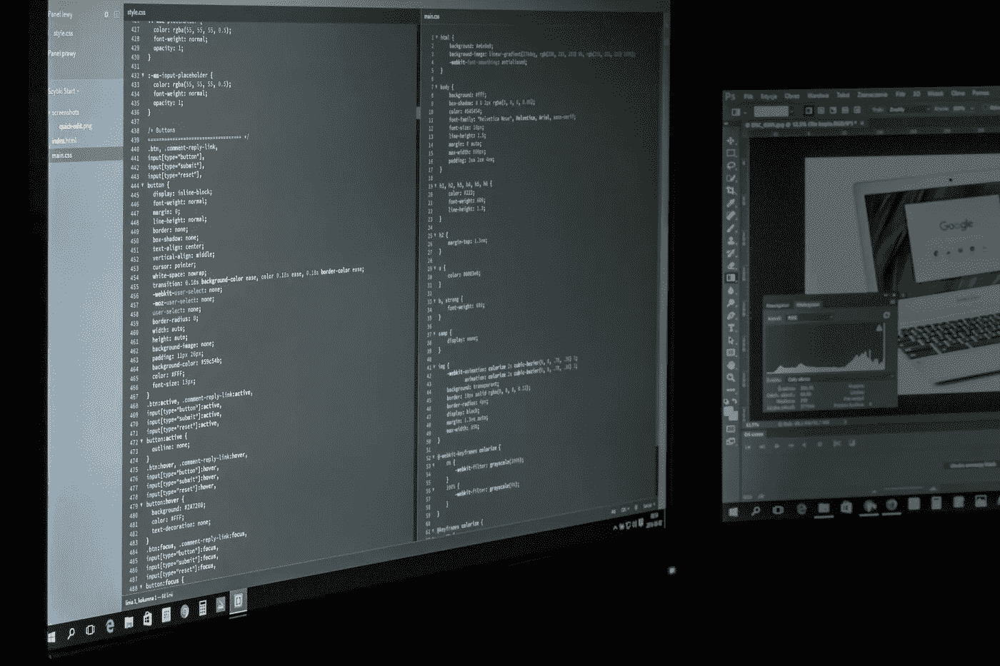

# Kotlin 怎么可能成为 Android 上 ML 的新“Python”？

> 原文：<https://towardsdatascience.com/why-should-you-use-kotlin-for-machine-learning-on-android-6dbab8ac59da?source=collection_archive---------36----------------------->

## 📱[移动机器学习](https://equipintelligence.medium.com/list/stories-on-mobile-ml-with-kotlin-and-tf-lite-3ebee822c87b)

## 强大的数组操作使它变得简单。

[来源。](https://www.pexels.com/photo/computer-screen-turned-on-159299/)

如果你是一个编程爱好者，开发 ML 算法听起来会很刺激。重要的事情，首先。假设您要用 Python 创建一个决策树分类器。你为什么要这么做？您很可能会使用 [NumPy](https://numpy.org/) 进行数组操作，使用 [Pandas](https://pandas.pydata.org/) 处理数据。有些人可能会使用 [scikit-learn](https://scikit-learn.org/) 的`DecisionTreeClassifier`。如果您打算从头开始创建决策树，您可以使用 Python 轻松完成。

[kotlinlang.org](https://kotlinlang.org/)

像其他编程语言一样，在 Python 中，不需要显式指定变量的数据类型。此外，它有许多软件包可以通过 pip 获得，所以拯救我们的生命！但是随着我们周围边缘设备数量的增加，你可能不得不在 iOS，Android，Rasberry Pi 等平台上编写 ML 算法。说到 Android(因为我是一名 Android 开发人员，你可能已经从故事的标题中推断出来了)，在 Java 上使用数组可能是一场噩梦(还记得那些分号吗！).

进入科特林。一种新的 Android 编程语言。它拥有易于使用的数组操作方法，这使得它功能强大且对开发人员友好。它的语法也类似于 Python。在这个故事中，我们学习了一些优秀的 Kotlin 函数，这些函数将帮助你在 Android 中进行 ML 之旅。

# 1.映射数组中的元素

如果你想对你的一些用户照片进行图像分类或检测，我们可以使用 Kotlin 的`map`功能。

片段 1

在 Java 中，您可能必须编写一个`for`循环来遍历文件，并将它们逐个转换为`Bitmap`。

> 特别是，Kotlin 中的 map()函数对于在数组上执行不同的操作非常有用。

计算存储在数组中的数的最小值、最大值和平均值对于各种 ML 算法都很重要。无论是 Python 中的`argmax`函数还是`max`和`min`函数，我们都可以在 Kotlin 中拥有它们！

片段 2

> 在上面的代码片段中，我在`map`函数中使用了`map`函数来规范化多维数组。

看看我们如何连续使用`map`对一个数组执行任何操作。还有更多像`groupBy`和`binarySearch`这样的方法可能有用。见本[文档](https://kotlinlang.org/api/latest/jvm/stdlib/kotlin.collections/)。

# 2.过滤阵列

例如，在决策树算法中，您需要数组中某个元素的概率来计算信息增益。同样，对于 TF-IDF，我们也需要计算词频和 IDF。使用 Kotlin 的`count`和`filter`方法，可以更容易地处理数组中各种元素的概率和频率。

片段 3

在为 NLP 模型预处理数据时，过滤也很有用。可以使用`filter`函数执行一些任务，比如标记化、删除停用词和标点符号。

片段 4

一个你可以创建一个`( word , frequency )`词汇表并将其存储为`HashMap<String,Int>`的例子，

代码片段 5

# 3.科特林协程

[Kotlin 协同程序](https://developer.android.com/kotlin/coroutines)可以帮助我们在后台线程上运行 ML 模型，从而提供优质的用户体验。如果您使用一个模型来增强图像的分辨率(超分辨率)，您会希望异步运行它。在这里了解更多关于使用 Kotlin 协程的信息，

 [## 掌握 Android 中的 Kotlin 协程——分步指南

### 在这篇博客中，我们将掌握 Android 中的 Kotlin 协同程序。我们将讨论协程到底是什么，以及…

blog.mindorks.com](https://blog.mindorks.com/mastering-kotlin-coroutines-in-android-step-by-step-guide)  [## 协程概述- Kotlin 编程语言

### 异步或非阻塞编程是新的现实。无论我们是创建服务器端、桌面还是移动设备…

kotlinlang.org](https://kotlinlang.org/docs/reference/coroutines-overview.html) 

# 听起来不错。在哪里可以看到代码？

我们都喜欢决策树，对吗？你也可以用 Kotlin 编写代码，

 [## 在 Android 上从头开始设计决策树

### 从 Scikit Learn 到 Android 的旅程。

becominghuman.ai](https://becominghuman.ai/designing-decision-trees-from-scratch-on-android-68bf7ee0d01a) 

它们很简单，对吗？我们需要有挑战性的东西！前馈神经网络(带反向传播)怎么样？

 [## 用 Kotlin(或 Android)编写前馈神经网络

### 添加层，单位和激活了！

heartbeat.fritz.ai](https://heartbeat.fritz.ai/coding-feed-foward-neural-networks-in-kotlin-or-android-b93efd47538f) 

强化学习，Q 学习？我们也供应那个！

 [## 问:在 Android 的冰湖环境中学习

### 探索 Q 学习与冰湖环境，都在安卓！

heartbeat.fritz.ai](https://heartbeat.fritz.ai/q-learning-with-the-frozen-lake-environment-in-android-937cf48dcc52) 

Android 上的端到端 FaceNet 实现(100%使用 Kotlin)，

 [## 使用 FaceNet 在 Android 设备上进行人脸识别

### 利用 Android 的 FaceNet 和 Firebase MLKit 的强大功能。

towardsdatascience.com](/using-facenet-for-on-device-face-recognition-with-android-f84e36e19761) 

# 更多示例

作为一个热衷于 ML + Android 的开发者，我一直在 Kotlin 中从头开始构建 ML 算法。

# 结束了

在 Java 中规范化多维数组！[来源](https://giphy.com/gifs/qFi3fACSMnP4Q)。

那么，Kotlin 对于机器学习来说怎么样？希望你会觉得比 Java 好！如果你有更多使用 Kotlin 的 ML 算法的例子，一定要在评论中提到它，让它出现在这里！感谢阅读！。