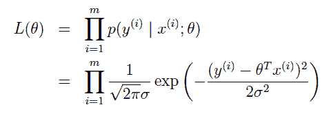
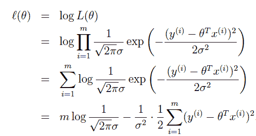
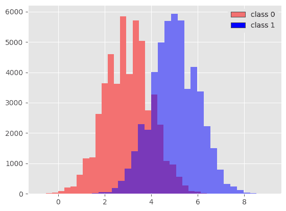
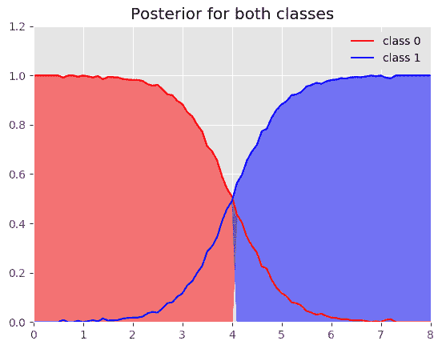
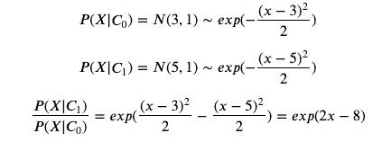
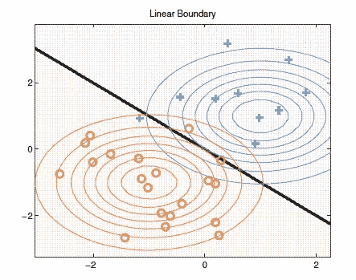
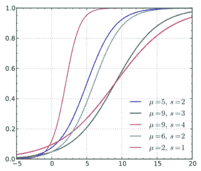
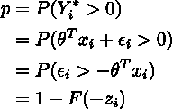
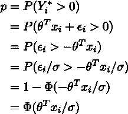

# 为什么是 Sigmoid:概率观点

> 原文：<https://towardsdatascience.com/why-sigmoid-a-probabilistic-perspective-42751d82686?source=collection_archive---------7----------------------->

## [视频教程](https://towardsdatascience.com/tagged/video-tutorial)

## *你知道为什么 sigmoid 函数的输出可以解释为概率吗？*

飞越太浩湖，2018 年春天，我和 DJI 马维克航空公司拍摄的照片

如果你以前上过任何机器学习课程，你一定在某个时候遇到过逻辑回归。有一个 sigmoid 函数将线性预测值与最终预测值联系起来。

> 根据您所学的课程，这个 sigmoid 函数通常是凭空产生的，并作为将数字线映射到所需范围[0，1]的函数引入。有无限多的函数可以做这种映射，为什么是这个呢？

需要注意的一个关键点是，sigmoid 的输出被解释为一个*概率*。很明显，0 和 1 之间的任何数字都不能被解释为概率。解释必须来自模型公式和随之而来的一系列假设。

*如果不想看全文，可以在这里看视频版:*

“为什么是乙状结肠”这个问题曾经困扰了我很久。网上很多回答都没有切中要害。我发现的这类答案最常提到的关键词是“logit”和“log odds ”,只是简单地将 sigmoid 转换为它的逆函数，这不仅没有解释为什么我们选择 log odds 作为线性预测器的目标，也没有说明这种选择的含义。一些更好的提到了“广义线性模型”，但它们与介绍性课程有着相同的弱点，介绍性课程提到了概念，但没有真正回答“为什么”的内在联系。**真正的答案应该可以帮助你从零开始设计这个算法，而不需要事先了解它**。当你面对一个只有基本概率和统计知识的二元分类问题时，你应该能够想到“好吧，解决这个问题的最符合逻辑的方法之一就是遵循这个精确的模型设计”。

在这篇文章中，我将尽最大努力以一种易于阅读的方式安排逻辑流程，这样就清楚了 sigmoid 是带有一些重要假设的概率二进制分类的自然设计选择。就像讲故事一样，逻辑不一定是好的和线性的，一些点可能看起来是平行的，但它们都有助于逻辑模型的设计动机。所以如果你关心这个话题，请坐下来耐心听我说一会儿。这将是一篇很长的帖子，信息量相当于机器学习书籍中的一整章。

一些关键词和主题在前面:

*   线性回归的概率解释，最大似然估计
*   高斯鉴别分析
*   逻辑回归的潜在变量公式
*   从替代方案中获得洞察力:概率单位模型
*   指数族、广义线性模型和标准连接函数

# 1.线性回归的概率解释，最大似然估计

这里提到线性回归的原因是为了看看我们如何将它视为数据的概率模型，以及我们是否可以将类似的想法应用于分类。

我们假设我们的目标变量 y 和输入 x 通过(上标 I 是数据点的索引)相关

其中，ε是一个误差项，表示未建模效应或随机噪声。我们假设噪声来自不同的源并且不相关，所以基于中心极限定理它应该是高斯的。我们可以写出分布并将误差表示为目标值和线性预测值之间的差值，

我们称之为*给定 x 的 y 的分布，以θ* 为参数。我们不以θ为条件，因为它不是随机变量，而是要学习的参数。接下来，我们将可能性定义为

可能性是θ的函数。当被视为 y 和 X 的函数，且θ固定时，它只是概率密度函数。但当被视为θ的函数时，这意味着通过改变θ，我们可以将分布“拟合”到观察到的数据。寻找最佳拟合的过程称为最大似然估计(MLE)。换句话说，MLE 是在假设分布类型(在这种情况下是高斯分布)和参数(在这种情况下是θ，请注意，我们只关心平均值，而不关心方差/协方差矩阵)的情况下，试图找到使观察数据的概率最大化的分布。因为我们假设了独立的观察值，所以我们进一步以下面的形式将它写成单个数据点的乘积。

由于对数变换是单调的，我们使用下面的对数似然来优化 MLE。

为了找到描述生成数据的真实基础模型的最佳高斯，换句话说，就是最佳θ，我们需要找到给出最大对数似然的峰值。最大化上面的表达式等价于最小化下面的项，

**现在我们看到了神奇之处:这正是最小二乘法！**

简而言之，*为什么线性回归使用最小二乘法拟合数据？*

> *因为它试图以线性预测器加高斯噪声项的形式找到最佳模型，使从中提取数据的概率最大化*。

线性回归的概率公式不仅为我们后来的逻辑回归公式提供了一个鼓舞人心的例子，而且它还展示了模型设计的合理解释。我们将带有高斯噪声的线性预测器映射到目标变量。对于二元分类，如果我们可以做一些类似的事情，那就太好了，即，将带有*某物*的线性预测器映射到属于两个类别之一的概率(后验 p(y=1|x))，并使用 MLE 来证明模型设计，即它最大化了从我们的参数化分布中提取观察数据的概率。我将在第 3 节展示如何做到这一点，但接下来，让我们看一个激励人心的例子。

# 2.一个令人振奋的例子:高斯判别分析

让我们考虑对 1D 数据的二进制分类任务，其中我们已经知道两个类的基本生成分布:具有相同方差 1 和不同均值 3 和 5 的高斯分布。两个高斯都有 50k 个数据点，即相同的先验，p(C0) = 0.5 = p(C1)。(Ck 代表 y 的类)

由于我们在数据中只有一维，我们能做的最好的事情就是在某个地方画一个垂直的边界，尽可能的把两个类分开。视觉上很明显，边界应该在 4 左右。使用一种*生成*方法，其中我们知道类条件 p(X|Ck)，这是两个高斯函数，以及先验 p(Ck)，我们可以**使用贝叶斯规则得到后验**

结果绘制如下

我们可以清楚地看到后验中的边界，即我们算法的最终概率预测。红色区域被分类为 0 级，蓝色区域为 1 级。*这种方法是一种生成模型，称为高斯判别分析(GDA)* 。它模拟连续的特征。你可能听说过它的兄弟离散特征:*朴素贝叶斯分类器*。

现在看看 S 形的后验边界周围，它描述了两个类之间的不确定性的过渡。

> **如果我们能够*在事先不知道类条件的情况下直接建模这个 S 形状，岂不是很酷*？**

但是怎么做呢？让我们解决一些数学问题。

请注意，红色和蓝色曲线是对称的，它们的总和总是 1，因为它们在贝叶斯定理中是归一化的。让我们看看红色的。它就是 p(C0|X ),它是 X 的函数。我们通过将顶部和底部分成以下形式，对前面的等式进行了一点修改，

对于右下角的项，我们可以取消先验，因为它们是相等的，并插入高斯条件句。

好吧，这很好！我们在 exp()里面有一个 x 的线性函数，如果我们设 z = -2x + 8，写出它的后验，就变成了，

**这就是逻辑 s 形函数！**如果你问为什么 z 有负号，那是因为为了方便起见，我们希望 p 和 z 在相同方向上是单调的，这意味着增加 z 将增加 p。这种情况的逆过程被称为*对数几率*或 *logit* ，这是我们可以使用线性函数建模的部分。

回头看看上面的逻辑流程，**到底发生了什么，使得有一个 sigmoid 形式的后验概率和 x 对 z 的线性函数**成为可能？这将为我们提供一些见解，以决定*何时*我们可以这样对分类建模。

**对于 sigmoid 形式，您可以看到它自然地来自两个类别的 Bayes 规则，即目标变量的 Bernoulli 分布**。它不要求类条件句是高斯型的！可能有一族分布具有相似的指数形式，符合我们上面的推导！只要输出 y 是二进制的，输入 X 在它们的类条件分布中就可以有一定的灵活性。

接下来，z 的线性形式。在本例中，我们有两个高斯函数，方差*相同，先验为*。这些事实让我们在推导中，抵消了先验和 X 的二次项。这个要求看起来挺严格的。事实上，如果我们改变高斯函数的形状，决策边界就不再是一条直线。考虑下面 2D 的例子。如果两个高斯函数具有相同的协方差矩阵，则判决边界是线性的；在第二张图中，它们具有不同的协方差矩阵，判定边界是抛物线。

来源:K. Murphy，机器学习:概率观点

**这告诉我们，如果我们使用 sigmoid 函数和线性边界直接对后验模型进行建模(*判别*方法),这也被称为*逻辑回归*,与 GDA 的*生成*方法相比，它有一些优点和缺点。**

*   GDA 具有比逻辑回归强得多的假设，但是**当高斯假设为真时，它比逻辑回归**需要更少的训练数据来实现类似的性能。
*   但是**如果类条件句的假设不正确，逻辑回归做得更好**，因为它不需要对特征的分布建模。

在凯文·墨菲的*机器学习:概率观点*的第 8.6.1 节中，对 GDA 和逻辑回归进行了广泛的比较。我在这里讨论 GDA 只是为了说明这一点

> 当我们试图用一些假设对一个伯努利目标变量建模时，sigmoid 函数会自然出现。

# 3.逻辑回归的潜在变量公式

现在回到第一点。我们通过定义带有高斯噪声项的线性预测因子来设计线性回归。我们能在二进制分类的情况下做一些类似的事情吗？是的，我们可以！让我们这样来看，

线性预测值加上此处的误差评估为我们所谓的*潜在变量*，因为它是不可观测的，并且是根据观测变量 x 计算的。二元结果由潜在变量是否超过阈值(本例中为 0)决定。(注意，为了方便后面的累积分布解释，判定阈值被设置为 0，而不是通常的 0.5。从数学上讲，这里的值是 0 还是 0.5 并不重要，因为线性预测器可以更新偏差项进行补偿。)

> 如果我们假设误差项有一个 [*逻辑分布*](https://en.wikipedia.org/wiki/Logistic_distribution) ，*，其累积分布是逻辑 sigmoid 函数*(如下并排所示)，那么我们就得到逻辑回归模型！

来源:[维基百科](https://en.wikipedia.org/wiki/Logistic_distribution)

将潜在随机变量表示为 Y*，线性预测值表示为 z，累积分布表示为 F，则观察结果 y = 1 的概率为，

我们让 F 成为 sigmoid 函数，所以它在 0 左右对称，

所以我们可以写作，

**现在我们达到了目标，伯努利结果的概率表示为线性预测值的 sigmoid！**

上面给了我们线性预测器 z 和预测 p 之间的关系，函数 F，或者机器学习上下文中的*激活函数*就是逻辑 sigmoid。激活函数的逆函数称为*链接函数*，它将预测映射回 z。它是逻辑回归中的 *logit* 。

概括地说，推导基本上是说**如果我们假设误差项具有逻辑分布，我们的伯努利结果的概率是线性预测值的 sigmoid。**

如果你仔细观察推导，**这个公式并不需要一个逻辑分布来工作**。**只需要在 0 附近对称分布。什么是合理的替代方案？一个高斯！**

> 如果我们假设误差是高斯型的呢？

它实际上给了我们另一个与逻辑回归相似的模型，也能完成这项工作。它被称为**概率单位回归**。

# 4.另一种选择:概率单位模型

与设计用于解决相同任务的替代模型进行比较是深入了解我们的主题:逻辑回归及其假设的一个很好的方法。

如前一节所述，二元分类的概率单位模型可以用相同的潜在变量公式表示，但存在高斯误差。你可能想知道为什么它不像逻辑回归那样被广泛使用，因为假设高斯误差似乎更自然。一个原因是高斯分布不具有封闭形式的 CDF，并且其导数在训练期间更难计算。逻辑分布的形状与高斯分布非常相似，但其 CDF(也称为逻辑 sigmoid)具有封闭形式且易于计算的导数。

我们来看看推导过程

φ是高斯的 CDF。注意，我们除以σ得到一个标准正态变量，并利用对称性得到最后的结果。这说明我们不能分别识别θ和σ，因为 p 只取决于它们的比值。这意味着潜在变量的规模没有确定。因此，我们设置σ = 1，并以潜在变量的标准差为单位解释θ。

上述推导与逻辑回归的唯一区别在于**激活函数被设置为高斯 CDF，而不是逻辑 sigmoid** ，即逻辑分布的 CDF。高斯 CDF 的逆函数被称为*概率单位*，它在这里被用作*链接函数*。

概率单位回归作为一种惯例更多地用于生物和社会科学。它通常产生与逻辑回归相似的结果，并且更难计算。如果你不是这方面的专业统计学家，逻辑回归是首选模型。

还有另一个叫做*互补双对数*的链接函数，可以用于伯努利响应，我不会在这里详细介绍，但如果你有兴趣，可以阅读一下。

# 5.指数族、广义线性模型和标准连接函数

到目前为止，我们已经看到了线性回归、逻辑回归和概率回归。它们的主要区别之一是*链接功能*。如果我们把它抽象出来，并做一些额外的假设，我们可以定义一个更广泛的模型类别，称为广义线性模型。

GLM 对 p(y|x)的期望值进行建模，即μ= E[y | x；θ].**对于线性回归，μ只是线性预测器，换句话说，它的连接函数就是恒等函数。**但对于其他情况，p(y|x)可以是指数形式或其他形式，如果我们仍然想以某种方式使用线性预测器，我们必须将其转换以匹配输出。

为了跳到 GLM，我们首先利用一个很好的数学形式，将一些最广泛使用的分布组合在一起，这样我们就可以研究它们的共享属性。我们可以查看如下所示的共享表单，而不是查看每个带有各自参数的发行版，

可以调整成这种形式的分布称为**指数族**(注意，它与*指数分布*不同)。这里，y 是我们试图预测的目标响应变量。统计学家为这些术语起了一些别出心裁的名字。**但我在这里关注的是η项，也称为*自然参数*。**出于我们的目的，我们可以假设 T(y)(称为*充分统计量*)只是 y。因此，自然参数η只是将 exp()中的结果 y 映射到左边的概率。让我们用一个具体的例子来说明我的意思。

**对于均值为μ的伯努利目标变量**，我们可以写为

**自然参数η原来是 logit！**

> 由于这种指数族公式，logit 也被称为伯努利分布的**规范链接函数**。

正如我们之前看到的，概率单位也是一个链接函数，但它不是*规范的*，因为它不属于这里的指数族设置。

现在我们有能力跨越到 GLM。利用指数族及其自然参数，我们可以根据结果 y 的分布为我们的线性预测器定义一个**规范链接函数**。**在伯努利结果的情况下，这种方法为我们提供了 logit 链接和逻辑回归。**

指数族给了我们很多好的性质。表明**它们的对数似然总是凹的(等价地，负对数似然总是凸的)，并且它们的基于梯度的优化共享相同的形式，因此我们总是可以使用一些迭代算法来找到最佳拟合**。

除了伯努利分布，其他一些著名的指数分布包括高斯分布、泊松分布、伽玛分布、指数分布、贝塔分布和狄利克雷分布。

要为机器学习任务选择 GLM，请考虑目标变量 y 的类型。例如，

*   如果 y 是一个实数值，使用高斯(最小二乘回归)
*   如果是二元的，用伯努利(逻辑回归)
*   如果是计数，使用泊松(泊松回归)

等等。

# 摘要

在介绍性的课程和书籍中，解决方案经常在没有充分理由的情况下强加给读者。从许多不同的资源中寻找线索并理解它们并不容易。希望这篇文章能为有疑问的人提供一个比较全面和直观的答案。学习的目标不仅仅是知道*如何*，还要知道*为什么*，这样我们才能在实际应用中概括我们的学习。

这个话题引出了广义线性模型这个更广泛的话题。glm 是一类强大的模型，没有像深度学习一样受到关注。在许多情况下，正确应用 GLMs 可以完成工作，同时使您的生活更加轻松。与深度学习技术相比，GLM 的优势在于数学的简单性和经过充分研究的可解释性。对基础理论的深刻理解也可以帮助机器学习研究人员和实践者开发新的方法。如果你有兴趣进一步探讨这个话题，我推荐 Philippe Rigollet 的麻省理工学院 18.650 应用统计学讲座和我的参考资料。坚持学习！

*在* [*中*](https://medium.com/@loganyang) *上看我的其他帖子，或者在* [*上关注我的【推特】*](https://twitter.com/logancyang) *。*

# 参考

*   主教。模式识别和机器学习。斯普林格，2006 年。第四章。
*   K. P .墨菲。机器学习:概率观点。马萨诸塞州剑桥。[美国]:麻省理工学院出版社，2013 年。
*   吴恩达的机器学习讲座和笔记，第一至第三部分。
*   罗德里格斯(2007 年)。广义线性模型讲义。网址:[*http://data.princeton.edu/wws509/notes/*](http://data.princeton.edu/wws509/notes/)
*   *麻省理工学院 18.650 统计学应用讲座菲利普·里戈莱特*[*https://www.youtube.com/watch?v=X-ix97pw0xY*](https://www.youtube.com/watch?v=X-ix97pw0xY)