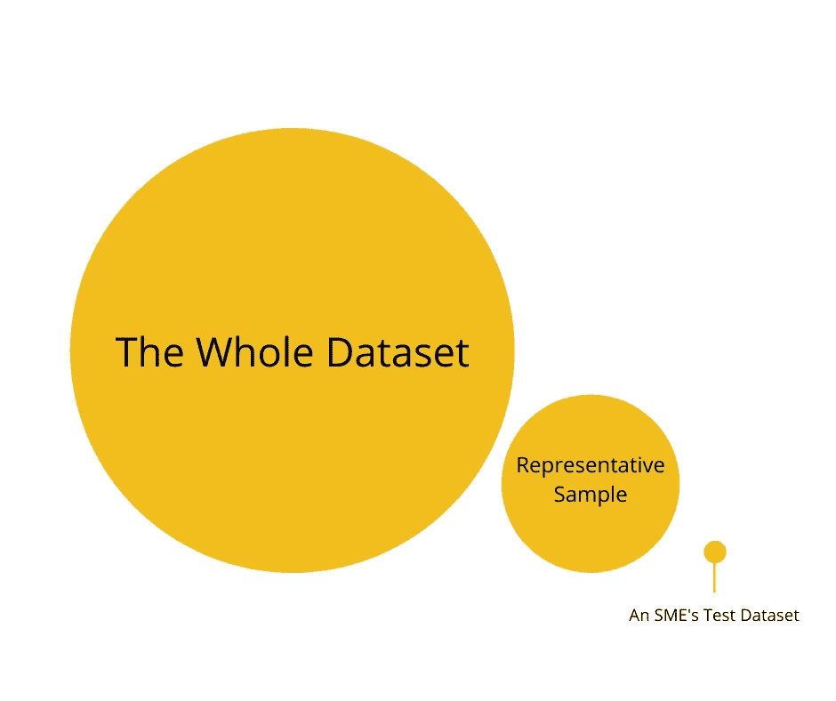

# 为什么中小型企业必须采用不同于大型企业的分析方法

> 原文：<https://towardsdatascience.com/why-smes-must-approach-analytics-differently-to-large-enterprises-e9c587b2b6c6?source=collection_archive---------39----------------------->

许多人在一级防范禁闭期间开始学习新技能，其中最受欢迎的是数据科学。唯一的问题是，这些课程通常是基于大公司使用的方法，因此对中小企业不实用。

原因:[外推](https://dictionary.cambridge.org/dictionary/english/extrapolate)

> 好吧，为什么？

想象一下，有一袋 5 公斤重的大米，每一粒大米都代表你的产品/服务的一个潜在客户。一粒谷物的质量代表了潜在客户的预算。

你的公司需要知道单个颗粒的平均质量是多少。这代表了潜在客户必须花费的预算。

你购买 50 克大米作为测试数据集，测量每粒大米的质量并记录下来。这需要一段时间，但你会完成的。

[良田中吉竹](https://unsplash.com/@yory?utm_source=unsplash&utm_medium=referral&utm_content=creditCopyText)在 [Unsplash](https://unsplash.com/s/photos/rice?utm_source=unsplash&utm_medium=referral&utm_content=creditCopyText) 上的照片

*(免责声明:数据科学不是一个简单或容易的过程，请做好长时间投入的准备，因为“在 10 分钟内构建一个*[*tensor flow*](https://www.tensorflow.org/)*机器学习模型”的文章听起来很好，但在现实世界中并没有那么简单。)*

你算了一下，完美的工作完成了！您的公司预算购买米粒，但是您发现每粒米粒的质量低于您在测试中计算的平均值。因此，此次购买的投资回报低于预期。

你的方法没有任何问题，但是你做了一个危险的假设:

*“你的测试数据集代表了大米的整体。”*

为什么这很重要？SME 通常没有能力收集足够的测试数据来获得整个数据集的代表性样本。

***这就是中小企业与大企业的差距所在，因为中小企业的预算限制意味着这些测试只能在一小部分潜在客户身上进行。*然而，**对结果的解读方式往往与大型企业相同，在大型企业中，结果代表了更大比例的潜在客户**** **。**

**

*作者图片*

*这对大公司有用，因为他们的预算足够高，可以接触到一定数量的潜在客户，从而对其他人的行为做出良好的预测。对于中小企业来说，预算并没有延伸到这一步，他们往往连 1%的潜在客户都达不到。*

*这个概念被称为外推，是一种有用的技术，但只有当您外推的数据代表整个数据集时才有效。*

*作为一个中小企业，你正处于一个两难的境地。你没有足够的预算来获得足够的数据，所以推断可能会给你带来不正确的结论。然而，如果没有一些数据，你会觉得你在完全盲目地做决定。*

*对于 SME 来说，思考你的方法是至关重要的。如果你是在推断，了解你的样本代表真实数据的比例是很重要的。使用我之前的例子，首先确定有多少米粒存在，然后看看你的样本代表的比例。*

*如果有 5 公斤的大米，但您的测试数据只有 5 克，那么当应用于 5 公斤的大米时，测试结果不太可能相似。这将根据数据而变化，有时数据点的变化会小得多，因此你不需要太多的测试数据来做出可靠的预测。*

*我想说的是，你可以使用最先进的分析和统计技术，但是如果你不考虑你要解决的问题的背景，那么你的模型再好也没用。在现实世界里是行不通的。*

> *那么，中小企业能做些什么来解决这个问题呢？*

1.  *首先花更多时间了解问题，而不是直接构建解决方案。相信我，从长远来看，会让你少很多痛苦。*
2.  *不要孤军奋战，有比大多数人意识到的更多的数据。寻找公共数据或与其他 SME 合作，你拥有的数据越多，你就能更好地理解问题。*(Twitter API、世界银行数据集、政府数据集、Data.world 都是很好的起点，不会让你付出任何代价)。**
3.  *除非你有真正可证实的证据来支持你的主张，否则不要做任何假设。分析的目标不是确认你的偏见(有意识或无意识)，而是理解实际发生的事情。*

**如果你有兴趣讨论文章中提到的任何事情，以及它可能对你的组织产生的影响，请不要犹豫，通过*[*LinkedIn*](https://www.linkedin.com/in/simon-dutton-discovr)*联系我。**