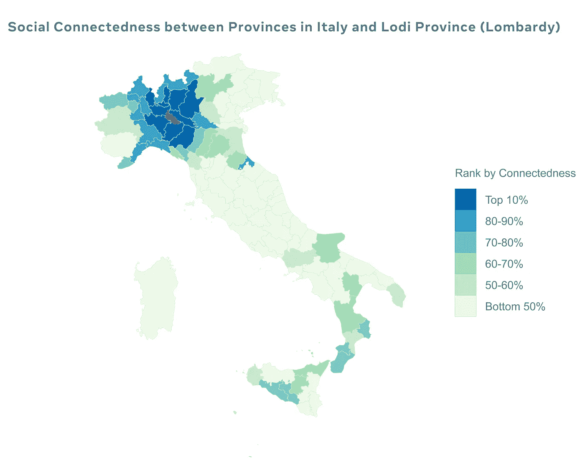
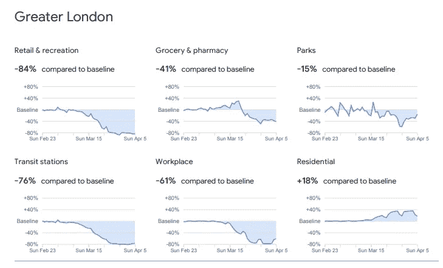
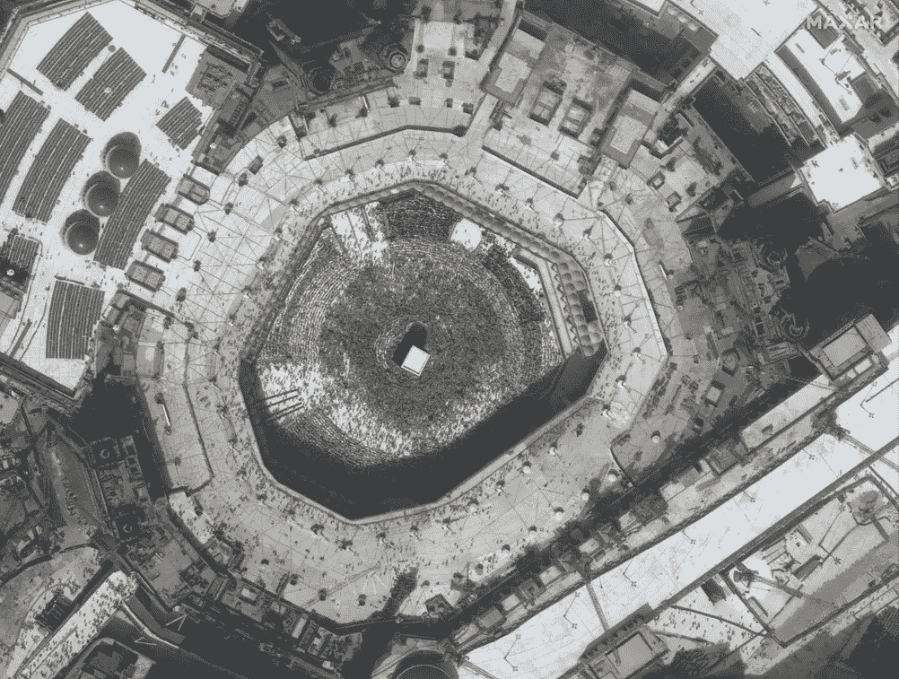
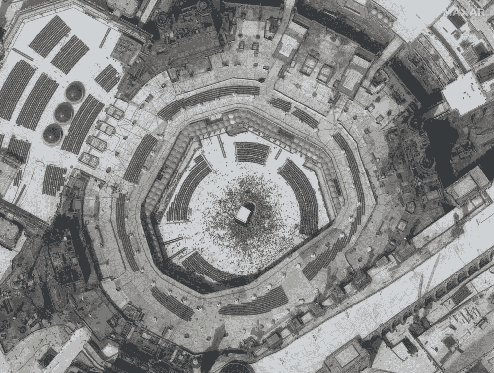
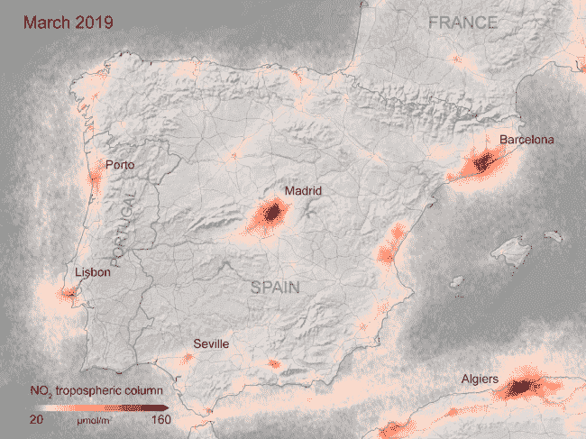

# 为什么在冠状病毒的时代，空间是特殊的

> 原文：<https://towardsdatascience.com/why-spatial-is-special-in-this-age-of-coronavirus-8c4f0be8954a?source=collection_archive---------59----------------------->

## 不，我不是指带有地图的仪表盘，而是更深刻的方式。

Patrick Assalé 在 [Unsplash](https://unsplash.com?utm_source=medium&utm_medium=referral) 上的照片

我相信你注意到了地图在几乎每个新冠肺炎仪表板或数据可视化中的普遍使用。如果你已经看过著名的约翰·斯诺(John snow)1854 年的《流行病学之父——伦敦霍乱地图》,那么空间数据分析如何帮助抗击流行病就不足为奇了。

然而，地理或空间数据科学正在以更微妙的方式帮助对抗这种疫情，这些方式并不在聚光灯下，比如一直存在的仪表盘和新冠肺炎案例的其他数据可视化。

我的意思是，我们往往会忘记全球范围内的流动模式，这些模式可以加强对病毒传播的研究和预测。我们也有更频繁的卫星重访世界各地，以监测人类活动。让我们对空间数据科学进行一些创新性的使用和应用，以应对新冠肺炎大流行。

## 隔离状态下的流动性

尽管对智能手机跟踪数据的隐私问题感到担忧，但它们在新冠肺炎下的使用让我们对社交距离措施下人们的运动有了无与伦比的洞察力。事实上，[国家利用](https://science.sciencemag.org/content/early/2020/03/25/science.abb4218)这些可用的技术和移动数据集来研究或预测流行病的传播和规模。最近，[欧盟委员会](https://www.mobileworldlive.com/featured-content/top-three/ec-sets-out-rules-for-covid-19-mobility-tracking/)规定利用手机的移动数据来应对新冠肺炎的流行病。

聚合的和去匿名化的数据集已经通过不同的计划提供，例如[脸书的永久数据](https://dataforgood.fb.com/tools/disease-prevention-maps/)和[谷歌的新冠肺炎社区移动性报告。](https://www.google.com/covid19/mobility/)

为了应对流行病，流动性是我们需要的一项重要信息。正如[研究](http://pages.stern.nyu.edu/~jstroebe/PDF/SCI_and_COVID.pdf)显示的那样，使用在线社交网络等这类数据集被证明对流行病学家和其他希望预测新冠肺炎等疾病传播的人很有用，一项使用脸书数据的研究表明了这一点。

**社会联系指数——脸书**

以脸书的[社会联系指数](https://dataforgood.fb.com/tools/social-connectedness-index/)为例，我们可以了解人们的一般运动模式，还可以模拟概率并预测疾病通过人际接触传播的可能性。

> 社会联系指数衡量两个地理区域之间的联系强度，以脸书友谊纽带为代表。这些联系可以揭示关于经济机会、社会流动性、贸易等方面的重要见解。(脸书数据为好)

意大利的社会联系例子。

**社区移动性报告——谷歌**

谷歌还在网上发布了社区移动报告，在新冠肺炎会议期间，世界上大多数国家都可以使用。测量了 6 种类型的移动性(零售和娱乐、杂货店和药店、公园、公交车站、工作场所和住宅)的增减。从伦敦谷歌社区移动性报告的摘录中可以看出，除了居住区，所有这些群体的移动性都有所下降，我们可以看到居住区在家的时间有所增加。

因此，流动性数据不仅可以使我们了解人类在这些困难时期的流动性和行为，还可以帮助建模和研究新冠肺炎的传播以及社会距离预防措施如何影响疾病的传播。事实证明，这些数据集对于解决和减少这种疫情的传播至关重要。

## 从卫星图像上鸟瞰

从太空观察冠状病毒的影响也是另一个空间数据科学前沿，它说明了这种流行病对世界经济和社会的深远影响。卫星图像可以从鸟瞰图揭示生命是如何在这个疫情下停止的。由于许多集会被取消，通过卫星图像可以很容易地看到空的地方。

麦加大清真寺，或称哈拉姆清真寺，位于沙特阿拉伯的麦加。左(2 月 14 日)，右(3 月 3 日)——[来源](https://www.cnbc.com/2020/03/10/satellite-photos-sites-around-the-world-deserted-due-to-coronavirus.html)

研究我们在哪里看到最高的下降活动，并应用深度学习和人工智能来检测和分类冠状病毒对这些地方的社会经济影响，对于等待我们的漫长恢复过程至关重要。

**气候和新冠肺炎**

卫星图像的另一个重要的微妙洞见是人类活动的完全停止如何影响环境。对于气候研究人员来说，这是一个研究气候动态的好时机。由于监测大气的卫星任务的发射，我们现在可以收集和探索人类的足迹和气候。例如，由欧洲航天局(欧空局)和荷兰共同资助的对流层监测仪器(TROPOMI)公开提供的 sentinel 5 数据。

2019 年新冠肺炎和去年西班牙的二氧化氮排放量— [来源](https://www.space.com/coronavirus-impacts-emissions-china-night-lights.html)

## 结论

迄今为止所做的空间分析只是冰山一角，使用移动数据集和地球观测数据来揭示这一时期社会经济变化的隐藏模式和见解有着巨大的潜力。世界各地可用的开放和免费的空间数据集在研究和绘制不同交通方式、连通性和移动模式的变化，以及深入了解社会距离和隔离的真实世界动态方面具有更大的潜力。

在抗击新冠肺炎的战斗中部署空间成分的微妙和不那么微妙之处，可能会在冠状病毒疫情期间引出许多未解的问题。为什么世界各国不同地区的死亡率差异如此之大？地理、天气、人口年龄分布、生活方式等条件如何影响冠状病毒的传播或遏制？

***编者注:*** [*走向数据科学*](http://towardsdatascience.com/) *是一份以研究数据科学和机器学习为主的中型刊物。我们不是健康专家或流行病学家，本文的观点不应被解释为专业建议。想了解更多关于疫情冠状病毒的信息，可以点击* [*这里*](https://www.who.int/emergencies/diseases/novel-coronavirus-2019/situation-reports) *。*

**参考**

[1][http://pages.stern.nyu.edu/~jstroebe/PDF/SCI_and_COVID.pdf](https://science.sciencemag.org/content/early/2020/03/25/science.abb4218)

[2][https://science . science mag . org/content/early/2020/03/25/science . abb 4218](https://science.sciencemag.org/content/early/2020/03/25/science.abb4218)