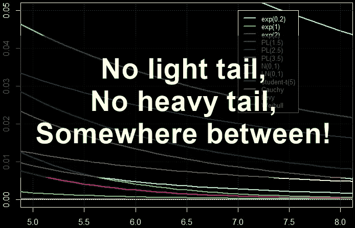

# 为什么回火稳定分布？

> 原文：<https://towardsdatascience.com/why-tempered-stable-distribution-no-math-equations-5c91bb64e4e9?source=collection_archive---------30----------------------->

来源:无限可分分布？[ [点击](https://medium.com/@corr.roh/infinitely-divisible-distribution-586b18c63670)

## 迈向稳定的分销之旅#0

## 资产收益的应用:为什么不是正态分布和稳定分布？

嗨，我是卢武铉( *ρ* )！欢迎来到“稳定分销之旅”系列

*   **第 0 部分:为什么是缓和稳定(TS)分布？**
*   第一部分:什么是厚尾分布？[ [点击](/journey-to-tempered-stable-distribution-part-1-fat-tailed-distribution-958d28bc20c)
*   第二部分:无限可分分布？[ [点击](https://medium.com/@corr.roh/infinitely-divisible-distribution-586b18c63670)

在写这个系列的过程中，**我周围的人让我写一篇文章，解释为什么需要它而不涉及数学**，我决定总结一下，放在第 0 部分。因此，在这里，我们要讨论的是为什么我们需要“回火稳定分布”。此外，我将尝试在不涉及数学方程的情况下进行解释。

## 我们开始吧！

来源:什么是厚尾分布？[ [点击](/journey-to-tempered-stable-distribution-part-1-fat-tailed-distribution-958d28bc20c)

我宁愿从为什么(不是)正态和稳定分布开始，因为调和稳定分布是为了克服这两种分布在资产回报建模中的缺点而开发的。

> 资产收益分布的尾部比正态分布重，但比稳定分布薄(Grabchak 和 Samorodnitsky，2010)

# **为什么(不是)正态分布？**

*   正态分布使用方便。两个正态变量的和也是正态的，这在金融应用中很重要 1) **两只股票的和**将遵循高斯分布假设股票是高斯的 2)根据对数收益的定义，今天的收益可以写成前“n”天收益序列的和。
*   易于以封闭形式计算各种风险度量(如 VaR 和 es)
*   ***资产收益不是正态分布的。*** *不适合对分布具有非对称、偏斜和尖峰特性的资产收益建模*
*   [***尾巴***](/journey-to-tempered-stable-distribution-part-1-fat-tailed-distribution-958d28bc20c) ***较轻，即它衰变得太快*** *(如果你不熟悉尾巴，请查阅第一部分* [*这篇文章*](/journey-to-tempered-stable-distribution-part-1-fat-tailed-distribution-958d28bc20c) *)*

# 为什么(不是)非正态稳定分布？

*   优于正态分布。它允许控制分布的偏斜、厚尾和对称程度。
*   ***采样频率不一致！*** *经验估计的尾部指数似乎对更频繁的回报较低，对不太频繁的回报较高(Gencay 等人，2001)。*
*   这意味着你可能会发现每日(不太频繁)的回报有一个有限的方差，而微观二次抽样序列的回报有无限的方差。[ [尾巴悖论](https://lsa.hse.ru/data/2016/06/08/1116963701/Grabchak%202.pdf) ]
*   ***对于非正态稳定分布，方差和高阶矩都是无穷大！然后发生了什么？***

## 金融应用中的无穷方差问题

如果我们在金融应用中没有有限方差，会发生什么？两个最常用的金融应用变得毫无意义。

## 均值-方差投资组合构建

*   如果方差(和高阶矩)不是有限的，就不能定义均值-方差投资组合。

## 期权价格建模

*   为了获得定义良好的期权定价模型，收益分布的均值、方差和高阶矩必须存在。

# 我们想要什么？

让我们通过对稳定分布的尾部做一些事情来使矩(例如，均值和方差)是有限的，这样我们就有了具有较轻尾部的“类稳定”分布。

由卢武铉编辑，来源:Pixabay

怎么做？方法有很多！

> **修改尾巴！！怎么会？**
> 
> 1.截断尾部
> 
> 2.在尾部乘以更快的衰减函数
> 
> 3.翘起尾巴

更多详情，请参见[ [点击](https://lsa.hse.ru/data/2016/06/08/1116963701/Grabchak%202.pdf)

# 一些插图

我提供两个例子。第一个是截尾，第二个是 TS 分布的尾部比稳定分布轻，比正态分布重。

## 截断尾巴！

资料来源:M. Grabchak，卢武铉编辑

## 正态< TS < Stable

We can see from the below graphs (log scale) that the **回火稳定分布位于尾部正态分布和稳定分布的中间。**

资料来源:计算统计手册(第 1031 页)

# 为什么(不)回火稳定分布？

*   **能够控制一个偏斜的、肥胖的尾巴的水平，并且分布对称**
*   **它有有限的时刻！**
*   *像稳定分布一样，只有特征函数是已知的。*
*   *密度或分布函数不存在封闭形式的公式。*
*   *利用快速傅立叶(FFT)技术进行最大似然近似时，统计推断的难度*

最后，这里列出了一些类型的调和稳定分布。

## 1 + 6 种 TS

*   平滑截断稳定分布(STS)
*   经典 TS (CTS)
*   广义经典 TS(GTS)
*   修改后的 TS (MTS)
*   普通 TS (NTS)
*   快速下降的 TS (RDTS)
*   基姆-拉切夫 TS

# 摘要

我们讨论了为什么需要“缓和稳定(TS)分布”。我希望这份文件对你有帮助。如果你有任何问题，请在下面评论。我希望你对接下来会发生什么感到好奇。下一次，我将带着“稳定分布之旅[部分。1:什么是厚尾分布？”【[点击](/journey-to-tempered-stable-distribution-part-1-fat-tailed-distribution-958d28bc20c)

## 参考

1.  风险值计算中的重尾分布，2010，A. Misiorek 和 R. Weron
2.  米（meter 的缩写））Grabchak 和 G. Samorodnitsky (2010 年)。“财务回报的方差是有限的还是无限的？一个悖论和一个解释。”量化金融 10(8):883–893。
3.  资产管理和风险管理中的重尾分布手册，2019，S. Stoyanov 等人。
4.  《金融模型百科全书》(第 3 卷)，241-258 页，2012 年，弗兰克。法博齐

我还为上面所有的参考资料添加了超链接。有关详细信息，请查阅参考资料。如果有我错过的任何事情，我将稍后更新参考。

感谢您阅读本文档。如果你觉得这个文档有用，不要忘记分享它。

*   **第 0 部分:为什么是回火稳定(TS)分布？**
*   第一部分:什么是厚尾分布？[ [点击](/journey-to-tempered-stable-distribution-part-1-fat-tailed-distribution-958d28bc20c)
*   第二部分:无限可分分布？【[点击](https://medium.com/@corr.roh/infinitely-divisible-distribution-586b18c63670)