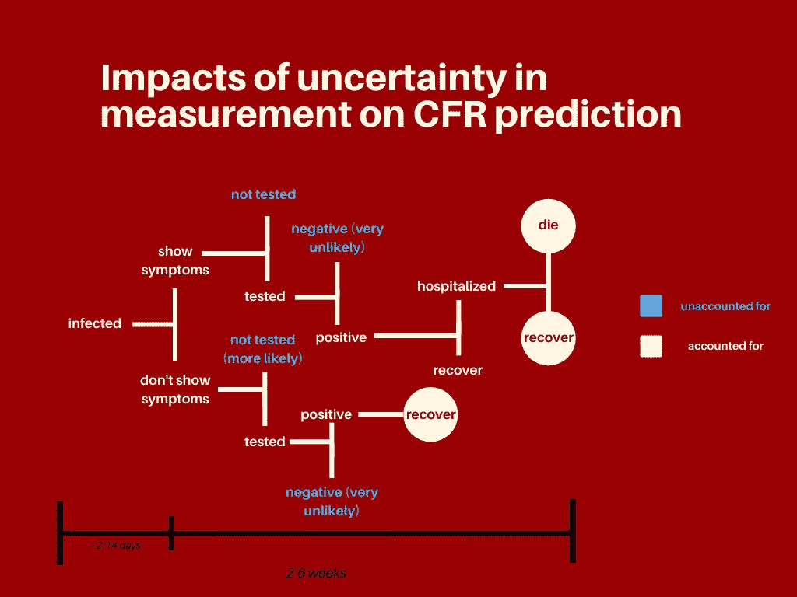
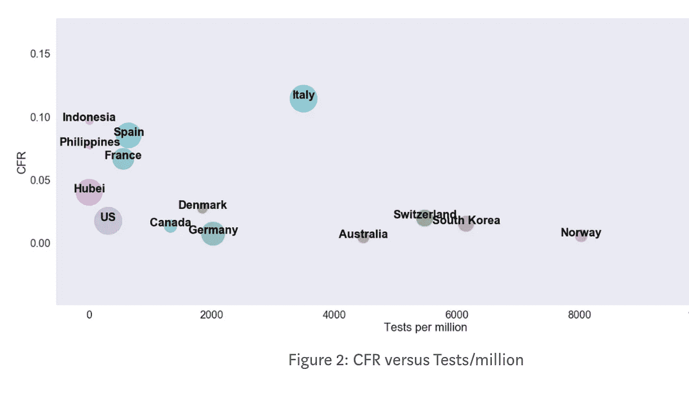
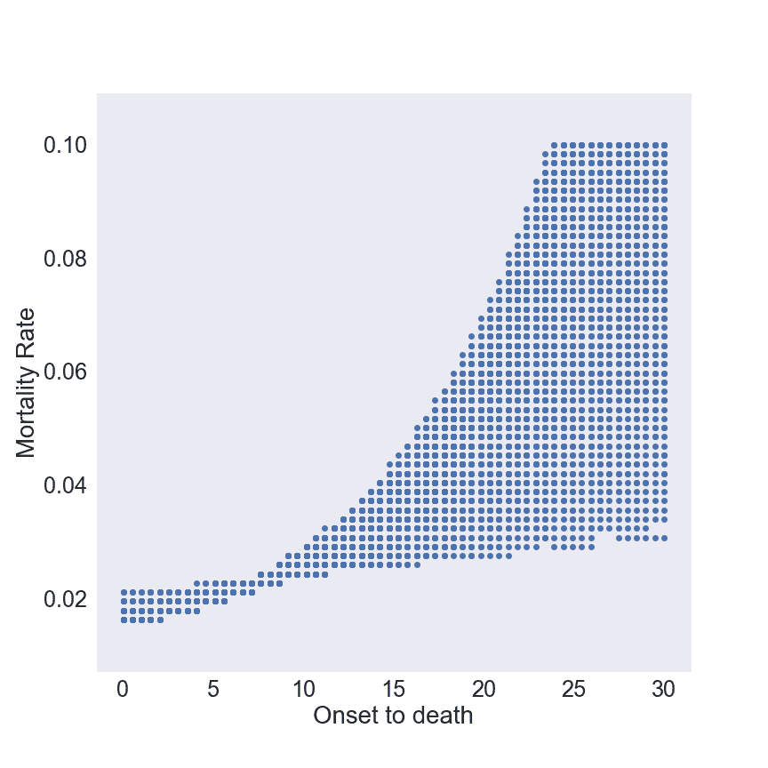
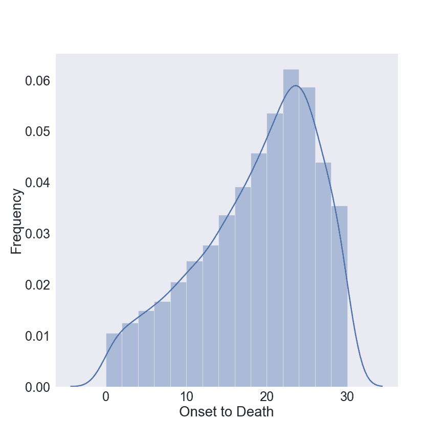
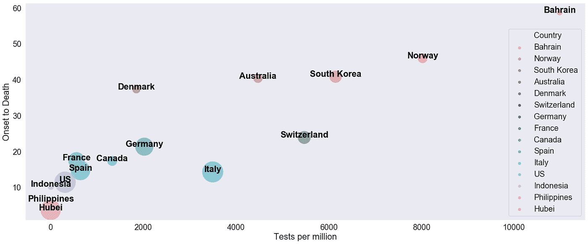

# 测试如何完全扭曲冠状病毒致死率

> 原文：<https://towardsdatascience.com/why-testing-completely-skews-coronavirus-case-fatality-rates-c7cbf53ac4c8?source=collection_archive---------15----------------------->

## 加速测试势在必行。

在传染病爆发期间，如世界目前正在经历的新冠肺炎疫情，了解疾病的致命性至关重要——人们希望知道他们感染疾病后死亡的可能性。使用多种不同的方法来评估这一点，在本文中，我们将描述这些方法，并讨论与获取这些指标相关的困难。

## **测量杀伤力**

疾病致死率有三个主要的衡量标准:病死率(CFR)、感染致死率(IFR)和死亡率(MR)。死亡率可以通过死亡人数除以总风险人口来计算。这告诉我们一个人在人群中死亡的概率。另一方面，CFR 使用相同的分子，但将其除以确诊病例数。也就是说，它表示一个人被感染(并报告它)而死亡的人的百分比。IFR 与 CFR 相同，只是它将死亡人数除以感染总人数。这考虑到了被感染的人，无论他们是否报告。在一个没有病毒病例未被发现并且所有病例都被报告的世界里，IFR 和 CFR 将是等同的。然而，正如我们将要讨论的，这是很难实现的，因为现实中并不是所有的感染都被考虑在内。

# **测量死亡率**

为了测量死亡率，我们首先需要了解感染期间事件的时序。

## **感染期间的事件年表**

这种疾病发病过程的年表有助于我们理解测量真正的发病至死亡间隔的困难。下面是时间表的分解(图 1)。从患病到康复/死亡，整个过程可能需要 2-6 周。

图 1

感染——病毒在你体内扩散，你被感染了。在这个阶段，你可能甚至不知道你已经被感染了。

**B.** 显示/不显示症状—您可能会也可能不会显示症状。如果没有症状，你就不太可能去做检查。

**C.** 接受测试——你可能会接受测试，也可能不会。如果你患有这种疾病，但没有进行检测，CFR 是无效的。如果你没有接受测试，你现在就退出了这个过程。

**D.** 结果——你得到了你的结果。这种滞后在不同的国家差别很大(在韩国你一天就能得到结果，而在美国需要 3-5 天)。在极少数情况下，可能会出现假阴性——例如，如果你是阳性，测试会返回阴性结果——但这种情况非常罕见，几乎可以忽略不计。

**E.** 住院——根据您病情的严重程度，您可能需要住院，也可能不需要住院(大约有[5–20%](https://www.nytimes.com/interactive/2020/03/25/opinion/coronavirus-trump-reopen-america.html?smid=fb-nytimes&smtyp=cur&fbclid=IwAR34f1V5H-ypR4bhE6SAvg7z0csYMdryvlMbcTO8hseIcyNE4kdk4qYQzio)的人需要住院)

**F.** 结果——从那以后，你的症状要么减轻，要么康复，要么死亡。

## **测试值**

在像新冠肺炎这样的疫情期间，不清楚有多少人被感染，这使得很难准确测量 IFR。这是因为有许多没有症状的人没有意识到他们已经感染了病毒。这也可能是因为人们可能无法获得检测，检测结果需要很长时间才能处理，或者他们只是不报告自己的疾病。由于这个原因，IFR 将总是小于 CFR，因为它具有相同的分子和更大的分母。

在理想的情况下，如果人群中的每个人都经常接受检测，那么我们就能准确地知道有多少人被感染了。在这种情况下，IFR 将与 CFR 完全相同。然而，许多患有这种疾病的人(如新冠肺炎的情况)没有接受检测，因此没有被列入病死率的分母。不管原因是什么，这严重扭曲了 CFR。为了进一步了解 IFR 和 CFR 之间存在的差异，让我们来看看不同国家是如何协调对新型冠状病毒的检测的。

[各国的检测率](https://ourworldindata.org/coronavirus-testing-source-data)差异很大，这严重影响了它们的病死率。图 2 绘制了人均测试的 CFR，它清楚地表明 CFR 随着更多测试的实施而降低。德国、韩国和挪威实施了积极主动的测试。相比之下，意大利也进行了大量测试，但他们的反应是被动的；他们只在情况变得严重时才进行测试。尽管 CFR 可能因医疗保健、感染人群的年龄组合、基础设施等而异。，它很可能无法解释这种巨大的偏差。也就是说，除了其他因素之外，这些国家中的低 CFR 几乎肯定是其测试的函数。换句话说，德国的 CFR 更接近 IFR，而印度尼西亚和西班牙的 CFR 要高得多，因为他们主要测试的是已经患病的人。此外，与反应性检测(只对已经患病的个人进行检测)相比，从感染到死亡的过程在主动检测(国家在大规模疫情爆发前进行检测)下要长得多。

# **关键测量值如何因测试率差异而变化**

图 3: CFR 与发病至死亡间隔的关系

在我最近的工作中，我们通过修改发病到死亡的时间间隔和疾病爆发的增长进行了多次模拟，以确定符合实际死亡人数的发病到死亡和死亡率的组合。我们在瑞士重现了这一点(图 3，4)。图 3 显示了发病至死亡间隔和病死率的组合，其中模型和实际数据最接近。从理论上讲，发病到死亡的时间间隔有很大的范围。

图 4:高斯核密度估计

在图 4 中，我们显示了死亡开始的分布以及高斯核密度估计，该估计最小化了模拟死亡数和实际死亡数之间的差异。我们估计 22 天的发病至死亡间隔是瑞士的最佳估计。图 5 显示了许多其他国家的这一数字，分散在人均检测中(点越大意味着病例越多)。

图 5:发病到死亡的时间间隔与人均检测

这表明发病到死亡和检测的流行之间有很强的相关性；广泛的测试导致更长的发病至死亡持续时间。几乎可以肯定的是，如果年龄结构、医疗保健和基础设施相似，每个国家的发病至死亡间隔应该很接近。这一措施的巨大差异明确表明，在检测较少的地方，发病至死亡的时间几乎肯定比实际时间短。也就是说，只有当人们已经生病时才进行测试。

像冰岛这样的国家，随机测试了 5000 多人，发现大约一半测试呈阳性的人没有症状。包括美国在内的大多数国家只检测那些出现发烧、咳嗽等症状的人。这使得发病到死亡的时间间隔更短，从而增加 CFR。因此，由于在不同国家进行的测试实践的差异，很难获得标准化的数字，使得 CFR 难以估计。

# **牵连**

**我们不应该相信 CFR—**CFR 的变化应该表明年龄、合并症等因素的差异。CFR 目前强烈依赖于测试的事实表明，我们不能依赖 CFR 来确定我们的总体 IFR 或死亡率。

**我们应该增加检测—** 这不仅能让我们隔离感染者&追踪接触者，还能帮助确定真正的发病至死亡间隔。这将有助于我们计算 CFR。

**我们不能相信我们的感染传播模型—** 许多预测感染病例数的模型依赖于 R0(基本繁殖数)，而 R0 又依赖于传染期的持续时间。然而，这个时间间隔是不可靠的，所以我们不能完全相信这些模型预测的感染数量。

***编者注:*** [*走向数据科学*](http://towardsdatascience.com/) *是一份以研究数据科学和机器学习为主的中型刊物。我们不是健康专家或流行病学家，本文的观点不应被解释为专业建议。想了解更多关于疫情冠状病毒的信息，可以点击* [*这里*](https://www.who.int/emergencies/diseases/novel-coronavirus-2019/situation-reports) *。*