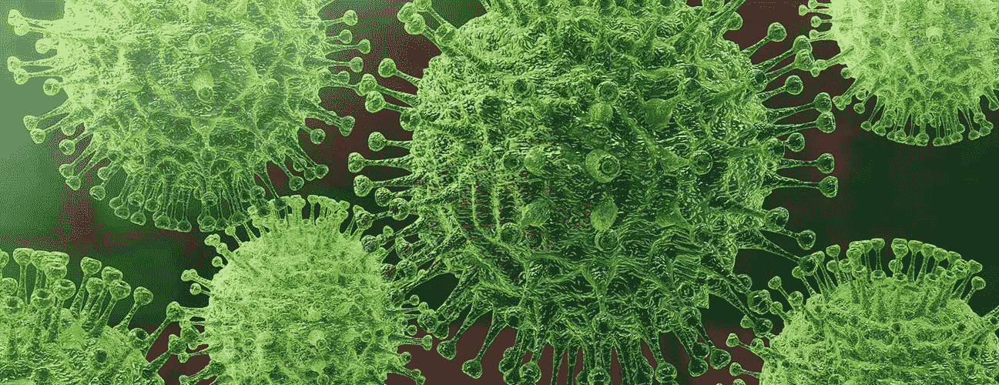
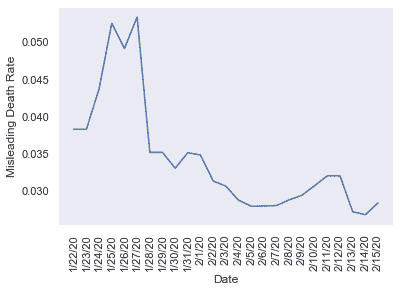
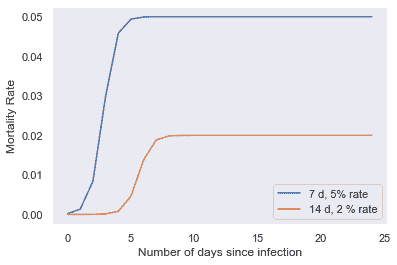
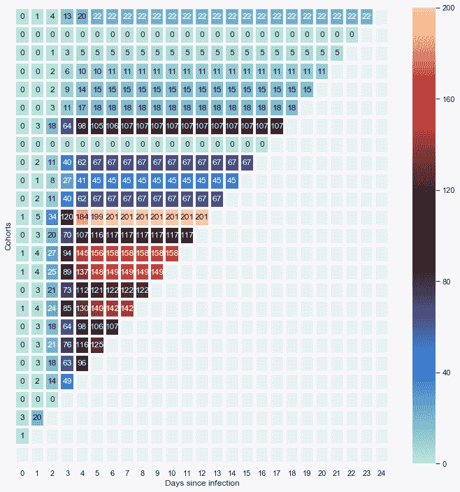
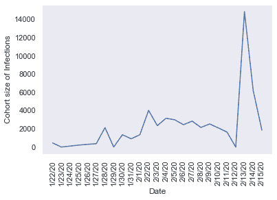
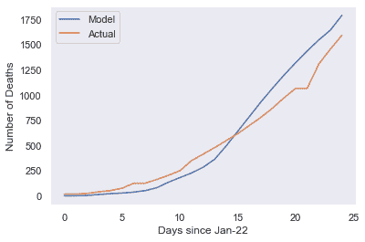

# 为什么冠状病毒死亡率具有误导性

> 原文：<https://towardsdatascience.com/why-the-coronavirus-mortality-rate-is-misleading-cc63f571b6a6?source=collection_archive---------0----------------------->

## 死亡率可能比我们想象的要高得多。

图片:[约翰霍普金斯医学](https://www.hopkinsmedicine.org/health/conditions-and-diseases/coronavirus)

你可能知道，冠状病毒，或新冠肺炎，是一种导致呼吸系统疾病的新病毒。它的起源可以追溯到 2019 年末的中国武汉。与 SARS、MERS 等其他动物源性冠状病毒不相上下。尽管大多数病例局限于湖北省(武汉是其中的一部分)，但它已经蔓延到香港、台湾、日本、德国、美国，甚至可能还有朝鲜。尽管关于该病毒性质及其生长的新细节仍在出现，但我们知道它有一个[2-14 天的潜伏期](https://www.cdc.gov/coronavirus/2019-ncov/about/symptoms.html)，每个感染者的平均传播次数大致在[2-2.5](https://www.who.int/docs/default-source/coronaviruse/who-china-joint-mission-on-covid-19-final-report.pdf)的范围内。截至 2 月 14 日，超过 64，000 人被怀疑/确认感染，近 1400 人死亡。

尽管媒体似乎没完没了地报道该病毒，但许多问题仍未得到解答。真的只有 60，000+确诊病例，还是这个数字被缩小了？死亡人数是否也少报了？病毒每天传播的速度有多快？有多危险？为了让我们准确地衡量它带来的危险，有必要计算病死率(CFR)。即使病毒传播很快，如果人们在感染后没有死亡，它也不是一个大的威胁。

目前，病死率的计算是不正确和误导的。截至目前，是用死亡人数除以感染人数计算出来的。下图显示了湖北省自 1 月 22 日以来的“误导性”CFR。基于这些计算，目前的病死率确定为 2.5%左右。然而，这是不正确的，因为它没有考虑一个非常重要的因素:**滞后效应**。

数据提供[JHU·CSSE](https://github.com/CSSEGISandData/COVID-19)

## **什么是滞后效应？**

假设 2020 年 1 月 10 日有 100 个人感觉不舒服。让我们跟踪他们一段时间。他们中的一些人在几天的时间里就病重了。一些人康复了，而另一些人继续生病。如果我们能从现在开始快进一年，我们就能准确知道死于这一群体的人数。大多数患病的人会康复，其他人会死去。在这一点上，你可以计算出这个群体的死亡率，死亡人数与最初被感染人数之比。例如，我们可以用这种方法来计算 2002 年在中国爆发的 SARS 的病死率，因为每个感染 SARS 的人现在要么已经康复，要么已经死亡。新冠肺炎的情况并非如此，因为它仍在继续。

在感染过程中，我们有不同阶段的不同人群。也就是说，昨天刚生病的几千人今天不会死；但是今天死去的人可能来自更早的年代。因此，用死亡人数除以感染人数来计算病死率是完全不正确的。正确的方法是分别跟踪每个队列，确定每个队列的死亡率。当然，当疾病完全停止时，这两种方法就会趋同。冠状病毒的流行正在进行，并没有停止，这种方法不会奏效。相比之下，这将与计算 SARS 病死率的工作。

这是描绘它的图解方式。

数据提供 [JHU CSSE](https://github.com/CSSEGISandData/COVID-19)

x 轴上是群组成员被感染后的天数(他们都在同一天被感染), y 轴上是群组内的累积死亡率(死亡人数/感染人数)。

报告称，出现症状需要 2-14 天，可能还需要几周左右的时间，否则你可能会死亡。因此，不管队列成员的性质如何，死亡人数在最初几天可能为零。

为了便于说明，我们将看两个不同的组。假设一组是来自武汉的 25 岁男性(通过 2 %的 CFR 建模并在 14 天内达到峰值)，另一组代表 80 岁男性的队列(通过 5%的 CFR 建模并在 7 天内达到峰值)。我们可以假设后者会比前者上升得更快，达到更高的高度，并更快达到稳定。这意味着，由于免疫力普遍较低，整体健康状况较差，更多 80 岁以上的老人将会更快死亡。心脏病和糖尿病患者以及长期吸烟者也是如此。除了这些因素(非常老和非常年轻的人表现出更多的脆弱性)，群组曲线将随着国家、财富等而变化。

## **那么，为什么我们不能按队列计算并找到 CFR 呢？**

这个想法在理论上听起来很简单:找到每天感染的人数，并在队列水平上跟踪他们，我们就可以得到病死率。在实践中，这有点困难。这里有一些挑战。

1.  **感染日期**:由于潜伏期不一且仍不确定，因此很难确定感染日期。此外，不同群体的症状会有所不同，记录每个表现出咳嗽或发烧等症状的人会非常耗时。由于新冠肺炎没有明确的症状，咳嗽等不明确的症状很可能是流感或普通感冒的症状。
2.  被感染的人数:可能有许多人没有接受检测，但却感染了病毒，且下落不明。这甚至更难，因为有些人已经感染，但没有症状。现在，由于武汉人被强制隔离，这稍微容易一些。
3.  **死亡时间**:我们不知道人们死于感染需要多长时间，因为人们出现症状的日期可能不同，即使他们都在同一天感染，也可能在不同的日期报告。
4.  **死亡的风险随着年龄、健康状况等而变化**:病人和老人比健康人更容易受到伤害[。如果每个感染队列中不同风险群体的比例发生变化，病死率也会发生变化。](https://www.npr.org/sections/goatsandsoda/2020/02/14/805289669/how-covid-19-kills-the-new-coronavirus-disease-can-take-a-deadly-turn)
5.  **死亡风险因地而异**:对于任何快速传播的传染病，选择用于确定 CFR 的样本都是有偏差的，因为病毒传播如此之快，影响不同地方的不同人。到目前为止，病死率主要由 1 月份在武汉市感染冠状病毒的人组成。随着病毒转移到不同的地方，死亡率必然会不同，因此，必须代表所造成的威胁，以便采取足够的预防措施。例如，由于人们的免疫力/健康、卫生设施、获得医疗服务的机会等因素，它对索马里人民造成的危险将远远高于对瑞士人民的危险。因此，为了准确评估这种威胁，CFR 应该用每个队列来表示。

## **理想情况下，我们如何解决这个问题？**

我们需要在队列水平上有更多的粒度数据来帮助我们建立 CFR 模型。不幸的是，似乎没有这方面的数据。

三角形图表是[按群组计算](http://wetzler.github.io/classes/img/percent_of_engaged_cohort_retention.png)死亡率的正确方法。我们需要为尽可能同质的群体构建这些三角形图表，以确保某些成员不会扭曲死亡率。年龄、高风险医疗群体和国家是值得关注的细分领域。使用这些，我们可以最准确地测量每组的病死率。

下面是死亡率的三角形图表示例。

数据提供[JHU·CSSE](https://github.com/CSSEGISandData/COVID-19)

这里，最上面的行描述了较老的组群，较新的组群由较低的行表示。每一列代表他们被感染后的额外一天，方框中的数字代表队列中的累计死亡人数。从右到左对角扫描方框，给出同一天每个群组的数字。

为了对死亡人数进行建模，需要做两个假设。

1)在所有队列中有 5%的病死率。

2)如果有人死亡，他们在感染病毒后 7 天内死亡。此外，数据仅来自武汉所在的湖北省。

数据提供[JHU·CSSE](https://github.com/CSSEGISandData/COVID-19)

我们可以立即看到最顶行和最底行之间从冷到暖的梯度。这意味着较老的组群开始时规模较小，而较新的组群规模较大，表明了新冠肺炎的扩散。(见上图)

尽管这些信息可以描绘出正在发生的事情的全貌，阐明新冠肺炎病毒传播的基本性质，但该模型有几个不足之处。首先，并非所有信息都可用，因此整行都没有数据。可能有死亡人数没有被计算在内，尤其是在震中武汉。我们很可能大大低估了感染人数。我们也不明白一旦被感染，人们需要多长时间才会死亡。我们不知道老年人和年轻人的组合；健康有病；等等。尽管有缺陷，这个模型仍然是说明性的。

**好的，这里有一些初步分析显示数据严重不正确**

接下来，我们使用该模型(病死率为 5%，死亡天数为 7 天)来比较湖北省的预测死亡人数和实际死亡人数。

数据提供 [JHU CSSE](https://github.com/CSSEGISandData/COVID-19)

该图将累积死亡数模型与假定的病死率和死亡时间与北京报告的数字进行了比较。我们的模型，以目前的参数，是惊人的接近。然而，考虑到除死亡时间和病死率之外的大量因素，我们永远无法完全确定真正的数字是多少。以下是一些关键的见解。

*   如果感染人数确实是正确的，那么 CFR 可能远远高于 2.5%，接近 5%甚至更高。
*   如果死亡时间长于 7 天，那么 CFR 将甚至大于 5%，并且可能高达 10%或更高。
*   如果受感染的人数显著增加，CFR 可能会变得非常小(甚至小至 1%)。

应该注意的是，有多种方法可以通过改变这些参数来获得相同的死亡人数。不管怎样，很有可能数据是严重错误的(更多的人被感染)或者我们有一个严重的危机(CFR > 5%)。

## 外卖食品

*   目前计算新冠肺炎病死率的方法存在固有缺陷，因为它没有考虑滞后效应。
*   提出了一种新的(基于队列的)计算病死率的方法。
*   使用特定参数(5% CFR &死亡前 7 天)，模型和实际数据非常一致。
*   这意味着要么病死率比想象的高，要么病例数比报道的高得多。

[这里是一个更新](https://medium.com/@charitnar/exploring-the-coronavirus-mortality-rate-82a86fb2c31)，显示了病死率的可能性范围。另一个[更新](https://link.medium.com/GpCz0D7u24)显示温暖的天气不会抑制增长。再来一次[更新](https://medium.com/@charitnar/will-200-000-americans-die-from-covid-19-742290262668)，我将揭示美国可能会经历多少死亡

*编者按:*[*towardsdatascience.com*](https://slack-redir.net/link?url=http%3A%2F%2Ftowardsdatascience.com)*是一家以数据科学和机器学习研究为主的中型刊物。我们不是健康专家或流行病学家。想了解更多关于疫情冠状病毒的信息，可以点击* [*这里*](https://slack-redir.net/link?url=https%3A%2F%2Fwww.who.int%2Femergencies%2Fdiseases%2Fnovel-coronavirus-2019) *。*