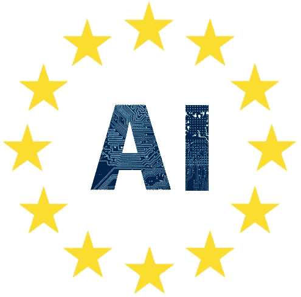

# 为什么欧盟必须进一步质疑人工智能中的信任、卓越和偏见

> 原文：<https://towardsdatascience.com/why-the-eu-must-further-interrogate-trust-excellence-and-bias-in-ai-715a4265e6b4?source=collection_archive---------55----------------------->

以下是对 2020 年 2 月 19 日欧盟委员会发布的《人工智能白皮书——欧洲实现卓越和信任的方法》的公开回应。该文件可以在这里找到:[https://EC . Europa . eu/info/sites/info/files/commission-white-paper-artificial-intelligence-feb 2020 _ en . pdf](https://ec.europa.eu/info/sites/info/files/commission-white-paper-artificial-intelligence-feb2020_en.pdf)

信用:【https://ec.europa.eu/futurium/en/ai-alliance-consultation 

这份白皮书代表了欧洲人工智能政策的重要转变；从个人权利语言到社会关系语言的转变。我赞扬作者确保欧洲人工智能的未来植根于明确定义的公共价值观和共同的基本权利，如人类尊严和隐私保护。同样，整个文件中的关系语言令人钦佩地表明，委员会在提交建议时认真对待可持续发展目标、欧洲绿色协议和类似多边协议的邀请。该政策文件的两个组成部分是建立一个以“卓越生态系统”和“信任生态系统”为中心的政策框架，这两个组成部分在关系愿景中有很好的基础，表明经济政策框架将代表社会经济范围内各种人口的愿望。

然而，本白皮书中有几个元素可以使用更细微的差别和更有意识的参与。最值得注意的是，在本文档中，术语“信任”明显缺乏定义。虽然信任很重要的论点已经很明确了，但是“信任什么？”和“信任谁？”没有得到充分的回答。同样，围绕多样性、在进一步创建和执行这些建议时身份的平等代表性以及对可能受到影响的各种社区的下游影响，也缺乏重要的社会政治分析。该文件推荐的以人为中心的方法背后的理论是明确定义的，但是在这种方法的创建和应用中，哪些人将被卷入和迎合的问题没有明确说明。人们有理由担心，在制定这种以人为本的方法时，如果不充分关注代表性和多样性，可能会使那些在当前技术环境中已经处于无能为力境地的人进一步边缘化。

我还想请作者在定义“优秀”时更明确一些。该文件认为，欧盟可以通过更有效地与民族国家合作，集中研究和创新社区的努力，提供资源以更好地解决当前经济市场中存在的技能短缺等方式，培育卓越的生态系统。不幸的是，这份文件假设了优秀的定义，但这个定义从未被充分探讨过。这份文件最接近于一个定义，当谈到创建一个生态系统时，它使用一种沿着整个价值链刺激研究和创新的策略，加速采用基于人工智能的解决方案。我批评这种对“卓越生态系统”定义的片面探索，因为我担心没有明确意图的无节制增长对下游的影响。同样，这种片面的定义为经济体系的延续留下了空间，这种经济体系以已经边缘化的、较小的和较新的公司以及地球本身为代价，提升了已经掌权的机构和个人。

最后，我想评论一下委员会对多样性和偏见的分析。该文件正确地指出了解决人工智能技术中的偏见的困难，以及随着人工智能技术在世界各地变得更加普遍，人工智能技术中的偏见可能造成的巨大伤害。然而，作者没有回答这个关键问题，即谁应该对人工智能技术中存在的有害偏见负责，以及欧盟法律应该如何强制解决技术系统中的偏见。我很欣赏人工智能中解决偏见困难的微妙之处，但是我强烈建议委员会增加几个他们建议的解决这些困难的具体机制。