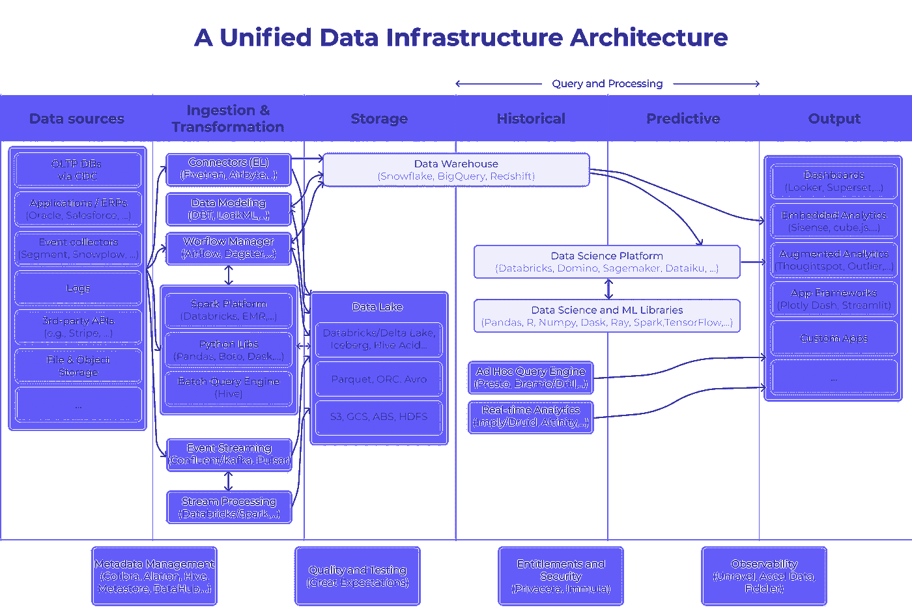
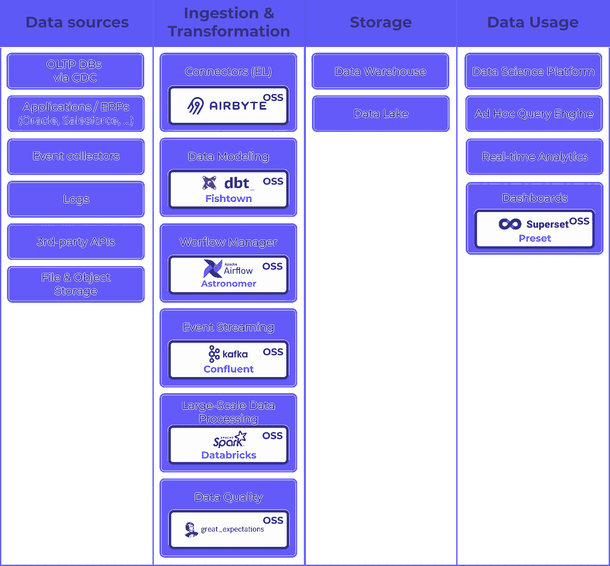

# 为什么 ETL 的未来不是 ELT，而是 EL(T)

> 原文：<https://towardsdatascience.com/why-the-future-of-etl-is-not-elt-but-el-t-880f08aab74a?source=collection_archive---------11----------------------->

图片来自[像素](https://www.pexels.com/photo/gray-steel-tubes-586019/)上的 [SpaceX](https://www.pexels.com/@spacex)

在过去十年中，我们存储和管理数据的方式已经完全改变。我们从 ETL 世界转向 ELT 世界，像 Fivetran 这样的公司推动了这一趋势。然而，我们不认为它会就此停止；ELT 是我们头脑中向 EL(T)的过渡(EL 与 T 解耦)。为了理解这一点，我们需要辨别这一趋势的潜在原因，因为它们可能会显示未来会发生什么。

这就是我们在本文中将要做的事情。我是 [Airbyte](https://airbyte.io) 的联合创始人，这是即将到来的新的数据集成开源标准。

# ETL 有什么问题？

从历史上看，数据管道过程包括提取、转换和加载数据到仓库或数据湖中。这种顺序有严重的缺点。

## 顽固

ETL 本质上是僵化的。它迫使数据分析师事先知道他们将使用数据的每一种方式，他们将产生的每一份报告。他们做出的任何改变都可能代价高昂。它可能会影响初始提取下游的数据使用者。

## 缺乏可见性

对数据执行的每个转换都会掩盖一些底层信息。分析师不会看到仓库中的所有数据，只会看到在转换阶段保存的数据。这是有风险的，因为结论可能是基于没有经过适当切片的数据得出的。

## 分析师缺乏自主权

最后但同样重要的是，构建基于 ETL 的数据管道通常超出了分析师的技术能力。它通常需要工程人才的密切参与，以及提取和转换每个数据源的额外代码。

一个复杂的工程项目的替代方案是在一个临时的、时间密集的、最终不可持续的基础上进行分析和构建报告。

# 什么改变了，为什么英语教学变得更好了

## 基于云的数据计算和存储

ETL 方法曾经是必要的，因为本地计算和存储的成本很高。随着雪花等基于云的数据仓库的快速增长，以及基于云的计算和存储成本的直线下降，几乎没有理由在最终目的地加载之前继续进行转换。事实上，翻转这两者可以让分析师以自主的方式做得更好。

## ELT 支持分析师的敏捷决策

当分析师可以在转换数据之前加载数据时，他们不必在决定需要获得的确切模式之前预先确定他们想要生成什么样的洞察。

相反，底层的源数据被直接复制到一个数据仓库，构成了一个**“真实的单一来源”**然后，分析师可以根据需要对数据执行转换。分析师将总是能够回到原始数据，并且不会遭受可能会**损害数据完整性的转换，**让他们放手去做。这使得商业智能过程无比灵活和安全。

## ELT 在整个公司推广数据素养

当与基于云的商业智能工具(如 Looker、Mode 和 Tableau)结合使用时，ELT 方法还拓宽了对跨组织的通用分析集的访问。即使相对非技术用户也可以访问商业智能仪表板。

我们也是 Airbyte 英语教学的忠实粉丝。但是 ELT[并没有完全解决数据集成问题](https://airbyte.io/articles/data-engineering-thoughts/how-we-can-commoditize-data-integration-pipelines/)，它也有自己的问题。我们认为 EL 需要与 t 完全解耦。

# 现在发生了什么变化，为什么 EL(T)是未来

## 数据湖和数据仓库的合并

Andreessen Horowitz 有一篇关于数据基础设施如何发展的精彩分析[。这是他们在与行业领导者进行大量访谈后得出的现代数据基础架构的架构图。](https://a16z.com/2020/10/15/the-emerging-architectures-for-modern-data-infrastructure/)

作者图片，灵感来自 a16z 的[分析](https://a16z.com/2020/10/15/the-emerging-architectures-for-modern-data-infrastructure/)

数据基础架构在高层次上有两个目的:

1.  通过使用数据帮助企业领导者做出更好的决策— **分析用例**
2.  将数据智能构建到面向客户的应用中，包括通过机器学习— **运营用例**

围绕这些广泛的用例，已经形成了两个并行的生态系统。

数据仓库构成了分析生态系统的基础。大多数仓库以结构化格式存储数据。它们旨在从核心业务指标中获得洞察力，通常使用 SQL(尽管 Python 越来越受欢迎)。

数据湖是运营生态系统的支柱。通过以原始形式存储数据，它提供了应用程序和更高级数据处理需求所需的灵活性、规模和性能。数据湖可以在多种语言上运行，包括 Java/Scala、Python、R 和 SQL。

真正有趣的是，现代数据仓库和数据湖开始变得越来越相似——它们都提供商品存储、本机水平扩展、半结构化数据类型、ACID 事务、交互式 SQL 查询等等。

因此，您可能想知道数据仓库和数据湖是否正在走向融合。它们在堆栈中可以互换吗？数据仓库也将用于运营用例吗？

## EL(T)支持两种用例:分析和运营 ML

与 ELT 相反，EL 将提取-加载部分与可能发生的任何可选转换完全分离。

运营用例在利用传入数据的方式上都是独一无二的。有些可能使用独特的转换过程；有些甚至不使用任何转换。

对于分析案例，分析师将需要在某个时候根据自己的需要对传入的数据进行规范化。但是将 EL 从 T 中分离出来可以让他们选择任何他们想要的标准化工具。 [DBT](https://www.getdbt.com/) 最近在数据工程和数据科学团队中获得了很多关注。它已经成为转换的开源标准。甚至 Fivetran 也与他们整合，让团队使用 DBT，如果他们习惯了的话。

## EL 扩展更快，并利用整个生态系统

转型是所有边缘案例的所在。对于任何公司内的每一个特定需求，对于每一个工具，都有一个独特的模式规范化。

通过将 EL 从 T 上解耦，这使得行业能够开始覆盖连接器的长尾。在 Airbyte，我们正在建设一个“[连接器制造厂](https://airbyte.io/articles/data-engineering-thoughts/how-to-build-thousands-of-connectors/)，这样我们可以在几个月内生产 1000 个预制连接器。

此外，如上所述，它将帮助团队以更容易的方式利用整个生态系统。你开始看到一个满足所有需求的开源标准。从某种意义上说，未来的数据架构可能是这样的:

作者图片

最终，提取和加载将与转换分离。你同意我们的观点吗？如果是这样，你可能有兴趣看看 [Airbyte](http://airbyte.io) 是做什么的。

*原载于 2020 年 11 月 3 日*[*https://airbyte . io*](https://airbyte.io/articles/data-engineering-thoughts/why-the-future-of-etl-is-not-elt-but-el/)*。*