# 为什么抖音让它的用户如此痴迷？让你上瘾的人工智能算法。

> 原文：<https://towardsdatascience.com/why-tiktok-made-its-user-so-obsessive-the-ai-algorithm-that-got-you-hooked-7895bb1ab423?source=collection_archive---------2----------------------->

通过[期限](https://tenor.com/view/tiktok-logo-glitch-animation-neon-color-gif-17085701)从 JaySanProduction

> Tick Tok 正在席卷全球。根据 Sensor Tower 的数据，这款短视频应用在 App Store 和 Google Play 上的全球下载量已经超过了 20 亿次**。这个耸人听闻的应用程序背后有什么魔力让你如此痴迷？不意外，答案是 ML backed 推荐引擎。**

*目录(预计阅读时间 15 分钟)*

1.  *抖音概况。*
2.  *抖音推荐系统的原型(数据、特征、目标、算法和训练机制)*
3.  *抖音的推荐工作流程(实时实施，* ***必读)***

好吧，我们实话实说吧。谁不喜欢狗的滑稽动作和滑稽的猫视频？尤其是在全球封锁的悲痛时期。

但这只是解释了抖音空前成功的一部分。在不到两年的时间里，它从一个小型粉丝社区的“唇同步”应用程序发展到 2020 年拥有近 8 亿月活跃用户的病毒应用程序。总的来说，带有#冠状病毒标签的抖音视频已经被观看了 530 亿次。

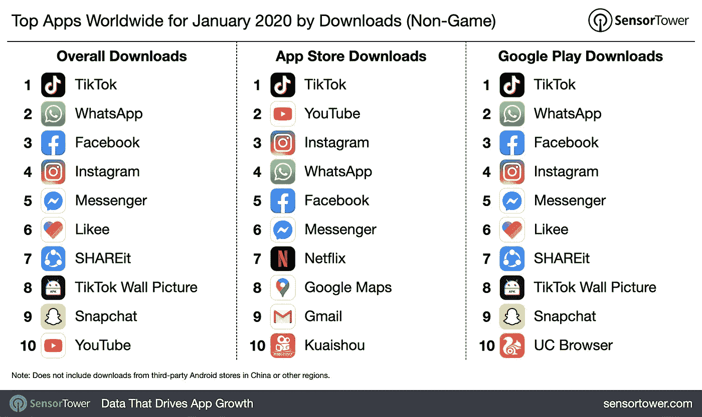

2020 年 1 月，抖音成为美国下载量最大的应用。(可见[传感塔](https://sensortower.com/)

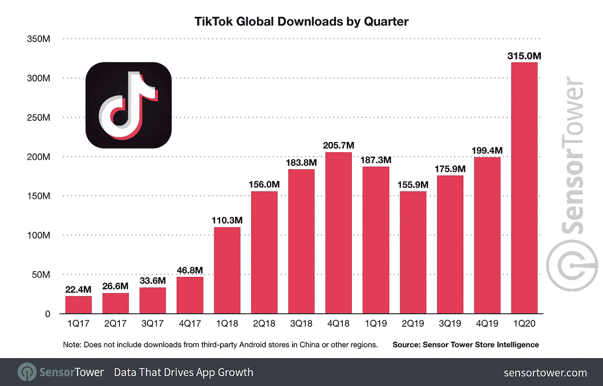

抖音全球总下载量由[传感器塔](https://sensortower.com/blog/tiktok-downloads-2-billion)

它以产生病毒歌曲和滑稽的哑剧视频而闻名。

通常人们每天花 52 分钟在这款应用上，Snapchat、Instagram 和脸书的每日使用时间分别为 26 分钟、29 分钟和 37 分钟。

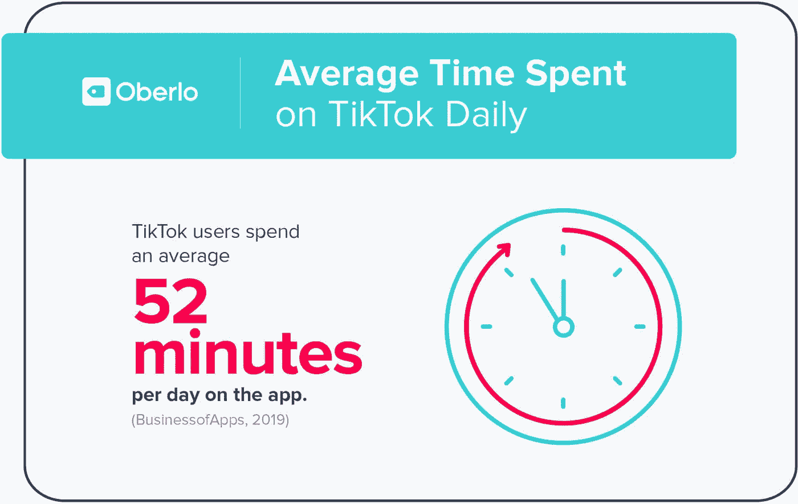

来自[奥伯罗](https://au.oberlo.com/blog/tiktok-statistics)的报道

除了增长黑客战略，这个 60 秒的短视频应用程序充满了迷因、喜剧、舞蹈和人才。配备业内数一数二的 [**推荐引擎**](https://en.wikipedia.org/wiki/Recommender_system) ，不需要搜索也不知道看谁。点击一下就可以提供个性化的订阅源。

这种对容易获得的快乐的无止境的快速刺激使人很难停止浏览抖音。有人称之为终极时间杀手，它会吸走你的业余时间，并以某种方式创造出“抖音的 5 分钟等于现实生活中的 1 小时”的扭曲空间。

今天，我们将讨论抖音如何通过交互使用机器学习来分析用户的兴趣和偏好，然后为不同的用户显示个性化的提要。

推荐引擎对于数据科学社区来说并不陌生。相反，一些人认为它是老一代人工智能系统，因为缺乏令人眼花缭乱的效果，如图像识别或语言生成。

然而，该建议仍然是占主导地位的人工智能系统之一，在几乎所有的在线服务和平台上都有最广泛的实现。例如，YouTube 视频建议、您从亚马逊收到的活动电子邮件、您在浏览 kindle 书店时可能也会喜欢的书籍。

事实上，根据 Gomez-Uribe 和网飞的首席产品 Neil Hunt 发表的 [***研究论文***](https://dl.acm.org/doi/10.1145/2843948) 称，个性化和推荐的综合效果每年为网飞节省超过 10 亿美元。此外，80%的订户从引擎的建议列表中选择视频。

现在让我们来看看 TikTock 的不同之处。

# 1.推荐引擎介绍。

*(对于已经熟悉这个话题的人，请跳到下一节。)*

关于推荐引擎有用的文章和在线课程太多了，我不想重新发明轮子。

下面是两个资源，可以帮助你建立一些推荐引擎的基础知识。

*   从头开始构建推荐引擎的综合指南[ [链接](https://www.analyticsvidhya.com/blog/2018/06/comprehensive-guide-recommendation-engine-python/) ](阅读大约需要 35 分钟，复制 python 代码需要 40-60 分钟)
*   来自吴恩达的推荐引擎[ [链接](https://www.youtube.com/playlist?list=PL-6SiIrhTAi6x4Oq28s7yy94ubLzVXabj) ](花一个小时看视频)

除了基本的，工业化的推荐引擎需要一个健壮的后端和架构设计来集成。下面是一个主要的例子。

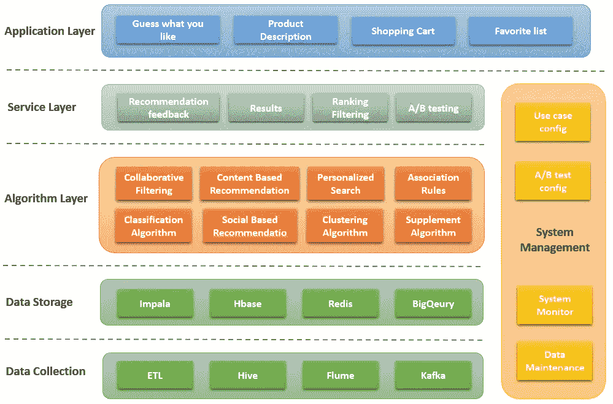

推荐引擎—由 Catherine Wang 创建，保留所有权利

一个实时系统应该有一个坚实的数据基础(用于收集和存储)，以支持解决不同业务问题的多个抽象层(算法层、服务层和应用层)。

# 2.抖音推荐系统设计的原型

以用户为中心的设计仍然是原型的核心。简单来说，抖音只会推荐你喜欢的内容，从冷启动调整到为活跃用户明确推荐。

如果你点击了一个跳舞的视频，你的反馈最初会被定制为娱乐类别，然后后续机制会跟踪你的行为进行进一步分析，最终只会为你提供精确的建议。

高级工作流。

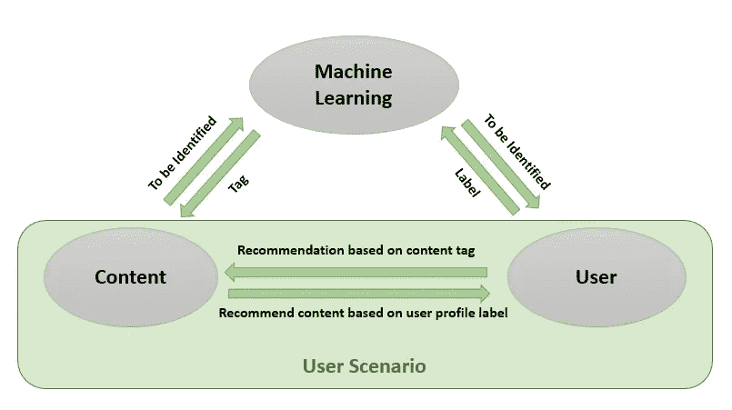

3 主要组件—由 Catherine Wang 创建，保留所有权利

在抖音的原型中，有三个主要的构建模块，1)标记内容，2)创建用户简档和用户场景，以及 3)训练和服务推荐算法。

我们将在下面的内容中逐一讨论。

## 2.1 数据和特征

首先，数据。如果我们正式描述推荐模型，它是一个符合用户对用户生成内容的满意度的函数。提供该功能需要从**输入数据。**

*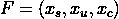*

****内容数据*** —抖音是一个拥有海量用户生成内容的平台。每种类型的内容都有其特点，系统应该能够识别和区分它们，以提供可靠的推荐。*

****用户数据****——*这些包括兴趣标签、职业、年龄、性别、人口统计等。它还包括基于 ML 的客户聚类的潜在特征。*

****场景数据*** —该数据根据不同的场景跟踪使用场景和用户的偏好变化。例如，当用户在工作、旅行或通勤时，他们喜欢观看什么类型视频*

*一旦收集了相关数据，就可以导出四种关键工程特征，并输入到推荐引擎中。*

*   ****关联特征*** *:* 表示内容属性与用户标签之间的关联，包括关键词匹配、分类标签、来源匹配、主题标签，以及用户与内容之间的向量距离等潜在特征。*
*   ****用户场景特征*** :从场景数据中设计，包括地理位置、时间、事件标签等。*
*   ****趋势特征:*** 它们基于用户交互，代表全球趋势、热点话题、热门关键词、趋势主题等。*
*   ****协同特性:*** 基于协同过滤技术。它平衡了狭义推荐(偏见)和协作推荐(泛化)。更准确地说，它不仅会考虑单个用户的历史，还会分析相似用户组的协作行为(点击、兴趣、关键词、主题)。*

*该模型将通过学习上述特征来预测内容是否适合场景中的用户。*

## *2.2 无形目标*

*在推荐模型中，点击率、阅读时间、点赞、评论、转发都是可以量化的目标。您可以使用模型或算法来拟合它们，然后做出最终的预测。*

*但是，其他无形的目标是无法用那些可量化的指标来评价的。*

*例如，为了维护一个健康的社区和生态系统，抖音的目标是压制涉及暴力、诈骗、色情、胀气的内容，以及新闻等高质量内容。*

*为了这个目标，边界控制框架需要被定义在可量化的模型目标之外。(内容审核系统)*

## *2.3 算法*

*推荐目标可以表述为一个经典的机器学习问题。然后通过包括[协同过滤模型、](https://en.wikipedia.org/wiki/Collaborative_filtering)逻辑回归模型、[因子分解机、](https://en.wikipedia.org/wiki/Matrix_factorization_(recommender_systems)) GBD、深度学习等算法进行求解。*

**

*协作过滤的一个例子*

*一个工业级的推荐系统需要一个灵活的、可扩展的 ML 平台来建立实验管道，快速训练各种模型。然后将它们堆叠起来，以便实时提供服务。(例如，结合 LR 和 DNN，SVM 与 CNN)*

*除了主要的推荐算法，抖音还需要训练内容分类算法和用户描述算法。下面是内容分析的层次分类结构。*

*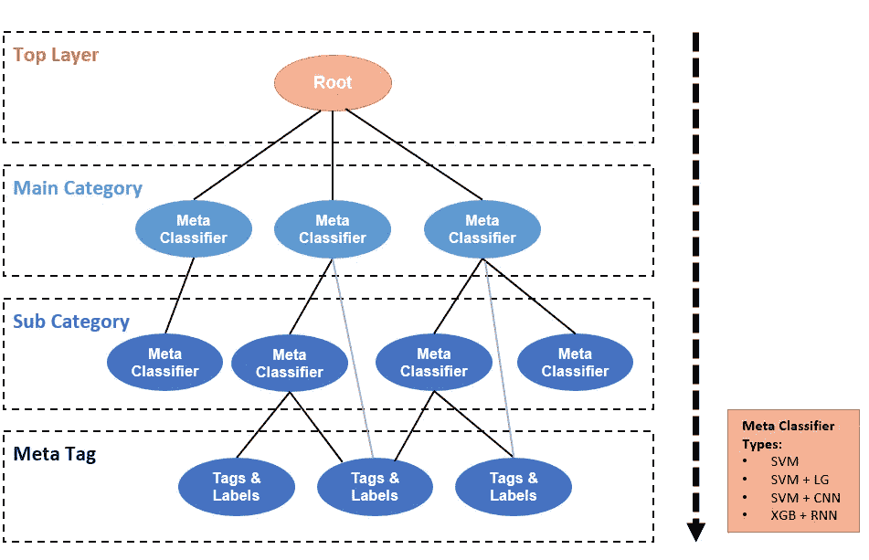*

*分级分类树—由 Catherine Wang 创建，版权所有*

*从主根向下钻取。向下每一层都是主类别和子类别。与单独的分类器相比，使用层次分类机制可以更好地解决数据偏斜问题。*

## *2.4 培训机制*

*抖音使用实时在线训练协议，它需要较少的计算资源，并提供快速反馈。这些对于流媒体和信息流产品非常重要。*

*用户行为和动作可以被即时捕获，然后反馈给模型，以反映在下一个提要中。(例如，当您点击一个新视频时，您的订阅源将根据您的最新操作快速改变)*

*最有可能的是，抖音正在使用 Storm Cluster 来处理实时样本数据，包括点击、显示、收藏、喜欢、评论和分享。*

*他们还将自己的高性能系统构建为模型参数和特征服务器(特征库和模型库)。 ***特征库*** 可以保存和服务数千万个原始特征和工程矢量。并且 ***模型库*** 将维护和提供模型和 tuned_parameters。*

*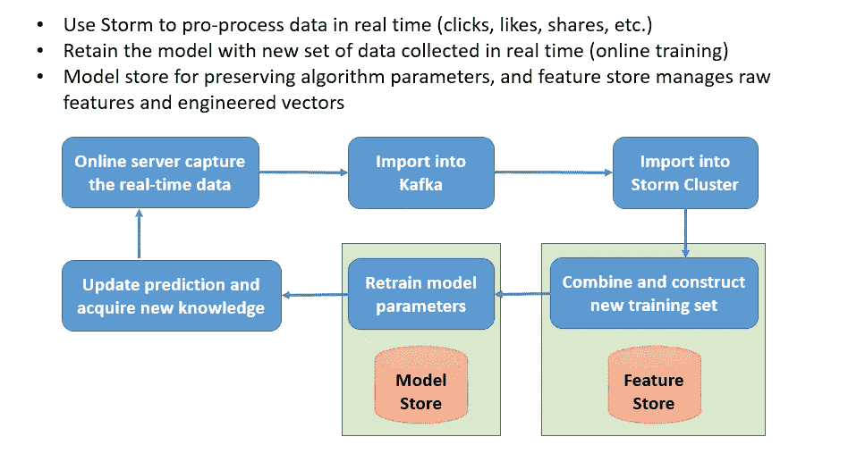*

*在线培训机制(简化版)—由 Catherine Wang 创建，保留所有权利*

*整个训练过程是:1)在线服务器捕获实时数据，然后将它们存储到 Kafka 中，2) Storm cluster 消费 Kafka 数据和产品特征，3)特征存储收集新特征和推荐标签，以构建新的训练集，4)在线训练管道重新训练模型参数，将它们存储到模型存储中，5)更新客户端推荐列表，捕获新的反馈(用户动作)并再次循环。*

# *3.抖音的推荐工作流程*

*抖音从未向公众或技术社区透露其核心算法。但基于该公司发布的零碎信息，以及极客使用逆向工程技术发现的踪迹。我得出以下结论。*

**(免责声明——这是我的解释和推断，可能与抖音的做法有所不同)**

*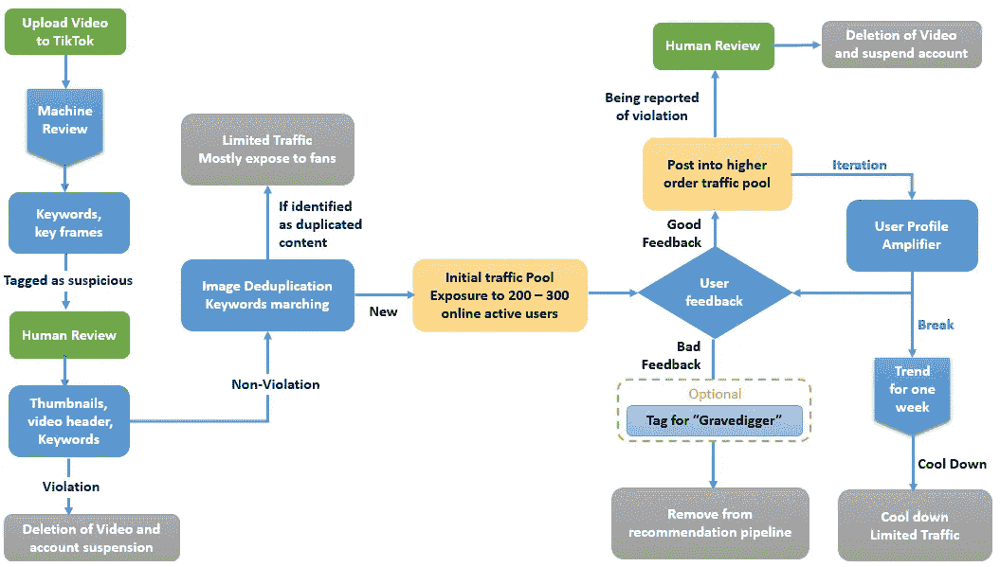*

*推荐工作流程-由 Catherine Wang 创建，保留所有权利*

***第 0 步:用户生成内容(UGC)双重审核系统***

*在抖音，每天有数百万的内容由用户上传。恶意内容更容易发现单机审查系统的漏洞，而人工审查在这种情况下是不现实的。因此，双审查成为抖音筛选视频内容的主要算法。*

*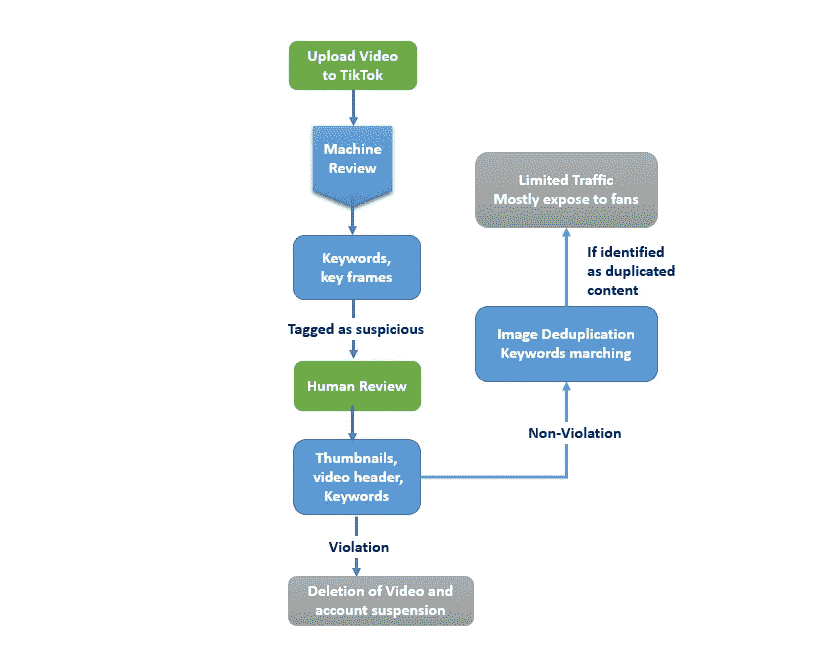*

****机器审核:*** 一般来说，Duo-audit 模型(基于计算机视觉)可以识别你的视频图像和关键词。它主要具有两个主要功能:1)检查剪辑中是否有违反，并检查文案。如果涉嫌违规，内容将被模型拦截，并标记为黄色或红色供人工审查。2)通过从视频中提取图片和关键帧，抖音的 duo audit 算法会将提取内容与其庞大的存档内容库进行匹配。重复将被选中，降低流量，减少推荐引擎的权重。*

****人工审核:*** 主要关注 3 个区域:视频标题、封面缩略图、视频关键帧。对于通过双重审核模型标记为可疑的内容，技术人员将手动审查它们。如果认定为违反规定，该视频将被删除，并暂停帐户。*

***第一步:冷启动***

*抖音推荐机制的核心是 ***信息流漏斗。*** 当内容通过 duo-audit 审核后，将被放入冷启动流量池。例如，在你的新视频通过审查过程后，抖音会分配 200-300 个活跃用户的初始流量，在那里你可以获得几千次曝光。*

*在这种机制中，一个新的创造者可以与一个社会影响者(可能有数万名追随者)竞争，因为他们有相同的起点。*

***步骤 2:基于公制的称重***

*通过最初的流量池，视频可以获得成千上万的观看次数，那些数据将被收集和分析。在分析中要考虑的指标包括喜欢，观点，完整的观点，评论，追随者，转发，分享数据等。*

*然后，推荐引擎将根据这些初始指标和您的帐户得分(无论您是否是高质量的创作者)来衡量您的内容。*

*如果引擎决定对你的内容进行加权，前 10%会额外增加 10，000-100，000 的流量曝光。*

***第三步:用户档案放大器***

*将进一步分析来自步骤 2 业务池的反馈，以决定使用用户简档放大器。在这一步中，跑赢的内容将在特定的用户群(如体育迷、时尚爱好者)中得到强化和放大。*

*这类似于“猜你喜欢什么”功能的概念。推荐引擎将建立一个用户简档库，以便它可以找到内容和用户组之间的最佳匹配。*

*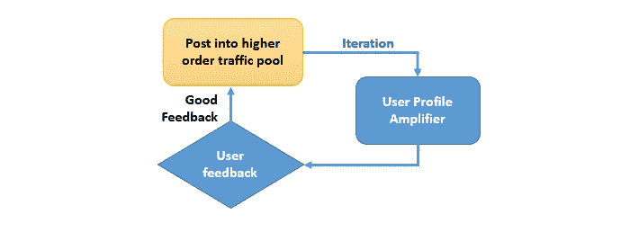*

***第四步:精品潮流池***

*不到 1%的内容将最终进入趋势池。内容在这个池中的曝光率比其他池高一个数量级。因为趋势内容会无差别的推荐给所有用户。(假设，不管你是谁，你可能想看“黑人的生命很重要”的最新抗议者视频)*

***其他步骤:延迟点火***

*一些 Tiktokers 会注意到，他们的内容在发布了几周后突然获得了巨大的关注。*

*主要有两个原因:*

*   *首先，抖音有一个算法(昵称“掘墓人”)来回顾旧的内容和挖掘高质量的候选人曝光。如果你的内容被这个算法选中，这表明你的帐户有足够的垂直视频来获得一个干净的标签。这个标签将增加你的内容在掘墓人中的可见性。*
*   *第二，“新潮效应。”这意味着，如果你的一个内容获得了数百万的浏览量，它会将流量导向你的主页，从而增加我们旧内容的浏览量。这种情况经常发生在垂直创作者(如:滑稽猫视频创作者)身上。一个新潮的视频将点燃所有其他高质量的视频(人们想看到更多你可爱、好奇的猫)。*

*[wiflegif.com](https://wifflegif.com/)*

***限制:流量峰值***

*如果一个内容云通过了信息流漏斗(duo-audit，weighing iterations，amplifiers)，创作者的账号就会获得过度的曝光、用户互动和粉丝。*

*但是根据研究，这个高暴露时间窗口很窄。通常，窗口期会持续一周左右。过了这个时间段，这个内容和账号就会降温，甚至后续的视频也很难变得新潮。*

***为什么？***

*主要原因是抖音希望引入多样性，并消除算法中的无意偏差。通过这种设计，推荐引擎将不会倾向于特定类型的内容，从而确保新内容将获得平等的机会进入潮流池。*

***参考文献**:*

1.  *【https://www.businessofapps.com/data/tik-tok-statistics/ *
2.  *[https://media kix . com/blog/top-tik-Tok-statistics-demographics/](https://mediakix.com/blog/top-tik-tok-statistics-demographics/)*
3.  *[https://en.wikipedia.org/wiki/TikTok](https://en.wikipedia.org/wiki/TikTok)*
4.  *[http://shop.oreilly.com/product/9780596529321.do](http://shop.oreilly.com/product/9780596529321.do)*
5.  *[https://sensortower.com/](https://sensortower.com/)*
6.  *[https://www . nytimes . com/2020/06/03/technology/tiktok 是未来. html](https://www.nytimes.com/2020/06/03/technology/tiktok-is-the-future.html)*

**关于我，我是*👧🏻谁住在澳大利亚的墨尔本。我学的是计算机科学和应用统计学。我对通用技术充满热情。在一家全球咨询公司担任人工智能工程师领导👩🏻‍🔬，帮助组织集成人工智能解决方案并利用其创新力量。在[**LinkedIn**](https://www.linkedin.com/in/catherine-wang-67547a53/)**上查看更多关于我的内容。***