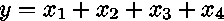
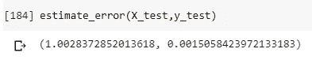
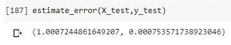

# 为什么训练集应该总是小于测试集

> 原文：<https://towardsdatascience.com/why-training-set-should-always-be-smaller-than-test-set-61f087ed203c?source=collection_archive---------10----------------------->

## 在小样本上测试机器学习模型不是一个好主意


图片由来自 [Pexels](https://www.pexels.com/it-it/foto/codice-computer-database-dati-546819/?utm_content=attributionCopyText&utm_medium=referral&utm_source=pexels) 的 [luis gomes](https://www.pexels.com/it-it/@luis-gomes-166706?utm_content=attributionCopyText&utm_medium=referral&utm_source=pexels) 拍摄

在机器学习领域，数据科学家经常被告知在大型训练数据集上训练监督模型，并在少量数据上测试它。训练数据集总是被选择为大于测试数据集的原因是有人说用于训练的数据越大，模型学习得越好。

我一直认为这种观点实际上并不完全正确，在本文中，我将向您展示为什么您应该保持尽可能小的训练集，而不是保留大部分数据用于测试目的。

# 衡量模型性能的问题

监督模型的真正任务不是在尽可能大的数据集上学习，而是以一种在未知数据上模型性能令人满意的方式学习。这就是为什么我们在看不见的数据集上执行模型交叉验证。

数据科学家通常会提供一些在此类测试数据集上计算的模型性能指标，如 AuROC、准确度、精度、均方根误差等。这个想法是，如果我们的模型在看不见的数据上表现得很好，那么它在生产环境中也可能表现得很好。

但是我们对模型性能的测量有多精确呢？如果我说我的模型在 100 条记录的测试数据集上有 86%的 AuROC，而另一个人说另一个模型在 10.000 条记录的测试数据集上仍有 86%的 AuROC，这两个值有可比性吗？如果你是一家大公司的经理，你被要求根据模型预测投资一些钱，你会选择哪一个？

我给你剧透一下。测试集越大，对其计算的任何性能指标的精确度就越高。

# 模型性能的精确度

我是一个物理学家，所以我总是被告知每一个测量都必须有一个误差估计。我可以告诉你我身高 1.93 米，但是我不会给你任何关于这个估计的精确度的信息。是 1 厘米，还是 12 厘米？你说不准。正确的信息可能是:我身高 1.93 +/- 0.01 米，这是 1.93 米，误差估计为 1 厘米。如果有人试图测量我的身高，他可能会得到 1.93 +/- 0.12 米，这是 1.93 米，误差估计为 12 厘米。哪种测量方法更准确？当然是前者。其误差比后者低一个数量级。

同样的方法可以应用于机器学习模型。每次计算模型性能(例如，AuROC、accuracy、RMSE)时，您都在执行一个测量，这个测量之后必须有一个误差估计。

那么，如何计算这种测量的误差估计呢？有许多技术，但我更喜欢使用 bootstrap，这是一种重采样技术，允许您计算估计的标准误差和置信区间。bootstrap 样本中可观察值的标准差是我们可以在报告中使用的标准误差。很容易证明，误差估计随样本容量的平方根而减小。

这就是为什么您必须使用大型测试集的原因。它提供了对未知数据的模型性能的更好估计。

# 例子

在以下 Python 示例中，我将模拟包含 4 个独立正态分布要素的 100 万条记录数据集，然后根据以下线性模型人工创建一个目标变量:



线性模型预测和样本 *y* 值之间的误差是正态分布的。

然后，我将拟合线性模型，计算 RMSE 及其标准误差，并向您展示测试集越大，标准误差越小，因此 RMSE 值的精度越高。

你可以在我的 GitHub 资源库找到完整的代码:[https://GitHub . com/gianlucamalato/machine learning/blob/master/Small _ training _ large _ test . ipynb](https://github.com/gianlucamalato/machinelearning/blob/master/Small_training_large_test.ipynb)

首先，让我们导入一些库。

```
import numpy as np
from sklearn.model_selection import train_test_split
from sklearn.linear_model import LinearRegression
from sklearn.metrics import mean_squared_error
```

让我们用 4 个正态和独立分布的特征来模拟 100 万条记录。

```
np.random.seed(0)
X = np.random.normal(size=4000000).reshape(1000000,4)
```

现在，我们可以应用正态分布噪声来创建输出变量。

```
y = []
for record in X:
   y.append(np.sum(record) + np.random.normal())
   y = np.array(y)
```

## 小型测试集

现在，让我们将我们的 X，y 数据集分成训练集和测试集，测试集大小是总大小的 20%。

```
X_train, X_test, y_train, y_test = train_test_split(X, y, test_size=0.2, random_state=42)
```

现在我们可以拟合线性回归模型。

```
model = LinearRegression()
model.fit(X_train,y_train)
```

在计算模型性能之前，让我们先定义一个函数，用 100 个样本的自举来计算 RMSE 及其误差估计。

```
def estimate_error(X_test,y_test):
  n_iter = 100
  np.random.seed(0)
  errors = [] indices = list(range(X_test.shape[0]))
  for i in range(n_iter):
    new_indices = np.random.choice(indices,
        len(indices),replace=True) new_X_test = X_test[new_indices]
    new_y_test = y_test[new_indices] new_y_pred = model.predict(new_X_test) new_error = np.sqrt(mean_squared_error(new_y_test,new_y_pred)) errors.append(new_error) return np.mean(errors),np.std(errors)
```

这些是结果:



所以我们有一个等于 1.0028 +/- 0.0015 的 RMSE。

## 大型测试集

如果我们使用一个覆盖总人口规模 80%的测试集会发生什么？

随机分割和模型训练变成:

```
X_train, X_test, y_train, y_test = train_test_split(X, y, test_size=0.8, random_state=42)model = LinearRegression()
model.fit(X_train,y_train)
```

新 RMSE 的估计是:



所以我们有 1.00072 +/- 0.00075。我们的误差已经减少了一个数量级，所以最后一个测量更准确。

# 到底发生了什么？

这些数字里没有魔法。简单地说，这是大数定律和自举技术的一种效果。对于更大的数据集，样本中的任何可观测估计值都变得非常接近其在样本总体中的值。

# 结论

更大的测试数据集确保更准确地计算模型性能。对较小数据集的训练可以通过分层抽样等抽样技术来完成。它将加速你的训练(因为你使用更少的数据)，并使你的结果更可靠。

# 参考

[1]吉安卢卡·马拉托。*自举。任何数据科学家的瑞士军刀*。数据科学记者。[https://medium . com/data-science-reporter/the-bootstrap-the-Swiss-army-knife-of-any-data-scientist-ACD 6 e 592 be 13](https://medium.com/data-science-reporter/the-bootstrap-the-swiss-army-knife-of-any-data-scientist-acd6e592be13)

[2]吉安卢卡·马拉托。*分层抽样以及如何在 R 中进行*。走向数据科学。[https://towards data science . com/layered-sampling-and-how-to-perform-it-in-r-8b 753 efde 1 ef](/stratified-sampling-and-how-to-perform-it-in-r-8b753efde1ef)

[3]吉安卢卡·马拉托。*机器学习中如何从庞大的数据集中正确选择样本*。数据科学记者。[https://medium . com/data-science-reporter/how-to-corrective-select-a-sample-from-a-high-dataset-in-machine-learning-24327650372 c](https://medium.com/data-science-reporter/how-to-correctly-select-a-sample-from-a-huge-dataset-in-machine-learning-24327650372c)