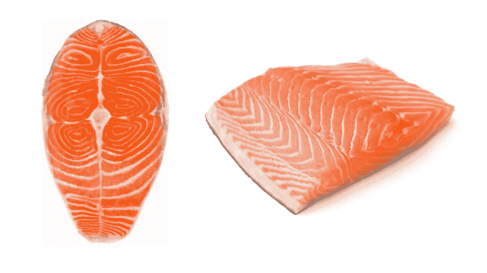

# 为什么迁移学习会成功或失败？

> 原文：<https://towardsdatascience.com/why-transfer-learning-works-or-fails-27dcb8095670?source=collection_archive---------43----------------------->

## 理解迁移学习和领域适应背后理论的(几乎)无数学指南。


来源:Sebastian Ruder，via [slideshare](https://www.slideshare.net/SebastianRuder/transfer-learning-the-next-frontier-for-machine-learning)

D 在 2016 年的 NIPS 教程演讲中，吴恩达表示，**转移学习**——机器学习的一个子领域，模型被学习，然后部署在*相关但不同的领域*——将是未来几年机器学习商业成功的下一个驱动力。这种说法很难反驳，因为避免从头学习大规模模型将大大减少 it 所需的高计算和注释工作，并节省数据科学从业者的大量时间、精力，最终节省资金。

作为后面这些话的一个例子，考虑一下脸书的 DeepFace 算法，该算法在 2014 年首次实现了接近人类的人脸验证性能。它背后的神经网络是在 440 万张 **标记的**人脸上训练的——大量的数据必须被收集、注释，然后训练整整 3 天，还没有考虑微调所需的时间。毫不夸张地说，如果没有脸书的资源和深度学习工程师，大多数公司和研究团队将不得不投入数月甚至数年的工作来完成这样的壮举，其中大部分时间都花在收集足够大的标注样本来构建这样一个精确的分类器上。

这就是迁移学习神奇地介入的地方，它允许我们在相关数据集之间使用相同的模型，就像如果它们来自相同的来源，我们会做的那样。尽管迁移学习算法在计算机视觉和自然语言处理等挑战性任务中非常有效和有用，但在实践中也很失败，解释为什么它可能会或可能不会发生是我下面要尝试做的。

## 追根溯源

到开始我对迁移学习理论的简单而轻松的介绍，让我介绍一下 Homer，一个快 30 岁的家伙，他因为机器学习的炒作而变得非常兴奋，并决定自动分类他在 Aliexpress 上为他的在线商店购买的所有奇怪的东西。荷马的主要动机源于他的懒惰，事实上，全球速卖通上翻译的英文描述通常非常混乱，至少可以说，这意味着只有荷马购买的照片才能提供任何关于实际商品的信息。

因此，Homer 下载了一个巨大的标注了亚马逊上销售的商品的数据集，希望一个分类器能够很好地处理他在全球速卖通上的图片。“是什么让他这么想的？”你可能会问。嗯，首先，Homer 假设有那么多来自亚马逊的图像，他可以使用最先进的具有 1 万亿层的深度神经网络为它们学习一个低错误的分类器。此外，在他祖母海边的房子度过的所有暑假期间，荷马有机会阅读了瓦普尼克先生和切尔沃嫩基斯先生的所有最新作品[，他们(非常)宽泛地提出了以下不等式:](https://en.wikipedia.org/wiki/Vapnik%E2%80%93Chervonenkis_dimension#In_statistical_learning_theory)


荷马知道，由于神经网络的能力[能够从输入其中的任何垃圾](https://arxiv.org/pdf/1611.03530.pdf)中很好地学习，右手边的第一项可以变得尽可能小。此外，Homer 认为，第二项分子中神经网络的高度复杂性将由他可支配的大样本量来补偿，从而使其也接近于 0。困扰 Homer 的最后一块拼图是左手边，因为他不确定亚马逊上看不见的商品的分类错误是否会接近全球速卖通上的分类错误。为了解决这个问题，他做了如下简单的假设:


“什么样的距离？”一个好奇的读者会问，这样做是对的。但是荷马并不在乎这些细节，他现在对自己很满意，并继续进行下面的终极不等式:


> “现在我知道该做什么了，”荷马对自己说，他指的是转移学习，而不是他那不安定的生活。“首先，我需要找到一种方法来转换来自亚马逊的图像，使它们看起来尽可能与来自全球速卖通的图像相似，从而缩短它们之间的距离。然后，我将在转换后的图像上学习一个低错误分类器，因为我仍然有它们的基本事实标签，并将在我的全球速卖通图像上进一步应用这个分类器。”

思考片刻后，他对自己的想法变得不确定了。“我是不是漏掉了什么？”他问自己，同时从速卖通网站订购了一把激光军刀伞，碰巧的是，他照做了。

## 什么叫做相似？

虽然荷马关于迁移学习的直觉在最后一个不等式中被形式化了，但他仍然缺乏一个关于距离的明确定义的概念，他可以用这个概念来衡量两个数据集之间的可迁移性。

> “粗略地说，”荷马自言自语道，“有两种比较数据集的可能方式:无监督的和有监督的。如果我选择有监督的，这意味着我同时考虑图像和它们的标签来测量距离；如果我选择无监督的，我只考虑图像。”

这两种方法都困扰着荷马，但原因不同。对于监督方法，他必须有速卖通图像的标签，这是他最初试图通过迁移学习获得的东西。至于无监督的，他认为这是不够准确的，因为两个图像可能看起来很相似，即使它们属于不同的类别。“这怎么可能？”你可能会想。嗯，看看[速卖通](https://www.aliexpress.com/item/32582734205.html)和[亚马逊](https://www.amazon.co.uk/1-5kg-Fresh-Salmon-Fillet-Boned/dp/B0747NCFJB)网站上卖的以下两件商品，告诉我它们属于哪一类。



在全球速卖通(左图，来源:宁波 Creight Co .，via aliexpress)和亚马逊(右图，Regal Fish Supplies，via amazon)上销售的商品图片。

很明显，左边的那个是睡枕(很明显，不是吗？！)，而右边的是三文鱼片。为了避免这种混乱，荷马决定提出以下假设:


Homer 认为，将标注函数放入等式中——从各自的在线平台输出任何可能项目的类别的函数——是考虑数据集注释和图像实际相似性的最直接方式。令人惊讶的是，这就是他如何(几乎)得出与迁移学习理论的开创性论文中的定理 1 极其接近的结果。

## 一个理论将他们联系在一起

如果我告诉你，大多数关于迁移学习理论的论文都可以归结为 Homer 从他对机器学习原理的最基本理解中得出的不等式，你可能会很惊讶。[那些众多的论文](https://arxiv.org/pdf/2004.11829v1.pdf)和荷马脚踏实地的推理之间的唯一区别是，荷马必须通过做出假设，而不是通过实际证明与出版作品相反的预期结果。

我现在将向您展示一个稍微重新表述的不等式，它抓住了定理 1 和荷马推理的本质，然后我们将看到它如何用于证明所有那些在之前在 Medium 上讨论过的[迁移学习算法。我的改写如下:](/search?q=transfer%20learning)


在这里，我的目标域是我想要分类的任何数据集，而不需要手动注释它；在 Homer 的例子中，它由在 Aliexpress 上销售的商品的图像组成。我的源域，在同一个例子中是丰富的 Amazon images，是任何带注释的数据集，我可以为其生成一个低错误模型，用于目标域的后记。右边的第二项是两个域之间的无监督距离，我们通常可以在不知道任何一个域中实例的标签的情况下计算该距离。致力于迁移学习的研究人员为这个术语提出了许多不同的候选词，其中大多数采取了这两个领域的(边缘)分布之间的某种差异的形式。最后，第三项代表通常所说的*先验适应性*:一个不可估计的量，只有当真正的目标域的标记函数已知时，我们才能计算它。后一种观察使我们得出以下重要结论。

> 虽然迁移学习算法可以显式地最小化我们不等式的前两项，但先验适应性项仍然**不可控**，潜在地导致迁移学习的**失败**。

如果你在这一点上等待一个神奇的解决方案，那么我将不得不说没有这样的解决方案，这将使你失望。您可以使用[基于内核的、矩匹配的或对抗性的方法](/deep-domain-adaptation-in-computer-vision-8da398d3167f)，但这不会改变任何事情:最终您将受到不可估计项的支配，该项可能最终用其看不见的手影响您的模型在目标域中的最终性能。然而，好消息是，在大多数情况下，它仍然比完全不传输要好。

## **回到现实生活**

我现在将展示一个在[这篇论文](http://proceedings.mlr.press/v9/david10a/david10a.pdf)中提供的简单例子，它强调了遵循上述哲学的迁移学习方法的一个缺陷。在本例中，我们将考虑两个一维数据集，分别代表源域和目标域，并使用下面给出的代码生成。

```
**import** numpy **as** np

np.set_printoptions(precision=1)**def** generate_source_target(xi):
 k=0
    size = int(1./(2*xi))
    source = np.zeros((size,))
    target = np.zeros_like(source)

    **while** (2*k+1)*xi<=1:
        source[k] = 2*k*xi
        target[k] = (2*k+1)*xi
        k+=1
    **return** source, target
```

执行这段代码会在区间[0，1]中产生两组点，如下图所示。


例如，当ξ = 0.1 时，它将返回以下两个列表:

```
source,target = generate_source_target(1./10)print(source)
[0\. 0.2 0.4 0.6 0.8]print(target)
[0.1 0.3 0.5 0.7 0.9]
```

我将进一步将标签 1 归属于来自源域的所有点，将标签 0 归属于来自目标域的所有点。我的最终学习样本将因此变成:

```
source_sample = [(round(i,1),1) **for** i **in** source]
target_sample = [(round(i,1),0) **for** i **in** target]

print(source_sample)
[(0.0, 1), (0.2, 1), (0.4, 1), (0.6, 1), (0.8, 1)]print(target_sample)
[(0.1, 0), (0.3, 0), (0.5, 0), (0.7, 0), (0.9, 0)]
```

为每个样本找到一个完美的分类器容易吗？是的，因为在源域的情况下，它可以使用阈值函数来完成，对于坐标小于 0.8 的点输出 1，否则输出 0。这同样适用于目标域，但这一次分类器将为坐标小于 0.9 的所有点输出 0，否则输出 1。最后，我们现在将确定这两个畴之间的距离取决于ξ，因此可以通过减小它来使其任意小。为此，我们将使用 1-Wasserstein 距离，在我们的例子中，它正好等于ξ。让我们使用下面的代码来验证它:

```
**from** scipy.stats **import** wasserstein_distance**for** xi **in** [1e-1,1e-2,1e-3]:
    source, target = generate_source_target(xi)
    wass_1d = wasserstein_distance(source,target)
    print(round(np.abs(wass_1d-xi),2))0.0
0.0
0.0
```

总的来说，我们现在有了一个可以学习完美分类器的源域和一个可以任意接近它并且也存在完美分类器的目标域。现在，我们提出的问题是:在这种看似非常有利的情况下，迁移学习能成功吗？！嗯，你可能已经猜到了，不，它不能，原因隐藏在我之前提到的不可估计项中。事实上，在这个设置中，无论您做什么，同时对两个域**和**都好的分类器是不存在的。实际上，其最低可能误差将正好等于 1-ξ，同样，通过相应地操纵ξ，可以使其任意接近 1。正如《建立迁移学习理论的基础》一文中的作者所说，

> “当没有对源域和目标域都表现良好的分类器时，我们不能指望通过在源域只训练目标模型来找到好的目标模型。”

遗憾的是，这个对于**所有**无法访问目标领域标签的迁移学习方法都是正确的。

## 便笺后

虽然这篇文章看起来有点悲观，但是它的主要目的是向感兴趣的读者提供迁移学习理论的一般理解，而不是欺骗他或她使用迁移学习方法。事实上，迁移学习算法在实践中通常非常有效，因为它们经常应用于它们之间有很强语义联系的数据集。在这种情况下，假设不可估计的项很小是合理的，因为很可能存在一个对两个域都适用的好分类器。然而，正如生活中经常发生的那样，除非你尝试一下，否则你永远不会知道是否是这样，这就是它的美妙之处。

如果你想更深入地讨论你感兴趣的关于迁移学习理论的论文背后的技术细节，请在评论中告诉我。