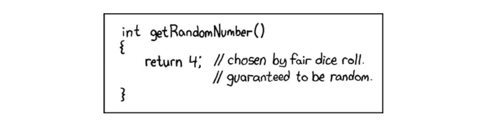
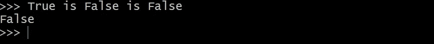
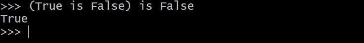
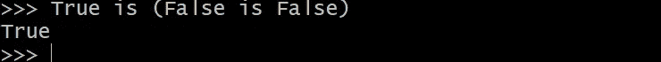
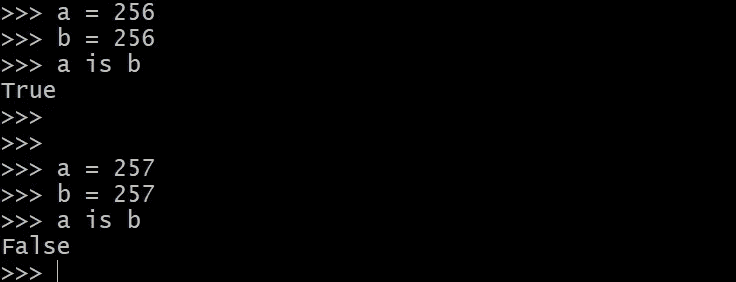
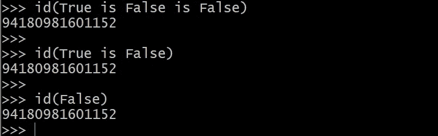
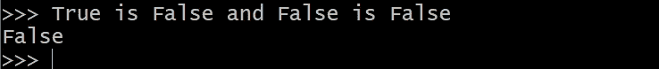

# 为什么`真的是假的是假的`->假的？

> 原文：<https://towardsdatascience.com/why-true-is-false-is-false-false-dc41b11eb27a?source=collection_archive---------46----------------------->

[由 xkcd](https://xkcd.com/221/)

Python 很酷:在使用了这么多年之后，有一些奇怪的小东西让我感到惊讶。我最近偶然发现了一行非常简单的代码，我所知道的大多数有经验的 python 程序员不通过谷歌搜索就无法解释它。

## WTF…

为什么令人惊讶？我想这是因为如果一个人被要求执行这个命令，他不会输出这个结果。我是这样推理的。

我需要执行第一条`is`语句，这将给我`False`，然后执行第二条`is`，这将给我`True.`:

有了括号，它确实像预期的那样工作。同样，如果你从右到左以相反的顺序做，你会得到同样的结果。

## 然后我想…

也许是`is`操作符在与另一个`is`组合时执行方式不同。

python `is`操作符所做的是比较对象的 id。当你做`a is b`时，你实际上是在问`id(a) == id(b)`，即这些是否是相同的对象(不像`a==b`只比较值)。Python 的`id`操作符实际上[指向存储对象的真实内存地址](https://stackoverflow.com/a/16408542/2069858)。

我知道`id`有一些意想不到的行为。例如，[-5，256]范围内的整数的 T12 总是相同的，而对于其他整数，它在内存中分配单独的位置。我的意思是:

这是 Python 使用的一种启发式方法。下面是来自[文档](https://docs.python.org/3/c-api/long.html#c.PyLong_FromLong)的解释:

> 当前的实现为所有在`-5`和`256`之间的整数保留了一个 integer 对象数组，当你在这个范围内创建一个 int 时，你实际上只是得到了一个对现有对象的引用。所以应该可以改变`1`的值。我怀疑 Python 在这种情况下的行为是不确定的。:)

这是我所知道的，但是这里我们处理的是广播到`0`和`1`的布尔值的比较，它们依次落入[-5，256]范围。事实上，如果你检查一下，它们都指向同一个内存地址。

所以，这肯定是某个用双`is`语句把事情搞砸的东西。

## 啊哈…

然后我问自己:*当你在一个语句中有多个比较操作符时，Python 中实际上发生了什么？*以下是[文档中所说的](https://docs.python.org/3/reference/expressions.html#comparisons):

> 形式上，如果 *a* 、 *b* 、 *c* 、…、 *y* 、 *z* 是表达式， *op1* 、 *op2* 、…、 *opN* 是比较运算符，那么`a op1 b op2 c ... y opN z`相当于`a op1 b and b op2 c and ... y opN z`，只是每个表达式最多求值一次。

所以实际上发生的是语句`True is False is False`被替换为语句`True is False and False is False`。显然，第一个`True is False`被评估为`False`，它决定了最终结果。

*附:如果你喜欢这个故事，可以考虑在 medium 上关注我或者订阅我的* [*电报频道*](https://t.me/graphML) *或者* [*我的 twitter*](https://twitter.com/SergeyI49013776) *。*