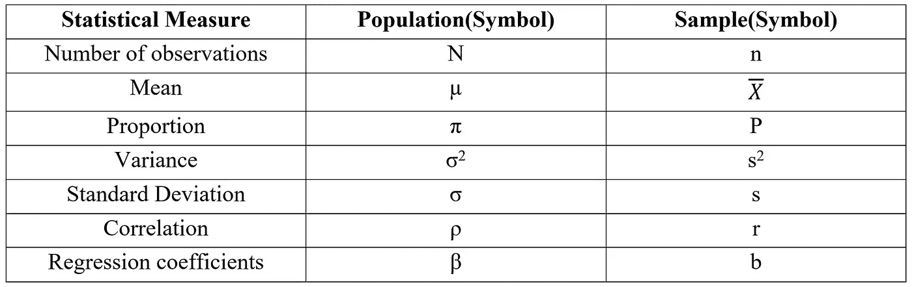
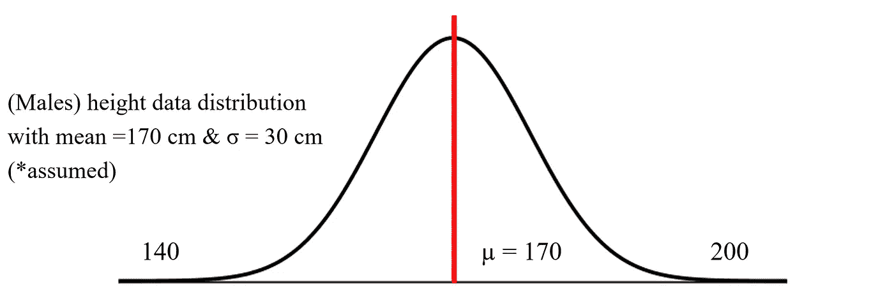
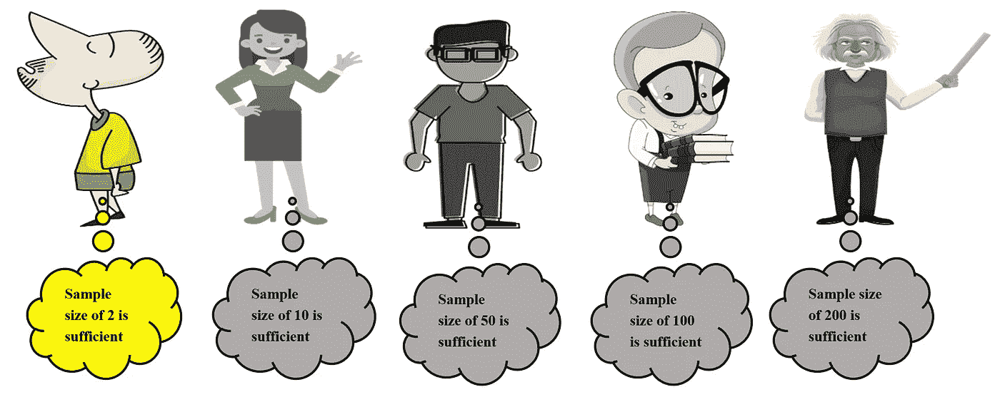
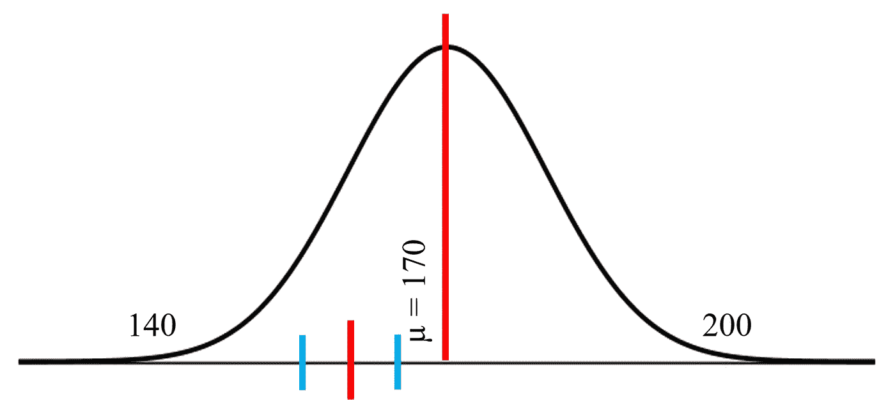
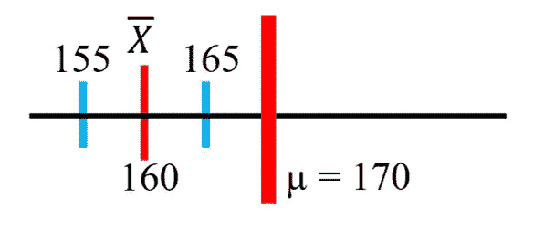
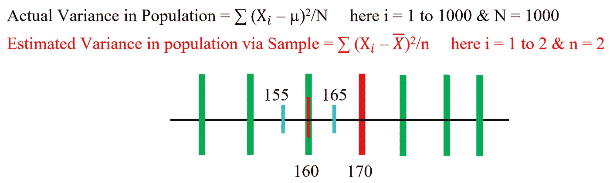
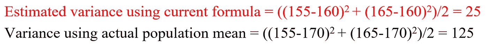
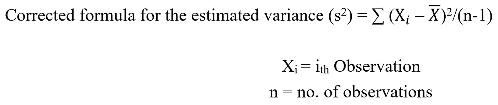

# 为什么样本使用 n-1？——她问

> 原文：<https://towardsdatascience.com/why-use-n-1-for-the-sample-she-asked-aa4e5043571a?source=collection_archive---------35----------------------->

## 简单的视觉演示，以清除这个臭名昭著的疑问！

奥斯潘·阿里在 [Unsplash](https://unsplash.com?utm_source=medium&utm_medium=referral) 上的照片

在直接进入主题之前，让我们先来看看分别用于人口统计和样本统计的符号:

为了一致的解释，我将引用我以前博客中的相同信息:

 [## 简化的中心极限定理

### 推论统计学背景中的一个重要定理，没有它，推论统计学就没有…

towardsdatascience.com](/central-limit-theorem-simplified-7a0689519a46) 

*继续 X 星球上 1000 名男性(总人口)的相同身高数据集:*

(图片由作者提供)

正如我以前的博客中关于中心极限定理的演示活动所讨论的，评估专家从预先确定样本大小的总体中抽取样本，每个人给出 10 个总体均值的评估。我们有 5 个自称的评估专家来评估不同抽样选择的平均值:

(图片由作者提供)

让我们以第一个评估专家选择两个样本大小为例。对于他的第一个样本，他根据两个导出值(155 cm 和 165 cm)的平均值估计样本平均值为 160 cm。

(图片由作者提供)

(图片由作者提供)

请注意，评估专家在整个评估实践中并不知道总体均值，他对总体的最佳猜测是他从总体中得出的两个观察值的均值。这对于我们来说是显而易见的，因为我们很清楚总体分布和总体均值，但根据他的说法，总体均值的一个最佳可行位置是收集的观测值的均值，我们也很清楚，在该均值附近**方差度量最小**。因此，当我们使用 N(如在人口统计中)编写方差计算公式时，请注意当我们试图用样本数据估计它时会出现什么问题:

(图片由作者提供)

大绿条反映可行的总体平均位置(对于我们的数据，它是大红条-实际位置)。上述表示的目的是让您明白，总体均值可以在任何地方，与之相关的方差**总是大于估计专家使用样本数据均值估计的方差**。

*注意我们的实际差异是如何被当前公式低估的。*

进一步澄清，评估专家以样本数据平均值的形式给出最佳评估，再次重复是总体平均值的可行位置之一。正如我们所知，这里的总体均值(170)位于估计均值(160)的右侧，但如果我们使用其他数据集，它可以在任何地方。假设样本数据平均值处的总体平均值位置**缩小了方差测量值**，即方差在样本数据平均值附近最低。这是我们需要通过操纵分母来扩大方差度量的唯一原因，用 n-1 代替 n 来补偿低估。

> 如果你想到，通过使用修改后的公式，我们仍然不能很好地进行估计，请记住，当我们增加样本量时，估计会提高(在本例中，我们只取两个样本量，样本量的增加最终会反映出估计的准确性)
> 
> [*这个概念在中心极限定理博客中也有详细证明](/central-limit-theorem-simplified-7a0689519a46)

## **为什么分母必须是 n-1，而不是 n-2，n-3 或 n-10？**

当我们从总体数据中抽取一个样本时，很明显它的平均值是固定的(一个常数值):

让我们取一个任意的样本= 2，5，7，10，16 (5 个数据点)

样本均值= (2+5+7+10+16)/5 = 8

现在，如果我给某人这个样本的 4 个数据点和样本平均值(固定的)，他/她能解出第 5 个数据点吗？答案是肯定的！

> 这是关键点，在样本统计中，我们失去了一个自由度，因为存在样本均值的约束(固定)。这就是为什么我们总是从样本量中减去 1 = n-1

这个 n-1 修正最初被称为贝塞尔修正，如果您对详细的推导感兴趣，请参考下面提到的链接:

 [## 贝塞尔校正

### 在统计学中，贝塞尔的修正是在样本方差和样本……的公式中使用 1 代替 n

en.wikipedia.org](https://en.wikipedia.org/wiki/Bessel%27s_correction#Proof_of_correctness_%E2%80%93_Alternative_1) 

对于人口统计，我们没有任何限制，因为人口数据点的选择对实际人口平均值没有任何影响，这就是为什么 N 被用作计算的分母。

这篇博客到此为止，我希望这个简化的解释最终消除了在分母中使用 n-1 而不是 n 来表示被低估的样本统计量的疑虑。偏差的唯一**来源于估计练习，这是达到人口统计测量的接近近似值的唯一现实方法。最终的结论是通过**使用贝塞尔的修正**使**有偏方差输出**(被低估——通过样本计算获得)无偏。**

我将在接下来的博客中介绍一个低调但非常重要的“自由度”概念，因为它对于解决统计学中的主要解释挑战非常重要，请保持关注

谢谢！！！