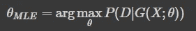
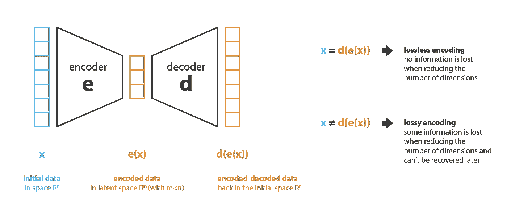
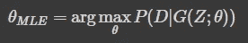
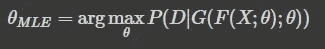

# 为什么 VAE 是基于可能性的生成模型

> 原文：<https://towardsdatascience.com/why-vae-are-likelihood-based-generative-models-2670dd81a40?source=collection_archive---------12----------------------->

罗马法师在 [Unsplash](https://unsplash.com?utm_source=medium&utm_medium=referral) 上拍摄的照片

生成模型是学习从现有数据生成真实数据样本的强大工具

当我们必须决定使用什么具体方法来实现生成模型时，我们必须处理泛化与可解释性的权衡:简单的方法是可解释的，但它们的泛化能力明显低于像(大)神经网络这样的方法，神经网络已经显示出惊人的能力，但它们被认为是黑盒，因为我们仍然缺少一个合理的理论。

然而，从更抽象的角度来看这个领域，我们有一个很好的理论，它可以帮助我们理解一些重要的特征，并提供重要的见解，当我们必须监控这种模型的训练时，这将是有用的

我们将在这里集中讨论这个问题

# 最大似然估计

最大似然估计是参数估计的基本工具

从贝叶斯定理

贝叶斯定理，来自 https://www.saedsayad.com/naive_bayesian.htm

我们看到可能性被标识为 P(X|C ),但是它是什么意思呢？

严格来说，它代表一个条件概率，因此给定 C 为真，X 的概率是多少

但是当 C 是一个分布时会发生什么呢？

P(X|C)仍然是概率，因此它的输出在[0，1]中吗？

这个问题的答案是否定的:P(X|C)的输出恰好是非负的(事实上，贝叶斯公式中的所有其他项都是非负的，并且后验概率一定是非负的，因为它是一个概率),但它不是一个概率，因此它可以大于 1

那么这个值如何转化为后验概率呢？

这是贝叶斯公式中其他两项的工作:先验和证据(分母),虽然前者来自假设(因此在计算方面不存在问题),但后者需要计算，这实际上通常非常困难，因为它涉及非常大空间上的棘手积分。

无论如何，如果我们专注于可能性，我们就不必担心处理棘手的积分

想法是使用似然性作为两个分布 X 和 C 之间的相似性度量，并在其上定义一个优化问题

但是请注意，可能性不是距离，因为它不是对称的:所以 P(X|C)不是 P(C|X)

要理解什么样的顺序对你有效，只要想想你想要什么样的后验概率:可能性的顺序是相反的。

但是哪两个发行版？

因为我们的目标是在数据集 D 上训练生成模型 G(X ),那么我们将有

- D:训练集中数据的分布

- G(X):生成数据的分布

这意味着将训练转换为以最大化 P(D | G(X))为目标的优化问题

实际上，我们将使用本质上是参数函数的神经网络来实现 G(X ),我们称之为 G(X；因此，问题的最终目标是找到最大化数据集和生成数据之间的似然性的θ值

生成模型学习的最大似然法

# 生成模型

因此，虽然现在应该清楚我们的生成模型是参数化的，以及我们使用什么框架来估计它的参数，但我们还没有定义什么是 X

这是一个很好的观点，因为生成模型本身不需要额外的输入 X，它应该像一个黑盒

*   按下按钮，我们就可以从中获取样本
*   并允许我们改变一些设置，因为它们通过微分与结果有某种联系

但是实际上，如果我们使用一个神经网络，那么它就是一个完全确定性的架构:它没有任何新颖性，给定相同的输入和相同的参数化，那么它总是返回相同的输出

那么我们如何增加新鲜感呢？

为此我们需要一个额外的输入

我们终于能够将它与标题联系起来，并开始处理最初的问题，所以让我们介绍一下变分自动编码器

# VAE

关于 VAE 的详细介绍，我推荐这篇来自 TDS 的文章

 [## 了解变分自动编码器(VAEs)

### 逐步建立导致 VAEs 的推理。

towardsdatascience.com](/understanding-variational-autoencoders-vaes-f70510919f73) 

来自[**https://towardsdatascience . com/understanding-variable-auto encoders-vaes-f 70510919 f 73**](/understanding-variational-autoencoders-vaes-f70510919f73)

简而言之，VAE 的生成部分是解码器，它本质上是一个将潜在空间中的点映射到可观察空间中的点的函数，用于图像生成

-潜在空间作为 N 维欧几里得空间，所以潜在码本质上是 N 个实元素的向量

-作为 W x H x 3 张量空间的可观察空间，用于 W x H 大小的 RGB 图像

因此，从统计的角度来看，解码器得到输入分布 Z，并将其转换为输出分布 X，因此 G(Z) -> X 和 Z 的每个样本 Z 属于潜在空间，X 的每个样本 X 属于可观察空间

这个公式给出了在最大似然估计框架中使用的第二个术语:发生器分布，所以让我们用正确的符号重写这个公式

MLE 解码器培训

我们可以开始训练解码器了吗？

从技术上来说，是的，我们可以开始随机采样发电机潜在空间，并从数据集中随机选取图像，尝试调整θ，以对齐 2 个分布

它永远不会起作用，因为不仅潜在代码和期望输出之间没有关系，而且它还会随着时间而改变。

因此，让我们至少将潜在空间代码与数据集中的每个样本相关联:随机选择，但至少随时间保持不变。

在这种情况下，解码器将最好地完全过拟合训练集，但是将具有零泛化能力，因此完全无用。

我们缺少的组件是编码器，它与解码器的功能相反:从可见空间映射到潜在空间。

让我们用 F(X) -> Z 来表示它，让我们假设用神经网络来实现它，还有另一个参数函数

理论上，它应该增加参数空间大小，但是实际上编码器和解码器共享它们的权重(在某种意义上，它们的参数化是另一个的转置),所以让我们用θ来标识它们两者的参数化

加上这个就结束了循环，允许我们从图像生成代码，从代码生成图像。

因此，从分布角度来看，我们通过对数据集进行采样获得分布 X，该分布由编码器转换为分布，该分布由解码器转换为分布 X’，因此，通过比较 X 和 X’，可以在 MLE 框架中进行训练，我们可以表示如下

全自动编码器的 MLE 训练

# 结论

在这里，我们已经详细地展示了自动编码器如何在最大似然估计框架中被训练，以及为什么它们被称为基于似然的生成模型