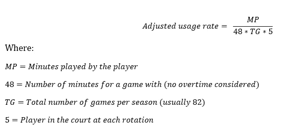
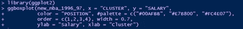

# 为什么皮蓬对芝加哥公牛队来说如此便宜？

> 原文：<https://towardsdatascience.com/why-was-pippen-such-a-bargain-to-the-chicago-bulls-8436f273beca?source=collection_archive---------71----------------------->

## 尽管他对球队做出了宝贵的贡献，但斯科蒂·皮蓬的合同不仅仅是偶然的。

来源:[芝加哥公牛队的脸书页面](https://pt-br.facebook.com/chicagobulls/photos/happy-birthday-scottie-pippen/10155930727761614/)

对于那些看过网飞的[《最后的舞蹈》](https://www.youtube.com/watch?v=cBGZPXEdrlM)的人来说，纪录片提出的最好奇的一点是芝加哥公牛队的小前锋斯科蒂·皮蓬相对较低的工资。1987 年被公牛队选中，这位球员在 20 世纪 90 年代统治 NBA 期间成为全明星迈克尔·乔丹的主要搭档。尽管如此，在这支球队赢得的最后一个总冠军期间，公牛队的球星只有联盟第 112 高的工资，只有公牛队的第 6 高。相比之下，乔丹在 1997-98 赛季赚了 3300 万美元，而皮蓬只赚了不到 270 万美元

是什么导致了皮蓬这样的结局？在纪录片的第二集，集中在旧金山的历史，皮蓬解释说，他接受了公牛队最初的安全建议。这名球员担心职业生涯过早结束，而目前保护球队和球员的工资帽规则在 1991 年并不存在。[哥伦比亚广播公司体育频道的山姆·奎因详细介绍了皮蓬的合同条款。](https://www.cbssports.com/nba/news/scottie-pippen-contract-explained-how-chicago-bulls-managed-to-sign-hall-of-famer-for-pennies-on-the-dollar/)

虽然人们普遍认为皮蓬接受了一份糟糕的合同，但如果公牛队能够重新谈判他的合同或放弃他，根据他的潜力，皮蓬在 1997-98 赛季应该赚多少钱？首先，让我们后退一步:鉴于皮蓬在 1996-97 赛季的表现，下赛季皮蓬对公牛队的价值是多少？根据收集的数据，在 1996-97 赛季，皮蓬的 VORP 为 6.1，调整后的使用率为 15.7%(分别落后于迈克尔乔丹的 8.6 和 15.8%)。但是，我们知道，这个表现并没有体现在皮蓬那个赛季的工资上。皮蓬的薪水仅排在第六位，相当于中锋卢克·朗利薪水的 80%，调整后的使用率为 7.5%，VORP 仅为 0.1%。换句话说:皮蓬是公牛队第二有价值的球员，但他的收入远非如此。

根据从 hoopshype.com 收集的数据([参见我的 Github 访问我的网页抓取脚本](https://github.com/almeidaeas))，在 1996-97 年期间，一名小前锋的平均工资为 150 万美元。皮蓬的合同保证他的工资为 225 万美元。尽管他的工资比小前锋的平均工资高 55%，但他无法获得小前锋中 24 个最高工资之一。但是据报道，皮蓬可以得到更多。事实上，他真的做到了，当他与公牛队和火箭队签署了一份先签后换的协议，几乎是他年薪的三倍。

图 1:小前锋的工资分布(1996-97)

但是 90 年代 NBA 一个球员的工资受什么影响呢？GM 怎么决定一个球员值多少钱？也许他们依赖于球员的统计数据，以前的成绩，球员可能给球队带来的影响(好的和坏的)，球队对具有某些特征的球员的需求，以及最终他们可以付给球员多少钱。根据现有的统计数据，任何对此感兴趣的人的第一个明显的尝试是设计一个回归模型并对其进行调整。不幸的是，我们可能会认识到，使用球员统计数据的线性模型构建起来会非常复杂，并且可能会产生糟糕的结果。这就是为什么我试图使用尽可能少的球员数据来回答这个问题，并通过替补球员(VORP)、球员效率等级(PER)和年龄来解释每个赛季的工资。我还使用游戏和玩的分钟数来估计一种“调整后的使用率”，由下面的表达式给出:

因此，很容易理解，调整后的使用率永远不会高于 0.20，因为一名球员在球场上的时间不能超过一支球队上场时间的 20%。

但是，我没有构建回归模型，而是将统计数据分为以下 5 个百分点:

图 2:统计百分比

根据皮蓬的贡献，这可能是预测皮蓬应得工资的一个好方法，因为俱乐部总经理不能最大化为每个球员支付的每单位货币所获得的 VORP 或 PER，原因有三:(i) NBA 不是一个竞争性的劳动力市场(有限数量的俱乐部试图获得有限数量的有价值的球员)；(ii)俱乐部和球员之间的谈判更类似于拍卖(如果球员不同意俱乐部给他的条款，他可以期待另一个球队的提议)；以及(iii)谈判采取长期合同的形式(这意味着俱乐部和球员不会根据生产率逐年谈判工资)。

一个球员挣的工资可以由这些百分比决定吗？一旦我将百分位数作为字符加载，我们可以运行单向方差分析(ANOVA)来回答这个问题。正如我们在下面的 p 值中看到的，我们应该否认我们的零假设(H0 ),即根据变量的百分位数，总体均值是相等的。

图 3:方差分析—百分位数

正如我们在下面的交互图中看到的，VORP 和 PER 似乎都是很好的解释变量，因为绩效越低，工资就越低。在 1996-97 赛季期间，NBA 俱乐部的管理人员成功地根据球员的预期表现来决定球员的工资。只有当我们关注年龄在第 5 百分位的球员时，情况似乎才不是这样，对此最合理的解释可能是当一名球员即将满 30 岁时，他与他签订了更长的合同:随着球员年龄的增长，他不能像过去那样发挥作用。

图 4:互动图(绩效 x 工资 x 年龄)

所以，我的下一步是使用这些数据对我的基础进行聚类。作为一个通常的步骤，我运行了一个肘方法来帮助我发现最佳数量的集群，然后我运行了 Kmeans 算法，最佳数量为 4 个集群。请注意，我没有缩放数据，因为我的所有变量已经处于相同的比例。然后，我将每个球员的聚类数合并到我的主数据框中，发现皮蓬与迈克尔·乔丹、丹尼斯·罗德曼、克里斯·穆林、哈基姆·奥拉朱旺、雷吉·米勒等并列第一。

图 5: Kmeans 分析

有了这些聚类的知识，我们现在可以根据球员的表现和对球队的重要性以及他的职位来分析他的期望工资:

图 6:创建我的箱线图

这就是我们得到的。毫不奇怪，表现更好、对球队更重要的球员过去会挣得更多，这种情况一直持续到我们的时代。根据该图，集群 1 中玩家的平均工资曾经比其他集群中玩家的平均工资至少高 1.8 倍。但是引起我注意的是最低工资和标准差的值。凯文·加内特(160 万美元)、雷·阿伦(180 万美元)、阿伦·艾弗森(220 万美元)等人签下的新秀合同可以解释为什么一个贡献更多的球员工资相对较低。但是皮蓬的收入甚至低于平均工资(225 万美元)。

图 7: Bloxplot 和平均工资(按组)

到目前为止，我们已经有了很好的线索，但还没有确定一个值。我试图采用卡方独立性检验，使用平均工资作为我的参考值，来发现球员的工资是否与其集群和位置相关，因为我们对集群 1 的小前锋的工资感兴趣。p 值表示聚类和位置在统计上相互关联。进行分析，并检查观察值和期望值。正如我之前所展示的，一个小前锋在第一个赛季的平均工资是 200 万美元，但预期的平均工资应该在 270 万美元左右——不是很高，但比皮蓬那个赛季的工资高出 50 万美元。

图 8:卡方检验

那么，小前锋的工资怎么样呢？他们以前比其他位置的球员挣得多吗？少？上面的方框图告诉我们，在第一个集群中，小前锋的平均工资是 200 万美元，标准差是 70 万美元。一旦罗德曼的收入几乎是皮蓬的三倍，考虑到拉特里尔·斯普雷维尔是 1996-97 赛季收入最高的小前锋(700 万美元)，认为小前锋过去收入更少并不为过——特别是如果我们考虑到在 90 年代， 大个子(大前锋或中锋)曾经在比赛中有更大的影响力——如果你怀疑这一点，我强烈推荐你柯克·戈德斯贝里的书，《翻滚的球》！

为了消除这种怀疑，除了 Tukey 测试之外，我还使用每个位置的平均工资来评估这种可能性，答案是位置可以决定球员的工资

图 9:方差分析—位置

根据这一点，我们可以说，这场比赛中最伟大的小前锋之一是一个便宜货，不仅因为他的合同不好，还因为 NBA 高管没有为大部分小前锋支付应有的工资。大前锋和中锋是最受关注的球员，也许是因为当时这项运动的特点，争夺空间是一个决定性因素，他们因此得到了更好的交易——哈基姆在乔丹之上被选中，公牛队的第三人是篮板手，甚至查尔斯·巴克利在 1993 年当选 MVP 都不是巧合。他们都是球员，除了荒谬的天赋，还有身体，力量和为空间而战的意愿。

皮蓬最好的机会是尝试得到一份更好的合同，就像他在 1997-98 赛季所做的那样。但是考虑到大个子是最有目标的球员，公牛队的高管们没有动力给他一份更好的合同，如果他们认为他们可以为那个位置找到另一个好球员的话。即使是 33 岁的勇士队传奇人物克里斯·穆林，那个赛季也只赚了 280 万美元(比标准偏差多一倍)。

最后，有人可能会说皮蓬应该像斯普雷威尔一样至少赚 700 万美元，但如果一个先签后换的交易可以给球队带来两名出色的球员，为什么要给皮蓬 700 万美元并超越上限呢？我们可以分析公牛队高层在 1996-97 赛季末面临的选择，是给皮蓬一份新合同。但这需要一堆博弈论，这是另一个帖子的问题。