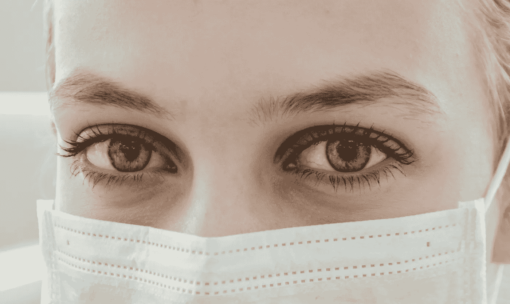
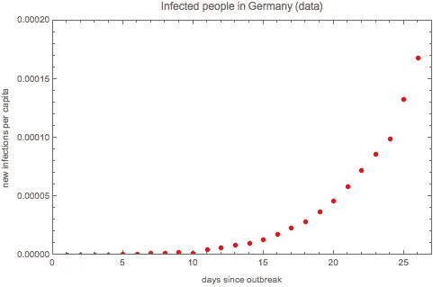
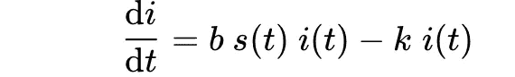
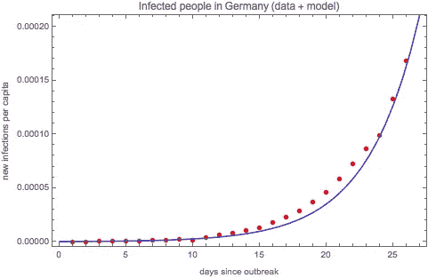
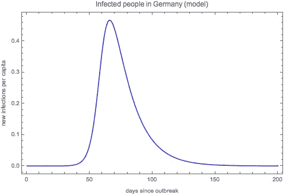
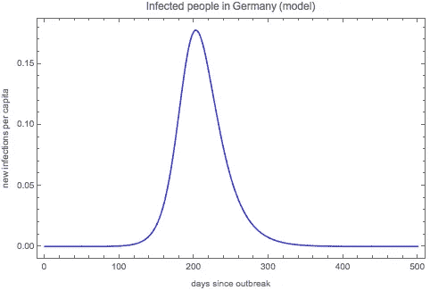

# 为什么我们绝对没有过度宣传冠状病毒

> 原文：<https://towardsdatascience.com/why-we-are-definitely-not-over-hyping-coronavirus-f69a8d3cc091?source=collection_archive---------20----------------------->

## 系统地

冠状病毒爆发的定量研究。在 [Unsplash](https://unsplash.com/s/photos/sick?utm_source=unsplash&utm_medium=referral&utm_content=creditCopyText) 上由 [Ani Kolleshi](https://unsplash.com/@anikolleshi?utm_source=unsplash&utm_medium=referral&utm_content=creditCopyText) 拍照

D*isclaimer:如果定量分析和微分方程吓到你了，别担心。本文重要的外卖都印在* ** *粗体* ** *(而且是重要的！).此外，图表中有大量的智慧，即使你不在乎所有这些是如何计算的。*

新闻告诉我们要保持社交距离。政府告诉我们要自我隔离。世界卫生组织(World Health Organization)正在讨论拉平新感染的曲线，这样我们就不会让世界卫生系统超负荷运转。

有些人声称这完全是一场骗局。其他人看到了情况的严重性，但不明白为什么这比季节性流感更糟糕。其他人再次认为，人死于许多不同的原因，冠状病毒造成的死亡人数与全因死亡率相比看起来相当小。

他们错了。

日冕是一个巨大的威胁。数字说明了一切。

在这个故事中，我将对世界范围内的疫情进行定量分析。这样做的目的是估计如果我们不采取行动，我们将不得不哀悼多少死者。这应该非常清楚地表明您是否需要关注(即自我隔离)。

 [## 如果你因为冠状病毒而被锁在家里，11 堂最好的数据科学课

### 不用花一分钱就可以开始你的职业生涯

towardsdatascience.com](/11-best-data-science-classes-if-youre-locked-home-because-of-coronavirus-ca7d2d74a454) 

# 有多少人被感染了？

出于几个原因，我使用德国的数据作为例子。一方面，欧洲是疫情的新中心，所以选择一个欧洲国家是有意义的。

另一方面，德国并不是第一个遭受日冕袭击的欧洲国家，因此它有更多的时间做好准备。这包括建立测试中心。所以确诊病例的数字可能更接近现实。

我选择了德国，而不是我居住的法国，因为测试似乎要好得多。截至记者发稿时，德国目前的确诊病例比法国多 50%。但是死亡人数也少了八倍！由于两国的医疗保健系统相似，这表明法国的许多病例没有被发现。

图 1:病毒爆发以来人均确诊电晕病例数。水平轴上的第 1 天转化为 2 月 24 日，此时开始获取数据。

德国官方数据由[罗伯特·科赫研究所](https://www.rki.de/DE/Content/InfAZ/N/Neuartiges_Coronavirus/Fallzahlen.html)记录。从 3 月 4 日起的数据从他们的档案中提取；对于 2 月 24 日至 3 月 3 日之间的数据，我使用了相应的[维基百科页面](https://en.wikipedia.org/wiki/2020_coronavirus_pandemic_in_Germany)。不幸的是，由于官方来源没有提供数据，我无法提取恢复的人数。但是由于这个数字到目前为止还很小，忽略它不会使结果有很大偏差。

从 3 月 16 日起，德国推出了社交距离措施，如关闭学校、幼儿园和大学、酒吧、剧院和电影院，鼓励人们在家工作。由于这些措施需要一些时间来产生可见的效果，我们也包括了从 3 月 16 日到记者发稿时的数据。

图 1 显示了自爆发以来德国冠状病毒检测呈阳性的人口比例。截至记者发稿时，这一比例约为万分之十七。相比之下，普通流感每年平均影响 1 万人中的 61 人。

自疫情爆发以来，科罗纳啤酒的销量直线下降(尽管这种啤酒与病毒无关)。照片由[汉尼斯·里克特](https://unsplash.com/@weristhari?utm_source=unsplash&utm_medium=referral&utm_content=creditCopyText)在 [Unsplash](https://unsplash.com/s/photos/sick?utm_source=unsplash&utm_medium=referral&utm_content=creditCopyText) 上拍摄

# 会有多少人被感染？

下面是一些数学原理——如果你不介意，可以向下滚动到图 2。

我使用 [*先生*模型](https://en.wikipedia.org/wiki/Mathematical_modelling_of_infectious_disease)来估计德国将出现的感染人数。

在这个模型中，我们有三组人: *S* 是易感者，即尚未被感染的人。我是目前被感染的人——这是我们感兴趣的。而 *R* 则是已经痊愈或者死亡的人。

对于时间点 *t* ，I 表示易感、感染或康复的人口比例，分别为 *s(t)、i(t)* 和 *r(t)* 。请注意，我使用小写符号来谈论人口的比例。

这些分数是如何随时间变化的？开始时，除了一小部分感染者——2 月 24 日德国 8279 万人中的 16 人——每个人都是易感的。因此，在时间 *t=0* ，我们有以下情况:

越来越多的人被感染，并最终康复(或死亡)。让 *b* 是被感染者每天传播病毒的平均次数。那么易感人群的数量将随着 *b* 以及感染者与易感者相遇的次数而减少。我们可以这样写:

同样，让 k 成为每天康复的人的分数。那么最终康复(或死亡)的人数的变化是:

我们假设这个国家的人口数量保持不变，也就是说，没有大规模的移民潮，也没有太多的出生和其他原因造成的死亡。这是一个合理的近似值，考虑到 EU-边境目前已经关闭，出生率也不算太高。那么所有组的变化总和必须为零:

因此，感染者的比例变化如下:

仅此而已！

这组微分方程有解析解，但是有点难处理。所以我让我的计算机来做这项艰苦的工作，用数字来解决它。

当然，我们希望模型能够很好地描述现实。我做了一个有根据的猜测，人们平均生病 15 天，因此 k = 1/15。还有，我猜测一个生病的人平均大约三天就会传染给别人一次，所以 *b* =1/3=0.33。

我稍微调整了一下模型以更好地适应数据。在图 2 中， *b* =0.32，但 *b* 仍为 15。第 12-23 天的感染率被低估了，但之后的感染率与之前持平。这可能会稍微影响我们的结果；稍后我将详细介绍这一点。

图 2:病毒爆发以来德国人均感染人数。红点是截至发稿时的真实数据，蓝线是拟合数据的模型。水平轴上的第 1 天转化为 2 月 24 日，此时开始获取数据。

现在有趣的部分来了:在疫情高峰期会有多少人被感染？这如图 3 所示。我用了和以前一样的模型，但它将在未来几个月展示。

根据我们的模型，在大约第 65 天——也就是离新闻发布还有 40 天——几乎一半的德国人口将在没有任何政府干预的情况下被感染。这太可怕了。

对这个模型有一个警告:即使它在数学上构建得很好，也没有办法调整参数使它更好地匹配第 12 天和第 23 天之间的数据。因此，它可能比实际情况更陡峭，并且在模型中峰值可能太早。

唯一的选择是低估一切。如果我稍微把感染率改成 0.31(而不是 0.32)，模型曲线一直在数据下面。有趣的是，这并没有显著改变事情。当我低估时，高峰在 45 天后，46%的德国人口将被感染——非常接近高峰的 47%,如下图所示。

如果政府和人民不采取行动，几乎一半的德国人口将在五月初感染上科罗纳。

图 3:德国从病毒爆发到 6 个月后人均感染人数的模型。水平轴上的第 1 天转化为 2 月 24 日，此时开始获取数据。

# 医院会有多满？

根据[迄今为止最大的研究](http://weekly.chinacdc.cn/en/article/id/e53946e2-c6c4-41e9-9a9b-fea8db1a8f51)，许多病例非常轻微，只有 19%的病例是严重的。

目前还不清楚有多少严重的病例需要住院治疗，但让我们假设它约占所有病例的 5%。这是一个乐观的猜测；我假设其他 14%的严重病例有足够的护理人员和设备在家治疗。

如果 5%的病人被感染，这意味着 2.35%的德国人口在高峰期需要病床。

德国是世界上人均医院床位密度最高的 T4 之一，每 1000 名居民拥有 8 张床位。但在高峰期，我们每 1000 名居民需要 24 张床位！

如果你看看重症监护室对床位的需求，情况会更糟。这些都是电晕病患者急需的，但德国每 10，000 名居民只有 3 张重症监护病床。

另外，我还没算上因为电晕以外的其他原因生病的人。这意味着医院将会非常非常拥挤…

即使每四个重症病例中只有一个需要住院治疗，德国也需要比现在多三倍的医院床位(以及医生和护士……)。这还不包括对重症监护室、人工呼吸器等的额外需求。

在疫情爆发的高峰期，医院的床位将变得稀缺。纽约公共图书馆在 [Unsplash](https://unsplash.com/s/photos/sick?utm_source=unsplash&utm_medium=referral&utm_content=creditCopyText) 上由[拍摄的照片](https://unsplash.com/@nypl?utm_source=unsplash&utm_medium=referral&utm_content=creditCopyText)

# 有多少人会死？

不到两个月，德国的疫情将达到顶峰。这段时间不足以开发出治疗方法或疫苗。

因此，人们可以很容易地说，死亡率将会是*至少* 2.3%，而它[到目前为止一直是](http://weekly.chinacdc.cn/en/article/id/e53946e2-c6c4-41e9-9a9b-fea8db1a8f51)。

为了估计德国科罗纳的死亡人数，我们首先要估计有多少人被感染。我对图 3 中的曲线进行积分，然后乘以 k。

请记住， *k* 是每天好转的人的比率，所以 *k* 的倒数是感染的持续时间。因此，曲线下的面积除以持续时间得出了感染人数。

结果是 99%的德国人会在接下来的 6 个月内被感染。因此，德国每 50 个人中就有 1 个以上会死亡。

太可怕了。

在接下来的六个月里，德国的每个人——或任何其他与电晕打交道的国家的每个人——都会有至少两三个死去的熟人、朋友或亲戚要哀悼。

# 我们能做什么？

很多！即社会距离和隔离。

在我们的模型中，这意味着减少参数 *b* ，因为我们想要降低每天的平均感染率。我们无法真正改变 T21，因为这是疾病的内在属性。

图 4 显示了当每日感染率从 *b* =0.32 降至 *b* =0.14 时的感染人数。这意味着一个被感染的人每七天才会感染另一个人，而在上面的模型中是每三天。

你可以看到两点:第一，峰值下降到人口的 16%。如果医院里没有人患有其他疾病，也不需要额外的重症监护室，这就足够医疗保健系统处理了。在这种情况下，如果不建设额外的设施，每个人都得到他们需要的护理仍然是不太可能的。但至少没那么糟糕。

图 3:从病毒爆发到 6 个月后德国人均感染人数的模型，包括一些社交距离和隔离。水平轴上的第 1 天转化为 2 月 24 日，此时开始获取数据。

其次，峰值几乎是未来的三倍。这意味着，如果我们将社交活动减半，主要爆发将在 2020 年秋季。这将给我们更多(但可能不够)时间来开发治疗方法和疫苗。

在这种情况下，受感染的总人数也会下降，从之前的 99%下降到 83%。假设死亡率保持不变，这意味着你通过隔离拯救了六分之一人的生命。这在德国挽救了 30 万条生命。

社会距离将使医院免于人满为患，让我们有时间开发治疗方法，并拯救每个国家成千上万人的生命。

# 最后一点:呆在家里。拯救一条生命。

我知道当你总是穿着睡衣四处闲逛，而你一天的外出只是带着你的狗散步半个小时时，这感觉并不十分英勇。我知道——我住在法国，我们都被隔离在这里。

但是你*正在*做一些英勇的事情。延缓这场危机的高峰——拉平曲线——必须是我们当前的首要任务。洗手，不要摸脸，呆在家里。留下来。在。回家。

是的，我只是在重复世界各国政府的说法。因为我的定量分析证实了他们所说的一切！你不需要理解所有的分析，但是如果你是一个像我一样的极客，你可以随意探索它们的更多细节

最后，保持健康！

***编者按:*** [*走向数据科学*](http://towardsdatascience.com/) *是一份以数据科学和机器学习研究为主的中型刊物。我们不是健康专家或流行病学家，本文的观点不应被解释为专业建议。想了解更多关于疫情冠状病毒的信息，可以点击* [*这里*](https://www.who.int/emergencies/diseases/novel-coronavirus-2019/situation-reports) *。*