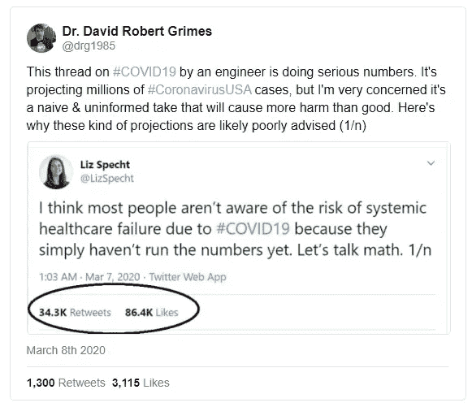
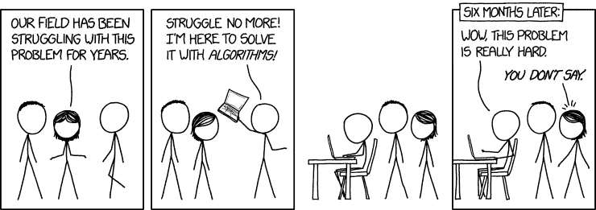

# 为什么我们如此想走出这条路？

> 原文：<https://towardsdatascience.com/why-we-are-so-tempted-to-go-out-of-lane-c4141f1e3d51?source=collection_archive---------61----------------------->

## 工作使我们习惯于

(摄影:兰迪·欧)

上周早些时候，我认真考虑讨论数据人员如何需要非常谨慎地对待他们在公共场合谈论的关于新冠肺炎的事情。有很多没有上下文的数据和图表，对我们这些做数据的人来说就像一块磁铁。我们很容易在工作中制作一些图表，得出一些不切实际的结论，并通过传播对该领域专家的不信任，意外地造成弊大于利(只需看看第 4 页上他们模型参数的复杂性)。

这种情况的一个例子是在这个 twitter 线程这里[自删除]:

*补充说明:这并不是说数据科学家和工程师垄断了新冠肺炎的可疑判断。我向熟悉病毒学和流行病学的人询问了一些他们见过的疯狂事情的例子，并得到了一些 MDs 甚至流行病学家的链接，这些人显然说了一些他们专业领域之外的不正确的事情。但是我已经超出了我的能力范围，不能评价这些人发的推特的质量，所以我避免在这里直接链接任何东西。*

*与此同时，我偶然看到 Amanda Makulec 的帖子，内容是关于在制作新冠肺炎图表* *之前需要考虑的 10 件事情，在我这个外行看来，这非常合理，可以作为在处理新冠肺炎数据时不要完全介入的指南。*

回到数据科学，我对整个情况思考得越多，我就越好奇为什么我们会有这种冲动？

我可以想象，我们中的大多数人不会认为我们天真的笔记本电脑天气模型可以揭示一些隐藏的真相，而专业气象学家和超级计算机还没有发现这些真相。为什么我们会认为我们可以比那些花了整个职业生涯思考这个问题的人更好地预测疾病的传播？大喊邓宁-克鲁格、＄{ field }的狂妄或天真是很容易的，但这并不令人满意。这些人很多既不傻，也没有恶意，为什么呢？

[*常青树 xkcd 漫画:《我是来帮忙的》*](https://xkcd.com/1831/)

然后我突然想到，我确实是被雇来在我的日常工作生活中做同样的高周转理论分析的，这是导致这些问题的原因。有时候，我天真的方法工作得出奇的好，但是即使它们不成功，如果我做错了事情，我也会得到奖励，但是迭代最终把事情做对(ish)(T1)。这在本质上与正确的科学是相反的。隐藏无效结果的强大压力导致了[文件抽屉问题](https://web.ma.utexas.edu/users/mks/statmistakes/filedrawer.html)。

问题出在我们围绕自己建立的世界里。

# 在工业界，人们偏向于行动，而不是正确

机会成本在工业中是真实存在的。决策是在不确定和竞争的条件下做出的，因为没有什么是可以保证的。走出校门的人必须学会的最重要的事情之一是，如何判断什么时候工作“好到足以”用于商业决策。这是一个非常不同的严谨标准，与学术场合的要求不同。

由于决策将在一定时间内做出，无论数据是否可用，数据从业者的角色是在给定约束的情况下提供尽可能多的数据驱动的指导。可以接受的是，所提供的信息是不完整的，有助于增加成功几率的任何东西都比什么都没有好。

当然，我们可以主张等待收集更多的数据，而且肯定会有做出正确决定的时候。但是，当一项交易绝对需要在一周内签署，或者有紧急情况，等待将不是一个选项。

# 一个例子

想象一下，你在一家销售小配件的电子商务网站工作。有一天，你注意到有一笔不寻常的订单。他们都来自一个通常不会订购很多小配件的州。从以前的销售模式经验来看，这闻起来足够可疑，看起来像某种欺诈，尽管你不确定为什么。你是做什么的？

在这种情况下，大多数人会收集这些可疑订单的数据，寻找模式。都是出自一小撮 IP 吗？都是发往同一个地址吗？是否有某种外部事件以某种方式推动了对小配件的需求(比如疫情恐慌或名人代言)？)营销团队是否购买了该地区的电视广告？

有了这些数据，你需要找到一个令人信服的案例，让管理层知道该怎么做。您是否决定这不是欺诈，并接受将产品运出(可能被盗)的风险，并且订单的资金被收回？还是宣布是欺诈需要取消所有订单，甚至可能全国暂时封锁？您需要迅速做出决定，因为这些订单通常会在 24 小时内发货，除非停止发货，否则您避免损失的选择将变得极其有限。每一分钟，面临风险的资金都在增加。

如果我处于这种情况，我很可能会主张迅速冻结所有可疑订单，为进一步调查赢得时间，而不会让公司面临进一步的风险。在大多数情况下，需要一两个线图，几个谁在下订单的描述，上层管理人员会很容易同意这样的决定。这些年来，我已经非常擅长用数据来与决策者交流这类论点，以引起他们的注意。

看一看决策的风险状况。如果订单是合法的，让订单通过的风险要比给客户带来不便的风险大得多。如果他们的订单有问题，合法买家可能会稍后回来，欺诈不太可能做同样的事情。管理层同意最初的分析，并暂时锁定整个州中具有类似特征的每个人。

如果经过进一步调查，我们发现这实际上是一场欺诈(因为有些人溜了进来)，我看起来就像一个阻止了一场灾难的英雄。"阻止了价值 X 美元的诈骗！"诸如此类。

如果我们发现我错了，并且拒绝了好的订单，公司会立即转向路线修正和损失控制。我们发表一份公开声明，也许提供折扣来挽回失去的顾客。我不太可能因为失败而受到指责，因为根据当时的信息，每个人都同意这是正确的决定。

我被称为失败者的唯一真正原因是，我在分析和报告中犯了重大错误或遗漏，近乎于疏忽。

门槛极低。

# 失败往往不是什么大事

由于奖励结构的不对称，我习惯于以特定的方式行动。以这种方式做了十多年后，它几乎是自动的。

我不在一个错误会导致生命损失或 T2 损失数十亿美元的行业工作。从全局来看，我的失败“无关紧要”。成本相对较低，失败是“快速失败，学习，重复”的科技文化的一部分。这是意料之中的事，我很大程度上被这个事实所掩盖。显然，我更希望尽可能经常有积极的结果，我也在努力做正确的事情，但我的负面影响很小。

最重要的是，整个过程有一个棘轮机制，在这种机制下，具有可见负面影响的变化可以回滚，而正面影响可以保留。拥有撤销按钮意味着你可以非常鲁莽。我敢肯定，你可以看到这是如何不能很好地转化为没有撤销按钮的情况，如紧急疫情通信。

# 理论？怕什么？

工业工作本质上(通常)是非常理论化的。虽然有“最佳实践”的总体主题，如“具有这些属性的电子邮件具有良好的回复率”，或“人脸往往会吸引用户的注意力”，但它很少被提炼到科学意义上的严格理论。我们通常不会在寻求一个有弹性的、可概括的真理的层面上运作。我们只是对找出适合当前情况的方法感兴趣。

这种做事方式的好处是你可以跟上不断变化的情况。也许没有一个神奇的好邮件或注册页面的通用理论。它可能会随着时间的推移而改变。最佳实践会随着时间的推移而发展。

理论性意味着我们经常用一套类似的工具来解决一系列问题，这些工具在本质上是通用的。例如，线性回归几乎在任何地方都有效，并给出合理的结果，尤其是当你盲目地进入一个问题空间时。当跨领域应用方法时，有趣的事情也会发生。

这种做事方式的问题在于，如果不考虑阐明理论概念，我们就很难真正坐下来思考和探索这个问题的所有因素。这意味着我们的模型不能解释许多产生误差的因素。所以我们最终使用相对简单的模型，因为任何更复杂的东西都会被抛弃。

当你在这样的条件下工作很长一段时间，就很容易认为简单化的模型对每个问题“足够好”，而不是某一组问题。这对于开始一场 Kaggle 竞赛来说可能是好的，但当你涉入一个确实有理论和精炼模型的领域时，它就不起作用了，这些理论和模型已经被许多科学家审查和实地测试了几十年。

# 所以等等，这里有什么危害？

你可能会问，坏处在哪里？最坏的情况是，我们让公众意识到情况的危险，对吗？现在每个人都落后了，这有什么不好？我们需要马上行动！

当我坐在办公桌前，越来越恐惧地看着美国对新冠肺炎的笨拙回应时，我并不是不赞同这种观点。但即便如此，我认为把东西扔在那里还是很危险的。原因如下。

我最近一直在翻阅各种各样的[应急](https://store.samhsa.gov/system/files/pep19-01-01-005.pdf)沟通手册，主要是由世卫组织和 FEMA 等政府机构编写的，以了解所有应急管理官员正在努力做些什么。他们的指导方针很大一部分集中在负责处理紧急情况的人需要如何通过有效的沟通建立和保持与社区的信任，以便当机构试图告诉公众以某种方式行动时，公众愿意倾听。

如果公众对沟通有足够的接受度，并且已经了解了情况，那么公众的行动和管理机构的目标更有可能是一致的。这将被认为是一件好事。我们希望人们现在洗手，避免大规模的人群聚集，但我们需要人们的合作来做到这一点。

这就是人们发表不负责任的言论所造成的损害。这不是因为“制造恐惧”或“传播恐慌”，而是因为它侵蚀了公众对专家的信任，无论他们是政府专家还是医学专家，他们试图让人们为了共同利益改变他们的行为。

信任很容易失去，也很难赢得，尤其是在有死亡风险的情况下。所以侵蚀的影响往往是不利的。这上面也没有撤销按钮。在这个时代，谣言一旦开始，就会很快失控。

在这种环境下，数据和可视化尤其危险，因为人们把重量和可信度归因于彩色图片和数字。即使这些数字完全是胡说八道，仅仅是数字的存在和右边标有“已感染”的红色可怕图表就让人们很难忽视。

这里是 Aner Tal 和 Brian Wansink 在 2016 年发表的一篇名为“被科学蒙蔽”的可爱论文，其中(在 3 项研究中的第 1 项)61 名参与者在一项基于土耳其机器人的研究中发现，当一种药物的广告有一个与广告文本相比没有添加新信息的图表时，它会更有说服力。虽然纯文字说服了 2/3 的参与者相信药物是有效的，**除了一个人**以外，所有看过图表的人都认为药物是有效的。

多亏了科学的神奇光环，我们才真正有了进入人们信息处理的作弊代码。这既可以用来行善，也可以用来作恶。

请小心这种力量。

这篇文章最初发表在 3 月 17 日兰迪的时事通讯上:[计数材料](https://counting.substack.com)。你可以免费订阅，一周收到一次类似的帖子，没有重新发布的延迟。