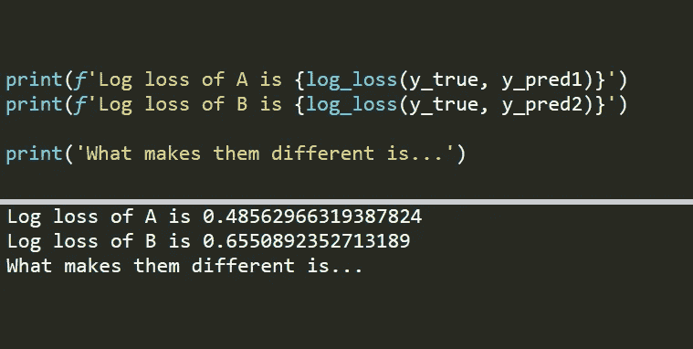
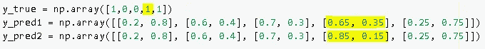

# 为什么我们关心日志丢失

> 原文：<https://towardsdatascience.com/why-we-care-about-the-log-loss-50c00c8e777c?source=collection_archive---------27----------------------->

## Kaggle 比赛中最常用的度量标准



(图片由作者提供)

机器学习管道中最关键的部分是性能评估。要了解模型的性能和缺点，需要一个强大而全面的评估过程。

对于分类任务，日志丢失是最常用的指标之一。它也被称为交叉熵损失。如果您关注或参加 Kaggle 竞赛，您会发现原木损失是评估指标的主要选择。

在本帖中，我们将看到是什么让日志丢失成为首选。在开始举例之前，让我们简要解释一下什么是日志损失。

对数损失(即交叉熵损失)通过比较实际类别标签和预测概率来评估性能。使用交叉熵来量化比较。

交叉熵量化了两个概率分布的比较。在监督学习任务中，我们有一个目标变量，我们试图预测。使用交叉熵比较目标变量的实际分布和我们的预测。结果是交叉熵损失，也称为对数损失。

在计算对数损失时，我们取预测概率的自然对数的负值。我们对预测越有把握，测井损失就越低(假设预测是正确的)。

例如，-log(0.9)等于 0.10536，而-log(0.8)等于 0.22314。因此，90%的把握比 80%的把握会导致更低的测井损失。

如果你想进一步阅读，我在另一篇[文章](/all-the-way-from-information-theory-to-log-loss-in-machine-learning-c78488dade15)中详细解释了熵、交叉熵和对数损失的概念。这篇文章更像是一个实践指南，展示了日志丢失如此重要的原因。

在分类任务中，模型通常为每个类别输出一个概率值。那么具有最高概率的类别被指定为预测类别。传统的度量标准，如分类准确度、精确度和召回率，通过比较预测类和实际类来评估性能。

考虑下面的情况。

```
import numpy as npy_true = np.array([1,0,0,1,1])
```

这是一个二元分类任务，有 5 个观察值标记为 0 或 1。这是两个不同模型的输出。

```
y_pred1 = np.array(
[[0.2, 0.8],        #predict 1
[0.6, 0.4],         #predict 0
[0.7, 0.3],         #predict 0
[0.65, 0.35],       #predict 0
[0.25, 0.75]])      #predict 1y_pred2 = np.array(
[[0.1, 0.9],        #predict 1
[0.7, 0.3],         #predict 0
[0.85, 0.15],       #predict 0
[0.55, 0.45],       #predict 0
[0.2, 0.8]])        #predict 1
```

虽然预测的概率不同，但是当选择具有最高概率的类别时，预测的类别是相同的。

因此，如果我们使用分类准确度来比较这两个模型，则两个模型的结果将是相同的。

```
from sklearn.metrics import log_loss, accuracy_scorey_pred1_classes = np.array([1,0,0,0,1])
y_pred2_classes = np.array([1,0,0,0,1])accuracy_score(y_true, y_pred1_classes)
0.8accuracy_score(y_true, y_pred2_classes)
0.8
```

两个模型都正确地预测了 5 次观察中的 4 次，因此精确度为 0.8。看起来这些模型的表现是一样的。这样想是错误的，因为预测的概率之间有很大的差异。

现在让我们基于日志损失来比较它们。

```
log_loss(y_true, y_pred1)
0.4856log_loss(y_true, y_pred2)
0.3292
```

如你所见，差别很大。认为这两个模型表现相同是错误的。

如果预测是正确的，则测井损失奖励在预测时更加确定。90%的对数损失小于 80%的对数损失。

另一方面，如果预测是错误的，它也惩罚更高的概率。假设对于特定的观察，真实的类标签是 1。两个模型预测结果为 0，概率分别为 0.65 (65%)和 0.55 (55%)。0.65 的对数损失高于 0.55 的对数损失。

考虑下面的场景。



(图片由作者提供)

所有预测的概率都是相同的，除了一个观察结果是唯一的错误预测。第二个模型更能确定错误的预测。让我们计算这种情况下的对数损失。

```
log_loss(y_true, y_pred1)
0.4856log_loss(y_true, y_pred2)
0.6550
```

第二个模型的对数损失更高，因为错误预测的概率更高。

对数损失考虑了预测的概率。它不仅基于正确的预测来评估性能，而且根据预测的概率来惩罚错误的预测。

这就是为什么 log loss 是一种稳健且全面的评估度量，并被广泛用于机器学习领域的原因。

感谢您的阅读。如果您有任何反馈，请告诉我。