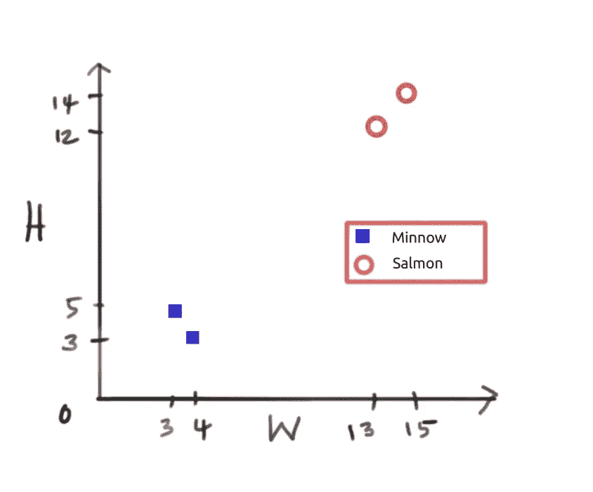
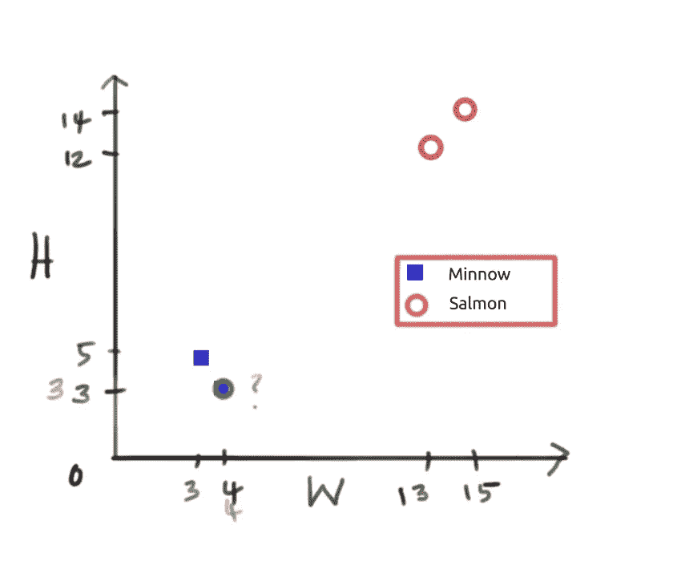
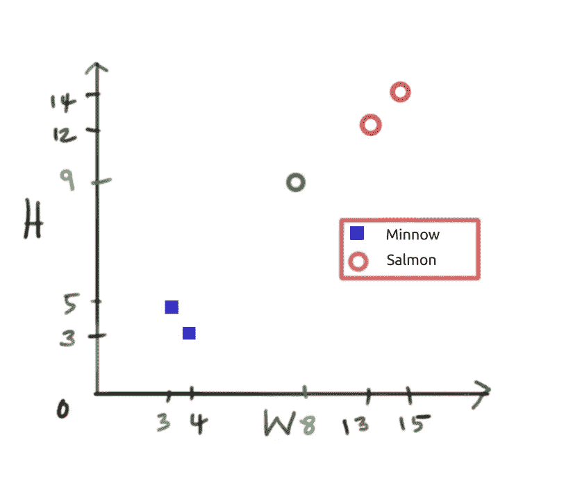
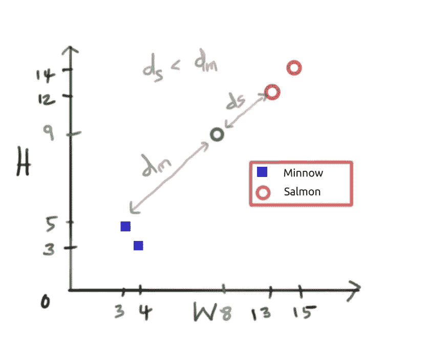

# 为什么我们需要机器学习算法中的偏差

> 原文：<https://towardsdatascience.com/why-we-need-bias-in-machine-learning-algorithms-eff0343174c0?source=collection_archive---------35----------------------->

有一种观念认为偏见不是最好的东西，因为根据定义，这是一种给客观观点增加主观性的方式。在机器学习中，算法中也有同样的偏差概念。听到这个，有人可能会说，为什么我们需要偏见，为什么我们不把它从算法中去除，并有一个算法，只使用它已经看到的数据来预测未知的新数据。

让我们看看为什么消除偏见的概念会从根本上破坏机器学习。

提供上下文让我们解决一个简单的分类问题。比方说，我们有一些鱼，我们想建立一个机器，可以分类鱼是鲑鱼还是鲦鱼。一个限制是机器只能测量鱼的高度和重量。现在我们已经定义了我们的问题，我们需要一些数据来学习。

这里有一些数据，是用鱼的种类标注的鱼的身高和体重。

培训用数据

现在我们有了一些数据，机器可以从中学习。

绘制的数据

我们希望确保机器没有任何偏见，或者对它正在学习的数据做出任何假设。所以机器只依赖上面提供的数据集。

假设我们想预测这条新鱼是鲑鱼还是小鱼。这条新鱼的身高和体重是 3 . 4。机器会将新的看不见的鱼与存储在它的存储器中的鱼进行比较，然后它注意到有一条尺寸完全相同的鱼，它是一条小鱼。厉害！所以机器确定这条新鱼是一条小鱼。如下图所示:

用绿色标出未知的鱼

让我们看另一条鱼，它的高度是 9，重量是 8。机器检查了所有的例子，然后说抱歉，我从来没见过这么高这么重的鱼，我不知道它是什么。我不想做任何假设，所以我不能给它贴标签。因此，这种消除偏差的概念将我们引向这种无偏概化器，当给定一个看不见的数据点时，它无法基于数据集做出概化。这并不令人惊讶，但并不明显。

用绿色标出未知的鱼

所以这意味着，为了做出一个概括，机器必须做出一些假设，必须有一些偏见，以便从一组可能的概括中选择一个概括。所以，机器学习就是选择这些偏差，并使用它们根据人口数据样本进行预测。

以下是一些来自众所周知的机器学习算法的不同概括或不同偏见的例子:

我们可以做的一个假设是，如果我们说寻找新示例的最近邻居，然后用最近邻居的标签来标记新示例。我们可以说最接近是基于两点之间的欧几里得距离。利用这一点，我们发现新的项目是鲑鱼。这实际上是一个非常著名的算法的基础，该算法被称为最近邻算法。我们引入了一个假设，即每种鱼的数据将来自相同的分布，因此彼此接近。如下图所示:

最近邻算法

我们还可以引入一种新的假设。如果我们像这样画一条线。这就产生了一个线性分隔数据的边界。我们这里的假设是，有一条线性线可以将数据分开。使用这条线，我们可以标记新的点，它说这是一条鲑鱼。这是逻辑回归算法的基础。ML 的订书钉。

逻辑回归算法

以上两种情况向机器引入了不同类型的偏差，并且当机器试图学习和预测时，还有许多其他类型的归纳可以考虑。

由用户决定向机器中输入多少偏差，并且由用户知道偏差如何影响算法决策。例如，我们可以使用一种叫做朴素贝叶斯的算法，它假设如果我们随机挑选一条鱼，得到一条鲑鱼和一条小鱼的可能性有多大。如果这个假设是非常错误的，那么我们其余的预测就完全错了。因此，了解每种 ML 算法的偏差以及它们如何影响决策过程是很重要的。有一点是肯定的，没有偏见就不会有学习。

我希望这已经提供了一些直觉，关于机器如何学习以及偏见如何成为学习过程的一部分。一篇对定义这些概念非常有帮助的论文是 Tom M. Mitchell 的“[学习归纳中的偏见需求](http://dml.cs.byu.edu/~cgc/docs/mldm_tools/Reading/Need%20for%20Bias.pdf)”,所以请随意查看。

感谢阅读！