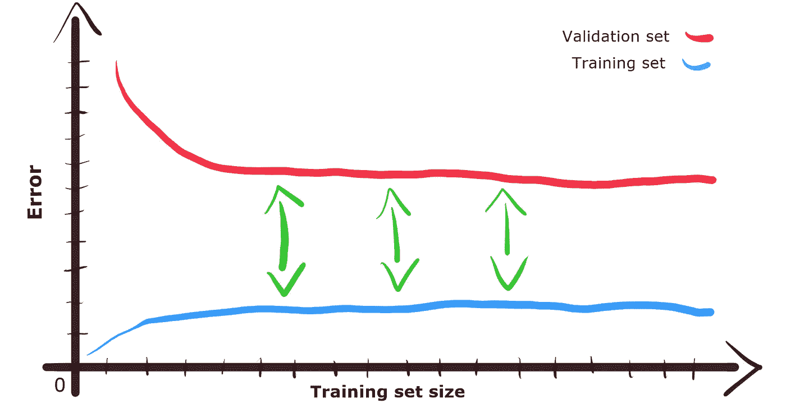
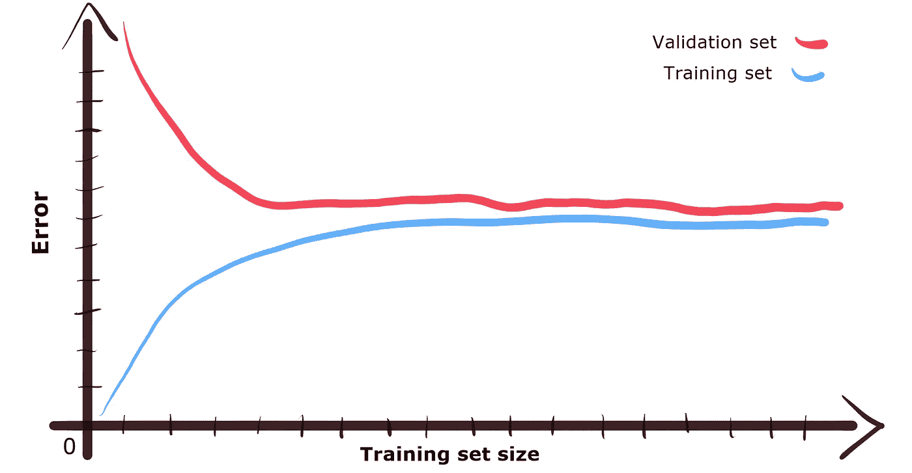
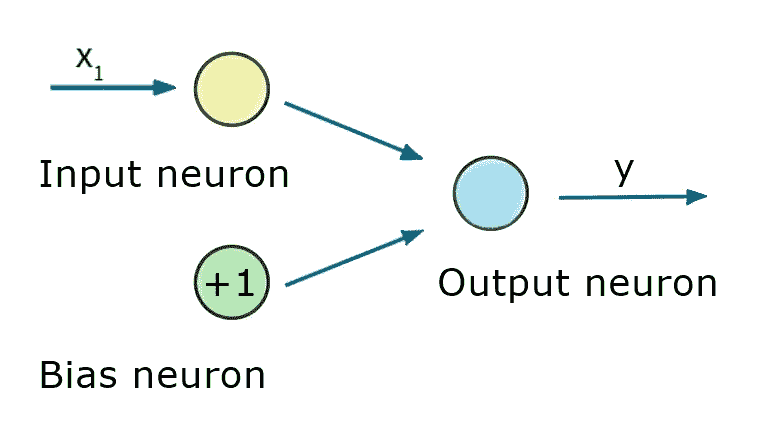
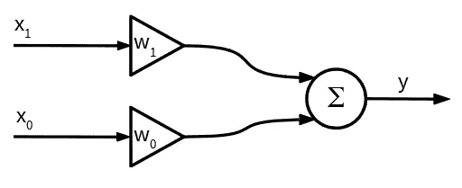
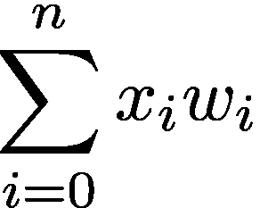
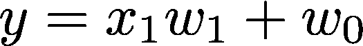
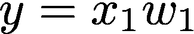
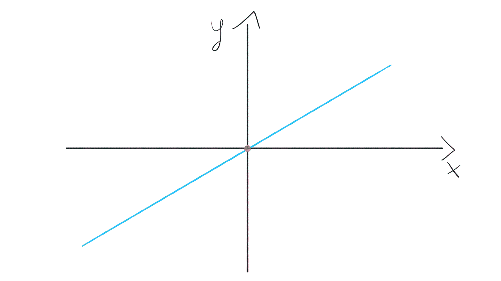
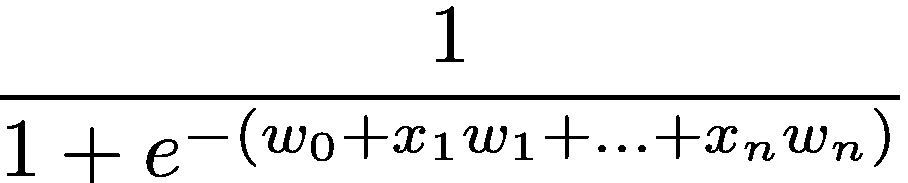
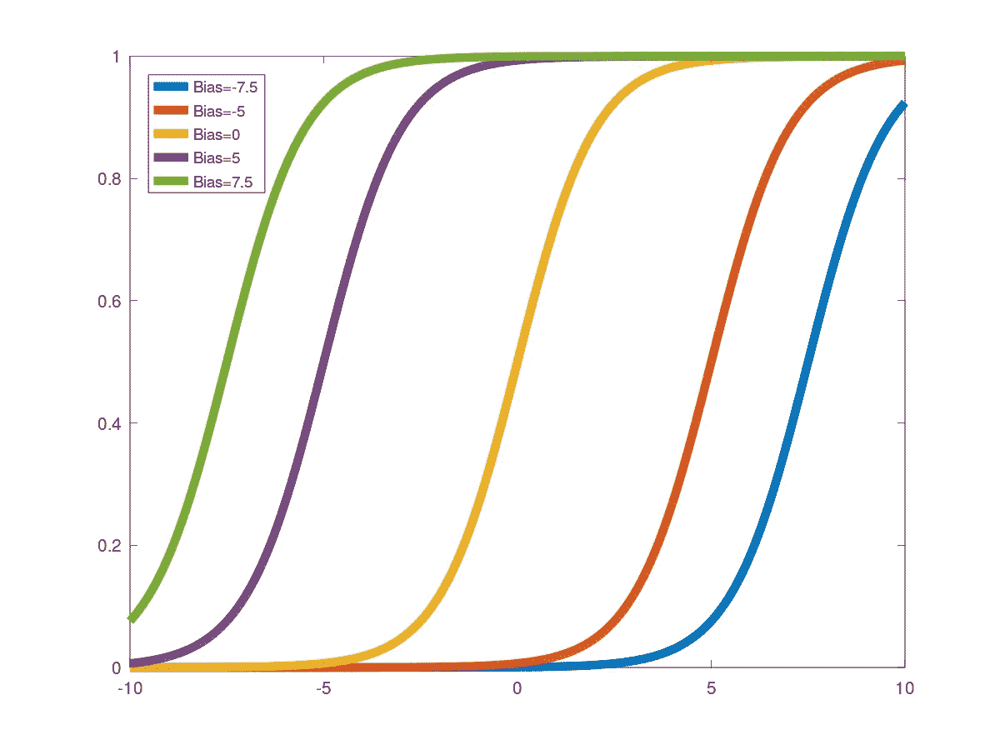

# 为什么我们需要神经网络中的偏差

> 原文：<https://towardsdatascience.com/why-we-need-bias-in-neural-networks-db8f7e07cb98?source=collection_archive---------6----------------------->

## 当偏见不是坏事的时候

图片由[天空电视台](https://pixabay.com/pl/users/skylarvision-2957633/)在[的](https://pixabay.com/pl/illustrations/neuron-m%C3%B3zgu-neurony-nerwy-synapsy-4632883/)拍摄

“ ***偏向*** ”这个词有很多贬义。当我们想到它时，我们会看到不公平的待遇、偏见、歧视或偏袒某人或某事。这很自然。不幸的是，我们生活在一个所有这些事情都会发生的世界里。然而，根据上下文，单词有许多意思，令人惊讶的是，甚至偏见也是有帮助的。

机器学习是一个领域，我们可以在一些情况下遇到偏见。让我们仔细研究这些含义，并找出使神经网络有用的含义。

# 偏置数据

首先，让我们讨论偏见的最一般的背景。这是用于训练模型的数据中的偏差。每次我们向神经网络或其他模型提供数据时，它都会决定模型的行为。我们不能指望从基于有偏见的数据构建的算法中获得任何公平或中立的待遇。

这种有偏见数据的一个众所周知的例子是亚马逊**招聘工具**。它应该对简历进行一些预过滤，这样招聘人员就可以从最有前途的简历中进行选择。这在筛选简历方面非常有用！尤其是在过滤女性简历方面……不幸的是，这个美妙的人工智能解决方案有失偏颇。该系统有利于男性候选人，因为工程师在培训过程中主要使用男性简历[1]。

另一个有偏模型的例子是 **Tay** 。Tay 是微软发布的聊天机器人。它应该通过发布推文来进行对话。Tay 还能够从用户发布的内容中学习。还有那个注定要失败的泰。它学会了如何具有攻击性和侵略性。Tay 变得有偏见，关掉了。实际上，不负责任的用户用辱骂性的帖子破坏了它，使它变得有偏见。

[freestocks](https://unsplash.com/@freestocks?utm_source=medium&utm_medium=referral) 在 [Unsplash](https://unsplash.com?utm_source=medium&utm_medium=referral) 上拍摄的照片

所以有偏差的数据肯定是一个负面现象。负责并意识到这一点是构建模型的重要部分。当你创造一个人造大脑时，你必须小心你放进去的东西。否则，你可能会让一个怪物复活。

# 整个神经网络的偏差

让我们来看看偏见的第二种情况。当我们训练和测试我们的神经网络或其他机器学习模型时，我们可以观察到两个主要趋势:

1.  模型过度拟合数据。
2.  模型无法从数据中学习模式。

过拟合就像用心学习。你的模型确实记住了你的大部分训练数据，但是，当新的东西出现时，它就不能正常工作了。你可以认为它擅长回答已经被问过的问题，但是当你打破常规提出问题时，这个模型就失败了。

如果我们根据训练集的大小来绘制验证和训练集错误，那么这样的问题可以很好地可视化。然后我们可以用**学习曲线**来预警。

如果训练集的误差相对较低，但验证集的误差较高，这意味着我们有一个**高方差**模型。图中可见的验证和训练集误差值之间的巨大差距是过度拟合造成的[3，4]。

高方差学习曲线(图片作者提供)。

让我们回到偏见。当我们在模型性能的上下文中谈论偏差时，我们可以说该模型具有**高偏差**。基本上，这意味着模型在训练期间做得不好，在验证期间做得不好。它的表现就像一个学生不能领会我们试图教给他们的思想。模型或我们的数据可能有问题[3，4]。

当我们看一下学习曲线图，我们看到训练集和验证集的误差都很高，这可能意味着您的模型有高偏差。训练集曲线和验证集曲线之间的差距将会很小，因为模型通常表现不佳。它缺乏归纳和发现数据模式的能力。

高偏差学习曲线(图片由作者提供)。

高偏见也是一件坏事。添加更多数据可能不会有太大帮助。但是，您可以尝试向数据集样本添加额外的功能。在搜索模式时，这些附加信息可以为模型提供更多线索。

您可能还需要更换型号。有时候模型太死板，无法从数据中学习。想想非线性分布的数据点，它们看起来像抛物线。如果你试图用一条简单的线来拟合这条抛物线，你的模型会因为高偏差而失败。在这种情况下，需要具有更多参数的更灵活的模型(如二次方程)。

# 作为单个神经元的偏差

让我们分析第三种情况，特定神经网络中的偏差。在文献中，我们可以找到术语*【4】。为什么我们需要这种特殊的神经元？看一下图片:*

**

*简单神经网络(图片由作者提供)。*

*这个简单的神经网络由 3 种类型的神经元组成。输入神经元只是从数据集中传递特征( *x₁* )。偏置神经元模仿附加特征，姑且称之为 *x₀* 。这个额外的输入是**总是** **等于 1** 。最后，还有一个输出神经元，这是一个成熟的人工神经元，它接受输入，处理输入，并生成整个网络的输出。*

*现在让我们详细看看我们的输出神经元:*

**

*神经元实现线性回归(图片由作者提供)。*

*它是如何工作的？我们取输入( *x₀，x₁* )并乘以相应的权重( *w₀，w₁* )。为了简单起见，输出神经元返回这些输入-权重乘积的和:*

**

*投入和权重乘积之和(图片由作者提供)。*

*在我们的例子中 *i=1* 和 *x₀=1* 。因此，这样的神经网络实际上是一个线性回归模型:*

**

*神经网络线性回归(图片由作者提供)。*

*现在是关键的部分。为了理解我们为什么需要偏置神经元，让我们看看当完全没有偏置输入时会发生什么。这意味着将只有一个输入 *x₁* ，仅此而已:*

**

*神经网络无偏倚线性回归(图片由作者提供)。*

*这样的模型不是很灵活。意味着这条线需要经过点 *(0，0)* 。线的斜率可能会改变，但是，它与坐标系的原点有关。看一下这个图像:*

**

*线可以改变斜率，但穿过原点(图片由作者提供)。*

*为了获得更大的灵活性，我们需要回到有偏差的原始模型。它将为我们配备重量 *w₀* ，不依赖于任何输入。如果需要适应数据，这个权重允许模型上下移动。*

**

*有了 bias，线不需要穿过原点(图片由作者提供)。*

*这就是为什么我们在神经网络中需要偏向神经元的原因。没有这些多余的偏置权重，我们的模型在搜索解空间时的“移动”非常有限。*

*再举一个例子，看看使用非线性激活函数的神经元，比如 sigmoid:*

**

*Sigmoid 函数(图片由作者提供)。*

*在这种情况下，偏见也给了我们的激活功能“移动”的可能性。由于它，乙状结肠可以向左移动(正偏压)或向右移动(负偏压)。下图显示了这种情况，其中包含不同偏置值的 sigmoid 图:*

**

*根据偏差值的 Sigmoid 移位(图片由作者提供)。*

# *(但愿)第三次交好运*

*最后，在经历了偏倚的数据和高偏倚的模型的概念后，我们得出了词偏倚的积极的背景。我们理解为什么偏置神经元是神经网络的关键元素，但还有最后一件事提出了一个问题。为什么一些有积极作用的东西会用一个负面的词来命名，比如偏见？*

*这是因为偏差权重与输入数据的任何元素都无关。但是，它是用来做决策的。所以偏向神经元或偏向权重反映了我们对数据集例子的信念或偏见。这就像用我们的经验而不是事实来调整我们对某人或某事的想法。挺偏的吧？*

## *参考书目:*

1.  *[https://www . Reuters . com/article/us-Amazon-com-jobs-automation-insight/Amazon-scraps-secret-ai-recruiting-tool-that-show-bias-against-women-iduscn1 MK 08g](https://www.reuters.com/article/us-amazon-com-jobs-automation-insight/amazon-scraps-secret-ai-recruiting-tool-that-showed-bias-against-women-idUSKCN1MK08G)*
2.  *[https://spectrum . IEEE . org/tech-talk/artificial-intelligence/machine-learning/in-2016-Microsoft-racistical-chatbot-discovered-the-dangers-of-online-conversation](https://spectrum.ieee.org/tech-talk/artificial-intelligence/machine-learning/in-2016-microsofts-racist-chatbot-revealed-the-dangers-of-online-conversation)*
3.  *乔尔·格鲁什，*数据科学从零开始，第二版*，ISBN:978–1492041139。*
4.  *Aurélien Géron，*使用 Scikit-Learn、Keras 和 TensorFlow 进行机器学习:构建智能系统的概念、工具和技术，第二版，*ISBN:978–1492032649。*