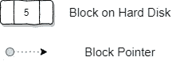
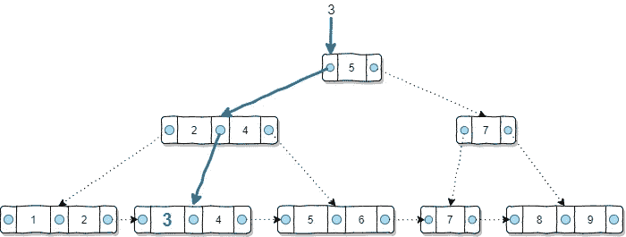
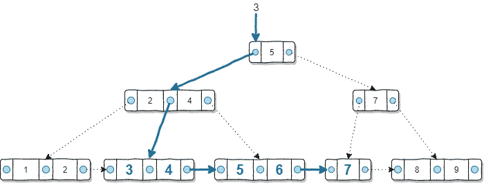

# 为什么我们需要数据库表的索引

> 原文：<https://towardsdatascience.com/why-we-need-indexes-for-database-tables-25198145a8ca?source=collection_archive---------31----------------------->


托德·夸肯布什在 [Unsplash](https://unsplash.com?utm_source=medium&utm_medium=referral) 上的照片

## 引入没有任何公式和计算机科学理论的 B+树索引

如果您不是 DBA 或数据库开发人员，您可能不知道数据库索引的机制。但是只要你会写一些 SQL 查询，你一定听说过数据库索引，知道索引可以提高 SQL 查询的性能。

在本文中，我将尝试使用最简单的语言和图表来说明 B+树索引如何提高 SQL 查询的性能。我使用 B+树索引作为例子的原因是

*   它被大多数关系数据库管理系统使用，如 MySQL、SQL Server 和 Oracle
*   它可以提高大多数类型的 SQL 查询的性能，而不是特定类型的查询

# 它看起来怎么样？


照片由[谢恩·豪泽](https://unsplash.com/@shanehauser?utm_source=medium&utm_medium=referral)在 [Unsplash](https://unsplash.com?utm_source=medium&utm_medium=referral) 上拍摄

让我们保持这个指令简单，这里有一个简化的图表说明了 B+树索引的结构。


在上面的 B+树示例中，每个矩形代表硬盘中的一个块，而蓝色填充的点代表将这些块链接在一起的指针。



请注意，出于演示目的，该图极大地简化了 B+树，因为它假设每个硬盘块只能包含 2 个键。实际上，这个数字会大得多。

理解 B+树索引是如何构造的很重要。我们需要知道“叶节点”级别应该包含创建该索引的字段的所有值。在上面的例子中，很明显我们在这个表列中只有 9 行，它们的值从 1 到 9。

如果你对上面的 B+树是如何构建的感兴趣，请参考我的另一篇文章:**B+树索引是如何在数据库中构建的？**

[](/how-b-tree-indexes-are-built-in-a-database-6f847fb3cfcc) [## B+树索引是如何在数据库中构建的？

### 使用图表来说明如何在数据库管理系统中建立 B+树索引

towardsdatascience.com](/how-b-tree-indexes-are-built-in-a-database-6f847fb3cfcc) 

# 它是如何工作的？


玛丽亚·克拉斯诺娃在 [Unsplash](https://unsplash.com?utm_source=medium&utm_medium=referral) 上拍摄的照片

B+tree 可以帮助大部分的数据库查询场景，这也是它有用的原因。

## 对平等测试的质疑

假设我们的 SQL 查询是在“equal”where 条件下进行检索，例如:

```
SELECT *
FROM TABLE
WHERE ID = 3
```

为了找到等于 3 的 ID，B+树的用法如下。



*   从树的顶层开始，3 小于 5，所以我们需要使用数字 5 左边的指针
*   在下一层，3 在 2 和 4 之间，所以我们需要使用中间的指针
*   我们得到了叶节点上的块，3 在这里

## 对比较的质疑

如果我们的 SQL 查询在一个范围内搜索会怎样？例如，以下是 SQL 查询:

```
SELECT *
FROM TABLE
WHERE ID BETWEEN 3 AND 7
```

下面是该过程的演示。



*   从树的顶层开始，3 小于 5，所以我们需要使用数字 5 左边的指针
*   在下一层，3 在 2 和 4 之间，所以我们需要使用中间的指针
*   我们得到了叶节点上的块，3 在这里
*   因为我们是在比较中查询，所以光标将继续在这个块中获取，所以我们可以得到数字 4
*   我们还没有到达 7，所以光标将继续移动到下一个(右)叶节点块
*   我们到了下一个街区，所以我们得到了数字 5 和 6。但是它还没有完成，将使用与上一步类似的机制到达下一个块
*   我们到达了下一个包含数字 7 的街区
*   我们已经达到了范围的上限，因此查询结束

# b+树特征


克里斯汀娜·戈塔迪在 [Unsplash](https://unsplash.com?utm_source=medium&utm_medium=referral) 上的照片

B+树索引最重要的特点是它由树的**叶节点层**和**搜索关键字层**组成。

1.  该索引列的所有值都出现在叶节点中。
2.  非叶节点仅用于搜索目的，因此只有指向较低级别的指针。换句话说，它们不能导致实际的数据条目。
3.  叶节点中的每个键都有一个指向数据条目的额外指针，因此它可以引导光标查找/获取数据行。

# B+树如何提高性能？


安德斯·吉尔登在 [Unsplash](https://unsplash.com?utm_source=medium&utm_medium=referral) 上拍摄的照片

如上例所示，B+树适用于“相等”和比较条件。

## 叶片与非叶片水平

可以看出，查询只需要遍历非叶节点上的搜索关键字就可以找到期望值。因此，当 SQL 查询在创建 B+树索引的列上进行检索时，只需要遍历几层非叶节点。

您一定认为非叶节点一定是一种开销，当有大量数据行时，它会变慢，因为可能有许多非叶级别。

部分正确。是的，需要扫描非叶节点以获得期望值。实际上，扫描的次数正好等于非叶层的数量。但是，实际上，我们硬盘上的块会比上面的例子大得多。通常，一个有 1000 万个条目的表可以放在一个只有 3 个非叶层的 B+树中。即使表非常大，如十亿级，通常 B+树的非叶层的数量通常是 4 或 5。

因此，使用 B+树索引可以显著减少 SQL 查询中扫描的硬盘块数。

## 为什么扫描的块数很重要？

我想这篇文章的读者可能没有计算机科学背景，所以我想对“块”的简单解释对于更好地理解这个问题可能是必要的。

在我们的硬盘中，数据并不总是按顺序存储的。单个文件可能被分割并存储到不同的块中。因此，当我们读取文件/数据集/表时，为了扫描整个文件，有必要在不同的块之间跳转。

通常，对于机械硬盘，有一个只能上下移动的磁头。当需要从不同的位置读取数据时，整个硬盘驱动器会将该位置旋转到磁头所在的位置，以便磁头可以读取数据。

假设我们正在扫描 1000 个块。最坏的情况是磁盘需要旋转 1000 次。如果我们使用索引，这个数字将减少到 4-5 倍。这就是指数有助于提高性能的原因。

# 摘要


照片由 [Aaron Burden](https://unsplash.com/@aaronburden?utm_source=medium&utm_medium=referral) 在 [Unsplash](https://unsplash.com?utm_source=medium&utm_medium=referral)

在这篇文章中，我分享了 B+tree 的样子以及它是如何工作的，并促进了一个 SQL 查询，通常使用相等和比较条件。

事实证明 B+Tree 不再是最先进的数据库索引，但是我相信，作为在大多数 RDBMS 中仍然普遍使用的最经典的索引，它仍然是展示为什么我们需要数据库表的索引以及它如何工作的最好例子。希望这对你来说足够有趣。

[](https://medium.com/@qiuyujx/membership) [## 通过我的推荐链接加入 Medium 克里斯托弗·陶

### 作为一个媒体会员，你的会员费的一部分会给你阅读的作家，你可以完全接触到每一个故事…

medium.com](https://medium.com/@qiuyujx/membership) 

**如果你觉得我的文章有帮助，请考虑加入灵媒会员来支持我和成千上万的其他作家！(点击上面的链接)**